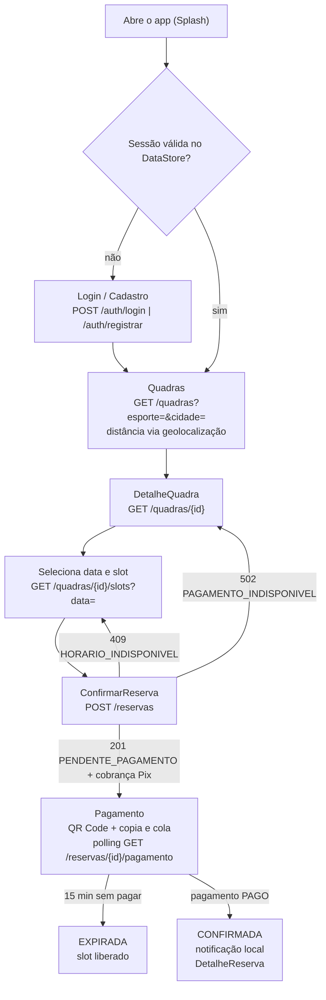

# Visão do produto — Só mais uma

Resumo: este documento apresenta o problema, o domínio, o público-alvo, a solução proposta e o fluxo principal do app Android "Só mais uma", um aplicativo de reserva e pagamento (Pix) de quadras esportivas, e delimita o que o app não é. Ele é a evidência do critério 1 da disciplina (problema, domínio e público-alvo); os requisitos derivados estão em `docs/05-requisitos-funcionais.md`, `docs/06-requisitos-nao-funcionais.md` e `docs/07-regras-de-negocio.md`.

## 1. Nome do projeto

**Só mais uma** vem da frase que todo grupo de amigos diz no fim do jogo: "só mais uma partida". O nome carrega a promessa do produto: quando a vontade de jogar aparece, marcar a próxima partida precisa ser tão rápido quanto dizer a frase — abrir o app, achar a quadra mais perto, escolher o horário e pagar pelo Pix em menos de dois minutos.

- Nome do produto (marketing e telas): **Só mais uma**
- Identificadores de código (sem acento, padrão do projeto): `so-mais-uma` (repositório), `br.com.somaisuma` (backend), `br.com.somaisuma.app` (Android), `SoMaisUmaApp`.

## 2. Problema

Reservar uma quadra esportiva no Brasil ainda é, na maioria das cidades, um processo manual e frágil:

| Situação hoje | Consequência |
|---|---|
| O cliente descobre as quadras "por indicação" e liga ou manda WhatsApp para saber se há horário | Perde tempo comparando várias quadras; não sabe qual está mais perto nem quanto custa |
| O dono anota as reservas em caderno, planilha ou conversa de WhatsApp | Dupla marcação do mesmo horário, esquecimentos e discussões na porta da quadra |
| O pagamento é combinado "na hora" ou por transferência sem vínculo com a reserva | Cliente que não aparece (no-show) deixa o horário vazio e o dono sem receita |
| Não existe registro do que foi reservado, cancelado ou pago | Dono e cliente não têm histórico para consultar |

O problema central: **não há uma forma simples, confiável e imediata de um cliente encontrar uma quadra, garantir um horário exclusivo e pagar por ele**, nem de um dono publicar sua quadra e receber reservas sem controle manual.

## 3. Domínio

O domínio é a **gestão de reservas de quadras esportivas de aluguel por hora** (futebol society, futsal, vôlei, basquete, tênis, beach tennis e padel — enum `TipoEsporte`). Os conceitos e as entidades do domínio, que viram tabelas em `docs/08-modelagem-banco.md`, são:

| Conceito | Entidade / tabela | Descrição curta |
|---|---|---|
| Cliente e Dono | `usuario` (coluna `perfil`, enum `PerfilUsuario {CLIENTE, DONO}`) | Quem joga e quem administra quadras |
| Quadra | `quadra` | Espaço esportivo com esporte, preço por hora, endereço, coordenadas e estado ativa/inativa |
| Horário de funcionamento | `horario_funcionamento` | Uma faixa de abertura/fechamento por dia da semana (1 = segunda … 7 = domingo) |
| Slot | calculado em memória (`SlotService`), não persistido | Bloco de 60 min em hora cheia, com status `LIVRE`, `OCUPADO`, `PASSADO` ou `FECHADO` |
| Reserva | `reserva` | Ocupação exclusiva de um slot por um cliente; estados `PENDENTE_PAGAMENTO`, `CONFIRMADA`, `CANCELADA`, `EXPIRADA` |
| Pagamento | `pagamento` | Cobrança Pix ligada 1:1 à reserva; estados `PENDENTE`, `PAGO`, `EXPIRADO`, `CANCELADO` |

Regras de domínio que dão forma ao produto (detalhes em `docs/07-regras-de-negocio.md`): reserva sempre de 60 min em hora cheia (RN06, RN07); no máximo uma reserva ativa por quadra e horário (RN08); janela de reserva de hoje até hoje+14 dias (RN09); reserva nasce pendente e expira em 15 min sem pagamento (RN10); pagamento confirma a reserva (RN12); fuso único `America/Sao_Paulo` (RNF12).

## 4. Solução proposta

Um aplicativo Android nativo (Kotlin + Jetpack Compose) apoiado por uma API REST (Spring Boot + PostgreSQL) que:

1. **Para o cliente**: lista quadras ativas com filtro por esporte e cidade, mostra a distância até cada uma (geolocalização, recurso nativo), exibe a grade de horários livres por data, cria a reserva com exclusividade garantida pelo banco, gera a cobrança Pix (QR Code e copia e cola) e confirma a reserva automaticamente quando o pagamento é detectado.
2. **Para o dono**: cadastra e mantém suas quadras (CRUD completo, com preenchimento de endereço e coordenadas a partir do CEP via BrasilAPI), define os horários de funcionamento por dia da semana (CRUD completo), acompanha as reservas recebidas por data e cancela quando necessário.
3. **Para os dois**: autenticação por e-mail e senha com JWT, sessão local, cache offline para leitura (Room + DataStore) e mensagens de erro claras.

O pagamento usa a **API Pix do Banco Inter** (sandbox como caminho obrigatório de demonstração; produção recomendada se o grupo obtiver conta PJ) atrás de uma interface `PixGateway`, com `SimuladoPixGateway` como fallback interno para desenvolvimento e demonstração sem dependência externa. Detalhes em `docs/11-integracao-pix-inter.md`.

Stack fechada (justificativa em `docs/09-arquitetura.md`): Android nativo Kotlin + Jetpack Compose; backend Spring Boot 4.1 (Java, JDK 21); PostgreSQL 18; REST/JSON; Git + GitHub em monorepo.

## 5. Público-alvo

Dois perfis, escolhidos no cadastro e fixos (RN20). Detalhes de permissões em `docs/03-perfis-e-permissoes.md`.

### Persona 1 — Lucas, o cliente que joga (perfil `CLIENTE`)

- 27 anos, analista de sistemas, joga futebol society com os amigos toda terça à noite e, às vezes, "só mais uma" no sábado.
- Usa o celular para tudo; paga com Pix; não quer ligar para ninguém.
- Dor: perde 20 min mandando mensagem para três quadras para descobrir quem tem horário às 19h; já chegou em quadra "reservada" que estava ocupada.
- O que espera do app: ver as quadras mais perto de onde está, escolher o horário livre e pagar na hora com a certeza de que o horário é dele.

### Persona 2 — Marcos, o dono de quadra (perfil `DONO`)

- 45 anos, dono de um complexo com três quadras (society, futsal e beach tennis) que funciona das 8h às 22h.
- Controla as reservas em um caderno e no WhatsApp; a sobrinha o ajuda a "não marcar duas vezes".
- Dor: no-show nos horários de pico, dupla marcação, cliente que discute o preço combinado.
- O que espera do app: cadastrar as quadras uma vez, definir os horários, receber reservas já pagas e ver, por data, quem vem jogar.

### Fora do público-alvo do MVP

Administradores de plataforma (perfil `ADMIN`), federações/ligas, escolinhas com aulas recorrentes e quadras fora do fuso `America/Sao_Paulo` (ver seção 8 e `docs/02-escopo-mvp.md`).

## 6. Proposta de valor

| Para quem | Valor | Como o app entrega (RF/RN) |
|---|---|---|
| CLIENTE | Achar a quadra certa rápido | Lista com filtro por esporte e cidade (RF07), distância e ordenação por proximidade (RF22), detalhe com endereço e "Abrir no Maps" (RF08) |
| CLIENTE | Garantia de horário exclusivo | Índice único parcial no PostgreSQL + 409 `HORARIO_INDISPONIVEL` (RF13, RN08) |
| CLIENTE | Pagar sem sair do app | Cobrança Pix com QR Code e copia e cola (RF19), confirmação automática (RF20) |
| CLIENTE | Saber o que reservou, mesmo sem rede | Minhas reservas e detalhe (RF15) com cache local (RF23) e notificação de confirmação (RF24, recomendado) |
| DONO | Publicar a quadra em minutos | CRUD de quadra com CEP -> endereço + coordenadas (RF06, RF09) e horários por dia da semana (RF11) |
| DONO | Fim da dupla marcação e do no-show | Slot ocupado só por reserva paga ou pendente por 15 min (RN10); reservas por data (RF18) |
| DONO | Controle sem burocracia | Cancelamento com motivo até o início (RF17, RN13); bloqueio de desativação com reservas futuras (RF10, RN16) |

O que o app **não promete** no MVP: repasse automático ao dono (todo Pix cai na chave única da plataforma, RN18), estorno automático (RN14) e funcionamento sem servidor para escritas (RNF11).

## 7. Fluxo principal do usuário

O fluxo que define o produto é o do cliente: **abre o app -> encontra quadra -> seleciona data e horário -> reserva -> paga -> recebe confirmação**. Tudo que não está neste fluxo nem pontua em um critério da disciplina fica fora do MVP (`docs/02-escopo-mvp.md`).

### 7.1 Exemplo concreto

Lucas quer jogar society no sábado 10/10/2026 às 19h. Ele abre o app já logado, vê a "Arena Society Centro" a 2,3 km, toca no card, escolhe o dia 10/10, toca no slot 19:00-20:00 (R$ 80,00), confirma, paga o QR Pix no app do banco e, em poucos segundos, recebe a notificação "Reserva confirmada".

### 7.2 Passo a passo com tela e endpoint

Todas as rotas têm o prefixo `/api/v1` e exigem `Authorization: Bearer <JWT>`, exceto as marcadas como públicas. Contrato completo em `docs/10-api-rest.md`; telas em `docs/04-telas.md`.

| Passo | O que o usuário faz | Tela (Compose) | Endpoint | Resultado esperado e erros tratados |
|---|---|---|---|---|
| 1 | Abre o app | `Splash` | nenhum: lê `SessaoDataStore` (`token_jwt`, `token_expira_em`, `usuario_perfil`) | Sessão válida -> `HomeCliente` (bottom-nav Quadras / Reservas / Perfil). Sem sessão -> passo 1a |
| 1a | Cria conta ou entra | `Cadastro` / `Login` | `POST /auth/registrar` (público, 201) ou `POST /auth/login` (público, 200) | `TokenResponse{token, expiraEm, usuario}` salvo no DataStore (RF01, RF02, RF03). Erros: 400 `VALIDACAO`, 409 `EMAIL_JA_CADASTRADO`, 401 `CREDENCIAL_INVALIDA`, 429 `LOGIN_BLOQUEADO` (RF04) |
| 2 | Encontra a quadra | `Quadras` | `GET /quadras?esporte=FUTEBOL_SOCIETY&cidade=` | Lista de quadras ativas (RF07). O app calcula a distância com `LocalizacaoProvider` + Haversine e ordena por proximidade (RF22); sem permissão, ordem alfabética. Offline: cache `quadra_cache` + `BannerOffline` (RF23) |
| 3 | Vê o detalhe | `DetalheQuadra(id)` | `GET /quadras/{id}` | Dados, endereço, horários de funcionamento, distância, botão "Abrir no Maps" (RF08). 404 `NAO_ENCONTRADO` |
| 4 | Seleciona data e horário | `DetalheQuadra(id)` (seletor de data hoje..hoje+14 + grade de slots) | `GET /quadras/{id}/slots?data=2026-10-10` | Slots de 60 min com status `LIVRE`, `OCUPADO`, `PASSADO`, `FECHADO` (RF12). 422 `DATA_FORA_DA_JANELA` se data > hoje+14 (RN09). Toque em slot `LIVRE` -> passo 5 |
| 5 | Reserva | `ConfirmarReserva(quadraId, inicioIso)` | `POST /reservas {quadraId, inicio: "2026-10-10T19:00:00-03:00", observacao?}` | 201 `ReservaResponse` com `status = PENDENTE_PAGAMENTO`, `expiraEm = criadoEm + 15 min` e `pagamento{txid, pixCopiaECola, valor, expiraEm, status}` (RF13, RF19, RN10). Erros: 409 `HORARIO_INDISPONIVEL` -> snackbar e recarrega os slots (RN08); 422 `RESERVA_PENDENTE_EXISTENTE` -> leva à reserva pendente (RN11); 422 `FORA_DO_FUNCIONAMENTO` (RN09); 502 `PAGAMENTO_INDISPONIVEL` -> "Não foi possível gerar a cobrança, tente novamente" (RN17) |
| 6 | Paga | `Pagamento(reservaId)` | `GET /reservas/{id}/pagamento` a cada 5 s por 2 min, depois a cada 10 s, enquanto a tela está visível (RNF04). No backend, `ConsultaPagamentoJob` consulta o gateway a cada 60 s. Em desenvolvimento/sandbox: botão "Simular pagamento" -> `POST /dev/pagamentos/{txid}/confirmar` (RF21) | QR Code gerado no app a partir de `pixCopiaECola` (ZXing) + botão "Copiar código" + contador regressivo de 15 min. O usuário paga no app do banco. Status `PENDENTE` -> `PAGO` (RF20, RN12). Se o tempo acabar: `EXPIRADO` / reserva `EXPIRADA` e o slot é liberado (RF14) |
| 7 | Recebe a confirmação | `Pagamento` -> `DetalheReserva(id)` | `GET /reservas/{id}` | Reserva `CONFIRMADA`; notificação local "Reserva confirmada! Arena Society Centro, 10/10 às 19h" (RF24, recomendado); a reserva aparece em `MinhasReservas` (RF15) e fica no cache `reserva_cache` para leitura offline (RF23) |

### 7.3 Diagrama do fluxo principal



Versão textual: Splash -> (Login/Cadastro se não houver sessão) -> Quadras -> DetalheQuadra -> escolha de data e slot -> ConfirmarReserva (`POST /reservas`) -> Pagamento (QR Pix + polling) -> reserva `CONFIRMADA` com notificação -> DetalheReserva. Desvios: 409 volta para a grade de slots; 502 volta ao detalhe; 15 min sem pagamento expira a reserva e libera o slot.

### 7.4 Sequência entre app, backend e provedor Pix (passos 5 a 7)

```mermaid
sequenceDiagram
    participant App as Android (Pagamento)
    participant API as Backend (ReservaFacade / PagamentoService)
    participant DB as PostgreSQL
    participant Pix as PixGateway (Inter sandbox | Simulado)
    App->>API: POST /reservas {quadraId, inicio}
    API->>DB: INSERT reserva PENDENTE_PAGAMENTO (índice único ux_reserva_slot_ativo)
    API->>Pix: criarCobranca(txid, valor, 900 s)
    Pix-->>API: pixCopiaECola, location
    API->>DB: INSERT pagamento PENDENTE
    API-->>App: 201 reserva + pagamento{txid, pixCopiaECola}
    loop a cada 5 s (depois 10 s)
        App->>API: GET /reservas/{id}/pagamento
        API-->>App: status PENDENTE
    end
    Note over API,Pix: ConsultaPagamentoJob (60 s) consulta o gateway
    Pix-->>API: CONCLUIDA (endToEndId)
    API->>DB: UPDATE pagamento PAGO; UPDATE reserva CONFIRMADA (condicional, idempotente)
    App->>API: GET /reservas/{id}/pagamento
    API-->>App: status PAGO
    App->>App: notificação local + navega para DetalheReserva
```

### 7.5 Fluxo do dono (secundário, mas obrigatório)

`Splash` -> `HomeDono` (bottom-nav MinhasQuadras / Reservas / Perfil) -> `MinhasQuadras` (`GET /quadras/minhas`) -> `FormQuadra` (`GET /cep/{cep}` preenche endereço e coordenadas; `POST /quadras` ou `PUT /quadras/{id}`) -> `HorariosQuadra` (`POST/PUT/DELETE /quadras/{id}/horarios-funcionamento[/{hid}]`) -> `ReservasQuadra` (`GET /quadras/{id}/reservas?data=`; `POST /reservas/{id}/cancelar` com motivo). Este fluxo cobre os dois CRUDs completos exigidos pelo critério 3 (Quadra e HorarioFuncionamento).

## 8. O que o app NÃO é (limites do MVP)

| O app não é | Por quê | Referência |
|---|---|---|
| Um marketplace com repasse financeiro ao dono | Todo Pix cai na única chave configurada da plataforma; repasse ocorre fora do app | RN18; `docs/02-escopo-mvp.md` (FORA) |
| Um sistema de estorno/devolução | Cancelamento não estorna; estorno é manual e fora do app | RN13, RN14 |
| Um app de "racha" (dividir o valor entre jogadores) | Múltiplos pagamentos por reserva estão fora do domínio do MVP | FORA (trabalhos futuros) |
| Um mapa interativo ou app de navegação | Mostra distância e abre o app de mapas do celular por Intent; sem Maps SDK | RF22; FORA |
| Uma rede social esportiva (avaliações, favoritos, chat) | Entidades e telas sem critério correspondente | FORA |
| Um painel de administração da plataforma (perfil ADMIN, aprovação de quadras) | Dois perfis bastam; o DONO administra apenas as próprias quadras | `docs/03-perfis-e-permissoes.md` |
| Um app que funciona offline para reservar ou pagar | Escritas são sempre online; a verdade é o servidor; cache só para leitura | RNF11, RF23 |
| Um app para quadras fora do fuso `America/Sao_Paulo` | Fuso único no MVP | RNF12 |
| Um app publicado na Play Store | APK release assinado instalado via `adb` (verificação de desenvolvedor no Brasil desde 30/09/2026) | `docs/19-riscos.md` |
| Um app com cartão de crédito, Pix com vencimento ou Pix Automático | Segundo meio de pagamento não pontua e dobra a superfície de erro | FORA |

## 9. Rastreabilidade com a disciplina

| Critério | Onde está a evidência neste documento | Complemento |
|---|---|---|
| 1 Engenharia — problema | Seção 2 | — |
| 1 Engenharia — domínio | Seção 3 | `docs/08-modelagem-banco.md` |
| 1 Engenharia — público-alvo | Seção 5 | `docs/03-perfis-e-permissoes.md` |
| 1 Engenharia — RF, RNF, RN | Referências nas seções 6 e 7 | `docs/05`, `docs/06`, `docs/07` |
| 3 Mobile — navegação e telas | Seção 7 (fluxo com telas) | `docs/04-telas.md` |
| 4 Persistência — API externa | Seção 4 (Inter Pix, BrasilAPI CEP) | `docs/11-integracao-pix-inter.md` |
| 5 Recurso nativo | Seção 7, passo 2 (geolocalização) e passo 7 (notificação) | `docs/13-recurso-nativo.md` |
