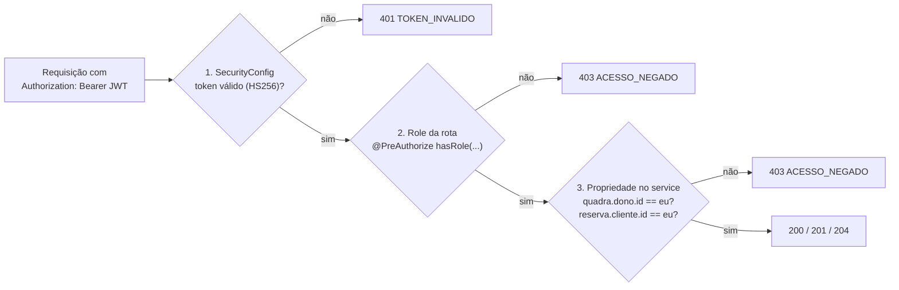
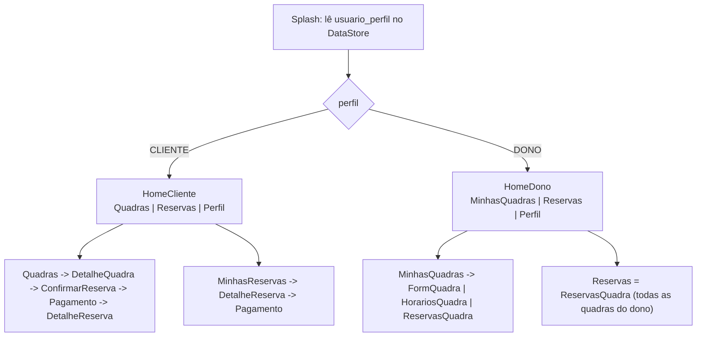

# Perfis e permissões

Resumo: o app tem exatamente dois perfis de usuário, `CLIENTE` e `DONO` (enum `PerfilUsuario`), escolhidos no cadastro e imutáveis; a autorização combina a role vinda do JWT com a checagem de propriedade no service. Este documento define os perfis, justifica a escolha, descreve o mecanismo de autorização, apresenta a matriz de permissões e indica como o avaliador comprova tudo em menos de um minuto. As regras citadas estão em `docs/07-regras-de-negocio.md`; as rotas, em `docs/10-api-rest.md`.

## 1. Os dois perfis

| Perfil | Quem é | O que faz no app | Tela inicial (bottom-nav) |
|---|---|---|---|
| **CLIENTE** | Quem quer jogar | Busca quadras (filtro por esporte e cidade, distância), vê a grade de slots por data, reserva, paga via Pix, acompanha e cancela as próprias reservas, edita o próprio perfil | `HomeCliente`: Quadras · Reservas · Perfil |
| **DONO** | Dono ou gestor de quadra (o "administrador" do domínio, renomeado) | CRUD das próprias quadras, CRUD dos horários de funcionamento, vê e cancela reservas das próprias quadras, edita o próprio perfil | `HomeDono`: MinhasQuadras · Reservas · Perfil |

Representação técnica: enum `PerfilUsuario { CLIENTE, DONO }` no backend (Java) e no app (Kotlin); coluna `usuario.perfil VARCHAR(10) NOT NULL CHECK (perfil IN ('CLIENTE','DONO'))`; claim `perfil` no JWT; chave `usuario_perfil` no `SessaoDataStore`.

## 2. Por que dois perfis e não três

| Alternativa | Decisão | Motivo |
|---|---|---|
| CLIENTE + DONO (escolhida) | Adotada | Cumpre o mínimo de dois perfis da disciplina com autorização simples (role + propriedade); "dono" descreve melhor o domínio, pois ele administra **as suas** quadras, não o sistema |
| CLIENTE + DONO + ADMIN (administrador da plataforma) | Fora do MVP | Aprovar quadras, banir usuários e moderar exigiriam uma terceira navegação, telas e endpoints sem critério correspondente; custo estimado de 20 a 30 h |
| Perfil único com papéis dinâmicos (usuário que é cliente e dono ao mesmo tempo) | Rejeitada | Cria o caso "dono reservando a própria quadra" e duplica a navegação em uma só conta; a regra RN02 fecha a ambiguidade |
| CLIENTE + ADMIN | Rejeitada | "Admin" sugere poder sobre todo o sistema; o segundo perfil do domínio é o dono da quadra |

Limitações conscientes: DONO não reserva (RN02) — se quiser jogar, cria uma conta CLIENTE com outro e-mail (RN20); não há troca de perfil após o cadastro (RN20); não há ADMIN.

## 3. Como o perfil é escolhido

1. Na tela `Cadastro`, o usuário marca um dos dois rádios: "Quero reservar quadras" (`CLIENTE`) ou "Quero anunciar minhas quadras" (`DONO`). O campo é obrigatório e validado na tela.
2. O app envia `POST /api/v1/auth/registrar` com `RegistrarRequest(nome, email, senha, telefone?, perfil)`; o backend valida `@NotNull PerfilUsuario perfil` (RF01).
3. `AuthService` grava `usuario.perfil` e devolve `TokenResponse{token, expiraEm, usuario}` (auto-login). O perfil **não muda** depois (RN20): não existe endpoint para alterá-lo e `PUT /usuarios/me` aceita apenas nome, telefone e senha (RF05).
4. O app grava `usuario_perfil` no `SessaoDataStore`; `Splash` e `AppNavHost` escolhem o grafo de navegação e a bottom-nav pelo valor lido (`BottomNavCliente` ou `BottomNavDono`).
5. Contas de demonstração vêm prontas no seed `scripts/seed-demo.sql` (seção 8).

## 4. Como o perfil é autorizado

A autorização acontece em três camadas, da mais barata para a mais específica.



Versão textual: (1) o filtro de segurança valida o JWT; (2) a anotação da rota exige a role do perfil; (3) o service confirma que o recurso pertence ao usuário autenticado.

### 4.1 Camada 1 — JWT e claim `perfil`

- `JwtService` emite um JWT HS256 (`NimbusJwtEncoder.withSecretKey`, segredo `JWT_SECRET` >= 32 bytes em variável de ambiente, validade de 7 dias — RNF01) com `sub = usuario.id` e claim `perfil = CLIENTE | DONO`.
- `SecurityConfig` é stateless (`SessionCreationPolicy.STATELESS`, CSRF desligado) com `oauth2ResourceServer(jwt)`. `PerfilAuthoritiesConverter` transforma a claim em `ROLE_CLIENTE` ou `ROLE_DONO`.
- Rotas públicas: `POST /auth/registrar`, `POST /auth/login`, `POST /webhooks/inter/pix/{segredo}` (recomendado), `GET /actuator/health`, Swagger em dev. Todo o resto exige JWT; token ausente ou expirado responde 401 `TOKEN_INVALIDO` (o app limpa a sessão e volta ao Login, sem retry — RNF03).

### 4.2 Camada 2 — role por rota

```java
// QuadraController
@PreAuthorize("hasRole('DONO')")
@PostMapping("/quadras")
public ResponseEntity<QuadraResponse> criar(@Valid @RequestBody QuadraRequest req,
                                            @AuthenticationPrincipal UsuarioAutenticado eu) { ... }

// ReservaController
@PreAuthorize("hasRole('CLIENTE')")
@PostMapping("/reservas")
public ResponseEntity<ReservaResponse> criar(@Valid @RequestBody CriarReservaRequest req,
                                             @AuthenticationPrincipal UsuarioAutenticado eu) { ... }
```

| Role exigida | Rotas |
|---|---|
| `ROLE_DONO` | `POST /quadras`, `PUT /quadras/{id}`, `DELETE /quadras/{id}`, `GET /quadras/minhas`, `POST/PUT/DELETE /quadras/{id}/horarios-funcionamento[/{hid}]`, `GET /quadras/{id}/reservas`, `GET /cep/{cep}` |
| `ROLE_CLIENTE` | `POST /reservas`, `PATCH /reservas/{id}`, `GET /reservas/{id}/pagamento` |
| Qualquer autenticado (`CLIENTE` ou `DONO`) | `GET /usuarios/me`, `PUT /usuarios/me`, `GET /quadras`, `GET /quadras/{id}`, `GET /quadras/{id}/horarios-funcionamento`, `GET /quadras/{id}/slots`, `GET /reservas`, `GET /reservas/{id}`, `POST /reservas/{id}/cancelar` |
| Qualquer autenticado + header `X-Dev-Key` | `POST /dev/pagamentos/{txid}/confirmar` — existe apenas nos profiles `simulado` e `inter-sandbox`; inexistente em `inter-prod` |

Role errada responde 403 `ACESSO_NEGADO` (`ProblemDetail` RFC 9457 com campo `codigo`).

### 4.3 Camada 3 — checagem de propriedade no service

A role diz "é um dono"; a propriedade diz "é o dono **desta** quadra". Essa checagem fica no service, nunca no controller:

```java
// QuadraService
private Quadra buscarDoDono(Long quadraId, Long donoId) {
    Quadra q = quadraRepository.findById(quadraId).orElseThrow(NaoEncontradoException::new); // 404
    if (!q.getDono().getId().equals(donoId)) throw new AcessoNegadoException();              // 403 (RN03)
    return q;
}
```

| Recurso | Regra de propriedade | RN | Resposta |
|---|---|---|---|
| Quadra e HorarioFuncionamento | `quadra.dono.id == usuarioAutenticado.id` | RN01, RN03 | 403 `ACESSO_NEGADO` |
| Reserva (CLIENTE) | `reserva.cliente.id == usuarioAutenticado.id` | RN04 | 403 |
| Reserva (DONO) | `reserva.quadra.dono.id == usuarioAutenticado.id` | RN03 | 403 |
| Pagamento | mesma regra da reserva; nunca expõe dados do pagador | RN05 | 403 |
| `GET /reservas` | CLIENTE recebe as suas; DONO recebe as das suas quadras (filtro no repositório, sem parâmetro de usuário na URL) | RN03, RN04 | 200 |

No app, a mesma lógica aparece de forma preventiva: `AppNavHost` só registra as rotas do perfil logado, e os botões de escrita ficam desabilitados quando o perfil não tem a ação (por exemplo, DONO vê `Quadras` sem o botão de reservar). A verdade, porém, é sempre o 403 do servidor.

## 5. Matriz de permissões

Legenda: **Sim** = permitido; **Não** = negado (403 ou ação inexistente na tela); **—** = não se aplica ao recurso. Condições entre parênteses. "Administrar" significa gerir o recurso em nome de terceiros ou da plataforma.

### 5.0 Matriz consolidada (visão comparativa por recurso)

Nesta tabela **C** = CLIENTE e **D** = DONO; a célula resume o que cada perfil pode fazer no recurso e o traço (—) indica que nenhum dos dois pode ou que a ação não se aplica; as condições completas, com regras de negócio e códigos de erro, estão nas duas tabelas seguintes (5.1 e 5.2).

| Recurso | visualizar | cadastrar | editar | excluir | reservar | cancelar | pagar | administrar |
|---|---|---|---|---|---|---|---|---|
| Usuário (próprio) | C: sim · D: sim | C: sim · D: sim (no cadastro) | C: sim · D: sim (nome, telefone, senha) | — | — | — | — | — |
| Quadra | C: só ativas · D: ativas + as próprias inativas | C: não · D: próprias | C: não · D: próprias | C: não · D: próprias (soft delete) | C: sim (slot LIVRE) · D: não (RN02) | — | — | C: não · D: próprias |
| HorarioFuncionamento | C: sim (leitura) · D: sim | C: não · D: próprias quadras | C: não · D: próprias quadras | C: não · D: próprias quadras | — | — | — | C: não · D: próprias quadras |
| Slots (calculados) | C: sim (hoje até hoje+14) · D: via ReservasQuadra | — | — | — | C: sim (slot LIVRE) · D: não (RN02) | — | — | — |
| Reserva | C: próprias · D: das próprias quadras | C: sim (= reservar) · D: não (RN02) | C: só observação · D: não | — (nunca é apagada, RN15) | C: sim · D: não (RN02) | C: próprias (RN13) · D: das próprias quadras (RN13) | C: sim · D: não | C: não · D: das próprias quadras (ver e cancelar) |
| Pagamento | C: próprio (txid, status, valor, QR) · D: status e valor (nunca o pagador, RN05) | — (gerado pelo sistema) | — | — | — | — | C: sim (QR / copia e cola) · D: não | — |
| Recursos de terceiros (reservas de outros clientes, quadras de outros donos) | C: não · D: só quadras ativas, como qualquer usuário | — | — | — | — | — | — | — |
| Plataforma (usuários, aprovação de quadras) | — | — | — | — | — | — | — | — (fora do MVP; não há ADMIN) |

### 5.1 Perfil CLIENTE

| Recurso | visualizar | cadastrar | editar | excluir | reservar | cancelar | pagar | administrar |
|---|---|---|---|---|---|---|---|---|
| Usuário (próprio) | Sim | Sim (público, no cadastro) | Sim (nome, telefone, senha) | Não (desativar conta é opcional) | — | — | — | Não |
| Quadra | Sim (somente ativas) | Não | Não | Não | Sim (via slot LIVRE) | — | — | Não |
| HorarioFuncionamento | Sim (no detalhe da quadra) | Não | Não | Não | — | — | — | Não |
| Slots (calculados) | Sim (hoje até hoje+14) | — | — | — | Sim (slot LIVRE) | — | — | Não |
| Reserva | Sim (próprias) | Sim (= reservar) | Sim (somente observação) | Não (nunca é apagada, RN15) | Sim (RN09, RN11) | Sim (próprias: PENDENTE a qualquer momento; CONFIRMADA até 2 h antes, RN13) | Sim | Não |
| Pagamento | Sim (próprio: txid, status, valor, QR) | Não (gerado pelo sistema ao reservar) | Não | Não | — | — | Sim (QR Code / copia e cola) | Não |
| Reservas de outros clientes | Não | — | — | — | — | Não | Não | Não |
| Plataforma (usuários, aprovação de quadras) | Não | Não | Não | Não | — | — | — | Não (fora do MVP) |

### 5.2 Perfil DONO

| Recurso | visualizar | cadastrar | editar | excluir | reservar | cancelar | pagar | administrar |
|---|---|---|---|---|---|---|---|---|
| Usuário (próprio) | Sim | Sim (público, no cadastro) | Sim (nome, telefone, senha) | Não (desativar conta é opcional) | — | — | — | Não |
| Quadra | Sim (todas ativas + as próprias inativas) | Sim (nasce com `dono_id` = logado, RN01) | Sim (próprias, RN03) | Sim (próprias; soft delete `ativa=false`; 409 `QUADRA_COM_RESERVAS` se houver reserva ativa futura, RN16) | Não (RN02) | — | Não | Sim (próprias) |
| HorarioFuncionamento | Sim | Sim (próprias quadras; 409 `DIA_JA_CADASTRADO`) | Sim (próprias; 409 `HORARIO_COM_RESERVAS`, RN16) | Sim (próprias; 409 `HORARIO_COM_RESERVAS`) | — | — | — | Sim (próprias) |
| Slots (calculados) | — (consulta a ocupação em ReservasQuadra, RF18) | — | — | — | Não (RN02) | — | — | — |
| Reserva | Sim (das próprias quadras, com nome e telefone do cliente) | Não (RN02) | Não | Não | Não (RN02) | Sim (das próprias quadras, até o início, motivo obrigatório, RN13) | Não | Sim (das próprias quadras: ver e cancelar) |
| Pagamento | Sim (status e valor da reserva; nunca dados do pagador, RN05) | Não | Não | Não | — | — | Não | Não |
| Quadras e reservas de outros donos | Sim (apenas quadras ativas, como qualquer usuário) | Não | Não | Não | Não | Não | Não | Não |
| Plataforma (usuários, aprovação de quadras) | Não | Não | Não | Não | — | — | — | Não (fora do MVP) |

### 5.3 Endpoint de desenvolvimento

| Recurso | Quem | Condição |
|---|---|---|
| `POST /dev/pagamentos/{txid}/confirmar` (RF21) | CLIENTE ou DONO autenticado | Header `X-Dev-Key` igual à variável `DEV_KEY`; somente profiles `simulado` e `inter-sandbox`; o bean não existe em `inter-prod` |

## 6. Regras de negócio ligadas a perfil

| RN | Enunciado curto | Onde é aplicada |
|---|---|---|
| RN01 | Somente DONO cria, edita e desativa quadras; a quadra nasce com dono = usuário logado | `@PreAuthorize("hasRole('DONO')")` + `QuadraService.criar` grava `dono_id` do principal |
| RN02 | DONO não reserva (usa conta CLIENTE se quiser jogar) | `@PreAuthorize("hasRole('CLIENTE')")` em `POST /reservas`; tela `DetalheQuadra` sem grade de slots clicável para DONO |
| RN03 | DONO só altera quadras, horários e reservas das próprias quadras (403) | `QuadraService.buscarDoDono`, `HorarioFuncionamentoService`, `ReservaService.cancelarPeloDono` |
| RN04 | CLIENTE só vê, edita e cancela as próprias reservas (403) | `ReservaService.buscarDoCliente`; `GET /reservas` filtra por `cliente_id` |
| RN05 | Nenhum perfil vê dados do pagador; o sistema não os armazena | Tabela `pagamento` sem `devedor`/`infoPagador`; `PagamentoResponse` expõe só txid, status, valor, `pixCopiaECola`, `expiraEm`, `pagoEm` (RNF02) |
| RN13 | Cancelamento por perfil: CLIENTE cancela PENDENTE a qualquer momento e CONFIRMADA até 2 h antes; DONO cancela até o início com motivo obrigatório | `ReservaService.cancelar` com `CanceladoPor {CLIENTE, DONO, SISTEMA}`; 422 `CANCELAMENTO_FORA_DO_PRAZO` |
| RN18 | Todo Pix é recebido na única chave da plataforma; repasse ao dono fora do app | `INTER_CHAVE_PIX` única; DONO não tem tela de recebimentos |
| RN20 | E-mail único por usuário; perfil não muda após o cadastro | `usuario.email UNIQUE` (409 `EMAIL_JA_CADASTRADO`); `PUT /usuarios/me` não aceita `perfil` |

## 7. Navegação por perfil



`AppNavHost` tem dois grafos aninhados; a bottom-nav inteira muda ao trocar de usuário. Sair (`Perfil`) limpa `SessaoDataStore` e as tabelas do Room e volta ao `Login` (RF03).

## 8. Evidência para o avaliador (menos de um minuto)

| # | Evidência | Como mostrar |
|---|---|---|
| 1 | **Seed com dois usuários demo** | `scripts/seed-demo.sql` cria `cliente@demo.com` (CLIENTE) e `dono@demo.com` (DONO), ambos com senha `Senha123`, além de 3 quadras georreferenciadas com horários seg–dom 08h–22h e 2 reservas (uma CONFIRMADA amanhã, uma EXPIRADA ontem). Só no profile `simulado`/`inter-sandbox`; nunca em `inter-prod` |
| 2 | **403 no Swagger** | Em `/swagger-ui.html`: fazer login com `cliente@demo.com`, colar o token em Authorize, chamar `POST /api/v1/quadras` -> 403 `ACESSO_NEGADO`. Repetir com `dono@demo.com` -> 201. Depois, com o token do dono, `PUT /api/v1/quadras/{id}` em uma quadra de outro dono -> 403 (propriedade) |
| 3 | **Bottom-nav por perfil no app** | Entrar como `cliente@demo.com`: abas Quadras / Reservas / Perfil, tela `Perfil` mostra "Perfil: CLIENTE". Sair, entrar como `dono@demo.com`: abas MinhasQuadras / Reservas / Perfil, sem botão de reservar |
| 4 | **Testes automatizados** | `AuthControllerTest` (`@WebMvcTest`: 401 sem token, 403 com role errada), `QuadraServiceTest` (propriedade -> `AcessoNegadoException`), `ReservaServiceTest` (RN04, RN13 por perfil). Rodar `./gradlew test` no `backend/` |
| 5 | **Claim no token** | Decodificar o JWT devolvido pelo login (qualquer decodificador local) e apontar `sub` e `perfil` |

## 9. Limitações documentadas

| Limitação | Motivo | Referência |
|---|---|---|
| Sem revogação de JWT no logout (validade de 7 dias) | Sem tabela de sessão nem refresh token no MVP; o app apaga o token localmente | RNF01, RNF03 |
| DONO não reserva, mesmo em quadra de terceiros | Simplifica a autorização e evita o caso "dono reservando a própria quadra" | RN02 |
| Sem troca de perfil e sem ADMIN | Terceiro perfil e troca dinâmica não pontuam critério | RN20; `docs/02-escopo-mvp.md` |
| Bloqueio de login em memória (`ConcurrentHashMap`) | Uma instância no Render; reinício zera o contador (aceitável no beta) | RF04, RNF01 |
