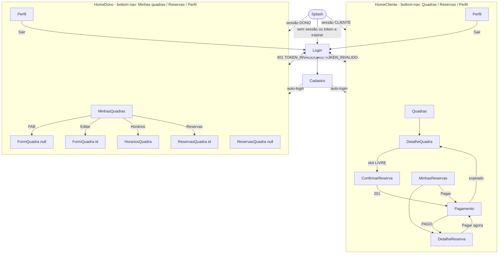

# Telas e navegação do app Android

Especificação das 13 telas do app "Só mais uma" (mais a Splash de apoio), com rota tipada, objetivo, informações, ações, perfil, estados, validações e RFs atendidos; grafo de navegação em Jetpack Compose, componentes reutilizáveis, checklist de acessibilidade por tela e orientação para o protótipo navegável do Checkpoint 1 (11/09/2026).

Relacionados: `docs/05-requisitos-funcionais.md` (RF), `docs/06-requisitos-nao-funcionais.md` (RNF06, RNF07, RNF08), `docs/07-regras-de-negocio.md` (RN), `docs/10-api-rest.md` (rotas e códigos de erro), `docs/12-persistencia-local.md` (cache e offline), `docs/13-recurso-nativo.md` (localização e notificação).

## 1. Visão geral

O app tem **duas navegações inteiras**, escolhidas pelo perfil da sessão (`PerfilUsuario.CLIENTE` ou `PerfilUsuario.DONO`, ver `docs/03-perfis-e-permissoes.md`). Toda tela segue o padrão `XxxScreen` (stateless, recebe `XxxUiState` + lambdas) + `XxxViewModel` (expõe `StateFlow<XxxUiState>`), em `ui/<modulo>/`. As rotas são classes `@Serializable` em `ui/navigation/Rotas.kt` (Navigation Compose 2.10.0, rotas tipadas).

| # | Tela | Rota tipada (`Rotas.kt`) | Perfil | Entrega | Funcional [F] | RFs |
|---|---|---|---|---|---|---|
| 1 | Login | `Login` | público | N1 | [F] | RF02, RF03, RF04 |
| 2 | Cadastro | `Cadastro` | público | N1 | [F] | RF01 |
| 3 | Quadras | `Quadras` | CLIENTE (DONO só visualiza) | N1 lista e filtros de esporte e cidade (Must Have N1); N2 distância e cache | [F] | RF07, RF22, RF23 |
| 4 | DetalheQuadra | `DetalheQuadra(id: Long)` | CLIENTE (DONO só visualiza) | N1 parte estática; N2 grade de slots | [F] | RF08, RF12, RF22 |
| 5 | ConfirmarReserva | `ConfirmarReserva(quadraId: Long, inicioIso: String)` | CLIENTE | N2 | [F] | RF13, RF19 |
| 6 | Pagamento | `Pagamento(reservaId: Long)` | CLIENTE | N2 | [F] | RF19, RF20, RF21, RF24 |
| 7 | MinhasReservas | `MinhasReservas` | CLIENTE | N2 | [F] | RF15, RF23 |
| 8 | DetalheReserva | `DetalheReserva(id: Long)` | CLIENTE | N2 | [F] | RF15, RF16, RF17 |
| 9 | Perfil | `Perfil` | ambos | N1 (ver, editar e sair) | complementar | RF03, RF05 |
| 10 | MinhasQuadras | `MinhasQuadras` | DONO | N1 | [F] | RF06, RF10 |
| 11 | FormQuadra | `FormQuadra(id: Long? = null)` | DONO | N1 | [F] | RF06, RF09 |
| 12 | HorariosQuadra | `HorariosQuadra(quadraId: Long)` | DONO | N1 | [F] | RF11 |
| 13 | ReservasQuadra | `ReservasQuadra(quadraId: Long? = null)` | DONO | N2 | complementar | RF17, RF18 |
| apoio | Splash | `Splash` | — | N1 | não conta | RF03 |

**Contagem para o critério 3 da disciplina (>= 6 telas funcionais):** 11 telas marcadas [F] chamam a API real, persistem ou leem dados e tratam erro. Já na **Entrega N1 (28/09 a 02/10)** existem **7 telas [F]** (Login, Cadastro, Quadras, DetalheQuadra, MinhasQuadras, FormQuadra, HorariosQuadra), o que cumpre o mínimo de 6 com margem; Perfil também entra na N1 (ver, editar e Sair). As 4 telas [F] restantes (ConfirmarReserva, Pagamento, MinhasReservas, DetalheReserva) e ReservasQuadra chegam na N2. Perfil e ReservasQuadra são funcionais (chamam `PUT /usuarios/me` e `GET /quadras/{id}/reservas`), mas ficam fora da contagem oficial para que a defesa do critério não dependa delas.

O **mínimo de 6 defendido na banca** (as que o avaliador abre primeiro): Login, Cadastro, Quadras, DetalheQuadra, FormQuadra e HorariosQuadra — todas prontas na N1 e cobrindo autenticação, os 2 perfis e o CRUD completo das 2 entidades (Quadra e HorarioFuncionamento).

## 2. Padrões comuns a todas as telas

### 2.1 Estado de tela (RNF06)

Toda tela que lê dados tem um `data class XxxUiState(val carregando: Boolean, val erro: ErroUi?, val offline: Boolean, val dados: ...)` e renderiza exatamente um dos estados abaixo. A ausência de qualquer um deles é defeito bloqueante no PR de tela (o revisor do PR confere).

| Estado | Quando | Componente | Comportamento |
|---|---|---|---|
| Carregando | primeira carga sem cache; ação em andamento | `CarregandoBox` (tela) ou `CircularProgressIndicator` no botão (ação) | botões de ação desabilitados; sem "tela branca" |
| Vazio | lista com 0 itens após carga | `VazioBox(titulo, subtitulo, acao?)` | texto específico da tela (ver fichas); ação sugerida quando existir |
| Erro | HTTP 4xx/5xx ou falha de parsing | `ErroBox(mensagem, onTentarNovamente)` para carga; `Snackbar` para ação | mensagem vem do campo `detail` do `ProblemDetail` quando o `codigo` é conhecido; caso contrário texto genérico "Algo deu errado. Tente novamente." |
| Offline | `IOException` no `Sincronizador` ou `MonitorConectividade` sem rede | `BannerOffline("Sem conexão. Dados de 10/10 19:32")` no topo | lista exibida do cache Room; escritas desabilitadas com motivo no botão (RNF11) |

### 2.2 Mapeamento de códigos de erro para a interface

O app lê `codigo` do `ProblemDetail` (RNF09) via `ProblemDetailParser` e converte em `Resultado.Erro(codigo)`; as telas mapeiam assim:

| `codigo` | HTTP | Onde aparece | Comportamento na tela |
|---|---|---|---|
| `VALIDACAO` (+ `campos[]`) | 400 | formulários | erro abaixo do campo correspondente; foco no primeiro campo inválido |
| `CREDENCIAL_INVALIDA` | 401 | Login | texto "E-mail ou senha incorretos" abaixo do botão Entrar |
| `TOKEN_INVALIDO` | 401 | qualquer rota protegida | evento global `SessaoExpirada` -> Login (seção 4.3) |
| `LOGIN_BLOQUEADO` | 429 | Login | "Muitas tentativas. Tente novamente em 15 minutos." (RF04) |
| `ACESSO_NEGADO` | 403 | qualquer | snackbar "Você não tem permissão para isso" e volta |
| `NAO_ENCONTRADO` | 404 | detalhes | `ErroBox` "Não encontrado" com botão Voltar |
| `EMAIL_JA_CADASTRADO` | 409 | Cadastro | erro no campo e-mail |
| `HORARIO_INDISPONIVEL` | 409 | ConfirmarReserva | snackbar "Esse horário acabou de ser reservado. Escolha outro." + volta ao DetalheQuadra e recarrega slots |
| `DIA_JA_CADASTRADO` | 409 | HorariosQuadra | snackbar + recarrega lista |
| `QUADRA_COM_RESERVAS` | 409 | MinhasQuadras | diálogo "A quadra tem reservas futuras. Cancele-as em Reservas antes de desativar." com atalho para ReservasQuadra |
| `HORARIO_COM_RESERVAS` | 409 | HorariosQuadra | diálogo equivalente; linha do dia volta ao valor anterior |
| `REGRA_NEGOCIO` / `RESERVA_PENDENTE_EXISTENTE` | 422 | ConfirmarReserva | diálogo "Você já tem uma reserva aguardando pagamento" com botão "Ir para a reserva" |
| `REGRA_NEGOCIO` / `CANCELAMENTO_FORA_DO_PRAZO` | 422 | DetalheReserva, ReservasQuadra | snackbar com a regra (RN13) |
| `REGRA_NEGOCIO` / `TRANSICAO_INVALIDA` | 422 | DetalheReserva, ReservasQuadra | snackbar "A reserva mudou de situação" + recarrega |
| `REGRA_NEGOCIO` / `DATA_FORA_DA_JANELA` | 422 | DetalheQuadra | seletor de data limitado a hoje+14; se ocorrer, snackbar |
| `PAGAMENTO_INDISPONIVEL` | 502 | ConfirmarReserva | diálogo "Não foi possível gerar a cobrança Pix. Tente novamente." (reserva já cancelada pelo sistema, RN17) |
| `CEP_INDISPONIVEL` | 503 | FormQuadra | snackbar "Serviço de CEP fora do ar; preencha o endereço manualmente" e libera os campos |

### 2.3 Validação de formulários

Validação local em `util/Validadores.kt` espelha o Bean Validation dos records do backend (`docs/10-api-rest.md`); o servidor continua sendo a autoridade. O componente `CampoTextoValidado` mostra o erro abaixo do campo só após o primeiro toque fora dele (ou ao submeter). `ImeAction.Next` entre campos e `ImeAction.Done` no último dispara o botão principal.

### 2.4 Formatação e fuso

`util/Formatadores.kt`: dinheiro como `R$ 80,00` (`NUMERIC(10,2)` chega como string `"80.00"`), datas no fuso `America/Sao_Paulo` (RNF12) como `sáb 10/10 · 19h–20h`; distância como `a 2,3 km` (1 casa decimal; abaixo de 1 km, `a 850 m`).

## 3. Fichas das telas

### 3.0 Splash (apoio, N1, `Splash`)

- **Arquivo:** `ui/auth/SplashScreen.kt` (sem ViewModel próprio; lê `SessaoDataStore` via `AppContainer`).
- **Objetivo:** decidir a rota inicial sem chamar a API.
- **Lógica:** se `token_jwt` ausente ou `token_expira_em < agora + 5 min` -> `Login`; senão -> `HomeCliente` ou `HomeDono` conforme `usuario_perfil`. Funciona em modo avião (RNF08, RNF11).
- **Informações:** logotipo e `CircularProgressIndicator` (< 300 ms em geral).
- **Ações:** nenhuma ação do usuário; a navegação é automática para `Login`, para a home do cliente (`HomeCliente`) ou para a home do dono (`HomeDono`), conforme a sessão lida no `SessaoDataStore`.
- **Perfil:** ambos (a tela roda antes de a decisão de perfil existir, pois é ela que lê o perfil da sessão).
- **Estados:** apenas carregando; não há erro (DataStore local).
- **RFs:** RF03.

### 3.1 Login [F] (N1, `Login`, público)

- **Arquivo:** `ui/auth/LoginScreen.kt`, `LoginViewModel`.
- **Objetivo:** autenticar por e-mail e senha e guardar a sessão (RF02).
- **Informações:** campos e-mail e senha (com alternador mostrar/ocultar), botão Entrar, link "Criar conta", erro por campo, erro geral 401/429, versão do app no rodapé.
- **Ações:** Entrar (`POST /auth/login` -> grava `token_jwt`, `token_expira_em`, `usuario_id`, `usuario_nome`, `usuario_perfil` no DataStore -> home do perfil, `popUpTo(Login) { inclusive = true }`); ir para Cadastro.
- **Perfil:** público (sem Scaffold/bottom-nav).
- **Estados:** carregando (spinner no botão, campos desabilitados); erro `CREDENCIAL_INVALIDA` (texto abaixo do botão, senha limpa); erro `LOGIN_BLOQUEADO` (texto com "15 minutos", botão desabilitado por 30 s); offline ("Sem conexão. Verifique a internet e tente de novo"); não há estado vazio.
- **Validações:** e-mail com `@` e domínio (`Patterns.EMAIL_ADDRESS`); senha não vazia. A regra de composição da senha não é validada aqui (evita dica a atacante).
- **RFs:** RF02, RF03 (grava sessão), RF04 (feedback do bloqueio).

### 3.2 Cadastro [F] (N1, `Cadastro`, público)

- **Arquivo:** `ui/auth/CadastroScreen.kt`, `CadastroViewModel`.
- **Objetivo:** criar conta com perfil e entrar automaticamente (RF01).
- **Informações:** nome, e-mail, telefone (opcional), senha, confirmar senha, grupo de rádio "Quero reservar quadras" (CLIENTE) / "Quero anunciar minhas quadras" (DONO) com texto de apoio "O perfil não pode ser alterado depois" (RN20), botão Cadastrar, link "Já tenho conta".
- **Ações:** Cadastrar (`POST /auth/registrar` -> 201 `TokenResponse` -> sessão gravada -> home do perfil com `popUpTo(Login) { inclusive = true }`); voltar para Login.
- **Perfil:** público.
- **Estados:** carregando (spinner no botão); erro `VALIDACAO` (por campo), `EMAIL_JA_CADASTRADO` (no campo e-mail, com link "Entrar"); offline (snackbar, botão desabilitado); sem estado vazio.
- **Validações:** nome 2 a 100 caracteres; e-mail válido (normalizado para minúsculas); telefone opcional, 10 ou 11 dígitos após remover máscara; senha `^(?=.*[A-Za-z])(?=.*\d).{8,}$` com dica permanente "mínimo 8 caracteres, com letra e número" (RNF01); confirmar senha igual; perfil obrigatório.
- **RFs:** RF01.

### 3.3 Quadras [F] (N1 lista e filtros de esporte e cidade; N2 distância, cache; `Quadras`)

- **Arquivo:** `ui/quadras/QuadrasScreen.kt`, `QuadrasViewModel`. Aba "Quadras" da `BottomNavCliente`.
- **Objetivo:** encontrar uma quadra (RF07) ordenada por proximidade (RF22).
- **Informações:** chips de esporte (`TipoEsporte`, 7 valores, seleção única, chip "Todos"); campo de cidade (filtro por texto, Must Have (N1), entregue junto com os chips de esporte); lista de `CardQuadra` (foto opcional via Coil [REC], nome, esporte, bairro/cidade, `R$ 80/h`, `a 2,3 km` quando houver coordenadas); card "Ativar localização para ver quadras perto de você" enquanto a permissão não foi concedida; `BannerOffline` quando aplicável.
- **Ações:** tocar card -> `DetalheQuadra(id)`; filtro por esporte e cidade aplicado localmente sobre o cache (o app chama `GET /quadras` sem parâmetros; os parâmetros da API permanecem para Swagger/clientes futuros); pull-to-refresh (`Sincronizador`); "Ativar localização" -> `rememberLauncherForActivityResult(RequestMultiplePermissions())` com `ACCESS_COARSE_LOCATION` + `ACCESS_FINE_LOCATION` (nunca no launch); ao conceder, `viewModel.atualizarLocalizacao()` grava `ultima_lat/lon` e reordena.
- **Perfil:** CLIENTE; DONO pode abrir (via link em Perfil, N2, Could Have) apenas para consultar — sem botão de reserva (RN02).
- **Estados:** carregando (skeleton de 3 cards na primeira carga; com cache, lista imediata + indicador discreto, RNF04); vazio ("Nenhuma quadra encontrada" + "Limpar filtros"; se o catálogo inteiro estiver vazio: "Ainda não há quadras cadastradas"); erro (`ErroBox` com tentar novamente, mantendo o cache se existir); offline (cache `quadra_cache` escopo `CATALOGO` + banner; distância com `ultima_lat/lon`; filtro aplicado localmente).
- **Localização negada ou sem fix:** lista em ordem alfabética, texto "Ative a localização para ver a distância"; quadras sem `latitude/longitude` vão para o fim (RNF08, `docs/13-recurso-nativo.md`).
- **Validações:** nenhuma.
- **RFs:** RF07, RF22, RF23.

### 3.4 DetalheQuadra [F] (N1 estático; N2 slots; `DetalheQuadra(id)`)

- **Arquivo:** `ui/quadras/DetalheQuadraScreen.kt`, `DetalheQuadraViewModel`.
- **Objetivo:** ver a quadra e escolher um horário (RF08, RF12).
- **Informações:** foto (opcional), nome, esporte, descrição, `R$ 80/h`, endereço completo, `a 2,3 km`, botão "Abrir no Maps", tabela de horários de funcionamento seg..dom ("Fechado" para dia sem registro, RN19); seletor de data horizontal (hoje até hoje+14, RN09); grade de slots de 60 min com `StatusSlot` (`LIVRE` verde selecionável, `OCUPADO` cinza, `PASSADO` riscado, `FECHADO` oculto ou cinza claro), texto "Toque em um horário livre para reservar".
- **Ações:** escolher data (`GET /quadras/{id}/slots?data=`); tocar slot `LIVRE` -> `ConfirmarReserva(quadraId, inicioIso)` com `inicioIso` no formato `2026-10-10T19:00:00-03:00`; "Abrir no Maps" via `Intent(ACTION_VIEW, "geo:lat,lon?q=lat,lon(Nome)")` (sem SDK); voltar.
- **Perfil:** CLIENTE (grade e reserva); DONO vê a parte estática sem grade (RN02).
- **Estados:** carregando (parte estática do cache imediata; grade com skeleton de 1 linha); vazio de slots ("Nenhum horário livre nesta data" + sugestão de próxima data com slot livre); vazio de funcionamento ("Esta quadra ainda não tem horários cadastrados"); erro 404 (`ErroBox` "Quadra não encontrada" + Voltar); erro na grade (`ErroBox` só na área da grade); offline (dados e funcionamento do cache; área da grade mostra "Conecte-se para ver os horários"; reservar desabilitado).
- **Validações:** data restrita ao intervalo pelo próprio seletor; `inicio` sempre em hora cheia por construção da grade (RN06).
- **RFs:** RF08, RF12, RF22.

### 3.5 ConfirmarReserva [F] (N2, `ConfirmarReserva(quadraId, inicioIso)`)

- **Arquivo:** `ui/reservas/ConfirmarReservaScreen.kt`, `ConfirmarReservaViewModel`.
- **Objetivo:** revisar e criar a reserva pendente com cobrança Pix (RF13, RF19).
- **Informações:** resumo (quadra, endereço curto, `sáb 10/10 · 19h–20h`, `R$ 80,00`), campo observação (opcional, até 200), aviso "Você terá 15 minutos para pagar via Pix; depois disso o horário é liberado" (RN10), botão "Confirmar e gerar Pix".
- **Ações:** Confirmar (`POST /reservas {quadraId, inicio, observacao?}`) -> 201 grava `reserva_cache` (escopo `MINHAS`, com `pixCopiaECola` e `expiraEm`) -> `Pagamento(reservaId)` com `popUpTo(DetalheQuadra) { inclusive = true }` (impede voltar a esta tela e repetir o POST); Voltar.
- **Perfil:** CLIENTE.
- **Estados:** carregando (botão com spinner, sem duplo toque: botão desabilitado até resposta); erro `HORARIO_INDISPONIVEL` 409 (snackbar + `popBackStack()` para DetalheQuadra com recarga da grade, RN08); `RESERVA_PENDENTE_EXISTENTE` 422 (diálogo com "Ir para a reserva" -> `DetalheReserva(reservaId)` — o `ProblemDetail` deve trazer `reservaId` como propriedade adicional, ver notas); `PAGAMENTO_INDISPONIVEL` 502 (diálogo; a reserva já foi cancelada por `SISTEMA`, RN17, nenhum slot fica preso); `FORA_DO_FUNCIONAMENTO`/`DATA_FORA_DA_JANELA` 422 (snackbar + volta); offline (botão desabilitado com texto "Conecte-se para reservar", RNF11); sem estado vazio.
- **Validações:** observação <= 200 caracteres (contador visível).
- **RFs:** RF13, RF19 (a cobrança nasce junto), RN06 a RN11.

### 3.6 Pagamento [F] (N2, `Pagamento(reservaId)`)

- **Arquivo:** `ui/pagamento/PagamentoScreen.kt`, `PagamentoViewModel`.
- **Objetivo:** apresentar a cobrança Pix e detectar a confirmação (RF19, RF20, RF21, RF24).
- **Informações:** `PixQrCode(pixCopiaECola)` gerado localmente por `QrCodeGerador` (ZXing core 3.5.4), valor, quadra e horário, contador regressivo `mm:ss` até `expiraEm`, `ChipStatus` do pagamento (`Aguardando pagamento` / `Pago` / `Expirado`), instruções "Abra o app do seu banco, escolha Pix, leia o QR ou cole o código", provedor em texto pequeno ("Ambiente de testes (sandbox)" quando `ProvedorPagamento = INTER` em sandbox; "Pagamento simulado" quando `SIMULADO`).
- **Ações:** "Copiar código Pix" (`ClipboardManager` + snackbar "Código copiado"); "Já paguei" [REC]: `GET /reservas/{id}/pagamento?atualizar=true` (no `simulado` equivale à consulta normal); botão "Simular pagamento" somente em `BuildConfig.DEBUG` (`POST /dev/pagamentos/{txid}/confirmar` com `X-Dev-Key`); polling automático a cada 5 s por 2 min, depois 10 s (RNF04), somente com a tela visível (`repeatOnLifecycle(STARTED)`); ao detectar `PAGO`: `NotificadorReserva.confirmada()` [REC] e navegação para `DetalheReserva(id)` com `popUpTo(Quadras)` (ou `popUpTo(MinhasReservas)` quando veio de lá); pedir `POST_NOTIFICATIONS` (API >= 33) na primeira abertura desta tela com texto de contexto, uma única vez (`permissao_notificacao_pedida`).
- **Perfil:** CLIENTE.
- **Estados:** carregando (QR do cache aparece antes da rede); `Expirado` (QR esmaecido, contador em 00:00, botão "Escolher outro horário" -> `DetalheQuadra(quadraId)`); erro de polling (não interrompe: mantém QR e mostra texto "Não foi possível verificar agora"); offline (QR do `pixCopiaECola` em cache continua legível e pagável; status "Aguardando conexão para verificar"); sem estado vazio.
- **Validações:** nenhuma.
- **Back:** vai para `MinhasReservas` (nunca para ConfirmarReserva); ver seção 4.3.
- **RFs:** RF19, RF20, RF21, RF24 (recomendado), RN10, RN12.

### 3.7 MinhasReservas [F] (N2, `MinhasReservas`)

- **Arquivo:** `ui/reservas/MinhasReservasScreen.kt`, `MinhasReservasViewModel`. Aba "Reservas" da `BottomNavCliente`.
- **Objetivo:** acompanhar reservas (RF15).
- **Informações:** abas Próximas / Histórico (`GET /reservas?situacao=PROXIMAS|HISTORICO`); `CardReserva` com quadra, `sáb 10/10 · 19h`, valor, `ChipStatus` (`StatusReserva`), botão "Pagar" em cards `PENDENTE_PAGAMENTO` com tempo restante; `BannerOffline`.
- **Ações:** abrir `DetalheReserva(id)`; "Pagar" -> `Pagamento(reservaId)`; pull-to-refresh; trocar aba.
- **Perfil:** CLIENTE.
- **Estados:** carregando (cache imediato); vazio Próximas ("Você ainda não tem reservas" + botão "Encontrar quadra" -> `Quadras`); vazio Histórico ("Nenhuma reserva anterior"); erro (`ErroBox` mantendo cache); offline (cache `reserva_cache` escopo `MINHAS` + banner).
- **RFs:** RF15, RF23.

### 3.8 DetalheReserva [F] (N2, `DetalheReserva(id)`)

- **Arquivo:** `ui/reservas/DetalheReservaScreen.kt`, `DetalheReservaViewModel`.
- **Objetivo:** gerir uma reserva (RF15, RF16, RF17).
- **Informações:** quadra (nome, endereço, "Abrir no Maps"), data/hora, valor, `ChipStatus`, observação, bloco pagamento (`txid` abreviado, status, `pagoEm`), texto da regra de cancelamento aplicável ("Cancelamento gratuito até 2 h antes do início" ou "Prazo de cancelamento encerrado", RN13), aviso "Não há estorno automático" quando `CONFIRMADA` (RN14), motivo do cancelamento e quem cancelou quando `CANCELADA`.
- **Ações:** editar observação (campo inline + "Salvar" -> `PATCH /reservas/{id} {observacao}`); "Cancelar reserva" (diálogo de confirmação com a consequência -> `POST /reservas/{id}/cancelar`); "Pagar agora" quando `PENDENTE_PAGAMENTO` -> `Pagamento(reservaId)`; voltar.
- **Perfil:** CLIENTE (somente as próprias, RN04).
- **Estados:** carregando (cache imediato); erro 404/403 (`ErroBox` + Voltar); `TRANSICAO_INVALIDA`/`CANCELAMENTO_FORA_DO_PRAZO` 422 (snackbar + recarga); offline (dados do cache; editar e cancelar desabilitados com texto "Conecte-se para alterar"; "Pagar agora" continua disponível porque o QR está em cache); sem estado vazio.
- **Validações:** observação <= 200; botão Cancelar só aparece quando a regra RN13 permite (a decisão final é do servidor).
- **RFs:** RF15, RF16, RF17, RN13, RN15.

### 3.9 Perfil (N1 ver, editar e sair; `Perfil`)

- **Arquivo:** `ui/perfil/PerfilScreen.kt`, `PerfilViewModel`. Aba "Perfil" nas duas bottom-navs.
- **Objetivo:** ver e editar a própria conta e encerrar a sessão (RF05, RF03).
- **Informações:** nome, e-mail (somente leitura), telefone, perfil (somente leitura, RN20), seção "Alterar senha" (senha atual, nova senha), switch "Avisar quando a reserva for confirmada" (`notificar_confirmacao`, N2 [REC]), "Última sincronização: 10/10 19:32", versão do app, botão "Sair".
- **Ações:** Salvar (`PUT /usuarios/me {nome, telefone, senhaAtual?, novaSenha?}`); Sair (`SessaoDataStore.clear()` + `AppDatabase.clearAllTables()` -> `Login` com `popUpTo(0)`; RNF03); N2 Could Have: para DONO, link "Ver quadras como cliente" -> `Quadras` em modo leitura.
- **Perfil:** ambos.
- **Estados:** carregando (dados do DataStore aparecem na hora; `GET /usuarios/me` atualiza); erro (snackbar; dados locais permanecem); offline (leitura normal; Salvar desabilitado); sem vazio.
- **Validações:** nome 2 a 100; telefone 10 ou 11 dígitos ou vazio; nova senha com a regra RNF01 e senha atual obrigatória quando preenchida; 422 do servidor (senha atual incorreta) exibido no campo.
- **RFs:** RF03, RF05.

### 3.10 MinhasQuadras [F] (N1, `MinhasQuadras`)

- **Arquivo:** `ui/dono/MinhasQuadrasScreen.kt`, `MinhasQuadrasViewModel`. Aba "Minhas quadras" da `BottomNavDono`.
- **Objetivo:** listar e desativar as quadras do dono (R e D do CRUD de Quadra, RF06, RF10).
- **Informações:** cards com nome, esporte, `R$ 80/h`, `ChipStatus` Ativa/Inativa, "3 reservas hoje" (N2), `BannerOffline`; FAB "Nova quadra".
- **Ações:** FAB -> `FormQuadra(null)`; card -> menu com Editar (`FormQuadra(id)`), Horários (`HorariosQuadra(id)`), Reservas (`ReservasQuadra(id)`, N2), Desativar (diálogo -> `DELETE /quadras/{id}`); pull-to-refresh (`GET /quadras/minhas`, escopo `MINHAS` do cache).
- **Perfil:** DONO (RN01, RN03).
- **Estados:** carregando; vazio ("Cadastre sua primeira quadra" + botão que abre `FormQuadra(null)`); erro (`ErroBox`); `QUADRA_COM_RESERVAS` 409 (diálogo com atalho para `ReservasQuadra(id)`, RN16); offline (cache + banner; FAB, Editar e Desativar desabilitados).
- **RFs:** RF06, RF10, RN16.

### 3.11 FormQuadra [F] (N1, `FormQuadra(id: Long? = null)`)

- **Arquivo:** `ui/dono/FormQuadraScreen.kt`, `FormQuadraViewModel`. Título "Nova quadra" ou "Editar quadra" conforme `id`.
- **Objetivo:** criar e editar quadra (C e U do CRUD, RF06) com endereço por CEP (RF09).
- **Informações e campos:** nome; esporte (`ExposedDropdownMenu` com os 7 valores de `TipoEsporte` com rótulos em português); descrição; preço por hora (teclado decimal, prefixo `R$`); CEP (8 dígitos, máscara `00000-000`) + botão "Buscar"; logradouro, número, bairro, cidade, UF (preenchidos pela busca, editáveis); latitude e longitude (preenchidos pela busca, editáveis, com texto "Usadas para calcular a distância até a quadra"); URL da foto (opcional); botão Salvar.
- **Ações:** Buscar CEP (`GET /cep/{cep}` -> BrasilAPI v2 com fallback ViaCEP no backend; preenche endereço e, quando houver, lat/lon; spinner no botão); Salvar (`POST /quadras` ou `PUT /quadras/{id}` -> volta para MinhasQuadras com snackbar "Quadra salva" e re-sincroniza); voltar (diálogo "Descartar alterações?" se houver mudanças).
- **Perfil:** DONO.
- **Estados:** carregando (edição: carrega do cache/`GET /quadras/{id}`); erro 403/404 (`ErroBox` + Voltar); erro de CEP 404 ("CEP não encontrado" no campo) e 503 `CEP_INDISPONIVEL` (snackbar; campos de endereço continuam editáveis); erro 400 `VALIDACAO` por campo; offline (formulário aberto, Buscar e Salvar desabilitados); sem vazio.
- **Validações (espelham `QuadraRequest`):** nome obrigatório <= 100; esporte obrigatório; descrição <= 500; preço >= 1,00 e <= 9999,99 com até 2 casas; CEP exatamente 8 dígitos; logradouro <= 150 obrigatório; número obrigatório <= 10; bairro <= 80; cidade obrigatória <= 80; UF 2 letras; latitude entre -90 e 90 e longitude entre -180 e 180 (opcionais, mas os dois juntos); URL da foto começando com `http` quando preenchida.
- **RFs:** RF06, RF09, RN01.

### 3.12 HorariosQuadra [F] (N1, `HorariosQuadra(quadraId)`)

- **Arquivo:** `ui/dono/HorariosQuadraScreen.kt`, `HorariosQuadraViewModel`.
- **Objetivo:** CRUD completo de `HorarioFuncionamento` (RF11), um registro por dia da semana (RN19).
- **Informações:** cabeçalho com nome da quadra; 7 linhas (segunda..domingo, `dia_semana` 1..7) com switch "Aberto", hora de abertura e hora de fechamento (`TimePicker` Material 3, passo de 60 min); linha sem registro mostra "Fechado"; texto "Os horários seguem o fuso de Brasília" (RNF12).
- **Ações (cada uma dispara a operação individual do CRUD):** ligar o switch -> `POST /quadras/{id}/horarios-funcionamento {diaSemana, horaAbertura: "08:00", horaFechamento: "22:00"}` (valores padrão 08:00–22:00 editáveis antes de confirmar); alterar hora -> `PUT .../horarios-funcionamento/{hid}`; desligar o switch -> diálogo "Fechar a quadra na segunda?" -> `DELETE .../horarios-funcionamento/{hid}`; "Copiar para todos os dias" (Should Have, dispara 7 chamadas sequenciais); pull-to-refresh (`GET .../horarios-funcionamento`).
- **Perfil:** DONO (RN03).
- **Estados:** carregando (skeleton das 7 linhas; na edição, cache `horariosJson`); vazio (as 7 linhas "Fechado" + dica "Ative os dias em que a quadra funciona"); erro por linha (`HORARIO_COM_RESERVAS` 409 volta a linha ao valor anterior e abre diálogo com atalho para `ReservasQuadra(quadraId)`, RN16; `DIA_JA_CADASTRADO` 409 recarrega); erro de carga (`ErroBox`); offline (leitura do cache; switches e horas desabilitados).
- **Validações:** fechamento > abertura (RN19) validado antes de chamar a API, com erro "O fechamento precisa ser depois da abertura" na linha; horas em múltiplos de 60 min.
- **RFs:** RF11, RN16, RN19.

### 3.13 ReservasQuadra (N2, `ReservasQuadra(quadraId: Long? = null)`)

- **Arquivo:** `ui/dono/ReservasQuadraScreen.kt`, `ReservasQuadraViewModel`. Com `quadraId = null` é a aba "Reservas" da `BottomNavDono` (todas as quadras do dono, via `GET /reservas`); com id, lista de uma quadra (`GET /quadras/{id}/reservas?data=`).
- **Objetivo:** ver e cancelar reservas recebidas (RF18, RF17).
- **Informações:** seletor de data (padrão hoje; sem data = próximas); filtro por quadra (quando `null`); lista com hora, quadra, nome e telefone do cliente (toque disca via `Intent(ACTION_DIAL)`), `ChipStatus`, valor, status do pagamento; nunca dados do pagador (RN05); `BannerOffline`.
- **Ações:** "Cancelar" em reservas `PENDENTE_PAGAMENTO` ou `CONFIRMADA` até o início -> diálogo com campo motivo obrigatório e aviso "Combine o estorno diretamente com o cliente" (RN13, RN14) -> `POST /reservas/{id}/cancelar {motivo}`; pull-to-refresh.
- **Perfil:** DONO (RN03).
- **Estados:** carregando; vazio ("Nenhuma reserva nesta data"); erro (`ErroBox`); `CANCELAMENTO_FORA_DO_PRAZO`/`TRANSICAO_INVALIDA` 422 (snackbar + recarga); offline (cache `reserva_cache` escopo `QUADRA`; cancelar desabilitado).
- **Validações:** motivo obrigatório, 5 a 200 caracteres.
- **RFs:** RF17, RF18, RN13.

## 4. Navegação

### 4.1 Grafo (`ui/navigation/AppNavHost.kt`: um `NavHost` com dois grafos aninhados)



Versão textual:

```
Splash --sem sessao--> Login <--> Cadastro --sucesso--> home do perfil
Splash --CLIENTE--> HomeCliente (bottom-nav: Quadras | Reservas | Perfil)
   Quadras -> DetalheQuadra(id) -> ConfirmarReserva(quadraId, inicioIso) -> Pagamento(reservaId) --PAGO--> DetalheReserva(id)
   MinhasReservas -> DetalheReserva(id) -> Pagamento(reservaId)  (se PENDENTE_PAGAMENTO)
   Perfil --Sair--> Login (popUpTo 0)
Splash --DONO--> HomeDono (bottom-nav: MinhasQuadras | Reservas | Perfil)
   MinhasQuadras -> FormQuadra(null) | FormQuadra(id) | HorariosQuadra(id) | ReservasQuadra(id)
   Reservas (aba) = ReservasQuadra(null)
Qualquer rota protegida --401--> Login (sessao e cache limpos)
```

### 4.2 Rotas tipadas

```kotlin
// ui/navigation/Rotas.kt
@Serializable object Splash
@Serializable object Login
@Serializable object Cadastro
@Serializable object HomeCliente          // grafo aninhado
@Serializable object Quadras
@Serializable data class DetalheQuadra(val id: Long)
@Serializable data class ConfirmarReserva(val quadraId: Long, val inicioIso: String)
@Serializable data class Pagamento(val reservaId: Long)
@Serializable object MinhasReservas
@Serializable data class DetalheReserva(val id: Long)
@Serializable object Perfil
@Serializable object HomeDono             // grafo aninhado
@Serializable object MinhasQuadras
@Serializable data class FormQuadra(val id: Long? = null)
@Serializable data class HorariosQuadra(val quadraId: Long)
@Serializable data class ReservasQuadra(val quadraId: Long? = null)
```

`inicioIso` viaja como `String` ISO-8601 com offset (`2026-10-10T19:00:00-03:00`) para não depender de serializador de data na rota; o ViewModel converte com `OffsetDateTime.parse`.

### 4.3 Regras de navegação

| Situação | Regra | Implementação |
|---|---|---|
| Login ou Cadastro com sucesso | vai para o grafo do perfil e remove Login/Cadastro da pilha | `navigate(HomeCliente ou HomeDono) { popUpTo(Login) { inclusive = true } }` |
| Sair (Perfil) | limpa sessão e cache; pilha zerada | `SessaoDataStore.clear()`, `db.clearAllTables()`, `navigate(Login) { popUpTo(0) { inclusive = true } }` |
| 401 `TOKEN_INVALIDO` em rota protegida | um único evento global; sem retry e sem loop | `AuthInterceptor` limpa sessão e emite `SessaoExpirada` em `SharedFlow`; `AppNavHost` coleta e executa a mesma navegação de Sair; o 401 de `/auth/login` (`CREDENCIAL_INVALIDA`) nunca dispara o evento |
| Após `POST /reservas` (201) | ConfirmarReserva sai da pilha para evitar POST duplicado | `navigate(Pagamento(id)) { popUpTo(DetalheQuadra(quadraId)) { inclusive = true } }` |
| Back físico ou seta em Pagamento | vai para MinhasReservas (nunca para ConfirmarReserva); a reserva pendente continua visível com botão Pagar | `BackHandler { navigate(MinhasReservas) { popUpTo(Quadras) } }` |
| Pagamento detecta `PAGO` | abre DetalheReserva e limpa o fluxo de reserva | `navigate(DetalheReserva(id)) { popUpTo(Quadras) }` quando o fluxo veio de Quadras; `popUpTo(MinhasReservas)` quando veio de MinhasReservas |
| Pagamento `EXPIRADO` | oferece novo horário | `navigate(DetalheQuadra(quadraId)) { popUpTo(Quadras) }` |
| 409 `HORARIO_INDISPONIVEL` | volta à grade e recarrega | `popBackStack()` + `savedStateHandle["recarregarSlots"] = true` lido pelo `DetalheQuadraViewModel` |
| 422 `RESERVA_PENDENTE_EXISTENTE` | leva à reserva pendente | `navigate(DetalheReserva(reservaIdDoProblemDetail))` |
| Troca de aba na bottom-nav | uma pilha por aba, estado preservado | `navigate(rota) { launchSingleTop = true; restoreState = true; popUpTo(graph.startDestination) { saveState = true } }` |
| Bottom-nav visível | somente nos destinos raiz de cada grafo (Quadras, MinhasReservas, Perfil / MinhasQuadras, ReservasQuadra(null), Perfil) | `Scaffold` lê `currentBackStackEntryAsState()`; Splash, Login e Cadastro ficam fora do `Scaffold` |
| Deep link da notificação local [REC] | abre DetalheReserva | `PendingIntent` com extra `reservaId`; `MainActivity` navega após o Splash |
| Rotação de tela | estado sobrevive | `UiState` no ViewModel; formulários usam `rememberSaveable` para texto ainda não enviado |

### 4.4 Bottom navigation por perfil

| Perfil | Aba 1 | Aba 2 | Aba 3 |
|---|---|---|---|
| CLIENTE (`BottomNavCliente.kt`) | Quadras (ícone `SportsSoccer`) | Reservas (`EventAvailable`) = `MinhasReservas` | Perfil (`Person`) |
| DONO (`BottomNavDono.kt`) | Minhas quadras (`Stadium`) = `MinhasQuadras` | Reservas (`EventNote`) = `ReservasQuadra(null)` | Perfil (`Person`) |

Evidência para a banca: fazer logout e entrar com `dono@demo.com` troca a bottom-nav inteira (seed `scripts/seed-demo.sql`, senha `Senha123`).

## 5. Componentes reutilizáveis (`ui/components/`)

| Componente | Assinatura resumida | Usado em | Responsável |
|---|---|---|---|
| `CampoTextoValidado` | `(valor, onValor, rotulo, erro: String?, teclado, imeAction, transformacao?)` | Login, Cadastro, Perfil, FormQuadra, ConfirmarReserva, diálogos de motivo | A |
| `CarregandoBox` | `(mensagem: String? = null)` centralizado | todas | A |
| `ErroBox` | `(mensagem, onTentarNovamente: (() -> Unit)?, onVoltar: (() -> Unit)?)` | todas as telas de leitura | A |
| `VazioBox` | `(titulo, subtitulo?, textoAcao?, onAcao?)` | Quadras, MinhasReservas, MinhasQuadras, HorariosQuadra, ReservasQuadra, DetalheQuadra (grade) | B |
| `BannerOffline` | `(ultimaSincronizacao: Instant?)` -> "Sem conexão. Dados de 10/10 19:32" | todas as telas com cache | C |
| `ChipStatus` | `(status: StatusReserva | StatusPagamento | Boolean)` com cor e ícone por valor | MinhasReservas, DetalheReserva, ReservasQuadra, MinhasQuadras, Pagamento | C |
| `PixQrCode` | `(pixCopiaECola: String, valor: String, tamanhoDp = 240)` via `QrCodeGerador` | Pagamento | D |
| `CardQuadra` | `(quadra, distanciaKm?, onClick)` | Quadras, MinhasQuadras (variante do dono) | B |
| `CardReserva` | `(reserva, onClick, onPagar?)` | MinhasReservas, ReservasQuadra | C |
| `SeletorData` | `(datas: List<LocalDate>, selecionada, onSelecionar)` linha horizontal hoje..hoje+14 | DetalheQuadra, ReservasQuadra | B (C revisa e fecha o contrato `SlotResponse`) |
| `GradeSlots` | `(slots: List<Slot>, onSlotLivre)` | DetalheQuadra | B (C revisa e fecha o contrato `SlotResponse`) |
| `DialogoConfirmacao` | `(titulo, texto, textoConfirmar, campoMotivo: Boolean = false, onConfirmar(motivo?))` | MinhasQuadras, HorariosQuadra, DetalheReserva, ReservasQuadra, FormQuadra (descartar) | C |
| `LinhaHorarioFuncionamento` | `(diaSemana, horario?, onAbrir, onAlterar, onFechar)` com `TimePicker` | HorariosQuadra | B |
| `TopBarPadrao` | `(titulo, onVoltar?, acoes)` | telas internas | A |

Os seis primeiros são os componentes canônicos da arquitetura (`docs/09-arquitetura.md`); os demais são propostas desta especificação e podem ser fundidos se ficarem triviais.

## 6. Acessibilidade básica (RNF07)

### 6.1 Checklist geral (vale para toda tela; conferido pelo revisor do PR com um commit próprio)

1. Todo ícone clicável e toda imagem informativa com `contentDescription`; imagens decorativas com `contentDescription = null`.
2. Alvos de toque >= 48 dp (`Modifier.minimumInteractiveComponentSize()` já cobre botões Material 3; conferir chips, ícones de card e switches).
3. Textos em `sp` via tipografia Material 3; layout testado com fonte do sistema em 200 % sem corte de texto nem sobreposição (usar `LazyColumn`/`verticalScroll` em formulários).
4. Contraste do `lightColorScheme`/`darkColorScheme` explícitos (dynamic color desligado); status nunca comunicado só por cor (chip tem texto e ícone).
5. Ordem de foco lógica (de cima para baixo), `ImeAction.Next`/`Done` nos formulários, erros de campo anunciados (`error = true` + `supportingText`).
6. Estados carregando/erro anunciados: `CarregandoBox` com `semantics { liveRegion = LiveRegionMode.Polite }`; snackbar já é anunciado pelo TalkBack.
7. Passagem com TalkBack por cada tela registrada em `docs/22-testes-com-usuarios.md` (S10, 02 a 06/11).

### 6.2 Pontos específicos por tela

| Tela | Itens específicos |
|---|---|
| Splash | logotipo com `contentDescription = "Só mais uma"`; nada interativo |
| Login | alternador de senha com descrição "Mostrar senha"/"Ocultar senha"; erro geral anunciado como live region; `ImeAction.Done` envia |
| Cadastro | grupo de rádio com `Modifier.selectableGroup()` e `Role.RadioButton`; dica da senha visível antes do erro; texto "perfil não pode ser alterado" vinculado ao grupo |
| Quadras | chips com `Role.Checkbox`/`Role.RadioButton` e estado selecionado anunciado; card com descrição única ("Quadra Arena Sul, futebol society, R$ 80 por hora, a 2,3 km"); botão de localização com texto, não só ícone; pull-to-refresh com alternativa por botão no `ErroBox` |
| DetalheQuadra | seletor de data com `Role.Tab` e data por extenso na descrição ("sábado, 10 de outubro"); slot com descrição "19h às 20h, livre" / "ocupado" / "já passou"; slots não livres com `disabled` semântico; "Abrir no Maps" com descrição do destino |
| ConfirmarReserva | resumo agrupado com `semantics(mergeDescendants = true)`; contador do campo observação anunciado; botão principal com texto completo "Confirmar e gerar Pix" |
| Pagamento | QR com `contentDescription = "QR Code Pix no valor de R$ 80,00"`; contador regressivo com `liveRegion` apenas em marcos (5 min, 1 min, 0) para não saturar o leitor; "Copiar código Pix" com confirmação anunciada; status como texto + ícone |
| MinhasReservas | abas com `Role.Tab`; card com descrição única incluindo status; botão Pagar com nome da quadra na descrição |
| DetalheReserva | regra de cancelamento em texto simples; diálogo de cancelamento com foco no botão "Manter reserva" (ação segura) |
| Perfil | campos somente leitura marcados como `disabled` com valor lido; botão Sair vermelho e com texto; switch com rótulo clicável |
| MinhasQuadras | FAB com `contentDescription = "Nova quadra"`; menu do card acessível por toque longo e por botão "Mais opções" |
| FormQuadra | dropdown de esporte com `Role.DropdownList`; botão "Buscar" ao lado do CEP com descrição "Buscar endereço pelo CEP"; campos preenchidos automaticamente anunciados ("Endereço preenchido"); lat/lon com texto explicativo |
| HorariosQuadra | cada linha com `mergeDescendants` ("Segunda-feira, aberto das 8h às 22h"); switch com rótulo do dia; `TimePicker` do Material 3 já acessível |
| ReservasQuadra | telefone do cliente como botão "Ligar para Maria"; motivo obrigatório com erro anunciado |

## 7. Protótipo navegável no Figma (Checkpoint 1, sexta 11/09/2026)

### 7.1 Responsável, ferramenta e prazo

- **Responsável:** Integrante B (dono de `docs/04` e do protótipo). **Suplente:** C (revisa em 10/09 e apresenta se B faltar). A e D validam os textos de erro e o fluxo de pagamento em 09/09.
- **Ferramenta:** Figma (plano gratuito), arquivo "So mais uma — protótipo CP1", usando o **Material 3 Design Kit** da comunidade Figma (componentes prontos: `TopAppBar`, `NavigationBar`, `FilledButton`, `TextField`, `Chip`, `Switch`, `TimePicker`). Frame Android padrão 412 x 917 dp, tema claro (o tema escuro é entregue no app, não no protótipo).
- **Fidelidade:** média — cores do tema (`primary` verde-quadra, `error` vermelho Material) e tipografia Material 3, sem ilustrações finais; fotos de quadra como placeholder cinza.
- **Cronograma:** qua 02/09 estrutura de páginas e componentes; qui 03/09 fluxo de autenticação e telas do DONO (5 telas); sex 04/09 telas do CLIENTE de N1 (Quadras, DetalheQuadra, Perfil); ter 08/09 fluxo de reserva e pagamento (4 telas + estados); qua 09/09 estados vazio/erro/offline e ligações de protótipo; qui 10/09 revisão de C e correções; sex 11/09 apresentação no Checkpoint 1.

### 7.2 O que prototipar (14 frames principais + variantes de estado)

| Ordem | Frame | Variantes obrigatórias no CP1 |
|---|---|---|
| 1 | Splash | — |
| 2 | Login | erro "E-mail ou senha incorretos" |
| 3 | Cadastro | erro de senha fraca; rádio CLIENTE/DONO |
| 4 | MinhasQuadras | vazio ("Cadastre sua primeira quadra") e com 2 cards |
| 5 | FormQuadra | antes e depois do "Buscar" CEP; erro de campo (preço) |
| 6 | HorariosQuadra | 7 linhas com seg-sex aberto e sáb/dom fechado |
| 7 | ReservasQuadra | lista de um dia + diálogo de cancelar com motivo |
| 8 | Quadras | card "Ativar localização"; lista ordenada com distância; vazio; banner offline |
| 9 | DetalheQuadra | grade com os 4 status de slot; estado offline da grade |
| 10 | ConfirmarReserva | normal; snackbar 409 |
| 11 | Pagamento | Aguardando (QR + contador); Pago; Expirado |
| 12 | MinhasReservas | Próximas com card pendente (botão Pagar); Histórico; vazio |
| 13 | DetalheReserva | CONFIRMADA (com regra de 2 h); CANCELADA (com motivo) |
| 14 | Perfil | CLIENTE e DONO (mesma tela, bottom-nav diferente); botão Sair |

As variantes usam Figma Variants ou frames duplicados com sufixo `/vazio`, `/erro`, `/offline`. Não prototipar: biometria, mapa, fotos, avaliação (lista FORA em `docs/02-escopo-mvp.md`).

### 7.3 Fluxos clicáveis (ligações de protótipo)

1. **Fluxo do DONO (N1):** Splash -> Login -> Cadastro (marca "Quero anunciar minhas quadras") -> MinhasQuadras vazio -> FAB -> FormQuadra -> "Buscar" preenche endereço -> Salvar -> MinhasQuadras com card -> Horários -> HorariosQuadra (ligar segunda) -> voltar -> Reservas (aba) -> ReservasQuadra.
2. **Fluxo do CLIENTE (N1 + N2):** Login -> Quadras -> "Ativar localização" -> diálogo de permissão do sistema (frame simulado) -> lista reordenada com distância -> card -> DetalheQuadra -> data -> slot 19h -> ConfirmarReserva -> Confirmar -> Pagamento (Aguardando) -> "Já paguei" -> Pagamento (Pago) -> DetalheReserva CONFIRMADA.
3. **Fluxo de conflito:** ConfirmarReserva -> Confirmar -> snackbar 409 -> DetalheQuadra com o slot agora OCUPADO.
4. **Fluxo de gestão:** MinhasReservas -> card pendente -> Pagar -> Pagamento; MinhasReservas -> card confirmado -> DetalheReserva -> Cancelar -> diálogo -> DetalheReserva CANCELADA.
5. **Fluxo de saída:** Perfil -> Sair -> Login.

Back (seta da TopAppBar) ligado em todos os frames; a bottom-nav ligada nos 3 destinos de cada perfil.

### 7.4 O que o avaliador vai clicar (roteiro de 2 minutos no CP1)

1. Abre em Splash, toca "Criar conta", escolhe DONO, cadastra -> vê MinhasQuadras vazio com bottom-nav do dono.
2. Toca o FAB, digita CEP, toca "Buscar" -> endereço preenchido; Salvar -> card na lista.
3. Toca "Horários", liga segunda-feira, vê 08:00–22:00.
4. Vai em Perfil, Sair, entra como CLIENTE -> bottom-nav muda.
5. Em Quadras toca "Ativar localização" -> lista reordena com "a 1,2 km".
6. Abre a quadra, escolhe sábado, toca 19h, confirma, vê o QR Pix com contador, toca "Já paguei", vê "Pago" e a reserva CONFIRMADA.
7. Volta em Reservas, abre a reserva, toca Cancelar, vê o motivo registrado.

B narra em paralelo quais telas são N1 e quais são N2 (tabela da seção 1) e mostra o `BannerOffline` como evidência da persistência local planejada.

### 7.5 Entrega e critério de pronto

- Link do protótipo (modo "Anyone with the link can view") no `README.md` e em `docs/00-indice.md`; export em PDF de todos os frames em `docs/prototipo/figma-cp1.pdf` (backup se a internet da sala falhar), commitado por B em `docs/` até qui 10/09 (conta como commit de B em `docs/` para o critério 7).
- Pronto quando: os 5 fluxos da seção 7.3 são percorridos sem frame morto; cada tela tem os textos de erro da seção 2.2 que se aplicam; os nomes das telas no Figma são idênticos aos de `Rotas.kt`; C aprovou a revisão de 10/09.
- Após o CP1 o protótipo vira referência visual para os PRs de tela (S3 a S9); mudanças de UI decididas no código são refletidas no Figma só se alterarem fluxo (não pixel a pixel).

## 8. Rastreabilidade para o critério 3 (Mobile)

| Exigência | Evidência neste documento | Como mostrar em < 1 min |
|---|---|---|
| >= 6 telas funcionais | 11 telas [F] (7 na N1) | abrir o app e percorrer Login -> Quadras -> DetalheQuadra; trocar para dono e abrir FormQuadra e HorariosQuadra |
| Navegação estruturada | grafo da seção 4, `Rotas.kt` tipadas, dois grafos aninhados, regras de `popUpTo` | abrir `AppNavHost.kt` no repositório e fazer o back de Pagamento cair em MinhasReservas |
| Autenticação | Login, Cadastro, Splash, evento 401 -> Login | sair, entrar, matar o backend e ver o app abrir do cache |
| >= 2 perfis | bottom-navs distintas, RN01 a RN04 nas telas | logout com `cliente@demo.com` e login com `dono@demo.com` |
| CRUD completo de >= 2 entidades | MinhasQuadras + FormQuadra (Quadra); HorariosQuadra (HorarioFuncionamento) com POST/PUT/DELETE por linha | criar quadra, editar, desativar; ligar, alterar e desligar um dia |
