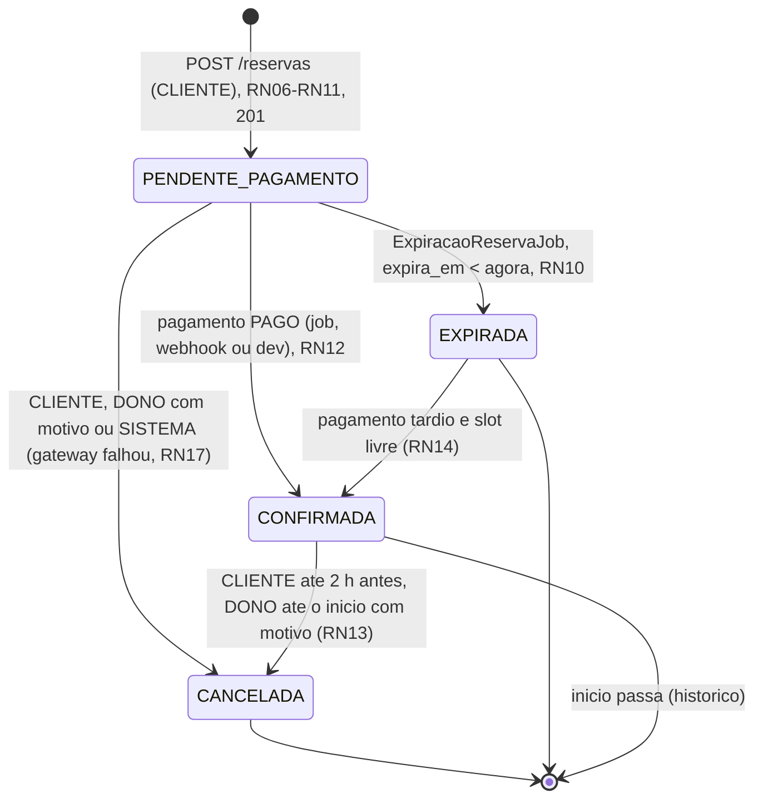
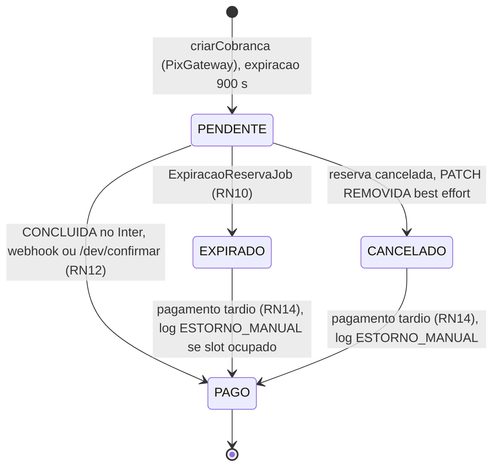

# 07 — Regras de negócio

As 20 regras de negócio (RN01..RN20) do app "Só mais uma", agrupadas por tema, com a resposta HTTP de cada violação, as máquinas de estado de Reserva e de Pagamento, a tabela de transições permitidas e a explicação completa de como a exclusividade do slot (RN08) é garantida no PostgreSQL sem lock.

## Convenções

- Formato: `RNnn — regra`. Citação em outros documentos: RN08.
- Toda violação responde com `ProblemDetail` (RFC 9457) e campo `codigo` (RNF09). Códigos usados aqui: 400 `VALIDACAO` · 403 `ACESSO_NEGADO` · 404 `NAO_ENCONTRADO` · 409 `HORARIO_INDISPONIVEL`, `QUADRA_COM_RESERVAS`, `HORARIO_COM_RESERVAS`, `DIA_JA_CADASTRADO`, `EMAIL_JA_CADASTRADO` · 422 `REGRA_NEGOCIO` com subcódigos `FORA_DO_FUNCIONAMENTO`, `DATA_FORA_DA_JANELA`, `RESERVA_PENDENTE_EXISTENTE`, `CANCELAMENTO_FORA_DO_PRAZO`, `TRANSICAO_INVALIDA` · 502 `PAGAMENTO_INDISPONIVEL`.
- Onde a regra mora: **banco** (constraint/índice em `V1__init.sql`), **service** (classe Java citada) ou **app** (só UX, nunca a única defesa).
- Enums: `StatusReserva {PENDENTE_PAGAMENTO, CONFIRMADA, CANCELADA, EXPIRADA}`, `StatusPagamento {PENDENTE, PAGO, EXPIRADO, CANCELADO}`, `CanceladoPor {CLIENTE, DONO, SISTEMA}`, `StatusSlot {LIVRE, OCUPADO, PASSADO, FECHADO}`.
- "Reserva ativa" = status `PENDENTE_PAGAMENTO` ou `CONFIRMADA`. "Agora" = relógio do backend no fuso `America/Sao_Paulo` (RNF12).

| Tema | Regras |
|---|---|
| Perfis e propriedade | RN01, RN02, RN03, RN04, RN05, RN20 |
| Tempo, slots e horários de funcionamento | RN06, RN07, RN09, RN19 |
| Exclusividade e concorrência | RN08 |
| Ciclo de vida da reserva | RN10, RN11, RN13, RN15, RN16 |
| Pagamento | RN12, RN14, RN17, RN18 |

## Perfis e propriedade

### RN01 — Somente DONO cria, edita e desativa quadras; a quadra nasce com dono = usuário logado.

- Onde: `@PreAuthorize("hasRole('DONO')")` em `QuadraController` (escritas) + `QuadraService.criar` grava `quadra.dono_id = usuarioAutenticado.id` ignorando qualquer `donoId` do corpo.
- Violação: CLIENTE em `POST/PUT/DELETE /quadras` → 403 `ACESSO_NEGADO`.
- Evidência: Swagger com token `cliente@demo.com` → 403.

### RN02 — DONO não reserva; para jogar, usa uma conta CLIENTE.

- Onde: `hasRole('CLIENTE')` em `POST /reservas`; a bottom-nav do DONO não tem "Reservar" e `DetalheQuadra` esconde a grade de slots para DONO.
- Violação: DONO em `POST /reservas` → 403.
- Motivo: elimina o caso "dono reservando a própria quadra" (pagamento para si mesmo, cancelamento sem regra). Limitação consciente: quem tem os dois papéis precisa de dois cadastros (RN20).

### RN03 — DONO só altera quadras, horários de funcionamento e reservas das próprias quadras.

- Onde: checagem de propriedade no service (`quadra.getDono().getId().equals(usuario.id)`) em `QuadraService`, `HorarioFuncionamentoService` e `ReservaService.cancelarPeloDono`; `GET /quadras/{id}/reservas` idem.
- Violação: → 403 `ACESSO_NEGADO` (mesmo que o registro exista; não devolvemos 404 para não vazar existência).
- Teste: `QuadraServiceTest` (dono A editando quadra do dono B).

### RN04 — CLIENTE só vê, edita e cancela as próprias reservas.

- Onde: `ReservaService` compara `reserva.cliente_id` com o usuário autenticado em `GET /reservas/{id}`, `PATCH /reservas/{id}`, `POST /reservas/{id}/cancelar`, `GET /reservas/{id}/pagamento`; `GET /reservas` filtra por `cliente_id`.
- Violação: → 403.

### RN05 — Nenhum perfil vê dados do pagador do Pix; o sistema não os armazena.

- Onde: tabela `pagamento` sem colunas de pagador (RNF02); `PagamentoResponse` expõe só `txid, status, valor, pixCopiaECola, expiraEm, pagoEm`; o dono vê nome e telefone do **cliente cadastrado** (`usuario.nome/telefone`), nunca do pagador Pix, que pode ser outra pessoa.
- Violação: não se aplica (dado inexistente por construção).

### RN20 — E-mail é único por usuário e o perfil não muda após o cadastro.

- Onde: `usuario.email UNIQUE` (armazenado em minúsculas) + `PUT /usuarios/me` não aceita `email` nem `perfil` (campos ausentes do DTO `AtualizarUsuarioRequest`).
- Violação: `POST /auth/registrar` com e-mail existente → 409 `EMAIL_JA_CADASTRADO`. A tradução parte de `DataIntegrityViolationException`, mas **só acontece quando o nome da restrição violada é `ux_usuario_email`** (nome explícito da constraint em `V1__init.sql`), exatamente como em RN08. Qualquer outra violação de integridade na mesma inserção (chave estrangeira, `NOT NULL`, `CHECK`) volta a subir e responde 500, com a exceção original registrada por completo no log — nunca é reescrita como "e-mail já cadastrado".

## Tempo, slots e horários de funcionamento

### RN06 — Toda reserva começa em hora cheia no fuso America/Sao_Paulo.

- Onde: `SlotService.validar` converte o `OffsetDateTime` recebido com `atZoneSameInstant(FUSO)` e rejeita `minute != 0 || second != 0`.
- Violação: → 400 `VALIDACAO` (campo `inicio`: "Reservas começam em hora cheia").
- Consequência: o par `(quadra_id, inicio)` identifica um slot sem comparação de intervalos — base de RN08.
- Fuso: `19:00-03:00` e `22:00Z` são o mesmo instante e caem no mesmo slot; `SlotServiceTest` cobre offset diferente.

### RN07 — Duração fixa de 60 minutos; o valor da reserva é o `preco_hora` da quadra no momento da reserva.

- Onde: `Reserva.pendente(...)` grava `fim = inicio + 60 min` e `valor = quadra.preco_hora` (cópia). Mudar o preço da quadra depois não altera reservas existentes nem a cobrança já emitida.
- Violação: não há entrada do usuário para duração; o DTO `CriarReservaRequest` não tem `fim` nem `valor`.

### RN09 — Janela de reserva: somente no futuro, até hoje + 14 dias, dentro do horário de funcionamento e em quadra ativa.

| Condição | Verificação (`SlotService.validar`) | Resposta |
|---|---|---|
| Quadra existe e `ativa = true` | `quadraRepository.findByIdAndAtivaTrue` | 404 `NAO_ENCONTRADO` (quadra inativa é tratada como inexistente para o cliente) |
| `inicio > agora` | comparação no fuso | 400 `VALIDACAO` (`@Future` + checagem no service) |
| `data(inicio) <= hoje + 14` | idem | 422 `DATA_FORA_DA_JANELA` |
| Dia tem `horario_funcionamento` e `hora_abertura <= hora(inicio)` e `hora(inicio) + 1h <= hora_fechamento` | `HorarioFuncionamentoRepository.findByQuadraIdAndDiaSemana(DayOfWeek.getValue())` | 422 `FORA_DO_FUNCIONAMENTO` |

- A mesma lógica gera a grade de RF12: slots fora do funcionamento vêm `FECHADO`, no passado `PASSADO`, com reserva ativa `OCUPADO`, o resto `LIVRE`. `GET /slots?data=` além de hoje+14 → 422.
- Quadra desativada depois de uma reserva existir: só é possível se não houver reservas ativas futuras (RN16); logo, não existe reserva ativa em quadra inativa.

### RN19 — HorarioFuncionamento: uma faixa por dia da semana (1 = segunda .. 7 = domingo); dia sem registro = fechado; `hora_fechamento > hora_abertura`.

- Onde: `UNIQUE (quadra_id, dia_semana)`, `CHECK (dia_semana BETWEEN 1 AND 7)`, `CHECK (hora_fechamento > hora_abertura)` em `V1__init.sql`; `dia_semana` = `java.time.DayOfWeek.getValue()` sem mapeamento.
- Violações: dia repetido → 409 `DIA_JA_CADASTRADO`; fechamento ≤ abertura → 400 `VALIDACAO`; `dia_semana` fora de 1..7 → 400.
- Limitação consciente: sem intervalo de almoço (duas faixas no mesmo dia), sem horário que atravessa a meia-noite, sem exceções por data (feriado/manutenção é Could Have).

## Exclusividade e concorrência

### RN08 — Exclusividade: no máximo uma reserva ativa (PENDENTE_PAGAMENTO ou CONFIRMADA) por (quadra, início); garantida por índice único parcial no PostgreSQL; o concorrente recebe 409 HORARIO_INDISPONIVEL.

Esta é a regra mais importante do sistema e a que o grupo defende na banca (integrante C). Ela é implementada em três camadas, todas obrigatórias, e provada por um teste automatizado.

#### Camada 1 — a garantia mora no banco: índice único parcial

```sql
-- V1__init.sql
CREATE UNIQUE INDEX ux_reserva_slot_ativo
    ON reserva (quadra_id, inicio)
    WHERE status IN ('PENDENTE_PAGAMENTO', 'CONFIRMADA');
```

Como funciona:

1. O índice só contém linhas com status ativo. Reservas `CANCELADA` e `EXPIRADA` **saem do índice automaticamente** quando o status muda — o slot é liberado sem nenhum código extra e o histórico é preservado (RN15).
2. Duas transações que tentam inserir a mesma chave `(quadra_id, inicio)`: a primeira grava a entrada no índice; a segunda **bloqueia nessa entrada** até a primeira terminar. Se a primeira commita, a segunda recebe `unique_violation` (SQLSTATE 23505); se a primeira faz rollback, a segunda prossegue. Isso vale para N threads e N instâncias do backend, porque a serialização é feita pelo PostgreSQL.
3. Como RN06 e RN07 fixam o slot em hora cheia de 60 min, `(quadra_id, inicio)` é a identidade completa do slot: não há intervalos sobrepostos a comparar.

Por que não outras técnicas (todas rejeitadas explicitamente, docs/09-arquitetura.md):

| Alternativa | Por que não |
|---|---|
| Checar `existsByQuadraIdAndInicioAndStatusIn` antes do `INSERT` | Janela de corrida entre o SELECT e o INSERT; serve só como UX (grade de slots), nunca como garantia. |
| Lock pessimista (`SELECT ... FOR UPDATE`) | **Não há linha para travar antes do INSERT**; travar a linha da `quadra` serializaria todas as reservas da quadra (inclusive de horários diferentes) e seria redundante com o índice. |
| Lock otimista (`@Version`) | Protege atualizações de uma linha existente; a dupla reserva é um problema de **criação**. |
| `EXCLUDE USING gist (quadra_id WITH =, tstzrange(inicio, fim) WITH &&)` | Resolve intervalos arbitrários, que não existem aqui; exige a extensão `btree_gist` e é mais difícil de explicar. |
| Lock distribuído (Redis) / fila | Infraestrutura extra para um problema que uma linha de SQL resolve. |

#### Camada 2 — transação curta, `saveAndFlush` e 409; cobrança fora da transação

```java
// service/ReservaService.java
@Transactional
public Reserva criarPendente(Long clienteId, CriarReservaRequest req) {
    Quadra q = quadraRepository.findByIdAndAtivaTrue(req.quadraId())
            .orElseThrow(NaoEncontradoException::new);                          // RN09 (404)
    ZonedDateTime inicio = req.inicio().atZoneSameInstant(FUSO);                // RNF12
    slotService.validar(q, inicio);                                             // RN06 (400), RN09 (422)
    if (reservaRepository.existsByClienteIdAndStatus(clienteId, PENDENTE_PAGAMENTO))
        throw new RegraNegocioException(RESERVA_PENDENTE_EXISTENTE);            // RN11 (422)
    Reserva r = Reserva.pendente(q, clienteId, inicio.toInstant(), q.getPrecoHora(),
                                 Instant.now().plus(15, ChronoUnit.MINUTES));   // RN07, RN10
    try {
        return reservaRepository.saveAndFlush(r);                               // INSERT acontece AQUI
    } catch (DataIntegrityViolationException e) {
        if (!ViolacaoIntegridade.de(e, "ux_reserva_slot_ativo")) throw e;       // outra constraint: 500 + log completo
        throw new HorarioIndisponivelException();                               // RN08 -> 409
    }
}
```

```java
// support/ViolacaoIntegridade.java — le o nome da constraint que o PostgreSQL devolve no 23505
public final class ViolacaoIntegridade {
    public static boolean de(DataIntegrityViolationException e, String constraint) {
        return e.getMostSpecificCause() instanceof PSQLException p
                && p.getServerErrorMessage() != null
                && constraint.equals(p.getServerErrorMessage().getConstraint());
    }
}
```

Pontos que importam:

- **`saveAndFlush`, não `save`**: com `save` o INSERT só é emitido no commit, fora do método, e a violação apareceria como `TransactionSystemException`/`JpaSystemException` no proxy transacional, onde o `catch` já não alcança. O `flush` força o INSERT dentro do `try`.
- **O `catch` é seletivo, não genérico**: só a violação de `ux_reserva_slot_ativo` vira 409 `HORARIO_INDISPONIVEL`. Um `catch (DataIntegrityViolationException e)` que traduzisse tudo mentiria para o usuário e esconderia defeito: duração inválida, hora não cheia, `quadra_id`/`cliente_id` inexistente e campo obrigatório vazio também chegam como `DataIntegrityViolationException` e nada têm a ver com concorrência. Essas continuam subindo, respondem 500 e são registradas por inteiro no log (`ERROR`, com a exceção original), para aparecerem como defeito e não como "horário ocupado". A mesma regra vale para `ux_usuario_email` em RN20.
- `GlobalExceptionHandler` mapeia `HorarioIndisponivelException` para `ProblemDetail{status: 409, codigo: "HORARIO_INDISPONIVEL", detail: "Esse horário acabou de ser reservado. Escolha outro."}`. No app, `Resultado.Erro("HORARIO_INDISPONIVEL")` mostra o snackbar, volta para `DetalheQuadra` e recarrega a grade.
- A transação contém apenas leituras locais e um INSERT: dura milissegundos. **Nenhuma chamada HTTP ao Inter acontece com a entrada do índice bloqueada.** Isso é responsabilidade da `ReservaFacade`:

```java
// service/ReservaFacade.java (sem @Transactional)
public ReservaResponse criar(Long clienteId, CriarReservaRequest req) {
    Reserva r = reservaService.criarPendente(clienteId, req);      // tx 1: commit da reserva
    try {
        Pagamento p = pagamentoService.criarCobranca(r);          // HTTP ao gateway + tx 2: INSERT pagamento
        return ReservaResponse.de(r, p);
    } catch (IntegracaoExternaException e) {
        reservaService.cancelarPorSistema(r.getId(), "GATEWAY_INDISPONIVEL"); // tx 3: RN17
        throw new PagamentoIndisponivelException();               // 502, slot liberado
    }
}
```

Entre a tx 1 e a tx 2 o slot já está reservado (PENDENTE) para os concorrentes — comportamento desejado: quem chegou primeiro tem 15 min para pagar. Se a cobrança falhar, a tx 3 cancela por SISTEMA e o índice libera o slot (RN17). É por isso que a relação é `reserva 1 — 0..1 pagamento`.

#### Camada 3 — transições por `UPDATE` condicional (imune a lost update)

Toda mudança de status é um `UPDATE ... WHERE id = ? AND status = <esperado>` via `@Modifying` no repository, e o service olha o **número de linhas afetadas**:

```java
// repository/ReservaRepository.java
@Modifying @Query("""
    UPDATE Reserva r SET r.status = 'EXPIRADA', r.atualizadoEm = :agora
    WHERE r.status = 'PENDENTE_PAGAMENTO' AND r.expiraEm < :agora""")
int expirar(Instant agora);

@Modifying @Query("""
    UPDATE Reserva r SET r.status = 'CONFIRMADA', r.atualizadoEm = :agora
    WHERE r.id = :id AND r.status = 'PENDENTE_PAGAMENTO'""")
int confirmar(Long id, Instant agora);

@Modifying @Query("""
    UPDATE Reserva r SET r.status = 'CANCELADA', r.canceladoPor = :por, r.motivoCancelamento = :motivo,
           r.canceladoEm = :agora, r.atualizadoEm = :agora
    WHERE r.id = :id AND r.status IN ('PENDENTE_PAGAMENTO', 'CONFIRMADA')""")
int cancelar(Long id, CanceladoPor por, String motivo, Instant agora);
```

- **1 linha** = a transição aconteceu.
- **0 linhas** = outro fluxo venceu a corrida. Se o chamador é um usuário → 422 `TRANSICAO_INVALIDA` ("A reserva já foi confirmada/cancelada"); se é um job ou webhook → no-op com log `INFO`.
- Nunca se lê a entidade, altera em memória e salva (`setStatus` + `save`): isso perderia a escrita concorrente.

```java
// service/ExpiracaoReservaJob.java
@Scheduled(fixedDelay = 60_000) @Transactional
public void expirarPendentes() {
    Instant agora = Instant.now();
    int r = reservaRepository.expirar(agora);   // RN10
    int p = pagamentoRepository.expirar(agora); // UPDATE pagamento SET status='EXPIRADO' WHERE status='PENDENTE' AND expira_em < :agora
    if (r + p > 0) log.info("expiradas reservas={} pagamentos={}", r, p);
}
```

#### Confirmação idempotente (RN12) — o mesmo `UPDATE` condicional, duas vezes

Este é o **único** ponto de confirmação do sistema; o mesmo método atende os três caminhos (job, webhook e `/dev/confirmar`). O código abaixo é idêntico ao de docs/11-integracao-pix-inter.md, seção 8. O retorno é `ResultadoConfirmacao {CONFIRMADA, JA_PROCESSADO, ESTORNO_MANUAL, VALOR_DIVERGENTE, DESCONHECIDO}`; nenhum desses valores faz o webhook responder diferente de 200.

```java
// service/PagamentoService.java
@Transactional
public ResultadoConfirmacao confirmar(String txid, String endToEndId, BigDecimal valor, OffsetDateTime horario) {
    Pagamento p = pagamentoRepository.findByTxid(txid).orElse(null);
    if (p == null) { log.warn("txid desconhecido {}", txid); return ResultadoConfirmacao.DESCONHECIDO; }
    if (p.getValor().compareTo(valor) != 0) {                                    // RN12: valor igual ao da cobranca
        log.warn("VALOR_DIVERGENTE txid={} esperado={} recebido={}", txid, p.getValor(), valor);
        return ResultadoConfirmacao.VALOR_DIVERGENTE;
    }
    Long reservaId = p.getReserva().getId();          // lidos ANTES: marcarPago limpa o contexto e desanexa p
    BigDecimal valorCobranca = p.getValor();
    int pagos;
    try {
        pagos = pagamentoRepository.marcarPago(txid, endToEndId, horario);       // 0 ou 1 linha
    } catch (DataIntegrityViolationException e) {
        if (!ViolacaoIntegridade.de(e, "ux_pagamento_end_to_end_id")) throw e;   // outra constraint: 500 + log
        log.warn("E2E_DUPLICADO txid={} endToEndId={}", txid, endToEndId);       // mesmo Pix ja aplicado a outro txid
        return ResultadoConfirmacao.JA_PROCESSADO;                               // webhook responde 200
    }
    if (pagos == 1) {
        if (reservaRepository.confirmar(reservaId, Instant.now()) == 1)
            return ResultadoConfirmacao.CONFIRMADA;
        return tratarPagamentoTardio(txid, reservaId, valorCobranca, endToEndId, horario);   // RN14
    }
    if (pagamentoRepository.statusAtual(txid) == PAGO)                           // RELIDO do banco, nao da entidade
        return ResultadoConfirmacao.JA_PROCESSADO;                               // job x webhook x /dev: no-op
    return tratarPagamentoTardio(txid, reservaId, valorCobranca, endToEndId, horario);       // EXPIRADO/CANCELADO
}

private ResultadoConfirmacao tratarPagamentoTardio(String txid, Long reservaId, BigDecimal valor,
                                                   String endToEndId, OffsetDateTime horario) {
    boolean reconfirmada = false;
    try {
        reconfirmada = reconfirmacaoTardia.reconfirmarExpirada(reservaId);       // TRANSACAO PROPRIA (REQUIRES_NEW)
    } catch (DataIntegrityViolationException e) {
        if (!ViolacaoIntegridade.de(e, "ux_reserva_slot_ativo")) throw e;
        // slot ja tomado: o rollback ficou contido na transacao interna; ESTA transacao continua valida
    }
    pagamentoRepository.marcarPagoTardio(txid, endToEndId, horario);             // so agora o pagamento vira PAGO
    if (reconfirmada) {
        log.info("RECONFIRMADA_TARDIA txid={} reservaId={}", txid, reservaId);   // T8
        return ResultadoConfirmacao.CONFIRMADA;
    }
    log.warn("ESTORNO_MANUAL txid={} reservaId={} valor={}", txid, reservaId, valor);
    return ResultadoConfirmacao.ESTORNO_MANUAL;
}
```

```java
// service/ReconfirmacaoTardiaService.java — bean SEPARADO: REQUIRES_NEW so vale entre beans (proxy do Spring)
@Service
public class ReconfirmacaoTardiaService {
    @Transactional(propagation = Propagation.REQUIRES_NEW)
    public boolean reconfirmarExpirada(Long reservaId) {
        return reservaRepository.reconfirmarExpirada(reservaId, Instant.now()) == 1;
        // O 23505 de ux_reserva_slot_ativo NAO e capturado aqui: sobe para o chamador e derruba
        // apenas esta transacao. Capturar dentro do metodo faria o commit falhar
        // ("current transaction is aborted"), porque o PostgreSQL ja abortou a transacao.
    }
}
```

```java
// repository/PagamentoRepository.java
@Modifying(clearAutomatically = true, flushAutomatically = true) @Query("""
    UPDATE Pagamento p SET p.status = 'PAGO', p.endToEndId = :e2e, p.pagoEm = :horario, p.atualizadoEm = :agora
    WHERE p.txid = :txid AND p.status = 'PENDENTE'""")
int marcarPago(String txid, String e2e, OffsetDateTime horario);

@Modifying(clearAutomatically = true, flushAutomatically = true) @Query("""
    UPDATE Pagamento p SET p.status = 'PAGO', p.endToEndId = :e2e, p.pagoEm = :horario, p.atualizadoEm = :agora
    WHERE p.txid = :txid AND p.status IN ('EXPIRADO', 'CANCELADO') AND p.endToEndId IS NULL""")
int marcarPagoTardio(String txid, String e2e, OffsetDateTime horario);           // RN14 / T13

@Query("SELECT p.status FROM Pagamento p WHERE p.txid = :txid")
StatusPagamento statusAtual(String txid);

// repository/ReservaRepository.java
@Modifying @Query("""
    UPDATE Reserva r SET r.status = 'CONFIRMADA', r.atualizadoEm = :agora
    WHERE r.id = :id AND r.status = 'EXPIRADA'""")
int reconfirmarExpirada(Long id, Instant agora);                                 // T8
```

Pontos que importam:

- **Zero linhas não é sinônimo de "já processado".** `marcarPago` devolve 0 tanto para um pagamento que já está `PAGO` quanto para um que está `EXPIRADO` ou `CANCELADO`. Por isso o método não pode retornar `JA_PROCESSADO` assim que vê 0: ele relê o status e só encerra se for `PAGO`. Sem essa distinção, `tratarPagamentoTardio` seria código morto e as transições T13 (`EXPIRADO`/`CANCELADO` → `PAGO`) e T8 (`EXPIRADA` → `CONFIRMADA`) nunca aconteceriam.
- **O status é relido do banco, não do objeto carregado.** `marcarPago` é um `UPDATE` em massa: ele não passa pelo contexto de persistência, então o `Pagamento` carregado no início do método continuaria com o status antigo. Daí `@Modifying(clearAutomatically = true, flushAutomatically = true)` (sincroniza antes, limpa depois) e a consulta `statusAtual(txid)`, que vai ao banco. Consequência prática: `p` fica desanexado depois do `UPDATE`, por isso `reservaId` e `valor` são lidos **antes** dele.
- **A reconfirmação tardia mora em transação própria.** Ela é a única operação que pode bater no índice `ux_reserva_slot_ativo`. Quando o PostgreSQL dispara o 23505, a transação em que o comando rodou fica abortada e nenhum `catch` em Java a reabre — dentro dela não daria nem para gravar o log nem para marcar o pagamento como pago, e o `UPDATE` anterior seria desfeito no rollback. Com `REQUIRES_NEW` em um bean separado, o rollback fica contido na transação interna e a externa segue viva para gravar `PAGO` e o `WARN ESTORNO_MANUAL`.
- **A ordem importa**: primeiro a tentativa de reconfirmação (transação própria), depois `marcarPagoTardio`. É isso que torna possível o estado prometido pela RN14 — pagamento `PAGO` com reserva ainda `EXPIRADA` e log de estorno.

Tripla proteção contra duplicidade: (a) o `WHERE status='PENDENTE'` garante que só um chamador (job, webhook ou `/dev/confirmar`) marca PAGO; (b) `end_to_end_id IS NULL` no caminho tardio impede que o mesmo pagamento seja "pago" duas vezes por caminhos diferentes; (c) a constraint `UNIQUE (end_to_end_id)` (`ux_pagamento_end_to_end_id`) impede que o mesmo Pix seja aplicado a dois `txid` distintos — e a violação **é capturada** e mapeada para `JA_PROCESSADO` com log `WARN E2E_DUPLICADO`, para que o webhook responda 200 em vez de 500 e o Inter não reenvie a notificação 4 vezes. `PagamentoServiceTest` chama `confirmar` duas vezes com o mesmo `txid` e verifica 1 e 0 linhas, e repete o mesmo `endToEndId` em outro `txid` verificando `JA_PROCESSADO`.

#### Casos de borda

| Caso | O que acontece | Resultado |
|---|---|---|
| Dois clientes tocam "Confirmar" no mesmo slot | Índice serializa: o 1º INSERT commita, o 2º recebe 23505 | 1×201 + 1×409; `count(*)` ativo = 1 |
| Cliente cancela PENDENTE no mesmo instante em que o job/webhook confirma | Quem executar o `UPDATE` primeiro vence; o outro afeta 0 linhas | Se o cancelamento venceu: pagamento vira PAGO com log `WARN ESTORNO_MANUAL` (RN14). Se a confirmação venceu: cancelamento devolve 422 `TRANSICAO_INVALIDA` e o app recarrega mostrando CONFIRMADA |
| Job (60 s) e webhook confirmam o mesmo `txid` ao mesmo tempo | 1º `marcarPago` afeta 1 linha; 2º afeta 0 e **relê o status no banco**, encontrando `PAGO` | no-op, sem erro, sem duplicidade (RN12) |
| O mesmo `endToEndId` chega para um `txid` diferente | O `INSERT`/`UPDATE` viola `ux_pagamento_end_to_end_id`; o `catch` reconhece o nome da constraint | `JA_PROCESSADO` + log `WARN E2E_DUPLICADO`; webhook responde 200 (sem as 4 retentativas do Inter) |
| Pagamento chega até 60 s depois de a reserva ter EXPIRADO (janela do job) | `marcarPago` afeta 0 (pagamento já EXPIRADO) e o status relido não é `PAGO`; `tratarPagamentoTardio` tenta `UPDATE reserva SET status='CONFIRMADA' WHERE id=? AND status='EXPIRADA'` em **transação própria** (`ReconfirmacaoTardiaService`, `REQUIRES_NEW`) e só depois marca o pagamento PAGO | Slot ainda livre: reserva reconfirmada. Slot já tomado por outro (23505 em `ux_reserva_slot_ativo`): a transação interna faz rollback sozinha, a externa continua válida, o pagamento fica PAGO, a reserva fica EXPIRADA e sai `WARN ESTORNO_MANUAL txid=...` (RN14) |
| Pagamento chega para reserva CANCELADA pelo cliente ou pelo dono | pagamento PAGO, reserva permanece CANCELADA | log `WARN ESTORNO_MANUAL`; estorno fora do app (RN14) |
| Gateway Pix falha ao criar a cobrança | `ReservaFacade` cancela por SISTEMA | 502 `PAGAMENTO_INDISPONIVEL`; slot liberado; sem linha em `pagamento` (RN17) |
| Cobrança fica ATIVA no Inter após cancelamento pelo cliente | `PagamentoService.cancelar` tenta `PATCH /pix/v2/cob/{txid}` com `status: REMOVIDA_PELO_USUARIO_RECEBEDOR` (best effort, erro só loga) | Se o PATCH falhar e o cliente pagar mesmo assim, cai no caso anterior |
| Job encontra a cobrança `REMOVIDA_PELO_PSP` / `REMOVIDA_PELO_USUARIO_RECEBEDOR` com pagamento PENDENTE | Não altera nada; a reserva expira naturalmente pela RN10 em no máximo 15 min | Slot liberado pelo job de expiração; Pix não tem estado "recusado" |
| Sandbox Inter fechado (fora de 8h–20h seg–sex) | Criação → 502 (RN17); job registra `INFO` e pula o ciclo sem mudar status | Reserva pendente expira normalmente se ninguém pagar |
| Grade de slots mostra LIVRE, mas o slot acabou de ser tomado | A grade é "melhor esforço" (RNF11) | 409 no toque; grade recarregada |

#### Evidência: `ReservaConcorrenciaIT`

- Teste de integração com Testcontainers (`postgres:18-alpine`, `@ServiceConnection`), profile `simulado`.
- 10 threads (`ExecutorService` + `CountDownLatch` para largarem juntas) chamam `POST /api/v1/reservas` com **10 clientes diferentes** (RN11 exige um cliente por reserva pendente) para a mesma `quadraId` e o mesmo `inicio`.
- Asserções: exatamente **1 resposta 201 e 9 respostas 409 `HORARIO_INDISPONIVEL`**; `SELECT count(*) FROM reserva WHERE quadra_id=? AND inicio=? AND status IN ('PENDENTE_PAGAMENTO','CONFIRMADA')` = 1; exatamente 1 linha em `pagamento`; nenhuma exceção não tratada no log.
- Dimensionamento: pool Hikari padrão de 10 conexões atende as 10 threads; o teste roda no CI a cada PR (RNF10) e no terminal durante a apresentação, ao lado da demo com dois celulares.
- Complemento: `ReservaServiceTest` (unitário) cobre RN06, RN09, RN11 e as transições com 0 linhas → 422.

## Ciclo de vida da reserva

### RN10 — Reserva nasce PENDENTE_PAGAMENTO com `expira_em = criado_em + 15 min`; a cobrança Pix tem a mesma expiração (900 s); vencida, vira EXPIRADA e libera o slot.

- Onde: `Reserva.pendente(...)` define `expira_em`; `PagamentoService.criarCobranca` envia `calendario.expiracao = 900` ao gateway e grava `pagamento.expira_em = reserva.expira_em`; `ExpiracaoReservaJob` (60 s) executa os dois `UPDATE` em lote.
- Consequências: o slot pode ficar "preso" no máximo 16 min (15 + 1 ciclo do job); o app mostra o contador com `expiraEm` e, ao zerar, exibe "Expirado" e o botão "Reservar novamente".
- Incerteza registrada: o Inter documenta que o `status` da cobrança não reflete expiração (continua `ATIVA`); por isso a expiração é decidida pelo nosso `expira_em`, não pela consulta ao Inter. Pagamento após esse prazo cai em RN14.

### RN11 — Um cliente só pode ter uma reserva PENDENTE_PAGAMENTO por vez.

- Onde: `existsByClienteIdAndStatus(clienteId, PENDENTE_PAGAMENTO)` em `ReservaService.criarPendente` (checagem simples; a corrida do próprio cliente contra si mesmo é tolerada — no pior caso ele terá duas pendentes por 15 min).
- Violação: → 422 `RESERVA_PENDENTE_EXISTENTE`; o app leva o cliente à reserva pendente (`DetalheReserva(reservaId)`, usando a propriedade `reservaId` do `ProblemDetail`) em vez de mostrar erro seco.
- Motivo: impede um cliente de bloquear vários slots sem pagar.

### RN13 — Cancelamento: CLIENTE cancela PENDENTE a qualquer momento e CONFIRMADA até 2 h antes do início; DONO cancela reservas das suas quadras até o início com motivo obrigatório; não há estorno automático.

| Quem | Status atual | Prazo | Motivo | Resposta fora do prazo |
|---|---|---|---|---|
| CLIENTE (dono da reserva) | PENDENTE_PAGAMENTO | qualquer momento antes de expirar | opcional | — |
| CLIENTE | CONFIRMADA | `agora <= inicio - 2h` | opcional | 422 `CANCELAMENTO_FORA_DO_PRAZO` |
| DONO (dono da quadra) | PENDENTE_PAGAMENTO ou CONFIRMADA | `agora < inicio` | **obrigatório** (`motivo` 1..200) | 422 `CANCELAMENTO_FORA_DO_PRAZO`; sem motivo → 400 `VALIDACAO` |
| Qualquer | CANCELADA ou EXPIRADA | — | — | 422 `TRANSICAO_INVALIDA` |

- Onde: `ReservaService.cancelar` (regra de prazo no fuso RNF12) + `ReservaRepository.cancelar` (UPDATE condicional) + `PagamentoService.cancelar` (pagamento PENDENTE → CANCELADO e `PATCH` best effort no Inter).
- Gravação: `cancelado_por` (CLIENTE/DONO), `motivo_cancelamento`, `cancelado_em`.
- Estorno: cancelar uma reserva CONFIRMADA (paga) **não devolve o dinheiro pelo app** (RN14). O `DetalheReserva` mostra a regra antes do diálogo ("Cancelamento gratuito até 2 h antes; após o pagamento, a devolução é combinada diretamente com a quadra"); o dono vê `usuario.telefone` do cliente em `ReservasQuadra` para combinar a devolução.

### RN15 — Reserva nunca é apagada (histórico); o cliente edita apenas a observação.

- Onde: não existe `DELETE /reservas/{id}`; `PATCH /reservas/{id}` aceita só `observacao` (máx. 200) e só em reserva ativa; `GET /reservas?situacao=HISTORICO` lista CANCELADA, EXPIRADA e passadas.
- Violação: `PATCH` em CANCELADA/EXPIRADA → 422 `TRANSICAO_INVALIDA`; qualquer outro campo é ignorado pelo DTO.
- Remarcar (`PATCH inicio` enquanto PENDENTE_PAGAMENTO) é Could Have e, se entrar, gera nova cobrança e passa pelo mesmo índice único.

### RN16 — Desativar quadra ou reduzir/remover horário de funcionamento com reservas ativas futuras é bloqueado; o dono cancela uma a uma antes.

| Operação | Checagem (service) | Resposta |
|---|---|---|
| `DELETE /quadras/{id}` | existe reserva ativa com `inicio > agora` na quadra | 409 `QUADRA_COM_RESERVAS` (com `detail` dizendo quantas) |
| `PUT .../horarios-funcionamento/{hid}` reduzindo a faixa | existe reserva ativa futura naquele `dia_semana` cujo horário fica fora da nova faixa | 409 `HORARIO_COM_RESERVAS` |
| `DELETE .../horarios-funcionamento/{hid}` | existe reserva ativa futura naquele `dia_semana` | 409 `HORARIO_COM_RESERVAS` |
| Ampliar a faixa ou editar outros campos da quadra | — | 200 |

- Motivo: nenhuma cascata silenciosa sobre dinheiro do cliente. O dono cancela cada reserva em `ReservasQuadra` (RN13, motivo obrigatório, telefone do cliente para o estorno manual) e então repete a operação. Risco R20 em docs/19-riscos.md.
- Teste: `QuadraServiceTest`, `HorarioFuncionamentoServiceTest`.

## Pagamento

### RN12 — Pagamento PAGO confirma a reserva (CONFIRMADA); a confirmação é idempotente (UPDATE condicional por status + `end_to_end_id` único) e exige valor igual ao da cobrança.

- Onde: `PagamentoService.confirmar` (código na seção RN08). Fontes de confirmação: `ConsultaPagamentoJob` (`GET /pix/v2/cob/{txid}` → `CONCLUIDA` com `pix[0].endToEndId/horario`), `InterWebhookController` (array `[{txid, endToEndId, valor, horario, ...}]`, recomendado) e `DevPagamentoController` (RF21; no profile `simulado` gera `endToEndId` sintético `"SIMULADO-" + txid.substring(0, 20)`, com 29 caracteres, dentro do `VARCHAR(32)` de `end_to_end_id`).
- Valor divergente (`valor != pagamento.valor`): não confirma, log `WARN VALOR_DIVERGENTE`, webhook responde 200 mesmo assim (para o Inter não reenviar 4 vezes); tratamento manual.
- `txid` desconhecido no webhook: ignorado com 200; corpo malformado: 400.
- Zero linhas afetadas não encerra o método: o status é relido do banco e só `PAGO` é no-op; `EXPIRADO` e `CANCELADO` seguem para RN14. Sem isso, RN14 seria inalcançável.
- `end_to_end_id` repetido (mesmo Pix chegando para outro `txid`): a violação de `ux_pagamento_end_to_end_id` é capturada pelo nome da constraint, vira `JA_PROCESSADO` com log `WARN E2E_DUPLICADO` e o webhook responde 200 — nunca 500, que faria o Inter reenviar a notificação 4 vezes.

### RN14 — Estorno é manual e fora do app; pagamento recebido para reserva EXPIRADA ou CANCELADA fica PAGO com log ESTORNO_MANUAL (se o slot ainda estiver livre, a reserva EXPIRADA é reconfirmada).

- Onde: `PagamentoService.tratarPagamentoTardio` + `ReconfirmacaoTardiaService` (seção RN08, casos de borda). Ordem, nesta sequência: (1) tenta reconfirmar a reserva, **em transação própria** (`@Transactional(propagation = REQUIRES_NEW)` em bean separado), só se ela estiver EXPIRADA e o índice `ux_reserva_slot_ativo` aceitar; (2) só então grava o pagamento como PAGO (`marcarPagoTardio`, guardado por `status IN ('EXPIRADO','CANCELADO') AND end_to_end_id IS NULL`), porque o dinheiro entrou de fato; (3) registra `INFO RECONFIRMADA_TARDIA` se a reserva voltou, ou `WARN ESTORNO_MANUAL txid=... reservaId=... valor=...` caso contrário.
- Por que a transação separada: o 23505 do índice aborta a transação no PostgreSQL. Se a tentativa rodasse na mesma transação da marcação de pago, o `catch` em Java não a reabriria — nem o log nem a marcação de pago seriam gravados, e tudo seria desfeito no rollback. Com `REQUIRES_NEW` o rollback fica contido na transação interna e o estado prometido por esta regra (pagamento PAGO + reserva EXPIRADA + log de estorno) é de fato alcançável.
- Operação: o log é a lista de estornos a fazer; o dono/plataforma devolve pelo app do banco usando o telefone do cliente. Devolução automática via API (`pix.write` devolução) está fora do MVP.
- Motivo: a janela é curta (expiração Pix = expiração da reserva, 900 s), a probabilidade é muito baixa (R6) e tratar devolução bancária dobraria a superfície de erro.

### RN17 — Falha ao gerar a cobrança Pix cancela a reserva por SISTEMA e responde 502 PAGAMENTO_INDISPONIVEL, liberando o slot.

- Onde: `ReservaFacade.criar` (seção RN08). Gatilhos: `IntegracaoExternaException` do `InterPixGateway` (token 4xx/5xx, sandbox fechado, timeout, certificado vencido) — no `SimuladoPixGateway` só ocorre por bug.
- Gravação: `status = CANCELADA`, `cancelado_por = SISTEMA`, `motivo_cancelamento = 'GATEWAY_INDISPONIVEL'`, sem linha em `pagamento`.
- App: "Não foi possível gerar a cobrança. Tente novamente." e volta para a grade; a reserva cancelada aparece no histórico do cliente com o motivo.

### RN18 — No MVP todo Pix é recebido na única chave configurada da plataforma; repasse ao dono ocorre fora do app.

- Onde: `INTER_CHAVE_PIX` (profiles `inter-*`) e `SIMULADO_PIX_CHAVE` (profile `simulado`) são a única `chave` enviada em `PUT /pix/v2/cob/{txid}` e no BR Code estático; a chave precisa pertencer à conta da integração (exigência do Inter).
- Consequência: `quadra` não tem chave Pix nem conta; não existe split, repasse ou conciliação por dono no app. `ReservasQuadra` mostra ao dono o valor e o status de cada reserva para conciliação manual.
- Registrado como "trabalhos futuros" junto com o split entre jogadores.

## Máquinas de estado

### Reserva (`StatusReserva`)



Versão textual: `PENDENTE_PAGAMENTO` → `CONFIRMADA` (pago) | `EXPIRADA` (15 min) | `CANCELADA` (cliente, dono ou sistema); `CONFIRMADA` → `CANCELADA` (cliente ≤ 2 h antes, dono até o início); `EXPIRADA` → `CONFIRMADA` só por pagamento tardio com slot livre. `CANCELADA` é terminal; reserva nunca é apagada.

### Pagamento (`StatusPagamento`)



Versão textual: `PENDENTE` → `PAGO` | `EXPIRADO` | `CANCELADO`; `EXPIRADO`/`CANCELADO` → `PAGO` apenas quando o dinheiro chega tarde (sempre com log `ESTORNO_MANUAL`, exceto se a reserva EXPIRADA for reconfirmada). `PAGO` é terminal: não há devolução no app.

Mapeamento com o Inter: `ATIVA` → `PENDENTE`; `CONCLUIDA` → `PAGO`; `REMOVIDA_PELO_USUARIO_RECEBEDOR` (nosso PATCH) → `CANCELADO`; `REMOVIDA_PELO_PSP` → sem transição (expira pela RN10). O Inter não tem estado "expirada" nem "recusada".

### Tabela de transições permitidas

| # | Entidade | De → Para | Quem dispara | Endpoint / componente | Guarda (`WHERE`) | Resposta HTTP / efeito |
|---|---|---|---|---|---|---|
| T1 | Reserva | — → PENDENTE_PAGAMENTO | CLIENTE | `POST /reservas` | RN06, RN09, RN11 no service; RN08 no índice | 201; 400; 404; 409; 422; 502 (T4 automática) |
| T2 | Reserva | PENDENTE_PAGAMENTO → CONFIRMADA | SISTEMA (job, webhook, `/dev`) | `PagamentoService.confirmar` | `status='PENDENTE_PAGAMENTO'` | 1 linha: confirmada; 0 linhas: RN14 |
| T3 | Reserva | PENDENTE_PAGAMENTO → EXPIRADA | SISTEMA | `ExpiracaoReservaJob` (60 s) | `status='PENDENTE_PAGAMENTO' AND expira_em < agora` | lote; slot liberado |
| T4 | Reserva | PENDENTE_PAGAMENTO → CANCELADA (SISTEMA) | SISTEMA | `ReservaFacade` (RN17) | `status='PENDENTE_PAGAMENTO'` | cliente recebe 502 `PAGAMENTO_INDISPONIVEL` |
| T5 | Reserva | PENDENTE_PAGAMENTO → CANCELADA (CLIENTE) | CLIENTE dono da reserva | `POST /reservas/{id}/cancelar` | `status IN (ativos)` | 200; 403; 422 `TRANSICAO_INVALIDA` se 0 linhas; pagamento → T10 |
| T6 | Reserva | CONFIRMADA → CANCELADA (CLIENTE) | CLIENTE | `POST /reservas/{id}/cancelar` | `agora <= inicio - 2h` (service) + `status IN (ativos)` | 200; 422 `CANCELAMENTO_FORA_DO_PRAZO`; sem estorno (RN14) |
| T7 | Reserva | PENDENTE_PAGAMENTO / CONFIRMADA → CANCELADA (DONO) | DONO da quadra | `POST /reservas/{id}/cancelar {motivo}` | `agora < inicio` + motivo presente + propriedade (RN03) | 200; 400 sem motivo; 403; 422 |
| T8 | Reserva | EXPIRADA → CONFIRMADA | SISTEMA | `ReconfirmacaoTardiaService.reconfirmarExpirada` (`REQUIRES_NEW`), chamado por `tratarPagamentoTardio` | `status='EXPIRADA'` + índice único aceita | reconfirmada; se 23505: só a transação interna faz rollback, a reserva fica EXPIRADA e o pagamento segue para T13 + `ESTORNO_MANUAL` |
| T9 | Pagamento | — → PENDENTE | SISTEMA | `PagamentoService.criarCobranca` | reserva PENDENTE_PAGAMENTO commitada | INSERT com `txid` UNIQUE; falha → T4 |
| T10 | Pagamento | PENDENTE → CANCELADO | SISTEMA (após T5/T7 em pendente) | `PagamentoService.cancelar` | `status='PENDENTE'` | + `PATCH /pix/v2/cob/{txid}` REMOVIDA (best effort) |
| T11 | Pagamento | PENDENTE → EXPIRADO | SISTEMA | `ExpiracaoReservaJob` | `status='PENDENTE' AND expira_em < agora` | lote |
| T12 | Pagamento | PENDENTE → PAGO | SISTEMA (job 60 s, webhook, `/dev`) | `PagamentoService.confirmar` | `status='PENDENTE'` + `valor` igual + `end_to_end_id` UNIQUE | 1 linha → T2; 0 linhas com status relido `PAGO` → no-op; 0 linhas com status relido `EXPIRADO`/`CANCELADO` → T13; violação de `ux_pagamento_end_to_end_id` → `JA_PROCESSADO` + `WARN E2E_DUPLICADO` |
| T13 | Pagamento | EXPIRADO / CANCELADO → PAGO | SISTEMA | `tratarPagamentoTardio` (`marcarPagoTardio`) | `status IN ('EXPIRADO','CANCELADO') AND end_to_end_id IS NULL` | tenta T8 **antes**, em transação própria; depois grava PAGO e loga `INFO RECONFIRMADA_TARDIA` ou `WARN ESTORNO_MANUAL` |

Transições ausentes da tabela são proibidas e respondem 422 `TRANSICAO_INVALIDA` quando pedidas por usuário (ex.: cancelar reserva já CANCELADA, editar observação de EXPIRADA) ou são ignoradas com log quando vêm de job/webhook.

## Resumo por situação do usuário

| Situação | Regras | O que o usuário vê |
|---|---|---|
| Horário indisponível (outro reservou antes) | RN08 | 409 → "Esse horário acabou de ser reservado", grade recarregada |
| Horário fora do funcionamento / dia fechado | RN09, RN19 | slot `FECHADO` na grade; 422 se forçado pela API |
| Data além de 14 dias ou no passado | RN09 | seletor limitado a hoje+14; 422/400 se forçado |
| Quadra desativada | RN09, RN16 | some da lista e do detalhe (404); dono só desativa sem reservas futuras (409) |
| Prazo para pagar | RN10 | contador de 15 min; depois "Expirado" e slot livre para todos |
| Já tem uma reserva pendente | RN11 | 422 → levado direto ao `DetalheReserva(reservaId)` da pendente, usando a propriedade `reservaId` do `ProblemDetail` |
| Pagamento aprovado | RN12 | status "Pago" em até 60 s (ciclo do `ConsultaPagamentoJob`), `ChipStatus` CONFIRMADA, notificação (RF24) |
| Pagamento não realizado / cobrança removida | RN10 | Pix não tem "recusado": a reserva simplesmente expira em 15 min |
| Pagamento expirado e pago depois | RN14 | reserva reconfirmada se o slot continuar livre; senão contato para estorno manual |
| Cancelar reserva | RN13, RN14 | cliente: livre até 2 h antes (CONFIRMADA) ou sempre (PENDENTE); dono: até o início com motivo; sem estorno pelo app |
| Alterar reserva | RN15 | só a observação; remarcar é opcional e futuro |
| Fuso horário | RN06, RNF12 | tudo em horário de Brasília; quadras fora desse fuso não são suportadas no MVP |
| Falha do banco/gateway Pix | RN17 | 502 → "Não foi possível gerar a cobrança, tente novamente" |
| Para quem vai o dinheiro | RN18 | chave única da plataforma; repasse ao dono fora do app |
