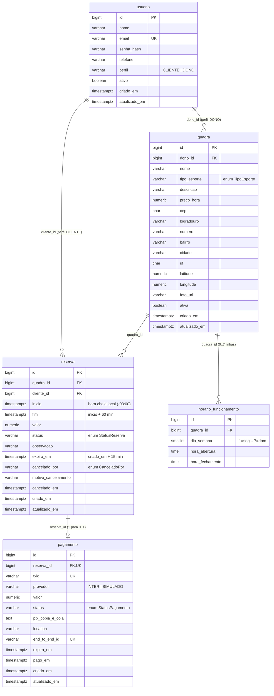
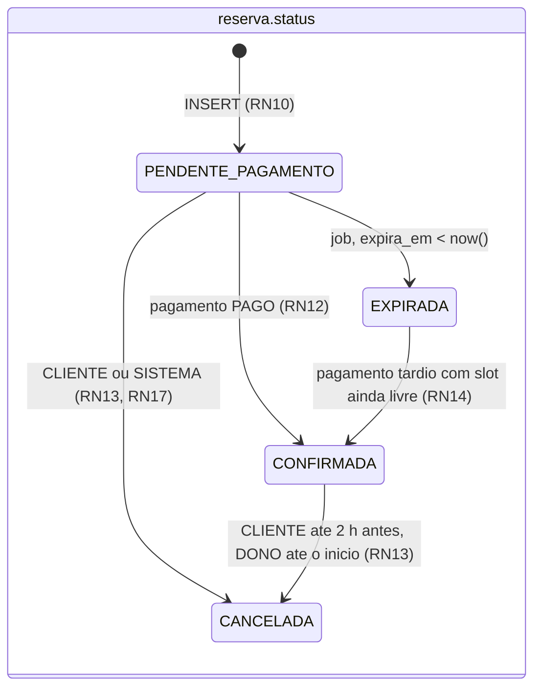

# 08 — Modelagem do banco de dados

Modelo relacional do "Só mais uma" em PostgreSQL 18: cinco tabelas (`usuario`, `quadra`, `horario_funcionamento`, `reserva`, `pagamento`), enums persistidos como texto, índice único parcial que garante a exclusividade do slot, DDL completo do `V1__init.sql`, esboço do seed de demonstração (aplicado fora do Flyway) e regras de evolução do esquema. Documento de responsabilidade do Integrante B (revisão do Integrante C na parte de concorrência).

## 1. Das entidades sugeridas ao modelo final

O grupo propôs seis entidades (Usuario, Quadra, TipoEsporte, Disponibilidade, Reserva, Pagamento). Quatro foram mantidas; duas viraram outra coisa.

| Entidade sugerida | Decisão | Motivo |
|---|---|---|
| Usuario | **mantida** — tabela `usuario`, com coluna `perfil` (CLIENTE/DONO) | Núcleo do domínio; um usuário tem exatamente um perfil (RN20) |
| Quadra | **mantida** — tabela `quadra`, endereço e coordenadas embutidos | O endereço não é reutilizado por outra entidade; uma tabela `endereco` só adicionaria FK, DTO e JOIN sem valor |
| TipoEsporte | **virou enum** `TipoEsporte` persistido em `quadra.tipo_esporte VARCHAR(20)` com `CHECK` | Lista fixa de 7 valores; uma tabela exigiria FK, repositório, DTO, endpoints e tela sem critério da disciplina associado. Bean Validation valida o valor de graça no `QuadraRequest` |
| Disponibilidade | **virou `horario_funcionamento`** (uma linha por dia da semana) **+ slots calculados** em memória pelo `SlotService` (RF12) | Persistir slots multiplica linhas (quadra x dia x hora) e dessincroniza ao mudar o horário. Como a duração é fixa em 60 min e o início é hora cheia (RN06, RN07), o par `(quadra_id, inicio)` identifica o slot e a exclusividade vira um `UNIQUE` simples (RN08). `horario_funcionamento` ainda é o segundo CRUD completo exigido (RF11) |
| Reserva | **mantida** — tabela `reserva`, nunca apagada (RN15) | Núcleo; guarda `valor` copiado da quadra no momento da reserva (RN07) |
| Pagamento | **mantida** — tabela `pagamento`, relação 1—0..1 com `reserva` | Só dados públicos da cobrança (RNF02, RN05). O 0 acontece quando a cobrança Pix falhou e a reserva foi cancelada por SISTEMA (RN17) |
| Endereco, BloqueioHorario, Avaliacao, LogWebhook | **não criadas** | Endereço embutido; bloqueio pontual é opcional (OPC); avaliações estão fora do MVP; log de webhook vai para o log da aplicação |

### Convenções adotadas

| Convenção | Valor |
|---|---|
| Nome de tabela e coluna | `snake_case`, singular, português sem acento (`horario_funcionamento`, `preco_hora`) |
| Chave primária | `BIGINT GENERATED ALWAYS AS IDENTITY` — ids curtos em URL, log e demo |
| Identificador externo | `txid` da cobrança Pix: 32 caracteres (UUID sem hifens), dentro do padrão `[a-zA-Z0-9]{26,35}` exigido pelo Inter |
| Datas e horas absolutas | `TIMESTAMPTZ` (instante); apresentação sempre no fuso `America/Sao_Paulo` (RNF12) |
| Hora local de funcionamento | `TIME` (sem fuso), interpretada em `America/Sao_Paulo` pelo `SlotService` |
| Dinheiro | `NUMERIC(10,2)`; no JSON viaja como string decimal (`"80.00"`) |
| Enums | `VARCHAR` + `CHECK`, mapeados com `@Enumerated(EnumType.STRING)` no JPA — nunca ordinal |
| Exclusão | Soft delete único: `quadra.ativa`, `usuario.ativo`, `reserva.status = CANCELADA`. Não há `DELETE` físico fora do `ON DELETE CASCADE` de `horario_funcionamento` |
| Auditoria mínima | `criado_em` e `atualizado_em` em toda tabela; `atualizado_em` é atualizado pelo `@PreUpdate` da entidade ou explicitamente nos `UPDATE` condicionais |

## 2. Entidades finais

### 2.1 `usuario`

| Coluna | Tipo | Restrições | Observação |
|---|---|---|---|
| `id` | BIGINT | PK, identity | |
| `nome` | VARCHAR(100) | NOT NULL | |
| `email` | VARCHAR(150) | NOT NULL, UNIQUE (`ux_usuario_email`), CHECK minúsculo | Login; único por usuário (RN20); o `AuthService` normaliza para minúsculas antes de salvar |
| `senha_hash` | VARCHAR(72) | NOT NULL | BCrypt custo 10 (RNF01); a senha em claro nunca é armazenada nem logada |
| `telefone` | VARCHAR(20) | | Exibido ao DONO na tela ReservasQuadra para contato e estorno manual (RN13, RN14) |
| `perfil` | VARCHAR(10) | NOT NULL, CHECK IN ('CLIENTE','DONO') | Enum `PerfilUsuario`; não muda após o cadastro (RN20) |
| `ativo` | BOOLEAN | NOT NULL DEFAULT TRUE | Reservado para `DELETE /usuarios/me` (OPC); login exige `ativo = true` |
| `criado_em` | TIMESTAMPTZ | NOT NULL DEFAULT now() | |
| `atualizado_em` | TIMESTAMPTZ | NOT NULL DEFAULT now() | `PUT /usuarios/me` |

Limites que o `UsuarioRequest` precisa declarar (os mesmos da coluna; sem a anotação o excesso estoura no banco e vira 500 em vez de 400 com a lista de campos):

| Campo da requisição | Limite da coluna | Anotação Bean Validation |
|---|---|---|
| `telefone` | VARCHAR(20), opcional | `@Size(max = 20)` |

### 2.2 `quadra`

| Coluna | Tipo | Restrições | Observação |
|---|---|---|---|
| `id` | BIGINT | PK, identity | |
| `dono_id` | BIGINT | NOT NULL, FK -> `usuario.id` | Sempre o usuário logado na criação (RN01); o `QuadraService` compara `dono_id` com o JWT (RN03) |
| `nome` | VARCHAR(100) | NOT NULL | |
| `tipo_esporte` | VARCHAR(20) | NOT NULL, CHECK nos 7 valores | Enum `TipoEsporte`; filtro de RF07 |
| `descricao` | VARCHAR(500) | | |
| `preco_hora` | NUMERIC(10,2) | NOT NULL, CHECK > 0 | Copiado para `reserva.valor` no momento da reserva (RN07) |
| `cep` | CHAR(8) | NOT NULL, CHECK 8 dígitos | Entrada do `GET /cep/{cep}` (RF09) |
| `logradouro` | VARCHAR(150) | NOT NULL | Preenchido pela BrasilAPI/ViaCEP, editável |
| `numero` | VARCHAR(10) | NOT NULL | Texto porque existe "S/N" e "120-A" |
| `bairro` | VARCHAR(80) | | Pode vir vazio da API de CEP |
| `cidade` | VARCHAR(80) | NOT NULL | Filtro por cidade (RF07) |
| `uf` | CHAR(2) | NOT NULL | |
| `latitude` | NUMERIC(9,6) | NULL, CHECK -90..90 | Da BrasilAPI CEP v2 ou digitada; base da distância (RF22) |
| `longitude` | NUMERIC(9,6) | NULL, CHECK -180..180 | As duas coordenadas são nulas ou preenchidas juntas (CHECK) |
| `foto_url` | VARCHAR(300) | | Exibida com Coil (REC); sem upload no MVP |
| `ativa` | BOOLEAN | NOT NULL DEFAULT TRUE | Soft delete de RF06/RF10; inativa some de `GET /quadras`, continua em `GET /quadras/minhas` |
| `criado_em`, `atualizado_em` | TIMESTAMPTZ | NOT NULL DEFAULT now() | |

Limites que o `QuadraRequest` precisa declarar (os mesmos da coluna; sem a anotação o valor só é barrado pelo banco e vira 500 em vez de 400 com a lista de campos):

| Campo da requisição | Limite da coluna | Anotação Bean Validation |
|---|---|---|
| `logradouro` | VARCHAR(150), NOT NULL | `@NotBlank @Size(max = 150)` |
| `numero` | VARCHAR(10), NOT NULL | `@NotBlank @Size(max = 10)` |
| `bairro` | VARCHAR(80), opcional | `@Size(max = 80)` |
| `cidade` | VARCHAR(80), NOT NULL | `@NotBlank @Size(max = 80)` |
| `uf` | CHAR(2), `CHECK (uf = upper(uf))` | `@Pattern(regexp = "^[A-Z]{2}$")` — só maiúsculas, como a coluna exige |
| `preco_hora` | NUMERIC(10,2), `CHECK > 0` | `@Digits(integer = 8, fraction = 2) @DecimalMin(value = "0.00", inclusive = false)` |

Índice: `idx_quadra_dono (dono_id)` para `GET /quadras/minhas`. A listagem pública (`ativa = true`, filtro por esporte/cidade) varre a tabela: com menos de 100 quadras isso custa menos que manter índice.

### 2.3 `horario_funcionamento`

| Coluna | Tipo | Restrições | Observação |
|---|---|---|---|
| `id` | BIGINT | PK, identity | Usado em `PUT/DELETE .../horarios-funcionamento/{hid}` (RF11) |
| `quadra_id` | BIGINT | NOT NULL, FK -> `quadra.id` ON DELETE CASCADE | Cascade só existe para limpeza em testes; em produção a quadra nunca é apagada |
| `dia_semana` | SMALLINT | NOT NULL, CHECK 1..7 | Igual a `java.time.DayOfWeek.getValue()` (1 = segunda, 7 = domingo) — sem mapeamento manual |
| `hora_abertura` | TIME | NOT NULL, CHECK minuto = 0 | Hora local em `America/Sao_Paulo` |
| `hora_fechamento` | TIME | NOT NULL, CHECK > abertura, CHECK minuto = 0 | Último slot começa em `hora_fechamento - 1 h` |
| — | — | UNIQUE (`quadra_id`, `dia_semana`) | Uma faixa por dia (RN19); violação -> 409 `DIA_JA_CADASTRADO` |

Dia sem linha = fechado (RN19). Abertura e fechamento em hora cheia são exigidos porque os slots são de 60 min a partir da abertura (RN06); a tela HorariosQuadra só oferece minutos `00` no `TimePicker`.

### 2.4 `reserva`

| Coluna | Tipo | Restrições | Observação |
|---|---|---|---|
| `id` | BIGINT | PK, identity | |
| `quadra_id` | BIGINT | NOT NULL, FK -> `quadra.id` | |
| `cliente_id` | BIGINT | NOT NULL, FK -> `usuario.id` | Sempre perfil CLIENTE (RN02, checado no service) |
| `inicio` | TIMESTAMPTZ | NOT NULL, CHECK hora cheia no deslocamento fixo `-03:00` | Identidade do slot junto com `quadra_id` (RN06, RN08); o `CHECK` não pode usar o nome do fuso porque a conversão só é `STABLE` (ver seção 5) |
| `fim` | TIMESTAMPTZ | NOT NULL, CHECK `fim = inicio + 60 min` | Redundante por desenho: facilita consultas de agenda (RN07) |
| `valor` | NUMERIC(10,2) | NOT NULL, CHECK > 0 | Cópia de `quadra.preco_hora` (RN07) |
| `status` | VARCHAR(20) | NOT NULL, CHECK nos 4 valores | Enum `StatusReserva`; transições só por `UPDATE` condicional (RN12) |
| `observacao` | VARCHAR(200) | | Único campo editável pelo cliente (RF16, RN15) |
| `expira_em` | TIMESTAMPTZ | NOT NULL | `criado_em + 15 min` (RN10); lido pelo `ExpiracaoReservaJob` (RF14) |
| `cancelado_por` | VARCHAR(10) | CHECK IN ('CLIENTE','DONO','SISTEMA'), obrigatório se CANCELADA | Enum `CanceladoPor` |
| `motivo_cancelamento` | VARCHAR(200) | | Obrigatório quando `cancelado_por = 'DONO'` (RN13), validado no service |
| `cancelado_em` | TIMESTAMPTZ | | |
| `criado_em`, `atualizado_em` | TIMESTAMPTZ | NOT NULL DEFAULT now() | |

Índices:

| Índice | Definição | Serve a |
|---|---|---|
| `ux_reserva_slot_ativo` | UNIQUE (`quadra_id`, `inicio`) WHERE status IN ('PENDENTE_PAGAMENTO','CONFIRMADA') | RN08 — a garantia anti-dupla-reserva mora aqui; a segunda transação concorrente bloqueia no índice até a primeira commitar e falha com violação -> 409 `HORARIO_INDISPONIVEL` (RF13). CANCELADA e EXPIRADA saem do índice e liberam o slot sem código extra |
| `idx_reserva_cliente` | (`cliente_id`, `inicio` DESC) | `GET /reservas` do cliente (RF15) |
| `idx_reserva_quadra_inicio` | (`quadra_id`, `inicio`) | Grade de slots (RF12), agenda do dono (RF18), checagem de RF10/RN16 |
| `idx_reserva_pendente_expira` | (`expira_em`) WHERE status = 'PENDENTE_PAGAMENTO' | `ExpiracaoReservaJob` (RF14) e checagem de RN11 |

### 2.5 `pagamento`

| Coluna | Tipo | Restrições | Observação |
|---|---|---|---|
| `id` | BIGINT | PK, identity | |
| `reserva_id` | BIGINT | NOT NULL, UNIQUE, FK -> `reserva.id` | Relação 1—0..1 |
| `txid` | VARCHAR(35) | NOT NULL, UNIQUE, CHECK `[A-Za-z0-9]{26,35}` | Gerado pelo backend (UUID sem hifens = 32 chars); chave do polling e do webhook (RF19, RF20) |
| `provedor` | VARCHAR(10) | NOT NULL, CHECK IN ('INTER','SIMULADO') | Enum `ProvedorPagamento`; registra qual `PixGateway` gerou a cobrança |
| `valor` | NUMERIC(10,2) | NOT NULL, CHECK > 0 | Igual a `reserva.valor`; a confirmação exige valor igual (RN12) |
| `status` | VARCHAR(10) | NOT NULL, CHECK nos 4 valores | Enum `StatusPagamento` |
| `pix_copia_e_cola` | TEXT | NOT NULL | Payload BR Code devolvido pelo Inter (ou montado pelo `PixPayloadBuilder` no simulado); o app renderiza o QR a partir dele |
| `location` | VARCHAR(255) | | URL do payload dinâmico (`loc.location`) devolvida pelo Inter; nula no simulado |
| `end_to_end_id` | VARCHAR(32) | UNIQUE parcial quando não nulo | `endToEndId` do Pix recebido; a unicidade torna a confirmação idempotente entre job e webhook (RN12) |
| `expira_em` | TIMESTAMPTZ | NOT NULL | Igual a `reserva.expira_em` (900 s — RN10) |
| `pago_em` | TIMESTAMPTZ | Obrigatório se PAGO | `horario` do Pix ou `now()` no simulado |
| `criado_em`, `atualizado_em` | TIMESTAMPTZ | NOT NULL DEFAULT now() | |

Índice `idx_pagamento_pendente (criado_em) WHERE status = 'PENDENTE'` alimenta o `ConsultaPagamentoJob` (até 50 por ciclo, mais antigos primeiro).

## 3. Relacionamentos

| Relação | Cardinalidade | FK | Regra |
|---|---|---|---|
| `usuario` (DONO) — `quadra` | 1 — N | `quadra.dono_id` | RN01, RN03 |
| `quadra` — `horario_funcionamento` | 1 — 0..7 | `horario_funcionamento.quadra_id` (CASCADE) | RN19 |
| `quadra` — `reserva` | 1 — N | `reserva.quadra_id` | RN09, RN16 |
| `usuario` (CLIENTE) — `reserva` | 1 — N | `reserva.cliente_id` | RN02, RN04, RN11 |
| `reserva` — `pagamento` | 1 — 0..1 | `pagamento.reserva_id` UNIQUE | RN10, RN17 |

O banco não distingue "usuário DONO" de "usuário CLIENTE" por FK: a mesma tabela `usuario` serve às duas pontas, e o perfil é validado no service (RN01, RN02). Uma FK para tabela particionada por perfil dobraria o modelo sem ganho.

### Modelo relacional simplificado

```text
usuario(id PK, nome, email UNIQUE, senha_hash, telefone, perfil, ativo, criado_em, atualizado_em)
quadra(id PK, dono_id FK -> usuario.id, nome, tipo_esporte, descricao, preco_hora, cep, logradouro, numero, bairro, cidade, uf, latitude, longitude, foto_url, ativa, criado_em, atualizado_em)
horario_funcionamento(id PK, quadra_id FK -> quadra.id, dia_semana, hora_abertura, hora_fechamento)  UNIQUE(quadra_id, dia_semana)
reserva(id PK, quadra_id FK -> quadra.id, cliente_id FK -> usuario.id, inicio, fim, valor, status, observacao, expira_em, cancelado_por, motivo_cancelamento, cancelado_em, criado_em, atualizado_em)  UNIQUE parcial(quadra_id, inicio) WHERE status ativo
pagamento(id PK, reserva_id FK UNIQUE -> reserva.id, txid UNIQUE, provedor, valor, status, pix_copia_e_cola, location, end_to_end_id UNIQUE parcial, expira_em, pago_em, criado_em, atualizado_em)
```

### Diagrama entidade-relacionamento



## 4. Enums e como são persistidos

Todos os enums são Java `enum` no pacote `br.com.somaisuma.entity` (espelhados em Kotlin em `model/` no app), gravados como texto com `@Enumerated(EnumType.STRING)` e protegidos por `CHECK` no banco. Ordinal foi descartado: reordenar o enum corromperia dados silenciosamente.

| Enum | Valores | Onde é persistido | Regras associadas |
|---|---|---|---|
| `PerfilUsuario` | CLIENTE, DONO | `usuario.perfil` | RN01–RN04, RN20; vira claim `perfil` do JWT |
| `TipoEsporte` | FUTEBOL_SOCIETY, FUTSAL, VOLEI, BASQUETE, TENIS, BEACH_TENNIS, PADEL | `quadra.tipo_esporte` | Filtro de RF07; dropdown no FormQuadra |
| `StatusReserva` | PENDENTE_PAGAMENTO, CONFIRMADA, CANCELADA, EXPIRADA | `reserva.status` | RN10, RN12, RN13; participa do índice parcial |
| `StatusPagamento` | PENDENTE, PAGO, EXPIRADO, CANCELADO | `pagamento.status` | RN12, RN14 |
| `ProvedorPagamento` | INTER, SIMULADO | `pagamento.provedor` | Profile Spring ativo na criação da cobrança |
| `CanceladoPor` | CLIENTE, DONO, SISTEMA | `reserva.cancelado_por` | RN13, RN17 |
| `StatusSlot` | LIVRE, OCUPADO, PASSADO, FECHADO | **não persistido** — só no `SlotResponse` | RF12; calculado a cada `GET /quadras/{id}/slots` |
| `dia_semana` | 1..7 | `horario_funcionamento.dia_semana SMALLINT` | Não é enum próprio: usa `DayOfWeek.getValue()` direto |

Adicionar um valor a um enum (por exemplo, um novo esporte) exige migration aditiva que recria a `CHECK` (`ALTER TABLE quadra DROP CONSTRAINT ck_quadra_tipo_esporte; ALTER TABLE quadra ADD CONSTRAINT ... CHECK (...)`), além do enum Java e Kotlin. É o único custo de ter usado enum em vez de tabela, e é aceitável para uma lista que não muda no semestre.

### Máquinas de estado no banco



Texto: `PENDENTE_PAGAMENTO` é o único estado inicial; `CANCELADA` e `EXPIRADA` liberam o slot porque saem do índice parcial; a única volta permitida é `EXPIRADA -> CONFIRMADA` quando o Pix chega tarde e o slot continua livre (o `UPDATE` cai na proteção do índice; se outro cliente já reservou, fica `EXPIRADA` e o log registra `ESTORNO_MANUAL`). Toda transição é `UPDATE ... WHERE id = ? AND status = <esperado>`; zero linhas afetadas significa que outro fluxo venceu (ver docs/07-regras-de-negocio.md, RN12).

## 5. DDL — `backend/src/main/resources/db/migration/V1__init.sql`

Alvo: PostgreSQL 18 (imagem `postgres:18-alpine` no `compose.yaml` e no Testcontainers; Neon no beta). Flyway 12.4+ (gerenciado pelo Spring Boot 4.1) com o módulo `flyway-database-postgresql`.

```sql
-- V1__init.sql — So mais uma — esquema inicial (PostgreSQL 18)
-- Regra do projeto: este arquivo NAO e editado apos a Entrega N1 (02/10/2026).
-- Qualquer mudanca de esquema entra como V2__*.sql, V3__*.sql ... sempre aditiva.
-- Os dados de demonstracao NAO sao migration: ver scripts/seed-demo.sql (secao 6).

-- ---------------------------------------------------------------- usuario
CREATE TABLE usuario (
    id             BIGINT       GENERATED ALWAYS AS IDENTITY PRIMARY KEY,
    nome           VARCHAR(100) NOT NULL,
    email          VARCHAR(150) NOT NULL,
    senha_hash     VARCHAR(72)  NOT NULL,
    telefone       VARCHAR(20),
    perfil         VARCHAR(10)  NOT NULL,
    ativo          BOOLEAN      NOT NULL DEFAULT TRUE,
    criado_em      TIMESTAMPTZ  NOT NULL DEFAULT now(),
    atualizado_em  TIMESTAMPTZ  NOT NULL DEFAULT now(),
    CONSTRAINT ck_usuario_perfil          CHECK (perfil IN ('CLIENTE', 'DONO')),
    CONSTRAINT ck_usuario_email_minusculo CHECK (email = lower(email))
);
CREATE UNIQUE INDEX ux_usuario_email ON usuario (email);

-- ----------------------------------------------------------------- quadra
CREATE TABLE quadra (
    id             BIGINT        GENERATED ALWAYS AS IDENTITY PRIMARY KEY,
    dono_id        BIGINT        NOT NULL REFERENCES usuario (id),
    nome           VARCHAR(100)  NOT NULL,
    tipo_esporte   VARCHAR(20)   NOT NULL,
    descricao      VARCHAR(500),
    preco_hora     NUMERIC(10,2) NOT NULL,
    cep            CHAR(8)       NOT NULL,
    logradouro     VARCHAR(150)  NOT NULL,
    numero         VARCHAR(10)   NOT NULL,
    bairro         VARCHAR(80),
    cidade         VARCHAR(80)   NOT NULL,
    uf             CHAR(2)       NOT NULL,
    latitude       NUMERIC(9,6),
    longitude      NUMERIC(9,6),
    foto_url       VARCHAR(300),
    ativa          BOOLEAN       NOT NULL DEFAULT TRUE,
    criado_em      TIMESTAMPTZ   NOT NULL DEFAULT now(),
    atualizado_em  TIMESTAMPTZ   NOT NULL DEFAULT now(),
    CONSTRAINT ck_quadra_tipo_esporte CHECK (tipo_esporte IN
        ('FUTEBOL_SOCIETY', 'FUTSAL', 'VOLEI', 'BASQUETE', 'TENIS', 'BEACH_TENNIS', 'PADEL')),
    CONSTRAINT ck_quadra_preco_hora   CHECK (preco_hora > 0),
    CONSTRAINT ck_quadra_cep          CHECK (cep ~ '^[0-9]{8}$'),
    CONSTRAINT ck_quadra_uf           CHECK (uf = upper(uf)),
    CONSTRAINT ck_quadra_latitude     CHECK (latitude  IS NULL OR latitude  BETWEEN  -90 AND  90),
    CONSTRAINT ck_quadra_longitude    CHECK (longitude IS NULL OR longitude BETWEEN -180 AND 180),
    CONSTRAINT ck_quadra_coordenadas  CHECK ((latitude IS NULL) = (longitude IS NULL))
);
CREATE INDEX idx_quadra_dono ON quadra (dono_id);

-- --------------------------------------------------- horario_funcionamento
CREATE TABLE horario_funcionamento (
    id               BIGINT   GENERATED ALWAYS AS IDENTITY PRIMARY KEY,
    quadra_id        BIGINT   NOT NULL REFERENCES quadra (id) ON DELETE CASCADE,
    dia_semana       SMALLINT NOT NULL,          -- 1 = segunda ... 7 = domingo (java.time.DayOfWeek)
    hora_abertura    TIME     NOT NULL,          -- hora local America/Sao_Paulo
    hora_fechamento  TIME     NOT NULL,
    CONSTRAINT ck_horario_dia_semana  CHECK (dia_semana BETWEEN 1 AND 7),
    CONSTRAINT ck_horario_intervalo   CHECK (hora_fechamento > hora_abertura),
    CONSTRAINT ck_horario_hora_cheia  CHECK (EXTRACT(MINUTE FROM hora_abertura) = 0
                                         AND EXTRACT(MINUTE FROM hora_fechamento) = 0),
    CONSTRAINT ux_horario_quadra_dia  UNIQUE (quadra_id, dia_semana)
);

-- ---------------------------------------------------------------- reserva
CREATE TABLE reserva (
    id                   BIGINT        GENERATED ALWAYS AS IDENTITY PRIMARY KEY,
    quadra_id            BIGINT        NOT NULL REFERENCES quadra (id),
    cliente_id           BIGINT        NOT NULL REFERENCES usuario (id),
    inicio               TIMESTAMPTZ   NOT NULL,
    fim                  TIMESTAMPTZ   NOT NULL,
    valor                NUMERIC(10,2) NOT NULL,
    status               VARCHAR(20)   NOT NULL,
    observacao           VARCHAR(200),
    expira_em            TIMESTAMPTZ   NOT NULL,
    cancelado_por        VARCHAR(10),
    motivo_cancelamento  VARCHAR(200),
    cancelado_em         TIMESTAMPTZ,
    criado_em            TIMESTAMPTZ   NOT NULL DEFAULT now(),
    atualizado_em        TIMESTAMPTZ   NOT NULL DEFAULT now(),
    CONSTRAINT ck_reserva_status        CHECK (status IN
        ('PENDENTE_PAGAMENTO', 'CONFIRMADA', 'CANCELADA', 'EXPIRADA')),
    CONSTRAINT ck_reserva_valor         CHECK (valor > 0),
    CONSTRAINT ck_reserva_duracao       CHECK (fim = inicio + INTERVAL '60 minutes'),      -- RN07
    CONSTRAINT ck_reserva_hora_cheia    CHECK (inicio = date_trunc('hour', inicio AT TIME ZONE INTERVAL '-03:00')
                                                              AT TIME ZONE INTERVAL '-03:00'),  -- RN06
    CONSTRAINT ck_reserva_cancelado_por CHECK (cancelado_por IS NULL OR cancelado_por IN ('CLIENTE', 'DONO', 'SISTEMA')),
    CONSTRAINT ck_reserva_cancelamento  CHECK ((status = 'CANCELADA') = (cancelado_por IS NOT NULL))
);
CREATE INDEX idx_reserva_cliente        ON reserva (cliente_id, inicio DESC);
CREATE INDEX idx_reserva_quadra_inicio  ON reserva (quadra_id, inicio);
CREATE INDEX idx_reserva_pendente_expira ON reserva (expira_em) WHERE status = 'PENDENTE_PAGAMENTO';

-- RN08: no maximo UMA reserva ativa por (quadra, inicio). E a garantia anti-dupla-reserva.
-- CANCELADA e EXPIRADA ficam fora do indice e, por isso, liberam o slot.
CREATE UNIQUE INDEX ux_reserva_slot_ativo ON reserva (quadra_id, inicio)
    WHERE status IN ('PENDENTE_PAGAMENTO', 'CONFIRMADA');

-- -------------------------------------------------------------- pagamento
CREATE TABLE pagamento (
    id                BIGINT        GENERATED ALWAYS AS IDENTITY PRIMARY KEY,
    reserva_id        BIGINT        NOT NULL REFERENCES reserva (id),
    txid              VARCHAR(35)   NOT NULL,
    provedor          VARCHAR(10)   NOT NULL,
    valor             NUMERIC(10,2) NOT NULL,
    status            VARCHAR(10)   NOT NULL,
    pix_copia_e_cola  TEXT          NOT NULL,
    location          VARCHAR(255),
    end_to_end_id     VARCHAR(32),
    expira_em         TIMESTAMPTZ   NOT NULL,
    pago_em           TIMESTAMPTZ,
    criado_em         TIMESTAMPTZ   NOT NULL DEFAULT now(),
    atualizado_em     TIMESTAMPTZ   NOT NULL DEFAULT now(),
    CONSTRAINT ux_pagamento_reserva  UNIQUE (reserva_id),                       -- 1 para 0..1
    CONSTRAINT ux_pagamento_txid     UNIQUE (txid),
    CONSTRAINT ck_pagamento_txid     CHECK (txid ~ '^[A-Za-z0-9]{26,35}$'),     -- regra do Inter
    CONSTRAINT ck_pagamento_provedor CHECK (provedor IN ('INTER', 'SIMULADO')),
    CONSTRAINT ck_pagamento_status   CHECK (status IN ('PENDENTE', 'PAGO', 'EXPIRADO', 'CANCELADO')),
    CONSTRAINT ck_pagamento_valor    CHECK (valor > 0),
    CONSTRAINT ck_pagamento_pago     CHECK ((status = 'PAGO') = (pago_em IS NOT NULL))
);
-- Idempotencia da confirmacao (RN12): o mesmo Pix nunca confirma duas vezes.
CREATE UNIQUE INDEX ux_pagamento_end_to_end ON pagamento (end_to_end_id) WHERE end_to_end_id IS NOT NULL;
CREATE INDEX idx_pagamento_pendente ON pagamento (criado_em) WHERE status = 'PENDENTE';

-- ------------------------------------------------------------ comentarios
COMMENT ON INDEX ux_reserva_slot_ativo IS 'RN08: exclusividade do slot; violacao -> HTTP 409 HORARIO_INDISPONIVEL';
COMMENT ON COLUMN reserva.expira_em     IS 'RN10: criado_em + 15 min; igual a pagamento.expira_em';
COMMENT ON COLUMN pagamento.pix_copia_e_cola IS 'Dado publico da cobranca; nunca ha dados do pagador nesta tabela (RNF02)';
```

Sobre `ck_reserva_hora_cheia`: a conversão pelo **nome** do fuso (`AT TIME ZONE 'America/Sao_Paulo'`) usa uma função apenas `STABLE`, porque o resultado depende da tabela de fusos do servidor; o PostgreSQL recusa expressões não imutáveis em `CHECK` e o `CREATE TABLE` falharia com `functions in check constraint expression must be marked IMMUTABLE`, derrubando a migration, o boot da aplicação e os testes de integração. Por isso a restrição usa o **deslocamento fixo** `INTERVAL '-03:00'`, que é imutável e vale o ano inteiro desde o fim do horário de verão brasileiro. A restrição é apenas a última linha de defesa: o `SlotService` continua validando a mesma regra (RN06) na aplicação, devolvendo 400 com o campo em vez de erro do banco.

O que **não** está no DDL, de propósito: triggers (o `atualizado_em` é responsabilidade da entidade JPA e dos `UPDATE` explícitos), `EXCLUDE USING gist` (slots fixos dispensam intervalos), tabela de log de webhook, tabela de sessão/refresh token (JWT sem revogação, RNF03), `uuidv7()` (ids `BIGINT` bastam).

### Consultas que dependem diretamente do esquema

| Operação | SQL/JPQL (resumido) | Índice usado |
|---|---|---|
| Criar reserva (RF13) | `INSERT INTO reserva (...) VALUES (...)` via `saveAndFlush`; `DataIntegrityViolationException` -> 409 | `ux_reserva_slot_ativo` |
| Grade de slots (RF12) | `SELECT inicio FROM reserva WHERE quadra_id = ? AND inicio >= ? AND inicio < ? AND status IN ('PENDENTE_PAGAMENTO','CONFIRMADA')` combinado com `horario_funcionamento` do dia | `idx_reserva_quadra_inicio` |
| Expirar pendentes (RF14) | `UPDATE reserva SET status = 'EXPIRADA', atualizado_em = now() WHERE status = 'PENDENTE_PAGAMENTO' AND expira_em < now()` e o equivalente em `pagamento` | `idx_reserva_pendente_expira` |
| Confirmar pagamento (RF20, RN12) | `UPDATE pagamento SET status = 'PAGO', end_to_end_id = ?, pago_em = ?, atualizado_em = now() WHERE txid = ? AND status = 'PENDENTE' AND valor = ?` -> se 1 linha, `UPDATE reserva SET status = 'CONFIRMADA' WHERE id = ? AND status = 'PENDENTE_PAGAMENTO'` | `ux_pagamento_txid`, `ux_pagamento_end_to_end` |
| Bloquear desativação (RF10, RN16) | `SELECT count(*) FROM reserva WHERE quadra_id = ? AND inicio > now() AND status IN ('PENDENTE_PAGAMENTO','CONFIRMADA')` > 0 -> 409 `QUADRA_COM_RESERVAS` | `idx_reserva_quadra_inicio` |
| Uma pendente por cliente (RN11) | `SELECT exists(SELECT 1 FROM reserva WHERE cliente_id = ? AND status = 'PENDENTE_PAGAMENTO')` | `idx_reserva_cliente` |

## 6. Seed de demonstração — `scripts/seed-demo.sql` (fora do Flyway)

O seed **não é uma migration**. Ele vive em `scripts/seed-demo.sql`, fora de `db/migration`, e é aplicado à mão sobre um banco já migrado:

```bash
psql "$DATABASE_URL" -v ON_ERROR_STOP=1 -f scripts/seed-demo.sql
```

Alternativa equivalente: um executor de inicialização anotado com `@Profile("dev")` que lê o mesmo arquivo no boot — nunca ativo em `inter-prod`.

Motivo: enquanto o seed era `V2__seed_dev.sql` e entrava em `spring.flyway.locations` só em alguns profiles, o histórico do Flyway divergia entre ambientes. Um banco criado em dev ficava com a versão 2 registrada; ao apontar a aplicação em outro profile para o mesmo banco, a validação falhava com migration aplicada que não existe localmente (e o inverso ao migrar um banco de produção com o profile de dev). Com o seed fora do Flyway, **o esquema tem uma sequência única e contínua a partir de V2** (`V1__init.sql`, `V2__*.sql`, `V3__*.sql`, ...), igual em todos os ambientes.

Conteúdo: 2 usuários demo (`cliente@demo.com` e `dono@demo.com`, senha `Senha123`), 3 quadras georreferenciadas na cidade do grupo mais a `Quadra Teste Usabilidade` de docs/22, horários de funcionamento seg–dom 08h–22h e 2 reservas (uma CONFIRMADA amanhã às 19h com pagamento PAGO simulado; uma EXPIRADA ontem).

O script usa valores literais e ids fixos (`OVERRIDING SYSTEM VALUE`), para ser conferível linha a linha e para as chaves estrangeiras não dependerem de subconsulta. As **únicas** expressões calculadas são as duas datas das reservas, que precisam ser relativas ao dia da execução para a demo funcionar em qualquer data. No fim, cada sequência de identidade é reposicionada, senão o primeiro cadastro feito pelo app colidiria com os ids do seed.

```sql
-- scripts/seed-demo.sql — dados de demonstracao (dev e teste; NAO e migration Flyway)
-- Uso: psql "$DATABASE_URL" -v ON_ERROR_STOP=1 -f scripts/seed-demo.sql
-- Pre-requisito: banco vazio ja migrado pelo Flyway (V1 em diante).
-- Hash BCrypt (custo 10) de 'Senha123' gerado por GerarHashSeedTest antes de commitar; substituir o valor abaixo.

BEGIN;

-- ---------------------------------------------------------------- usuario
-- id 1 = cliente, id 2 = dono
INSERT INTO usuario (id, nome, email, senha_hash, telefone, perfil) OVERRIDING SYSTEM VALUE VALUES
  (1, 'Cliente Demo', 'cliente@demo.com', '$2a$10$SUBSTITUIR_PELO_HASH_GERADO', '11999990001', 'CLIENTE'),
  (2, 'Dono Demo',    'dono@demo.com',    '$2a$10$SUBSTITUIR_PELO_HASH_GERADO', '11999990002', 'DONO');

-- ----------------------------------------------------------------- quadra
-- Todas do dono id 2. Coordenadas obtidas por GET /api/v1/cep/{cep} (BrasilAPI v2) e conferidas antes do commit.
-- 01001000 -> -23.550390, -46.633081 (valor confirmado na pesquisa).
-- Os CEPs 00000001 e 00000002 sao marcadores: substituir pelos CEPs reais da cidade do grupo
-- (8 digitos, senao ck_quadra_cep rejeita), junto com logradouro, bairro, cidade, uf e coordenadas.
INSERT INTO quadra (id, dono_id, nome, tipo_esporte, descricao, preco_hora,
                    cep, logradouro, numero, bairro, cidade, uf, latitude, longitude)
OVERRIDING SYSTEM VALUE VALUES
  (1, 2, 'Arena Centro Society', 'FUTEBOL_SOCIETY', 'Grama sintetica, vestiario e iluminacao', 120.00,
      '01001000', 'Praca da Se', '100', 'Se', 'Sao Paulo', 'SP', -23.550390, -46.633081),
  (2, 2, 'Quadra Vila Beach Tennis', 'BEACH_TENNIS', 'Areia tratada, 2 quadras', 80.00,
      '00000001', 'LOGRADOURO', '45', 'BAIRRO', 'CIDADE', 'UF', -23.500000, -46.600000),
  (3, 2, 'Ginasio Futsal Norte', 'FUTSAL', 'Piso emborrachado, cobertura', 90.00,
      '00000002', 'LOGRADOURO', '900', 'BAIRRO', 'CIDADE', 'UF', -23.500000, -46.600000),
  (4, 2, 'Quadra Teste Usabilidade', 'FUTSAL', 'Reservada aos testes de usabilidade (docs/22)', 60.00,
      '01001000', 'Praca da Se', '100', 'Se', 'Sao Paulo', 'SP', -23.550390, -46.633081);

-- --------------------------------------------------- horario_funcionamento
-- Seg-dom 08h-22h nas 4 quadras (28 linhas); id gerado pela identity, ninguem referencia.
INSERT INTO horario_funcionamento (quadra_id, dia_semana, hora_abertura, hora_fechamento) VALUES
  (1, 1, TIME '08:00', TIME '22:00'), (1, 2, TIME '08:00', TIME '22:00'), (1, 3, TIME '08:00', TIME '22:00'),
  (1, 4, TIME '08:00', TIME '22:00'), (1, 5, TIME '08:00', TIME '22:00'), (1, 6, TIME '08:00', TIME '22:00'),
  (1, 7, TIME '08:00', TIME '22:00'),
  (2, 1, TIME '08:00', TIME '22:00'), (2, 2, TIME '08:00', TIME '22:00'), (2, 3, TIME '08:00', TIME '22:00'),
  (2, 4, TIME '08:00', TIME '22:00'), (2, 5, TIME '08:00', TIME '22:00'), (2, 6, TIME '08:00', TIME '22:00'),
  (2, 7, TIME '08:00', TIME '22:00'),
  (3, 1, TIME '08:00', TIME '22:00'), (3, 2, TIME '08:00', TIME '22:00'), (3, 3, TIME '08:00', TIME '22:00'),
  (3, 4, TIME '08:00', TIME '22:00'), (3, 5, TIME '08:00', TIME '22:00'), (3, 6, TIME '08:00', TIME '22:00'),
  (3, 7, TIME '08:00', TIME '22:00'),
  (4, 1, TIME '08:00', TIME '22:00'), (4, 2, TIME '08:00', TIME '22:00'), (4, 3, TIME '08:00', TIME '22:00'),
  (4, 4, TIME '08:00', TIME '22:00'), (4, 5, TIME '08:00', TIME '22:00'), (4, 6, TIME '08:00', TIME '22:00'),
  (4, 7, TIME '08:00', TIME '22:00');

-- ---------------------------------------------------------------- reserva
-- Unicas expressoes calculadas do seed: as datas precisam ser relativas ao dia da execucao.
-- Mesmo deslocamento fixo -03:00 de ck_reserva_hora_cheia, para o inicio cair sempre em hora cheia local.
-- id 1: CONFIRMADA amanha 19h-20h na Arena Centro Society (quadra 1), cliente 1.
-- id 2: EXPIRADA ontem 20h-21h no Ginasio Futsal Norte (quadra 3), cliente 1.
INSERT INTO reserva (id, quadra_id, cliente_id, inicio, fim, valor, status, observacao, expira_em)
OVERRIDING SYSTEM VALUE VALUES
  (1, 1, 1,
     (date_trunc('day', now() AT TIME ZONE INTERVAL '-03:00') + INTERVAL '1 day 19 hours') AT TIME ZONE INTERVAL '-03:00',
     (date_trunc('day', now() AT TIME ZONE INTERVAL '-03:00') + INTERVAL '1 day 20 hours') AT TIME ZONE INTERVAL '-03:00',
     120.00, 'CONFIRMADA', 'Trazer colete', now() + INTERVAL '15 minutes'),
  (2, 3, 1,
     (date_trunc('day', now() AT TIME ZONE INTERVAL '-03:00') - INTERVAL '1 day' + INTERVAL '20 hours') AT TIME ZONE INTERVAL '-03:00',
     (date_trunc('day', now() AT TIME ZONE INTERVAL '-03:00') - INTERVAL '1 day' + INTERVAL '21 hours') AT TIME ZONE INTERVAL '-03:00',
     90.00, 'EXPIRADA', NULL, now() - INTERVAL '1 day');

-- -------------------------------------------------------------- pagamento
-- Payloads BR Code estaticos gerados pelo PixPayloadBuilder.
INSERT INTO pagamento (id, reserva_id, txid, provedor, valor, status, pix_copia_e_cola, end_to_end_id, expira_em, pago_em)
OVERRIDING SYSTEM VALUE VALUES
  (1, 1, 'seed0000000000000000000000000001', 'SIMULADO', 120.00, 'PAGO',
      '00020126...6304ABCD', 'ESEED0000000000000000000000001', now() + INTERVAL '15 minutes', now()),
  (2, 2, 'seed0000000000000000000000000002', 'SIMULADO',  90.00, 'EXPIRADO',
      '00020126...6304EF01', NULL, now() - INTERVAL '1 day', NULL);

-- Reposiciona as identities: sem isto o primeiro cadastro pelo app tentaria o id 1 e falharia na PK.
ALTER TABLE usuario   ALTER COLUMN id RESTART WITH 3;
ALTER TABLE quadra    ALTER COLUMN id RESTART WITH 5;
ALTER TABLE reserva   ALTER COLUMN id RESTART WITH 3;
ALTER TABLE pagamento ALTER COLUMN id RESTART WITH 3;

COMMIT;
```

Checklist antes de commitar o seed (Integrante B, S3 (até 18/09), antes das telas da N1): substituir os hashes BCrypt; substituir os CEPs marcados (`00000001`, `00000002`) pelos CEPs reais da cidade do grupo, com coordenadas obtidas via `GET /api/v1/cep/{cep}`; rodar `./gradlew flywayMigrate` em banco limpo, aplicar o seed com `psql` e conferir `SELECT count(*)` em cada tabela (`usuario` 2, `quadra` 4, `horario_funcionamento` 28, `reserva` 2, `pagamento` 2).

Nota: `scripts/reset-demo.sql` (Integrante B) apaga reservas e pagamentos de teste e recria a `Quadra Teste Usabilidade` (FUTSAL, seg–dom 08–22h) usada em docs/22, que o seed já cria como quadra 4. Como o seed, não faz parte do Flyway.

## 7. Volumetria esperada

O projeto é um MVP acadêmico com demo e testes com 5–8 usuários. Toda decisão de índice foi tomada para esse tamanho, não para escala.

| Tabela | Linhas na demo (seed + uso) | Estimativa em 1 ano de uso real pequeno | Crescimento |
|---|---|---|---|
| `usuario` | ~10 | < 1.000 | lento |
| `quadra` | 3–10 | < 100 | lento |
| `horario_funcionamento` | 21–70 | < 700 (7 por quadra) | proporcional a `quadra` |
| `reserva` | < 100 | ~10.000 (10 quadras x 5 reservas/dia x 200 dias) | linear, nunca apagada (RN15) |
| `pagamento` | ≈ `reserva` | ≈ `reserva` | 1 por reserva com cobrança |

Consequências: sem paginação nas listagens (RNF09 documenta a limitação), sem particionamento, `VACUUM` padrão, banco gratuito da Neon (0,5 GB) sobra por anos. O único índice que importa para corretude é `ux_reserva_slot_ativo`; os demais existem para o plano de consulta ficar estável quando `reserva` passar de alguns milhares de linhas.

## 8. Regras de evolução do esquema

| Regra | Como se aplica | Prioridade |
|---|---|---|
| Migrations versionadas pelo Flyway, nunca `ddl-auto` | `spring.jpa.hibernate.ddl-auto=validate` em todos os profiles: o Hibernate confere as entidades contra o esquema no boot e falha se divergirem | obrigatório |
| `V1__init.sql` congelado após a Entrega N1 (02/10/2026) | Até a N1 o arquivo pode ser reescrito livremente (o banco de dev é recriado com `docker compose down -v`). Depois, qualquer mudança é uma nova migration; editar V1 quebra o checksum do Flyway em todo banco já migrado (Neon, notebooks dos testes) | obrigatório |
| Migrations aditivas | Só `ADD COLUMN` (nulo ou com `DEFAULT`), `CREATE INDEX`, `CREATE TABLE`, `DROP/ADD CONSTRAINT` de `CHECK`. Nunca `DROP COLUMN`, `RENAME`, mudança de tipo — o APK dos testes com usuários (09–13/11) precisa continuar funcionando contra o banco novo (RNF09, contrato aditivo) | obrigatório |
| Numeração | `V<n>__<descricao_em_portugues_sem_acento>.sql`; `n` sequencial e contínuo a partir de 2, sem número reservado; um arquivo por PR | obrigatório |
| Seed fora do Flyway | Os dados de demonstração vivem em `scripts/seed-demo.sql` e são aplicados à mão (`psql -f`) ou por um executor de inicialização `@Profile("dev")`. Nenhum profile inclui seed em `spring.flyway.locations`: o histórico do Flyway precisa ser idêntico em dev, teste e produção, senão a validação falha ao apontar dois ambientes para o mesmo banco | obrigatório |
| Índices grandes com `CONCURRENTLY` | Não se aplica no MVP (tabelas pequenas); registrado para o futuro | opcional |
| Revisão DER x banco real | Integrante B compara este documento com `\d+` no PostgreSQL em S12 (16–20/11) e ajusta o documento, nunca o V1 | recomendado |

O cache local do Android (`quadra_cache`, `reserva_cache` no Room) não é versão deste esquema: é uma projeção dos DTOs de resposta e segue regras próprias (`fallbackToDestructiveMigration`), descritas em docs/12-persistencia-local.md.

## 9. O que não é armazenado (RNF02, RN05)

| Dado | Onde apareceria | Por que não guardamos |
|---|---|---|
| CPF/CNPJ e nome do pagador (`devedor`, `infoPagador` do webhook) | corpo da cobrança e do callback do Inter | Não coletamos o devedor ao criar a cobrança; o campo `infoPagador` do callback é ignorado. Evita tratar dado pessoal sensível (LGPD) sem necessidade de negócio |
| `componentesValor`, dados bancários, chave Pix do cliente | callback e consulta do Pix recebido | Sem uso no domínio; o app só precisa de `txid`, `endToEndId`, `valor` e `horario` |
| Cartão de crédito | — | Não há cartão no MVP (fora do escopo) |
| Senha em claro, `client_id`/`client_secret` do Inter, `JWT_SECRET`, `DEV_KEY`, certificado `.crt`/chave `.key` | — | Só `senha_hash` no banco; segredos vivem em variáveis de ambiente e Secret Files do Render, listados no `.gitignore` (ver docs/09-arquitetura.md, seção de variáveis de ambiente) |
| Token JWT emitido | — | Stateless: não existe tabela de sessão nem revogação (limitação de RNF03) |
| Slots | — | Calculados a cada requisição a partir de `horario_funcionamento` e `reserva` |
| Log bruto do webhook | — | Vai para o log da aplicação (nível INFO com `txid` e `endToEndId`; nunca o corpo inteiro) |

O que fica em `pagamento` é exclusivamente dado público da cobrança: `txid`, `valor`, `status`, `pix_copia_e_cola`, `location`, `end_to_end_id`, `expira_em`, `pago_em`. Qualquer perfil vê o status e o valor da sua reserva; nenhum perfil vê quem pagou (RN05).

## 10. Rastreabilidade

| Critério / requisito | Evidência neste documento |
|---|---|
| Critério 2 — modelagem do banco, entidades e relacionamentos | Seções 2, 3 (tabelas, DER) e 5 (DDL) |
| Critério 3 — CRUD completo de 2 entidades | `quadra` e `horario_funcionamento` (RF06, RF11) com PK própria para `PUT/DELETE /{id}` |
| Critério 4 — persistência remota | PostgreSQL 18 + Flyway (seção 5 e 8) |
| RN06, RN07, RN08 | `ck_reserva_hora_cheia`, `ck_reserva_duracao`, `ux_reserva_slot_ativo` |
| RN10, RN12, RN14 | `expira_em` nas duas tabelas, `ux_pagamento_end_to_end`, `ck_pagamento_pago`, máquina de estados da seção 4 |
| RN19, RN20 | `ux_horario_quadra_dia`, `ck_horario_intervalo`, `ux_usuario_email` |
| RNF02, RN05 | Seção 9 |
| RNF10 (migrations aditivas) | Seção 8 |
| RNF12 (fuso único) | `TIME` local + `TIMESTAMPTZ` com `CHECK` no deslocamento fixo `-03:00`; a apresentação usa `America/Sao_Paulo` |
