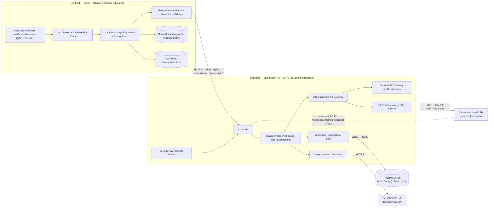
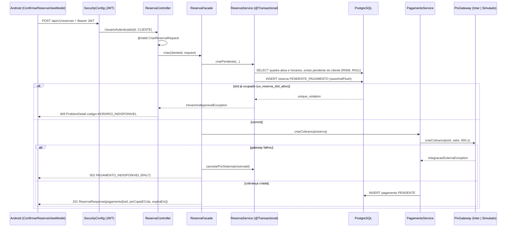
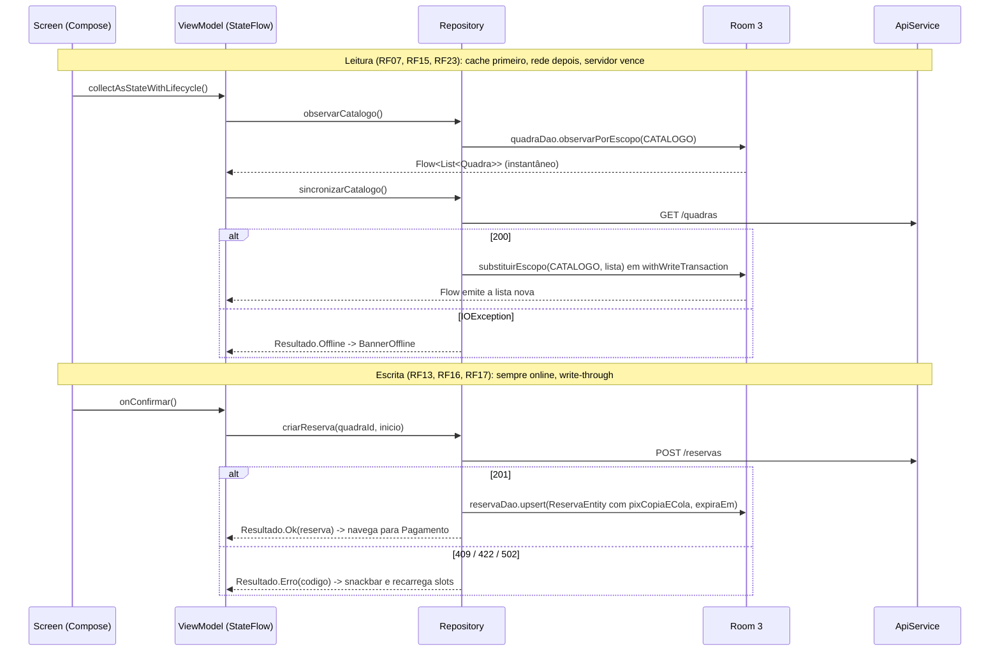

# 09 — Arquitetura da solução

Arquitetura cliente-servidor em três partes: app Android nativo (Kotlin + Jetpack Compose, MVVM + Repository, cache Room e DataStore) que fala apenas com uma API REST Spring Boot 4.1 (JDK 21, camadas controller/service/repository) sobre PostgreSQL 18; o backend é o único que conversa com o Banco Inter (API Pix, mTLS + OAuth2) e com a BrasilAPI/ViaCEP. Documento coletivo: Integrante B escreve a justificativa das tecnologias e a modelagem, Integrante A escreve camadas, ambientes e CI.

## 1. Visão geral



Versão ASCII, para leitura sem renderizador:

```text
+------------------------------+   HTTPS/JSON /api/v1, JWT Bearer   +----------------------------------+   JDBC + Flyway   +-----------------+
| Android (Kotlin + Compose)   | ---------------------------------> | Backend Spring Boot 4.1 / JDK 21 | ----------------> | PostgreSQL 18   |
| ui (Screen+ViewModel+UiState)| <--------------------------------- | security(JWT) -> controller      |                   | Docker local /  |
|  -> repository -> ApiService |                                    |   -> service -> repository (JPA) |                   | Neon (beta)     |
|  -> Room 3 cache | DataStore |                                    |   -> integracao/pix (PixGateway) |                   +-----------------+
| FusedLocation | Notificacao  |                                    |   -> integracao/cep (CepClient)  |
+------------------------------+                                    +-------+------------------+-------+
                                                                            | mTLS + OAuth2    | HTTPS
                                                                            v                  v
                                                              Banco Inter API Pix        BrasilAPI CEP v2 (fallback ViaCEP)
                                                              (sandbox | producao)
                                                              [REC] webhook -> POST /webhooks/inter/pix/{segredo}
                                                              profile simulado -> SimuladoPixGateway (interno, sem rede)
```

Três regras estruturais que valem para todo o projeto:

1. **O Android nunca fala com Inter nem com BrasilAPI.** Um só `baseUrl`, um só cliente HTTP, credenciais e certificados apenas no servidor (RNF02).
2. **A verdade é o servidor.** O app tem cache de leitura (Room) e sessão (DataStore); toda escrita é online e o PostgreSQL decide conflitos (RNF11, RN08).
3. **Tudo que depende de terceiro tem substituto interno:** `SimuladoPixGateway` para o Inter, ViaCEP para a BrasilAPI, `FakeApiService` para telas sem endpoint, kit de demo offline para o Render.

### Responsabilidade de cada componente

| Componente | Responsabilidade | Não faz |
|---|---|---|
| **App Android** | Telas (13), navegação por perfil, validação por campo, cache de leitura, sessão, geolocalização, notificação local, render do QR Pix | Regra de negócio de reserva/pagamento, cálculo de slots, acesso a APIs externas |
| **API REST (Spring Boot)** | Autenticação JWT, autorização por perfil e propriedade, regras RN01–RN20, slots, exclusividade do slot, cobrança e confirmação Pix, expiração, proxy de CEP | Interface, envio de e-mail/push, estorno automático |
| **PostgreSQL 18** | Persistência, integridade (FK, CHECK, índice único parcial `ux_reserva_slot_ativo`), fonte única de verdade | Lógica de aplicação (sem triggers/procedures) |
| **Banco Inter — API Pix** | Emite a cobrança imediata (`PUT /pix/v2/cob/{txid}`), devolve `pixCopiaECola`, informa `CONCLUIDA` (`GET /pix/v2/cob/{txid}`) e, se cadastrado, envia webhook | — (externo; disponibilidade do sandbox 8h–20h seg–sex, ver docs/11-integracao-pix-inter.md) |
| **SimuladoPixGateway** | Mesma interface do Inter sem rede: monta BR Code estático (`PixPayloadBuilder`) e confirma via `POST /dev/pagamentos/{txid}/confirmar` | Movimentar dinheiro |
| **BrasilAPI CEP v2 / ViaCEP** | CEP -> logradouro, bairro, cidade, UF e (BrasilAPI) latitude/longitude | — (externo, sem token; chamado só pelo backend com cache na entidade `quadra`) |
| **Render** | Hospeda o jar do backend em HTTPS (Web Service Docker) a partir de S9 | Banco |
| **Neon** | PostgreSQL gerenciado gratuito do beta | — |
| **Kit de demo offline** | Backend jar + PostgreSQL em Docker no notebook + hotspot; plano B único da apresentação | — |

## 2. Justificativa das tecnologias

Todas as versões foram verificadas em 01/09/2026 (tabela completa na seção 8). Critério de escolha: linha estável com suporte durante o semestre, um só JDK e um só sistema de build para os quatro integrantes, e a menor superfície de ferramentas que ainda atende os 7 critérios da disciplina.

| Tecnologia (versão) | Papel | Por que | Alternativas descartadas |
|---|---|---|---|
| **Kotlin 2.4.10 + Jetpack Compose (BOM 2026.08.00, Material 3 1.4.0)** | UI do app | Decisão do grupo (Compose, não XML). Declarativo, menos arquivos por tela, estado explícito (`UiState`) que facilita testar ViewModel com fakes; Material 3 dá contraste e alvos de 48 dp de graça (RNF07) | XML + ViewBinding (mais boilerplate, sem ganho); Flutter/React Native (a disciplina pede Android nativo) |
| **Spring Boot 4.1.1 + JDK 21 LTS** | Backend REST | Linha 4.x é a única com suporte OSS ao longo do semestre (3.5 saiu de suporte em 06/2026). JDK 21 é LTS, roda Gradle, Android Studio e Spring com uma só instalação | Boot 3.5 (fora de suporte); JDK 25 (funciona, mas dobra o atrito de ferramentas); Node/NestJS (o grupo domina Java) |
| **PostgreSQL 18.6** | Banco | Índice único parcial (`WHERE status IN (...)`) resolve a dupla reserva em uma linha de SQL; `TIMESTAMPTZ`, `NUMERIC`; gratuito na Neon; imagem `postgres:18-alpine` no Docker e no Testcontainers | MySQL (sem índice parcial); H2 (não reproduz o comportamento do índice); MongoDB (relacionamentos e unicidade condicional) |
| **REST + JSON (`/api/v1`)** | Contrato app-servidor | Simples de documentar (Swagger), testar (`curl`, `.http`) e evoluir de forma aditiva (RNF09) | GraphQL/gRPC (sem ganho para 25 endpoints) |
| **JWT HS256 via Nimbus (`spring-security-oauth2-jose`)** | Autenticação | Já vem com o `oauth2-resource-server`; `NimbusJwtEncoder/Decoder.withSecretKey`; compatível com Jackson 3 do Boot 4; stateless (RNF01, RNF03) | `jjwt` (risco `jjwt-jackson` x Jackson 3); sessão com cookie (não combina com app nativo); OAuth social (dependência externa) |
| **Spring Data JPA + Hibernate 7** | Persistência | Repositórios declarativos + `@Modifying` para os `UPDATE` condicionais; `ddl-auto=validate` confere as entidades contra o Flyway | JDBC puro (mais código); jOOQ (curva extra) |
| **Flyway 12.4+ (`spring-boot-starter-flyway` + `flyway-database-postgresql`)** | Migrations | `V1__init.sql` versionado é a fonte única do DER; suporte a PostgreSQL 18 exige Flyway ≥ 12 | Liquibase (XML/YAML mais verboso); `ddl-auto=update` (imprevisível) |
| **Testcontainers 2.x (`testcontainers-postgresql`) + `@ServiceConnection`** | Testes de integração | `ReservaConcorrenciaIT` roda contra um PostgreSQL 18 real, o único jeito de provar o índice parcial | H2 em modo PostgreSQL (não reproduz índice parcial); banco compartilhado (flaky) |
| **springdoc-openapi 3.1.0** | Swagger UI | Contrato vivo em `/swagger-ui.html`; evidência do backend na N1 antes das telas de reserva | Postman como única documentação |
| **Room 3.0.2 (`androidx.room3`, KSP)** | Cache local | Coroutines-first, DAOs `suspend`/`Flow`, `withWriteTransaction`; KSP obrigatório, alinhado com o resto do projeto | Room 2.8.4 (modo manutenção; não misturar); SQLDelight (mais uma linguagem de build) |
| **DataStore Preferences 1.2.1** | Sessão e preferências | Assíncrono, seguro com coroutines; substitui `SharedPreferences`; `EncryptedSharedPreferences` está deprecado | Proto DataStore (schema extra sem necessidade) |
| **Retrofit 3.0.0 + OkHttp 5.x + `converter-kotlinx-serialization` + kotlinx.serialization 1.11.0** | HTTP | Uma só biblioteca de serialização no app (a mesma das rotas tipadas do Navigation); interceptor único para o JWT; parsing de `ProblemDetail` centralizado | Ktor client (bom, mas menos material didático); Moshi/Gson (segunda serialização) |
| **Navigation Compose 2.10.0 (rotas `@Serializable`)** | Navegação | Rotas tipadas em `Rotas.kt` eliminam strings mágicas; dois grafos aninhados por perfil | Navigation por strings; Voyager/Decompose (terceiros) |
| **Injeção manual (`AppContainer` + `ViewModelFactory`)** | DI | Zero plugin Gradle/KSP extra, sem o bug conhecido Hilt 2.59 x AGP 9, ~60 linhas explicáveis em um slide; construtores já recebem dependências, então migrar para Hilt é local | Hilt 2.60.1 (risco de toolchain em 15 semanas); Koin (mais um framework para justificar) |
| **ZXing core 3.5.4** | Gerar o QR Pix | `QRCodeWriter` -> `BitMatrix` -> `Bitmap`; sem câmera, sem Activity | `zxing-android-embedded` (scanner, sem manutenção); `qrcode-kotlin` (válida, mas ZXing é o padrão de mercado) |
| **play-services-location 21.4.0** | Geolocalização (recurso nativo) | `FusedLocationProviderClient.getCurrentLocation` com uma permissão em runtime; cadeia de fallback até "sem distância" (RNF08) | `LocationManager` puro (mais código, pior precisão); Maps SDK (chave + billing) |
| **Gradle Kotlin DSL (backend e Android) + `libs.versions.toml`** | Build | Uma ferramenta para os dois projetos; versões fixadas em catálogo (RNF10); Initializr gera Gradle | Maven no backend (duas ferramentas no mesmo repositório) |
| **Render (Web Service Docker) + Neon (PostgreSQL)** | Hospedagem do beta | HTTPS automático (pré-requisito do webhook), deploy por push, grátis; Neon é PostgreSQL de verdade | VM + Caddy (horas de operação); só localhost (testes com usuários e webhook exigem URL pública); Railway/Fly (equivalentes, sem ganho) |
| **GitHub Actions** | CI | Roda no monorepo com filtro por caminho; Docker disponível para Testcontainers | Sem CI (PR verde é regra do grupo, docs/21-git-e-organizacao.md) |

## 3. Backend — organização em camadas

Pacote raiz `br.com.somaisuma`, um único módulo Gradle, um único jar. Pacotes por **camada** (e não por feature) porque mapeiam literalmente o critério 2 da disciplina; conflitos de merge são evitados porque cada domínio tem os próprios arquivos dentro de cada pacote.

### Árvore de arquivos

```text
backend/
├── build.gradle.kts · settings.gradle.kts · gradle/libs.versions.toml
├── compose.yaml                      (postgres:18-alpine, usado pelo spring-boot-docker-compose)
├── Dockerfile                        (multi-stage: gradle build -> eclipse-temurin:21-jre)
└── src/
    ├── main/java/br/com/somaisuma/
    │   ├── SoMaisUmaApplication.java             @SpringBootApplication @EnableScheduling
    │   ├── config/
    │   │   ├── SecurityConfig.java               stateless, oauth2ResourceServer(jwt), csrf off, rotas públicas
    │   │   ├── JwtConfig.java                    NimbusJwtEncoder/Decoder.withSecretKey(JWT_SECRET), HS256
    │   │   ├── OpenApiConfig.java                springdoc; desligado em inter-prod
    │   │   ├── FusoConfig.java                   ZoneId America/Sao_Paulo (app.fuso-horario), Clock
    │   │   ├── CepRestClientConfig.java          RestClient para BrasilAPI e ViaCEP, timeouts 3 s
    │   │   └── InterRestClientConfig.java        @Profile("inter-sandbox","inter-prod"): RestClient + SSL bundle PEM
    │   ├── security/
    │   │   ├── JwtService.java                   emite token (sub = usuarioId, claim perfil, exp 7 dias)
    │   │   ├── UsuarioAutenticado.java           record extraído do JWT (id, perfil)
    │   │   ├── PerfilAuthoritiesConverter.java   claim perfil -> ROLE_CLIENTE / ROLE_DONO
    │   │   └── LoginTentativasService.java       5 falhas -> bloqueio 15 min (ConcurrentHashMap + limpeza no job de 60 s)
    │   ├── controller/
    │   │   ├── AuthController.java               POST /auth/registrar, /auth/login
    │   │   ├── UsuarioController.java            GET/PUT /usuarios/me
    │   │   ├── QuadraController.java             CRUD /quadras
    │   │   ├── HorarioFuncionamentoController.java CRUD /quadras/{id}/horarios-funcionamento
    │   │   ├── SlotController.java               GET /quadras/{id}/slots
    │   │   ├── ReservaController.java            /reservas, /quadras/{id}/reservas
    │   │   ├── PagamentoController.java          GET /reservas/{id}/pagamento
    │   │   ├── CepController.java                GET /cep/{cep}
    │   │   ├── DevPagamentoController.java       @Profile("simulado","inter-sandbox"): POST /dev/pagamentos/{txid}/confirmar
    │   │   └── InterWebhookController.java       @Profile("inter-sandbox","inter-prod"): POST /webhooks/inter/pix/{segredo} (REC)
    │   ├── service/
    │   │   ├── AuthService.java · UsuarioService.java
    │   │   ├── QuadraService.java · HorarioFuncionamentoService.java · CepService.java
    │   │   ├── SlotService.java                  grade de 60 min por data, status LIVRE/OCUPADO/PASSADO/FECHADO
    │   │   ├── ReservaService.java               @Transactional: criarPendente, cancelar, atualizarObservacao
    │   │   ├── ReservaFacade.java                sem transação: reserva commitada -> cobrança -> 502 + cancela se falhar
    │   │   ├── PagamentoService.java             criarCobranca, confirmar (idempotente), cancelar
    │   │   ├── ExpiracaoReservaJob.java          @Scheduled(fixedDelay = 60 s): UPDATE em lote + limpeza do LoginTentativasService
    │   │   └── ConsultaPagamentoJob.java         @Scheduled(60 s), profiles inter-*, <= 10 pendentes por ciclo
    │   ├── repository/
    │   │   ├── UsuarioRepository.java · QuadraRepository.java · HorarioFuncionamentoRepository.java
    │   │   ├── ReservaRepository.java            existsSlotAtivo, @Modifying expirar(), confirmar(), cancelar()
    │   │   └── PagamentoRepository.java          @Modifying marcarPago(txid, endToEndId, horario), expirar(agora)
    │   ├── entity/
    │   │   ├── Usuario.java · Quadra.java · HorarioFuncionamento.java · Reserva.java · Pagamento.java
    │   │   └── PerfilUsuario · TipoEsporte · StatusReserva · StatusPagamento · ProvedorPagamento · CanceladoPor · StatusSlot
    │   ├── dto/                                  records com Bean Validation
    │   │   ├── RegistrarRequest · LoginRequest · TokenResponse · UsuarioResponse · AtualizarUsuarioRequest
    │   │   ├── QuadraRequest · QuadraResponse · HorarioFuncionamentoRequest · HorarioFuncionamentoResponse
    │   │   ├── SlotResponse · CriarReservaRequest · AtualizarReservaRequest · CancelarReservaRequest · ReservaResponse
    │   │   └── PagamentoResponse · CepResponse
    │   ├── exception/
    │   │   ├── GlobalExceptionHandler.java       @RestControllerAdvice -> ProblemDetail + codigo (+ campos[])
    │   │   ├── CodigoErro.java                   enum de todos os códigos da API
    │   │   ├── NaoEncontradoException (404) · AcessoNegadoException (403) · ConflitoException (409)
    │   │   ├── HorarioIndisponivelException (409) · RegraNegocioException (422) · PagamentoIndisponivelException (502)
    │   │   └── IntegracaoExternaException        interna, lançada pelos gateways
    │   └── integracao/
    │       ├── pix/
    │       │   ├── PixGateway.java               interface: criarCobranca, consultar, removerCobranca
    │       │   ├── CobrancaPix.java · StatusCobranca.java   records de retorno
    │       │   ├── PixPayloadBuilder.java        BR Code estático TLV + CRC16-CCITT (~60 linhas)
    │       │   ├── SimuladoPixGateway.java       @Profile("simulado")
    │       │   └── inter/
    │       │       ├── InterPixGateway.java      @Profile("inter-sandbox","inter-prod")
    │       │       ├── InterTokenService.java    POST /oauth/v2/token, cache 55 min
    │       │       └── dto/                      CobRequest, CobResponse, PixRecebido, WebhookPixItem
    │       └── cep/
    │           └── CepClient.java                BrasilAPI v2 -> fallback ViaCEP
    ├── main/resources/
    │   ├── application.yml                       padrão: profile simulado, /api/v1, Flyway, fuso
    │   ├── application-simulado.yml · application-inter-sandbox.yml · application-inter-prod.yml
    │   └── db/migration/V1__init.sql (seed em scripts/seed-demo.sql, fora do Flyway)
    └── test/java/br/com/somaisuma/
        ├── AbstractIntegrationTest.java          @SpringBootTest + @ServiceConnection PostgreSQLContainer("postgres:18-alpine")
        ├── service/ReservaConcorrenciaIT.java    10 threads no mesmo slot -> 1x201, 9x409
        ├── service/*ServiceTest.java · security/JwtServiceTest.java · integracao/pix/PixPayloadBuilderTest.java
        └── controller/*ControllerTest.java       @WebMvcTest + @MockitoBean
```

### Responsabilidade de cada pacote e regras de camada

| Pacote | Responsabilidade | Pode depender de | Nunca |
|---|---|---|---|
| `controller` | Mapear rota, validar entrada (`@Valid`), extrair `UsuarioAutenticado`, converter DTO <-> chamada de service, devolver status HTTP correto | `service`, `dto`, `security` | Tocar em `repository`, retornar `entity`, conter regra de negócio |
| `service` | Regras RN01–RN20, transações (`@Transactional`), checagem de propriedade (403), orquestração com gateways, jobs agendados | `repository`, `entity`, `integracao`, `exception` | Conhecer HTTP (`HttpServletRequest`, status), montar `ProblemDetail` |
| `repository` | Interfaces Spring Data JPA; consultas derivadas e `@Modifying` `UPDATE` condicionais | `entity` | Lógica além da consulta |
| `entity` | Mapeamento JPA das 5 tabelas + enums; `@PreUpdate` para `atualizado_em`; Lombok `@Getter @Setter @NoArgsConstructor` (nunca `@Data`, nunca `record`) | — | Sair do backend (não serializar entidade) |
| `dto` | `record` de entrada e saída com Bean Validation; métodos estáticos `de(entity)` para conversão | `entity` (só leitura) | Anotações JPA |
| `exception` | Exceções de domínio com status fixo + `GlobalExceptionHandler` que produz `ProblemDetail` RFC 9457 com `codigo` | `dto` (para `campos[]`) | — |
| `config` | Beans de infraestrutura: segurança, JWT, RestClients, fuso, OpenAPI | tudo | Regra de negócio |
| `security` | Emissão/leitura do JWT, autoridades por perfil, bloqueio de login | `entity` (enums) | Acesso ao banco além de `UsuarioRepository` no `AuthService` |
| `integracao` | Adaptadores para sistemas externos (Inter, simulado, CEP) atrás de interfaces; convertem erro externo em `IntegracaoExternaException` | `config` | Tocar em `repository` ou `entity` |

Regras adicionais: nenhuma chamada HTTP externa dentro de método `@Transactional` (por isso existe `ReservaFacade`); toda transição de status é `UPDATE ... WHERE status = <esperado>` no `repository`; `@PreAuthorize("hasRole('DONO')")` nas escritas de quadra e horários, `hasRole('CLIENTE')` em `POST /reservas`; propriedade (`quadra.dono_id == eu`, `reserva.cliente_id == eu`) sempre no service, nunca no controller.

### Tarefas agendadas: duas linhas de execução

`application.yml` fixa `spring.task.scheduling.pool.size: 2`. Motivo: o agendador padrão do Spring Boot tem uma única thread, e o `ConsultaPagamentoJob` (a cada 60 s, até 10 chamadas HTTP sequenciais ao Inter com timeout de leitura de 10 s) pode segurar o agendador por vários minutos em um ciclo ruim — com uma thread só, nenhuma reserva expiraria nesse período e a promessa de liberar o slot em poucos minutos (RN10) cairia. Com duas threads, `ExpiracaoReservaJob` roda no seu próprio ciclo de 60 s independentemente do que a consulta ao Inter estiver fazendo.

### Bloqueio de login sem vazamento de memória

`LoginTentativasService` guarda o contador de falhas por e-mail em um `ConcurrentHashMap` em memória. Como nada removia entradas, um script tentando entrar com e-mails aleatórios faria o mapa crescer até esgotar a memória da instância gratuita do Render. Por isso o `ExpiracaoReservaJob`, que já roda a cada 60 s, chama também `LoginTentativasService.limparVencidas()`: cada entrada guarda o instante da última falha e é descartada quando passa da janela de 15 min. É uma linha a mais no job que já existe, sem biblioteca de cache nova.

### Fluxo de uma requisição (exemplo: `POST /reservas`)



## 4. Android — MVVM + Repository em módulo único

Pacote raiz `br.com.somaisuma.app`, um único módulo `:app`. Três camadas: **UI** (Compose `Screen` sem estado próprio + `ViewModel` + `UiState`) -> **Repository** (decide entre rede, Room e DataStore) -> **fontes de dados** (`ApiService`, DAOs, `SessaoDataStore`, `LocalizacaoProvider`).

### Árvore de pacotes

```text
android/app/src/main/java/br/com/somaisuma/app/
├── SoMaisUmaApp.kt                 Application: cria AppContainer, canal de notificação "reservas"
├── MainActivity.kt                 ComponentActivity; setContent { SoMaisUmaTheme { AppNavHost(container) } }
├── di/
│   ├── AppContainer.kt             DI manual: OkHttp(AuthInterceptor) + Retrofit, AppDatabase, SessaoDataStore,
│   │                               LocalizacaoProvider, MonitorConectividade, repositórios (lazy)
│   └── ViewModelFactory.kt         factory genérica que recebe o container
├── data/
│   ├── remote/
│   │   ├── ApiService.kt           interface Retrofit (todas as rotas de docs/10-api-rest.md)
│   │   ├── dto/                    espelho em Kotlin (@Serializable) dos records do backend
│   │   ├── AuthInterceptor.kt      adiciona Bearer; em 401 espia o corpo (peekBody 8 KB): se TOKEN_INVALIDO limpa sessão e emite SessaoExpirada (sem retry)
│   │   ├── ProblemDetailParser.kt  corpo de erro -> ErroApi(status, codigo, subcodigo, detail, campos)
│   │   └── FakeApiService.kt       dados fixos para telas sem endpoint e testes de ViewModel
│   ├── local/
│   │   ├── AppDatabase.kt          Room 3 (somaisuma.db, exportSchema = false, fallbackToDestructiveMigration)
│   │   ├── QuadraDao.kt · QuadraEntity.kt · ReservaDao.kt · ReservaEntity.kt
│   │   ├── SessaoDataStore.kt      token_jwt, token_expira_em, usuario_*, ultima_lat/lon, ultima_sincronizacao_*
│   │   ├── LocalizacaoProvider.kt  FusedLocation -> lastLocation -> DataStore -> null
│   │   └── MonitorConectividade.kt NetworkCallback -> Flow<Boolean>
│   └── repository/
│       ├── AuthRepository.kt · QuadraRepository.kt · ReservaRepository.kt · PagamentoRepository.kt · CepRepository.kt
│       └── Sincronizador.kt        cache primeiro, rede depois, servidor vence (~30 linhas)
├── model/
│   ├── Quadra · HorarioFuncionamento · Reserva · Pagamento · Slot · Sessao · enums espelhados
│   └── Resultado.kt                sealed: Ok<T> | Erro(ErroApi) | Offline
├── ui/
│   ├── navigation/Rotas.kt (@Serializable) · AppNavHost.kt · BottomNavCliente.kt · BottomNavDono.kt
│   ├── theme/                      lightColorScheme + darkColorScheme explícitos; dynamic color desligado
│   ├── components/                 PixQrCode · ChipStatus · BannerOffline · CampoTextoValidado · CarregandoBox · ErroBox · VazioBox
│   ├── auth/                       SplashScreen · LoginScreen/ViewModel/UiState · CadastroScreen/ViewModel/UiState
│   ├── quadras/                    QuadrasScreen · DetalheQuadraScreen (+ ViewModel/UiState)
│   ├── reservas/                   ConfirmarReservaScreen · MinhasReservasScreen · DetalheReservaScreen
│   ├── pagamento/                  PagamentoScreen · PagamentoViewModel (polling com backoff)
│   ├── dono/                       MinhasQuadrasScreen · FormQuadraScreen · HorariosQuadraScreen · ReservasQuadraScreen
│   └── perfil/                     PerfilScreen
└── util/
    ├── Geo.kt (Haversine) · Formatadores.kt (moeda, data no fuso) · Validadores.kt
    ├── NotificadorReserva.kt       NotificationCompat, canal "reservas", POST_NOTIFICATIONS (API 33+)
    └── QrCodeGerador.kt            ZXing core: String -> Bitmap
```

### Padrão UiState + StateFlow

Cada tela tem exatamente três arquivos: `XxxUiState` (data class imutável), `XxxViewModel` (expõe `StateFlow<XxxUiState>` e funções de ação) e `XxxScreen` (composable puro que recebe o estado e lambdas — testável em preview e sem ViewModel).

```kotlin
data class QuadrasUiState(
    val carregando: Boolean = true,
    val quadras: List<Quadra> = emptyList(),
    val esporteFiltro: TipoEsporte? = null,
    val offline: Boolean = false,
    val ultimaSincronizacao: Instant? = null,
    val erro: ErroApi? = null,
)

class QuadrasViewModel(
    private val quadraRepository: QuadraRepository,
    private val localizacaoProvider: LocalizacaoProvider,
) : ViewModel() {
    private val _state = MutableStateFlow(QuadrasUiState())
    val state: StateFlow<QuadrasUiState> = _state.asStateFlow()

    init {
        viewModelScope.launch {
            quadraRepository.observarCatalogo()          // Flow do Room: instantâneo, também offline
                .collect { lista -> _state.update { it.copy(carregando = false, quadras = lista) } }
        }
        sincronizar()
    }

    fun sincronizar() = viewModelScope.launch {
        when (val r = quadraRepository.sincronizarCatalogo()) {
            is Resultado.Ok -> _state.update { it.copy(offline = false, erro = null) }
            is Resultado.Offline -> _state.update { it.copy(offline = true) }
            is Resultado.Erro -> _state.update { it.copy(erro = r.erro) }
        }
    }
}

@Composable
fun QuadrasScreen(state: QuadrasUiState, onAbrir: (Long) -> Unit, onFiltrar: (TipoEsporte?) -> Unit, onAtualizar: () -> Unit) { /* ... */ }
```

Regras: `Screen` não conhece ViewModel nem repositório; o `NavHost` faz `val vm: QuadrasViewModel = viewModel(factory = container.factory)` e passa `vm.state.collectAsStateWithLifecycle()`; toda tela renderiza os quatro estados carregando/vazio/erro/dados (RNF06) usando `CarregandoBox`, `VazioBox`, `ErroBox(onTentarNovamente)`; polling e coleta de `Flow` acontecem em `repeatOnLifecycle(STARTED)` para parar quando a tela sai.

### Fluxo de dados



Em texto: a UI observa o Room e por isso abre instantaneamente e funciona em modo avião; cada abertura de tela, pull-to-refresh, `ON_RESUME` e volta da rede dispara `Sincronizador.sincronizar()`, que substitui o escopo inteiro pela resposta do servidor. Escritas vão direto à API; o sucesso é gravado no cache e a lista é re-sincronizada. Não existe fila offline (RNF11). Detalhes em docs/12-persistencia-local.md.

### Por que sem Clean Architecture e sem Hilt

| Descartado | O que custaria | Por que MVVM + Repository + DI manual basta |
|---|---|---|
| Camada `domain` com use cases e modelos próprios | Um `UseCase` por ação (~25 classes) + mapeadores entity/domain/dto em cada sentido; módulos Gradle por camada | O critério pede "camadas" e "boas práticas": UI -> ViewModel -> Repository -> fonte de dados já são camadas com dependência em um sentido só. O `Repository` é o único lugar que decide entre Room e rede. Com 13 telas e 4 pessoas aprendendo Compose, dobrar o número de arquivos reduz a chance de entregar |
| Hilt/Dagger | Plugin Gradle + KSP + anotações em Application, Activity e ViewModels; Hilt 2.59 teve bug com AGP 9; documentação do KSP ainda marcada como alpha | `AppContainer` (~60 linhas) cria as dependências com `lazy` e `ViewModelFactory` injeta nos ViewModels por construtor. É explicável em um slide e o build nunca quebra por DI. Como os construtores já recebem dependências, migrar para Hilt depois é trocar o container por anotações, sem mexer nas telas |
| Multi-módulo (`:core`, `:data`, `:feature-*`) | Configuração de Gradle por módulo, tempo de build | Um módulo `:app` compila em segundos; separação lógica por pacote é suficiente para a banca ler |

## 5. Tratamento de erros ponta a ponta

Um único formato de erro na API, um único parser no app, um único tipo de retorno nos repositórios.

### No backend: `ProblemDetail` (RFC 9457) + `codigo`

`GlobalExceptionHandler` converte toda exceção em `ProblemDetail` e acrescenta a propriedade `codigo` (enum `CodigoErro`); erros de validação também trazem `campos[]`; erros 422 trazem `subcodigo`.

```json
{
  "type": "about:blank",
  "title": "Conflict",
  "status": 409,
  "detail": "Esse horário acabou de ser reservado. Escolha outro.",
  "instance": "/api/v1/reservas",
  "codigo": "HORARIO_INDISPONIVEL"
}
```

```json
{
  "type": "about:blank",
  "title": "Bad Request",
  "status": 400,
  "detail": "Há campos inválidos.",
  "instance": "/api/v1/quadras",
  "codigo": "VALIDACAO",
  "campos": [
    { "campo": "precoHora", "mensagem": "deve ser maior ou igual a 1.00" },
    { "campo": "cep", "mensagem": "deve ter 8 dígitos" }
  ]
}
```

| Origem no backend | HTTP | `codigo` | Como o app reage |
|---|---|---|---|
| `MethodArgumentNotValidException` (Bean Validation) | 400 | `VALIDACAO` + `campos[]` | Mostra a mensagem ao lado de cada campo (`CampoTextoValidado`) |
| `AuthService` credencial errada | 401 | `CREDENCIAL_INVALIDA` | Mensagem na tela de Login; não derruba sessão |
| Filtro JWT (token ausente, expirado, assinatura inválida) | 401 | `TOKEN_INVALIDO` | `AuthInterceptor` limpa DataStore e Room e emite `SessaoExpirada` uma vez -> Login (sem retry, sem loop) |
| `LoginTentativasService` | 429 | `LOGIN_BLOQUEADO` | "Muitas tentativas. Tente em 15 minutos." |
| `AcessoNegadoException` | 403 | `ACESSO_NEGADO` | Snackbar e volta |
| `NaoEncontradoException` | 404 | `NAO_ENCONTRADO` | `ErroBox` com "Tentar novamente" ou volta |
| `ConflitoException` | 409 | `EMAIL_JA_CADASTRADO`, `DIA_JA_CADASTRADO`, `QUADRA_COM_RESERVAS`, `HORARIO_COM_RESERVAS` | Mensagem específica na tela (por exemplo, diálogo "Cancele as reservas futuras antes de desativar") |
| `HorarioIndisponivelException` (violação de `ux_reserva_slot_ativo`) | 409 | `HORARIO_INDISPONIVEL` | Snackbar, volta ao DetalheQuadra e recarrega a grade |
| `RegraNegocioException` | 422 | `REGRA_NEGOCIO` com `subcodigo` `FORA_DO_FUNCIONAMENTO`, `DATA_FORA_DA_JANELA`, `RESERVA_PENDENTE_EXISTENTE`, `CANCELAMENTO_FORA_DO_PRAZO`, `TRANSICAO_INVALIDA` | Mensagem do `detail`; `RESERVA_PENDENTE_EXISTENTE` navega para a reserva pendente |
| `PagamentoIndisponivelException` (gateway falhou, RN17) | 502 | `PAGAMENTO_INDISPONIVEL` | "Não foi possível gerar a cobrança. Tente novamente." — o slot já foi liberado |
| `CepClient` sem resposta dos dois provedores | 503 | `CEP_INDISPONIVEL` | Formulário libera preenchimento manual do endereço e das coordenadas |
| Qualquer outra exceção | 500 | `ERRO_INTERNO` | `ErroBox` genérico; detalhe só no log do servidor |

### No app: `Resultado` selado

```kotlin
sealed interface Resultado<out T> {
    data class Ok<T>(val valor: T) : Resultado<T>
    data class Erro(val erro: ErroApi) : Resultado<Nothing>      // ErroApi(status, codigo, subcodigo?, detail, campos)
    data object Offline : Resultado<Nothing>                     // IOException / sem rede
}

suspend fun <T> chamarApi(bloco: suspend () -> T): Resultado<T> = try {
    Resultado.Ok(bloco())
} catch (e: HttpException) {
    Resultado.Erro(ProblemDetailParser.parse(e))
} catch (e: IOException) {
    Resultado.Offline
}
```

### `AuthInterceptor`: leitura por espiada, nunca consumindo o corpo

O interceptor precisa do `codigo` do `ProblemDetail` para separar `TOKEN_INVALIDO` (sessão expirada -> derruba a sessão) de `CREDENCIAL_INVALIDA` (erro de tela). Ler `response.body.string()` esgotaria o fluxo de dados uma única vez e a camada de cima receberia corpo vazio, perdendo `codigo`, `subcodigo`, `campos[]` e o id da reserva de que a navegação depende. A leitura é por espiada: `peekBody` copia no máximo 8 KB para um buffer novo e deixa o corpo original intacto para o Retrofit e o `ProblemDetailParser`.

```kotlin
class AuthInterceptor(private val sessao: SessaoDataStore, /* ... */) : Interceptor {
    override fun intercept(chain: Interceptor.Chain): Response {
        val requisicao = chain.request().novaComBearer(sessao.tokenAtualBloqueante())
        val resposta = chain.proceed(requisicao)
        if (resposta.code == 401 && !requisicao.ehRotaDeAuth()) {
            val copia = resposta.peekBody(8_192).string()      // espia até 8 KB; NÃO consome o corpo
            if (ProblemDetailParser.codigoDe(copia) == "TOKEN_INVALIDO") {
                derrubarSessaoUmaVez()                          // limpar() + clearAllTables() + SessaoExpirada
            }
        }
        return resposta                                        // corpo íntegro segue para o Retrofit
    }
}
```

O caminho completo é: exceção de domínio no `service` -> `GlobalExceptionHandler` -> JSON `ProblemDetail` -> `HttpException` no Retrofit -> `ProblemDetailParser` -> `Resultado.Erro(ErroApi)` no `Repository` -> `UiState.erro` no ViewModel -> `ErroBox`/snackbar/mensagem de campo na `Screen`. Nenhuma camada intermediária traduz mensagens: o `detail` já vem em português pronto para exibir (RNF06), e o `codigo` permite comportamento específico sem comparar strings de texto.

## 6. Ambientes, hospedagem e configuração

### Ambientes

| Ambiente | Quando | Backend | Banco | Pix | App aponta para |
|---|---|---|---|---|---|
| **Dev local** | S1–S8 e sempre | `docker compose up -d` (PostgreSQL) + `./gradlew bootRun` (profile `simulado`) | `postgres:18-alpine` local, recriável com `docker compose down -v` | `SimuladoPixGateway`; quem tem `.crt/.key` do sandbox roda `inter-sandbox` | Emulador: `http://10.0.2.2:8080`; celular físico via USB: IP da LAN (cleartext liberado só no build `debug` via `network_security_config`); Wi-Fi da faculdade bloqueando: hotspot |
| **Webhook em dev** | teste em S8 | `ngrok http 8080` ou `cloudflared` | local | `inter-sandbox` | — |
| **Beta / testes com usuários / CP2 / N2** | deploy em S9 (26–30/10) | **Render** Web Service Docker, HTTPS automático, deploy por push na `main` | **Neon** PostgreSQL gratuito | `SPRING_PROFILES_ACTIVE=inter-sandbox` (`.crt/.key` como Secret Files); `simulado` se o sandbox falhar | APK release: `BuildConfig.API_BASE_URL = https://<app>.onrender.com/api/v1` |
| **Semana de testes com usuários** | 09 a 13/11 | Render, com `SPRING_PROFILES_ACTIVE=simulado` durante toda a semana | Neon | `SimuladoPixGateway` | D devolve para `inter-sandbox` na seg 16/11 |
| **Kit de demo offline** (plano B único, ensaiado em S12/S13) | apresentação | `docker compose up` com PostgreSQL + jar do backend (profile `simulado`) no notebook do apresentador | local | simulado | APK debug apontando para o IP do notebook no hotspot do celular |
| **Produção Inter** | só se go/no-go de 16/10 for positivo (REC) | Render, profile `inter-prod` | Neon | `InterPixGateway` produção, chave `INTER_CHAVE_PIX` da conta PJ | idem beta |

Cold start do Render gratuito (30–60 s): abrir `/actuator/health` 10 minutos antes de qualquer demo; plano Starter só em novembro/dezembro se incomodar.

### Profiles Spring

| Profile | Ativo em | `PixGateway` | `DevPagamentoController` | `InterWebhookController` | `ConsultaPagamentoJob` | Swagger | Seed V2 |
|---|---|---|---|---|---|---|---|
| `simulado` (padrão em `application.yml`, dev, CI, testes) | qualquer máquina | `SimuladoPixGateway` | sim: marca PAGO direto | não | não (confirmação vem do `/dev`) | sim | sim |
| `inter-sandbox` | quem tem certificado sandbox; Render no beta | `InterPixGateway` -> `https://cdpj-sandbox.partners.uatinter.co` | sim: repassa a `POST /pix/v2/cob/pagar/{txid}` (escopo `pix.write`) | sim (REC) | sim, 30 s, ≤ 50 por ciclo | sim | sim |
| `inter-prod` | Render, só com conta PJ aprovada | `InterPixGateway` -> `https://cdpj.partners.bancointer.com.br` | **não existe** | sim | sim | não | não |

A troca de profile não exige rebuild: é a variável `SPRING_PROFILES_ACTIVE`. Só um `PixGateway` existe no contexto por vez (`@Profile`), então trocar de provedor é trocar de bean: mesma tela, mesmo DTO, mesmo banco.

### Variáveis de ambiente

| Variável | Obrigatória em | Exemplo / formato | Uso |
|---|---|---|---|
| `SPRING_PROFILES_ACTIVE` | todos (padrão `simulado`) | `inter-sandbox` | Seleciona gateway, jobs e controllers |
| `SPRING_DATASOURCE_URL` | Render/Neon (local vem do `spring-boot-docker-compose`) | `jdbc:postgresql://<host>.neon.tech/somaisuma?sslmode=require` | Conexão |
| `SPRING_DATASOURCE_USERNAME` / `SPRING_DATASOURCE_PASSWORD` | Render/Neon | — | Conexão |
| `JWT_SECRET` | todos | ≥ 32 bytes aleatórios (`openssl rand -base64 48`) | HS256 (RNF01); a aplicação recusa iniciar com segredo curto |
| `JWT_VALIDADE_DIAS` | opcional | `7` | Validade do token |
| `APP_FUSO_HORARIO` | opcional | `America/Sao_Paulo` (padrão) | `FusoConfig` (RNF12) |
| `SPRING_TASK_SCHEDULING_POOL_SIZE` | opcional (padrão `2`, fixado em `application.yml` como `spring.task.scheduling.pool.size`) | `2` | Duas threads no agendador: a consulta ao Inter não pode segurar a expiração de reservas |
| `DEV_KEY` | `simulado`, `inter-sandbox` | string aleatória | Header `X-Dev-Key` do `POST /dev/pagamentos/{txid}/confirmar` |
| `SIMULADO_PIX_CHAVE` | `simulado` | chave Pix de um integrante (opcional; padrão fictício) | Chave dentro do BR Code estático do simulado |
| `SIMULADO_AUTO_CONFIRMAR_SEGUNDOS` | opcional | `20` | Confirma sozinho após N s (demo sem toque no botão) |
| `INTER_BASE_URL` | `inter-*` (definido no yml de cada profile) | sandbox ou produção | Base do `RestClient` |
| `INTER_CLIENT_ID` / `INTER_CLIENT_SECRET` | `inter-*` | valores exibidos uma única vez no portal | OAuth2 `client_credentials` |
| `INTER_CRT` / `INTER_KEY` | `inter-*` | caminho **absoluto** do `.crt` / `.key`, por exemplo `C:/Users/<usuario>/.somaisuma/inter-sandbox.crt` ou `/home/<usuario>/.somaisuma/inter-sandbox.key` (Secret Files no Render: `/etc/secrets/...`) | SSL bundle PEM `inter` (mTLS) |
| `INTER_CHAVE_PIX` | `inter-*` | chave Pix da conta da integração | Campo `chave` da cobrança (RN18) |
| `INTER_WEBHOOK_SEGREDO` | `inter-*` | segmento secreto da URL de callback (UUID sem hifens, 32 chars) | Compõe `POST /webhooks/inter/pix/{segredo}`; requisição sem ele recebe 404 (docs/11-integracao-pix-inter.md) |
| `INTER_ESCOPOS` | opcional | `cob.write cob.read pix.read pix.write webhook.write webhook.read` | Escopo pedido ao token |
| `PORT` | Render | injetado pela plataforma | `server.port=${PORT:8080}` |

`.gitignore` desde o primeiro commit: `*.crt`, `*.key`, `*.pfx`, `.env`, `local.properties`, `*.jks`. Cada integrante mantém um `.env` local lido pelo `bootRun` via `spring.config.import=optional:file:.env[.properties]`. Atenção: esse arquivo é lido como **arquivo de propriedades**, não é interpretado por um shell — `$HOME` e `~` ficam literais (o certificado não é encontrado) e a conversão automática de nome (relaxed binding) de `MAIUSCULAS_COM_SUBLINHADO` só vale para variáveis de ambiente de verdade. Por isso, dentro do `.env`, caminhos são absolutos e as propriedades do Spring vão na forma canônica com pontos e minúsculas (`spring.profiles.active`, `spring.datasource.url`, `spring.datasource.username`, `spring.datasource.password`); a forma `SPRING_DATASOURCE_URL` serve para `export` no shell e para o painel do Render. Exemplo pronto em `backend/.env.exemplo` (ver `README.md`). No Android, `API_BASE_URL` é `buildConfigField` por build type (`debug` = IP local ou `10.0.2.2`; `release` = URL do Render) — nenhum segredo no APK. O build `debug` usa `applicationIdSuffix ".debug"` (pacote `br.com.somaisuma.app.debug`), para o APK debug conviver com o release no mesmo celular durante os testes com usuários; `BuildConfig.DEV_KEY` também é `buildConfigField`, lido de `DEV_KEY=` em `android/local.properties` (ignorado pelo Git) e usado só no botão "Simular pagamento" do build debug.

### Integração contínua (GitHub Actions)

Um único workflow, `.github/workflows/ci.yml`, disparado em `pull_request` e em `push` na `main` (ver `docs/21-git-e-organizacao.md` §21.7), com três jobs:

| Job | Passos | Tempo alvo |
|---|---|---|
| `segredos` | `actions/checkout` -> varredura de `git ls-files` que falha o build se houver `.env` (exceto `.env.exemplo`), `*.key`, `*.crt`, `*.pem`, `*.pfx`, `*.p12`, `*.jks` versionados | < 1 min |
| `backend` | `actions/setup-java` (Temurin 21) + `gradle/actions/setup-gradle` -> `./gradlew build` (compila, unitários, `@WebMvcTest` e `ReservaConcorrenciaIT` via Testcontainers, Docker já disponível no runner Ubuntu, e gera o jar) | < 6 min |
| `android` | `setup-java` 21 + `setup-gradle` -> `./gradlew testDebugUnitTest assembleDebug` (ViewModels com fakes e APK debug como artifact) | < 8 min |

Regras: `main` protegida, PR só mergeia com CI verde e uma aprovação do suplente (docs/21-git-e-organizacao.md); deploy no Render é automático por push na `main` a partir de S9; o `ReservaConcorrenciaIT` roda em todo PR do backend porque é a evidência de RN08.

## 7. Decisões de arquitetura registradas

| Decisão | Alternativas | Motivo resumido |
|---|---|---|
| Monolito em um jar + um PostgreSQL | microsserviços, filas, gateway | 25 endpoints, 4 pessoas, 15 semanas |
| Pacotes por camada no backend | package-by-feature | mapeia o critério 2; conflitos evitados por arquivo por domínio |
| Cobrança Pix fora da transação da reserva (`ReservaFacade`) | dentro, com rollback | não segurar o lock do índice durante uma chamada HTTP |
| Polling (app 5 s com backoff para 10 s + job 60 s) obrigatório; webhook recomendado | só webhook | sandbox pode não disparar callback; polling funciona em localhost |
| `PixGateway` com `@Profile` | só Inter | conta PJ e certificado fora do controle do grupo |
| Nimbus para JWT | jjwt | compatível com Jackson 3 sem dependência extra |
| DI manual no Android | Hilt, Koin | zero plugin, sem bug de toolchain, migrável |
| MVVM + Repository em módulo único | Clean Architecture | atende "camadas" sem dobrar arquivos |
| Room cache-only com `fallbackToDestructiveMigration` | migrations do Room | app nunca edita localmente; cache é recriado no sync |
| Fuso único `America/Sao_Paulo` | coluna de fuso por quadra | elimina slot deslocado sem lógica extra (RNF12) |
| Render + Neon | VM + Caddy | HTTPS grátis sem operar servidor |
| Gradle Kotlin DSL nos dois projetos | Maven no backend | uma ferramenta só |

## 8. Versões fixadas (verificadas em 01/09/2026)

Todas as versões ficam em `backend/gradle/libs.versions.toml` e `android/gradle/libs.versions.toml`; nada de `+` ou `latest`. A tabela é repetida no `README.md` com a mesma data de verificação.

### Backend

| Componente | Versão | Observação |
|---|---|---|
| JDK | 21 LTS (Temurin) | Mesmo JDK para Gradle, Android Studio e Spring; Java 25 funciona, não é exigido |
| Spring Boot | 4.1.1 | Traz Spring Framework 7.0.9, Spring Security 7.1.1, Hibernate 7.4.5, Tomcat 11.0.24 |
| Starters | `webmvc`, `data-jpa`, `security`, `oauth2-resource-server`, `validation`, `flyway`, `actuator`; `docker-compose` (developmentOnly); `webmvc-test`, `testcontainers` (test) | `spring-boot-starter-web` foi renomeado para `spring-boot-starter-webmvc` no Boot 4 |
| Flyway | 12.4.x (gerenciado pelo Boot 4.1) + `org.flywaydb:flyway-database-postgresql` | Flyway < 12 rejeita PostgreSQL 18 ("Unsupported Database") |
| PostgreSQL | 18.6 (`postgres:18-alpine`) | Neon: versão 17 ou 18 conforme disponível; o DDL não usa recurso exclusivo do 18 |
| Driver pgjdbc | 42.7.12 (gerenciado) | |
| springdoc-openapi | 3.1.0 (`springdoc-openapi-starter-webmvc-ui`) | Linha 2.x é só para Boot 3 |
| Lombok | 1.18.48 | Apenas em `entity`; DTOs são `record` |
| Testcontainers | 2.0.x (`org.testcontainers:testcontainers-postgresql`) | Classe movida para `org.testcontainers.postgresql.PostgreSQLContainer`; confirmar a versão gerenciada pelo Boot 4.1.1 ao criar o projeto |
| Gradle (wrapper) | 9.7.1 | Kotlin DSL |

### Android

| Componente | Versão | Observação |
|---|---|---|
| Android Studio | Quail 4 (2026.1.4) | |
| AGP | 9.4.0 | Exige Gradle ≥ 9.6, JDK ≥ 17, Build Tools 36; Kotlin embutido (não aplicar `org.jetbrains.kotlin.android`) |
| Gradle (wrapper) | 9.7.1 | |
| Kotlin | 2.4.10 | |
| Plugin Compose Compiler (`org.jetbrains.kotlin.plugin.compose`) | 2.4.10 | **Obrigatoriamente igual à versão do Kotlin** |
| KSP | `2.4.10-2.0.x` (prefixo = versão do Kotlin + sufixo de correção do próprio KSP) | Mesma regra do plugin Compose: a versão começa pela do Kotlin. Confirmar o número exato do sufixo na página de releases do KSP ao criar o projeto; KSP2 é padrão |
| compileSdk / targetSdk / minSdk | 37 / 37 / 26 | Compose BOM 2026.08 exige compileSdk 37; minSdk 26 dá canais de notificação e cobre ~95 % dos aparelhos (RNF08) |
| Compose BOM | 2026.08.00 (UI 1.12.0, Material 3 1.4.0) | Exige AGP ≥ 9.1.1 |
| activity-compose / core-ktx / lifecycle | 1.13.0 / 1.19.0 / 2.11.0 | Lifecycle 2.11 com Compose exige AGP ≥ 9.2 |
| Navigation Compose | 2.10.0 | Rotas `@Serializable` |
| Room | 3.0.2 (`androidx.room3:room3-runtime`, `room3-compiler` via KSP) | Não misturar com `androidx.room` 2.x |
| DataStore Preferences | 1.2.1 | |
| Retrofit / OkHttp | 3.0.0 / 5.x (versão explícita no catálogo, conferir a última no Maven Central) | Retrofit 3 declara OkHttp 4.12; forçar 5.x no catálogo |
| kotlinx.serialization | 1.11.0 (+ `converter-kotlinx-serialization` do Retrofit) | Uma única serialização no app |
| play-services-location | 21.4.0 | |
| ZXing core | 3.5.4 | Só geração de QR |
| Coil | 3.6.1 (REC) | Exige Kotlin 2.4.10+ e Compose 1.12+ |
| androidx.biometric | 1.1.0 (OPC) | `biometric-compose` ainda é alpha; fora do MVP |

### Armadilhas conhecidas (avisos no `CONTRIBUTING.md`)

| Armadilha | Sintoma | Como evitar |
|---|---|---|
| **Jackson 3** no Boot 4 | `import com.fasterxml.jackson.*` não compila; tutoriais de 2024/2025 falham | Pacote é `tools.jackson.*`; anotações continuam em `com.fasterxml.jackson.annotation` |
| `jjwt-jackson` | Conflito com Jackson 3 | Não usar jjwt; JWT via Nimbus (`oauth2-jose`) |
| `@MockBean` removido | Erro de compilação nos testes | Usar `@MockitoBean` / `@MockitoSpyBean` |
| `spring-boot-starter-web` | Dependência não encontrada | É `spring-boot-starter-webmvc` |
| Flyway sem módulo PostgreSQL | "No database found to handle jdbc:postgresql" | Adicionar `flyway-database-postgresql` |
| Testcontainers 1.x | Pacote `org.testcontainers.containers` inexistente | Linha 2.x, `org.testcontainers.postgresql`, artefato `testcontainers-postgresql` |
| `record` como `@Entity` | Hibernate falha ao instanciar | Records só em DTO/`@Embeddable`; entidades com Lombok `@Getter @Setter @NoArgsConstructor` |
| `@Data` em entidade | `equals/hashCode/toString` carregam relacionamentos lazy | Proibido em `entity` |
| **KAPT** | Não vem no Kotlin embutido do AGP 9; build lento | KSP em tudo (Room 3); KAPT proibido |
| **Plugin Compose ≠ versão do Kotlin** | Erro de compilação do compilador Compose | Versão idêntica à do Kotlin no catálogo (`compose-plugin = "2.4.10"`) |
| Aplicar `org.jetbrains.kotlin.android` com AGP 9 | Conflito com o Kotlin embutido | Não aplicar; usar só `com.android.application` + `plugin.compose` + `plugin.serialization` + KSP |
| Room 2 e Room 3 juntos | Duplicidade de anotações | Só `androidx.room3` |
| Hilt 2.59 + AGP 9 | Bug `ComponentTreeDeps` | Não usamos Hilt |
| Dynamic color como "tema escuro" | Cores mudam por aparelho, demo inconsistente | `lightColorScheme`/`darkColorScheme` explícitos, dynamic color desligado |
| Cleartext HTTP para IP local | App não conecta ao backend no celular físico | `network_security_config` com cleartext só no build `debug` |
| Verificação de desenvolvedor Google (Brasil, 30/09/2026) | Sideload por navegador entra em fluxo com espera | Instalar sempre via `adb install`; avaliar conta de distribuição limitada em S9 |

## 9. Rastreabilidade

| Critério / requisito | Evidência neste documento |
|---|---|
| Critério 2 — arquitetura e justificativa das tecnologias | Seções 1, 2 e 7 |
| Critério 2 — camadas do backend | Seção 3 (árvore + tabela de responsabilidades + regras de camada) |
| Critério 2 — camadas do Android | Seção 4 (MVVM + Repository, `UiState/StateFlow`, fluxo de dados) |
| Critério 4 — sincronização e API externa | Seções 1 e 4 (fluxo de dados), profiles da seção 6 |
| Critério 6 — tratamento de erros, camadas, boas práticas | Seções 3, 4 e 5 |
| RNF01, RNF02, RNF03 | JWT Nimbus, variáveis de ambiente e `.gitignore` (seção 6), Android nunca fala com o Inter (seção 1) |
| RNF05, RNF09, RNF10 | Ambientes e kit offline (seção 6), `ProblemDetail` (seção 5), catálogo de versões e CI (seções 6 e 8) |
| RNF08, RNF12 | minSdk/targetSdk (seção 8), `FusoConfig` e `APP_FUSO_HORARIO` (seções 3 e 6) |
