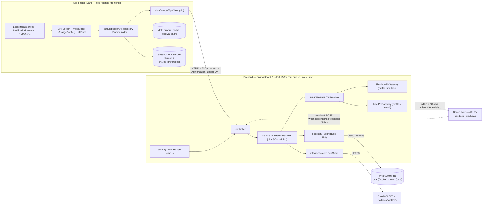
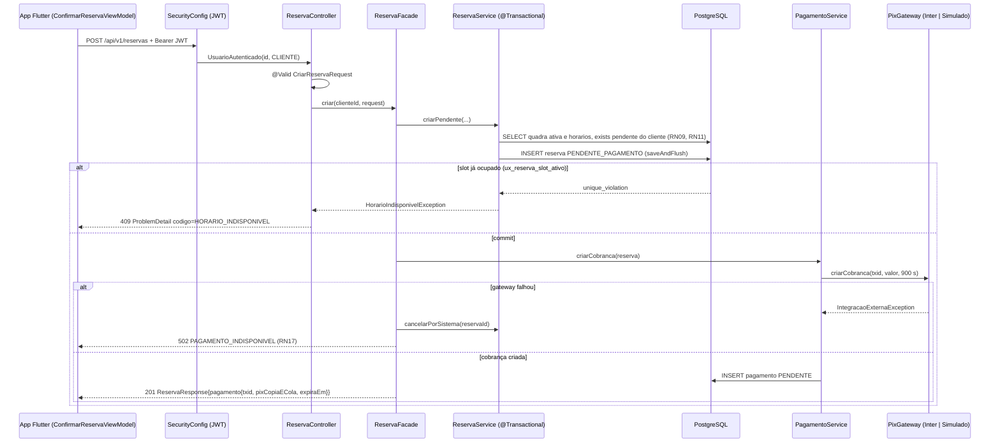
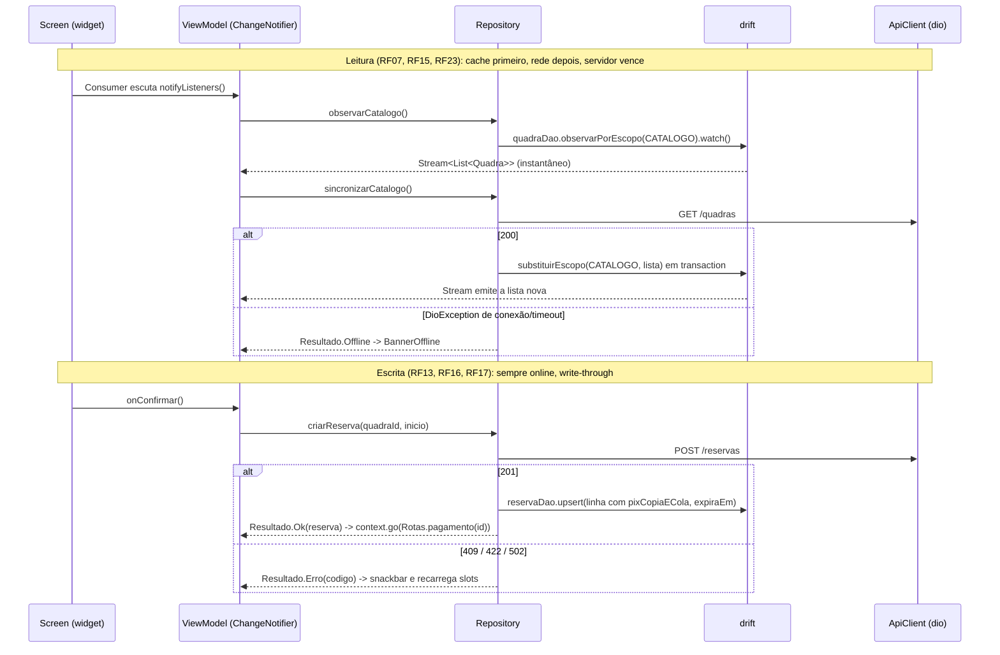

# 09 — Arquitetura da solução

Arquitetura cliente-servidor em três partes: app Flutter para Android (Dart, MVVM + Repository, cache drift e `SessaoStore`) que fala apenas com uma API REST Spring Boot 4.1 (JDK 21, camadas controller/service/repository) sobre PostgreSQL 18; o backend é o único que conversa com o Banco Inter (API Pix, mTLS + OAuth2) e com a BrasilAPI/ViaCEP. Documento coletivo: Integrante B escreve a justificativa das tecnologias e a modelagem, Integrante A escreve camadas, ambientes e CI. Atualizado em 06/10/2026: app passou de Android nativo (Kotlin + Compose) para Flutter (equivalências na seção 4).

## 1. Visão geral


```mermaid
flowchart LR
    subgraph APP["App Flutter (Dart) — alvo Android (frontend/)"]
        UI["ui/*: Screen + ViewModel (ChangeNotifier) + UiState"] --> REPO["data/repository/*Repository + Sincronizador"]
        REPO --> API["data/remote/ApiClient (dio)"]
        REPO --> ROOM[("drift: quadra_cache, reserva_cache")]
        REPO --> DS[("SessaoStore: secure storage + shared_preferences")]
        NAT["LocalizacaoService · NotificadorReserva · PixQrCode"] --> UI
    end

    API -- "HTTPS · JSON · /api/v1 · Authorization: Bearer JWT" --> CTRL

    subgraph BE["Backend — Spring Boot 4.1 · JDK 25 (br.com.puc.so_mais_uma)"]
        SEC["security: JWT HS256 (Nimbus)"] --> CTRL["controller"]
        CTRL --> SVC["service (+ ReservaFacade, jobs @Scheduled)"]
        SVC --> JPA["repository (Spring Data JPA)"]
        SVC --> PIX["integracao/pix: PixGateway"]
        SVC --> CEP["integracao/cep: CepClient"]
        PIX --> SIM["SimuladoPixGateway (profile simulado)"]
        PIX --> INTERGW["InterPixGateway (profiles inter-*)"]
    end

    JPA -- "JDBC · Flyway" --> PG[("PostgreSQL 18<br/>local (Docker) · Neon (beta)")]
    INTERGW -- "mTLS + OAuth2 client_credentials" --> INTER["Banco Inter — API Pix<br/>sandbox | producao"]
    CEP -- "HTTPS" --> BRASILAPI["BrasilAPI CEP v2<br/>(fallback ViaCEP)"]
    INTER -. "webhook POST /webhooks/inter/pix/{segredo} (REC)" .-> CTRL
```

Versão ASCII, para leitura sem renderizador:

```text
+------------------------------+   HTTPS/JSON /api/v1, JWT Bearer   +----------------------------------+   JDBC + Flyway   +-----------------+
| App Flutter (Dart, Android)  | ---------------------------------> | Backend Spring Boot 4.1 / JDK 21 | ----------------> | PostgreSQL 18   |
| ui (Screen+ViewModel+UiState)| <--------------------------------- | security(JWT) -> controller      |                   | Docker local /  |
|  -> repository -> ApiClient  |                                    |   -> service -> repository (JPA) |                   | Neon (beta)     |
|  -> drift | SessaoStore      |                                    |   -> integracao/pix (PixGateway) |                   +-----------------+
| geolocator | notificacao     |                                    |   -> integracao/cep (CepClient)  |
+------------------------------+                                    +-------+------------------+-------+
                                                                            | mTLS + OAuth2    | HTTPS
                                                                            v                  v
                                                              Banco Inter API Pix        BrasilAPI CEP v2 (fallback ViaCEP)
                                                              (sandbox | producao)
                                                              [REC] webhook -> POST /webhooks/inter/pix/{segredo}
                                                              profile simulado -> SimuladoPixGateway (interno, sem rede)
```

Três regras estruturais que valem para todo o projeto:

1. **O app nunca fala com Inter nem com BrasilAPI.** Um só `baseUrl`, um só cliente HTTP, credenciais e certificados apenas no servidor (RNF02).
2. **A verdade é o servidor.** O app tem cache de leitura (drift) e sessão (`SessaoStore`); toda escrita é online e o PostgreSQL decide conflitos (RNF11, RN08).
3. **Tudo que depende de terceiro tem substituto interno:** `SimuladoPixGateway` para o Inter, ViaCEP para a BrasilAPI, `FakeApiClient` para telas sem endpoint, kit de demo offline para o Render.

### Responsabilidade de cada componente

| Componente | Responsabilidade | Não faz |
|---|---|---|
| **App Flutter (Android)** | Telas (13), navegação por perfil, validação por campo, cache de leitura, sessão, geolocalização, notificação local, render do QR Pix | Regra de negócio de reserva/pagamento, cálculo de slots, acesso a APIs externas |
| **API REST (Spring Boot)** | Autenticação JWT, autorização por perfil e propriedade, regras RN01–RN20, slots, exclusividade do slot, cobrança e confirmação Pix, expiração, proxy de CEP | Interface, envio de e-mail/push, estorno automático |
| **PostgreSQL 18** | Persistência, integridade (FK, CHECK, índice único parcial `ux_reserva_slot_ativo`), fonte única de verdade | Lógica de aplicação (sem triggers/procedures) |
| **Banco Inter — API Pix** | Emite a cobrança imediata (`PUT /pix/v2/cob/{txid}`), devolve `pixCopiaECola`, informa `CONCLUIDA` (`GET /pix/v2/cob/{txid}`) e, se cadastrado, envia webhook | — (externo; disponibilidade do sandbox 8h–20h seg–sex, ver docs/11-integracao-pix-inter.md) |
| **SimuladoPixGateway** | Mesma interface do Inter sem rede: monta BR Code estático (`PixPayloadBuilder`) e confirma via `POST /dev/pagamentos/{txid}/confirmar` | Movimentar dinheiro |
| **BrasilAPI CEP v2 / ViaCEP** | CEP -> logradouro, bairro, cidade, UF e (BrasilAPI) latitude/longitude | — (externo, sem token; chamado só pelo backend com cache na entidade `quadra`) |
| **Render** | Hospeda o jar do backend em HTTPS (Web Service Docker) a partir de S9 | Banco |
| **Neon** | PostgreSQL gerenciado gratuito do beta | — |
| **Kit de demo offline** | Backend jar + PostgreSQL em Docker no notebook + hotspot; plano B único da apresentação | — |

## 2. Justificativa das tecnologias

As versões do backend foram verificadas em 01/09/2026 e as do app em 06/10/2026, na troca para Flutter (tabela completa na seção 8). Critério de escolha: linha estável com suporte durante o semestre, um só JDK e um só sistema de build para os quatro integrantes, e a menor superfície de ferramentas que ainda atende os 7 critérios da disciplina.

| Tecnologia (versão) | Papel | Por que | Alternativas descartadas |
|---|---|---|---|
| **Flutter 3.47.6 + Dart 3.13.5 (widgets Material 3)** | App (UI e lógica do cliente), alvo Android | Decisão do projeto em 06/10/2026, substituindo Kotlin + Jetpack Compose (escolha até a N1). Declarativo como o Compose, mesma divisão `Screen`/`ViewModel`/`UiState`; hot reload acelera a iteração nas 13 telas; Material 3 dá contraste e alvos de 48 dp de graça (RNF07); ViewModels, widgets e DAOs testáveis com `flutter test` sem emulador; gerar iOS depois não exige reescrever o app | Kotlin + Compose (Android nativo, substituído em 06/10/2026); React Native (outra linguagem e outra cadeia de build, sem ganho para os critérios); Kotlin/Compose Multiplatform (mantém o toolchain Kotlin/Gradle do app) |
| **Spring Boot 4.1.1 + JDK 21 LTS** | Backend REST | Linha 4.x é a única com suporte OSS ao longo do semestre (3.5 saiu de suporte em 06/2026). JDK 21 é LTS, roda Gradle, Android Studio e Spring com uma só instalação | Boot 3.5 (fora de suporte); JDK 25 (funciona, mas dobra o atrito de ferramentas); Node/NestJS (o grupo domina Java) |
| **PostgreSQL 18.6** | Banco | Índice único parcial (`WHERE status IN (...)`) resolve a dupla reserva em uma linha de SQL; `TIMESTAMPTZ`, `NUMERIC`; gratuito na Neon; imagem `postgres:18-alpine` no Docker e no Testcontainers | MySQL (sem índice parcial); H2 (não reproduz o comportamento do índice); MongoDB (relacionamentos e unicidade condicional) |
| **REST + JSON (`/api/v1`)** | Contrato app-servidor | Simples de documentar (Swagger), testar (`curl`, `.http`) e evoluir de forma aditiva (RNF09) | GraphQL/gRPC (sem ganho para 25 endpoints) |
| **JWT HS256 via Nimbus (`spring-security-oauth2-jose`)** | Autenticação | Já vem com o `oauth2-resource-server`; `NimbusJwtEncoder/Decoder.withSecretKey`; compatível com Jackson 3 do Boot 4; stateless (RNF01, RNF03) | `jjwt` (risco `jjwt-jackson` x Jackson 3); sessão com cookie (não combina com app mobile); OAuth social (dependência externa) |
| **Spring Data JPA + Hibernate 7** | Persistência | Repositórios declarativos + `@Modifying` para os `UPDATE` condicionais; `ddl-auto=validate` confere as entidades contra o Flyway | JDBC puro (mais código); jOOQ (curva extra) |
| **Flyway 12.4+ (`spring-boot-starter-flyway` + `flyway-database-postgresql`)** | Migrations | `V1__init.sql` versionado é a fonte única do DER; suporte a PostgreSQL 18 exige Flyway ≥ 12 | Liquibase (XML/YAML mais verboso); `ddl-auto=update` (imprevisível) |
| **Testcontainers 2.x (`testcontainers-postgresql`) + `@ServiceConnection`** | Testes de integração | `ReservaConcorrenciaIT` roda contra um PostgreSQL 18 real, o único jeito de provar o índice parcial | H2 em modo PostgreSQL (não reproduz índice parcial); banco compartilhado (flaky) |
| **springdoc-openapi 3.1.0** | Swagger UI | Contrato vivo em `/swagger-ui.html`; evidência do backend na N1 antes das telas de reserva | Postman como única documentação |
| **drift 2.35.1 + drift_flutter 0.3.1 (build_runner)** | Cache local | SQLite com tabelas tipadas, consultas observáveis (`.watch()` -> `Stream`), transações e DAOs (`@DriftAccessor`): o equivalente mais próximo do Room; testável em memória (`NativeDatabase.memory()`) no `flutter test` | sqflite (SQL cru, sem `Stream` reativo); Hive/Isar (NoSQL, sem PK composta nem transação com SQL) |
| **flutter_secure_storage 11.2.0 + shared_preferences 2.5.6** | Sessão e preferências (`SessaoStore`) | Token JWT cifrado pelo Android Keystore; demais chaves (ids, nome, perfil, marcas de sincronização, flags) no `SharedPreferencesAsync`, assíncrono como o DataStore era | Só shared_preferences (token em texto claro); sessão dentro do drift (mistura o cache descartável com a única cópia da sessão) |
| **dio 5.11.1 + json_serializable 6.14.1** | HTTP | Interceptor único para o JWT e para o 401 (`AuthInterceptor`), timeouts por requisição, corpo do erro já decodificado em `DioException.response` para o `ProblemDetailParser`; DTOs com `fromJson`/`toJson` gerados | `http` (sem interceptors, tudo à mão); retrofit para Dart (mais um gerador de código) |
| **go_router 18.0.2** | Navegação | Pacote mantido pelo time do Flutter; caminhos centralizados na classe `Rotas` (sem strings soltas nas telas), `redirect` por sessão e perfil, `StatefulShellRoute` com uma pilha por aba nas duas bottom-navs | `Navigator.push` puro (sem redirect central nem deep link); auto_route (gerador de código) |
| **`provider` 6.1.5+1 + `ChangeNotifier`** | DI e estado | Padrão do guia oficial de arquitetura do Flutter; `dependencias.dart` (~60 linhas, papel do antigo `AppContainer`) monta as dependências e cada rota cria seu ViewModel; zero geração de código; construtores recebem dependências, então os testes passam fakes direto | Riverpod (mais conceitos e geração de código); Bloc (eventos + estados por tela, mais arquivos); GetX (service locator global, difícil de testar e explicar) |
| **qr_flutter 4.1.0** | Gerar o QR Pix | `QrImageView(data: pixCopiaECola)` desenha o QR como widget dentro de `PixQrCode`; sem câmera | pretty_qr_code (válida, menos usada); desenhar a matriz à mão |
| **geolocator 14.1.1 + url_launcher 6.3.3** | Geolocalização (recurso nativo) e "Abrir no Maps" | Permissão em runtime, `getCurrentPosition` com timeout e `getLastKnownPosition`; no Android usa o Fused Location quando há Google Play Services e o `LocationManager` quando não há; cadeia de fallback até "sem distância" (RNF08); URI `geo:` abre qualquer app de mapas | location (API parecida, menos controle de precisão); google_maps_flutter (chave + billing) |
| **flutter_local_notifications 22.3.1** | Notificação local (REC) | Canal `reservas`, permissão `POST_NOTIFICATIONS` do Android 13+ e payload que abre a reserva ao tocar | Push FCM (Firebase e servidor de mensagens; fora do MVP) |
| **Maven Wrapper (backend) + `pubspec.yaml`/`pubspec.lock` (app)** | Build | Cada projeto com a ferramenta padrão do seu ecossistema; versões fixadas (RNF10); o Gradle do Android fica encapsulado pelo `flutter build` | Um sistema de build comum aos dois (não existe para Spring + Flutter sem atrito) |
| **Render (Web Service Docker) + Neon (PostgreSQL)** | Hospedagem do beta | HTTPS automático (pré-requisito do webhook), deploy por push, grátis; Neon é PostgreSQL de verdade | VM + Caddy (horas de operação); só localhost (testes com usuários e webhook exigem URL pública); Railway/Fly (equivalentes, sem ganho) |
| **GitHub Actions** | CI | Roda no monorepo com filtro por caminho; Docker disponível para Testcontainers | Sem CI (PR verde é regra do grupo, docs/21-git-e-organizacao.md) |

## 3. Backend — organização em camadas

Pacote raiz `br.com.puc.so_mais_uma`, um único módulo Maven, um único jar. Pacotes por **camada** (e não por feature) porque mapeiam literalmente o critério 2 da disciplina; conflitos de merge são evitados porque cada domínio tem os próprios arquivos dentro de cada pacote.

### Árvore de arquivos

```text
backend/
├── pom.xml · mvnw · mvnw.cmd · .mvn/wrapper/
├── compose.yaml                      (postgres:18-alpine, usado pelo spring-boot-docker-compose)
├── Dockerfile                        (multi-stage: mvnw package -> eclipse-temurin:25-jre)
└── src/
    ├── main/java/br/com/puc/so_mais_uma/
    │   ├── SoMaisUmaApplication.java             @SpringBootApplication @EnableScheduling
    │   ├── config/
    │   │   ├── SecurityConfig.java               stateless, oauth2ResourceServer(jwt), csrf off, rotas públicas
    │   │   ├── JwtConfig.java                    NimbusJwtEncoder/Decoder.withSecretKey(JWT_SECRET), HS256
    │   │   ├── OpenApiConfig.java                springdoc; desligado em inter-prod
    │   │   ├── FusoConfig.java                   ZoneId America/Sao_Paulo (app.fuso-horario), Clock
    │   │   ├── CepRestClientConfig.java          RestClient para BrasilAPI e ViaCEP, timeouts 3 s
    │   │   └── InterRestClientConfig.java        @Profile("inter-sandbox","inter-prod"): RestClient + SSL bundle PEM
    │   ├── security/
    │   │   ├── JwtService.java                   emite token (sub = usuarioId, claim perfil, exp 7 dias)
    │   │   ├── UsuarioAutenticado.java           record extraído do JWT (id, perfil)
    │   │   ├── PerfilAuthoritiesConverter.java   claim perfil -> ROLE_CLIENTE / ROLE_DONO
    │   │   └── LoginTentativasService.java       5 falhas -> bloqueio 15 min (ConcurrentHashMap + limpeza no job de 60 s)
    │   ├── controller/
    │   │   ├── AuthController.java               POST /auth/registrar, /auth/login
    │   │   ├── UsuarioController.java            GET/PUT /usuarios/me
    │   │   ├── QuadraController.java             CRUD /quadras
    │   │   ├── HorarioFuncionamentoController.java CRUD /quadras/{id}/horarios-funcionamento
    │   │   ├── SlotController.java               GET /quadras/{id}/slots
    │   │   ├── ReservaController.java            /reservas, /quadras/{id}/reservas
    │   │   ├── PagamentoController.java          GET /reservas/{id}/pagamento
    │   │   ├── CepController.java                GET /cep/{cep}
    │   │   ├── DevPagamentoController.java       @Profile("simulado","inter-sandbox"): POST /dev/pagamentos/{txid}/confirmar
    │   │   └── InterWebhookController.java       @Profile("inter-sandbox","inter-prod"): POST /webhooks/inter/pix/{segredo} (REC)
    │   ├── service/
    │   │   ├── AuthService.java · UsuarioService.java
    │   │   ├── QuadraService.java · HorarioFuncionamentoService.java · CepService.java
    │   │   ├── SlotService.java                  grade de 60 min por data, status LIVRE/OCUPADO/PASSADO/FECHADO
    │   │   ├── ReservaService.java               @Transactional: criarPendente, cancelar, atualizarObservacao
    │   │   ├── ReservaFacade.java                sem transação: reserva commitada -> cobrança -> 502 + cancela se falhar
    │   │   ├── PagamentoService.java             criarCobranca, confirmar (idempotente), cancelar
    │   │   ├── ExpiracaoReservaJob.java          @Scheduled(fixedDelay = 60 s): UPDATE em lote + limpeza do LoginTentativasService
    │   │   └── ConsultaPagamentoJob.java         @Scheduled(60 s), profiles inter-*, <= 10 pendentes por ciclo
    │   ├── repository/
    │   │   ├── UsuarioRepository.java · QuadraRepository.java · HorarioFuncionamentoRepository.java
    │   │   ├── ReservaRepository.java            existsSlotAtivo, @Modifying expirar(), confirmar(), cancelar()
    │   │   └── PagamentoRepository.java          @Modifying marcarPago(txid, endToEndId, horario), expirar(agora)
    │   ├── entity/
    │   │   ├── Usuario.java · Quadra.java · HorarioFuncionamento.java · Reserva.java · Pagamento.java
    │   │   └── PerfilUsuario · TipoEsporte · StatusReserva · StatusPagamento · ProvedorPagamento · CanceladoPor · StatusSlot
    │   ├── dto/                                  records com Bean Validation
    │   │   ├── RegistrarRequest · LoginRequest · TokenResponse · UsuarioResponse · AtualizarUsuarioRequest
    │   │   ├── QuadraRequest · QuadraResponse · HorarioFuncionamentoRequest · HorarioFuncionamentoResponse
    │   │   ├── SlotResponse · CriarReservaRequest · AtualizarReservaRequest · CancelarReservaRequest · ReservaResponse
    │   │   └── PagamentoResponse · CepResponse
    │   ├── exception/
    │   │   ├── GlobalExceptionHandler.java       @RestControllerAdvice -> ProblemDetail + codigo (+ campos[])
    │   │   ├── CodigoErro.java                   enum de todos os códigos da API
    │   │   ├── NaoEncontradoException (404) · AcessoNegadoException (403) · ConflitoException (409)
    │   │   ├── HorarioIndisponivelException (409) · RegraNegocioException (422) · PagamentoIndisponivelException (502)
    │   │   └── IntegracaoExternaException        interna, lançada pelos gateways
    │   └── integracao/
    │       ├── pix/
    │       │   ├── PixGateway.java               interface: criarCobranca, consultar, removerCobranca
    │       │   ├── CobrancaPix.java · StatusCobranca.java   records de retorno
    │       │   ├── PixPayloadBuilder.java        BR Code estático TLV + CRC16-CCITT (~60 linhas)
    │       │   ├── SimuladoPixGateway.java       @Profile("simulado")
    │       │   └── inter/
    │       │       ├── InterPixGateway.java      @Profile("inter-sandbox","inter-prod")
    │       │       ├── InterTokenService.java    POST /oauth/v2/token, cache 55 min
    │       │       └── dto/                      CobRequest, CobResponse, PixRecebido, WebhookPixItem
    │       └── cep/
    │           └── CepClient.java                BrasilAPI v2 -> fallback ViaCEP
    ├── main/resources/
    │   ├── application.yml                       padrão: profile simulado, /api/v1, Flyway, fuso
    │   ├── application-simulado.yml · application-inter-sandbox.yml · application-inter-prod.yml
    │   └── db/migration/V1__init.sql (seed em scripts/seed-demo.sql, fora do Flyway)
    └── test/java/br/com/puc/so_mais_uma/
        ├── AbstractIntegrationTest.java          @SpringBootTest + @ServiceConnection PostgreSQLContainer("postgres:18-alpine")
        ├── service/ReservaConcorrenciaIT.java    10 threads no mesmo slot -> 1x201, 9x409
        ├── service/*ServiceTest.java · security/JwtServiceTest.java · integracao/pix/PixPayloadBuilderTest.java
        └── controller/*ControllerTest.java       @WebMvcTest + @MockitoBean
```

### Responsabilidade de cada pacote e regras de camada

| Pacote | Responsabilidade | Pode depender de | Nunca |
|---|---|---|---|
| `controller` | Mapear rota, validar entrada (`@Valid`), extrair `UsuarioAutenticado`, converter DTO <-> chamada de service, devolver status HTTP correto | `service`, `dto`, `security` | Tocar em `repository`, retornar `entity`, conter regra de negócio |
| `service` | Regras RN01–RN20, transações (`@Transactional`), checagem de propriedade (403), orquestração com gateways, jobs agendados | `repository`, `entity`, `integracao`, `exception` | Conhecer HTTP (`HttpServletRequest`, status), montar `ProblemDetail` |
| `repository` | Interfaces Spring Data JPA; consultas derivadas e `@Modifying` `UPDATE` condicionais | `entity` | Lógica além da consulta |
| `entity` | Mapeamento JPA das 5 tabelas + enums; `@PreUpdate` para `atualizado_em`; Lombok `@Getter @Setter @NoArgsConstructor` (nunca `@Data`, nunca `record`) | — | Sair do backend (não serializar entidade) |
| `dto` | `record` de entrada e saída com Bean Validation; métodos estáticos `de(entity)` para conversão | `entity` (só leitura) | Anotações JPA |
| `exception` | Exceções de domínio com status fixo + `GlobalExceptionHandler` que produz `ProblemDetail` RFC 9457 com `codigo` | `dto` (para `campos[]`) | — |
| `config` | Beans de infraestrutura: segurança, JWT, RestClients, fuso, OpenAPI | tudo | Regra de negócio |
| `security` | Emissão/leitura do JWT, autoridades por perfil, bloqueio de login | `entity` (enums) | Acesso ao banco além de `UsuarioRepository` no `AuthService` |
| `integracao` | Adaptadores para sistemas externos (Inter, simulado, CEP) atrás de interfaces; convertem erro externo em `IntegracaoExternaException` | `config` | Tocar em `repository` ou `entity` |

Regras adicionais: nenhuma chamada HTTP externa dentro de método `@Transactional` (por isso existe `ReservaFacade`); toda transição de status é `UPDATE ... WHERE status = <esperado>` no `repository`; `@PreAuthorize("hasRole('DONO')")` nas escritas de quadra e horários, `hasRole('CLIENTE')` em `POST /reservas`; propriedade (`quadra.dono_id == eu`, `reserva.cliente_id == eu`) sempre no service, nunca no controller.

### Tarefas agendadas: duas linhas de execução

`application.yml` fixa `spring.task.scheduling.pool.size: 2`. Motivo: o agendador padrão do Spring Boot tem uma única thread, e o `ConsultaPagamentoJob` (a cada 60 s, até 10 chamadas HTTP sequenciais ao Inter com timeout de leitura de 10 s) pode segurar o agendador por vários minutos em um ciclo ruim — com uma thread só, nenhuma reserva expiraria nesse período e a promessa de liberar o slot em poucos minutos (RN10) cairia. Com duas threads, `ExpiracaoReservaJob` roda no seu próprio ciclo de 60 s independentemente do que a consulta ao Inter estiver fazendo.

### Bloqueio de login sem vazamento de memória

`LoginTentativasService` guarda o contador de falhas por e-mail em um `ConcurrentHashMap` em memória. Como nada removia entradas, um script tentando entrar com e-mails aleatórios faria o mapa crescer até esgotar a memória da instância gratuita do Render. Por isso o `ExpiracaoReservaJob`, que já roda a cada 60 s, chama também `LoginTentativasService.limparVencidas()`: cada entrada guarda o instante da última falha e é descartada quando passa da janela de 15 min. É uma linha a mais no job que já existe, sem biblioteca de cache nova.

### Fluxo de uma requisição (exemplo: `POST /reservas`)


```mermaid
sequenceDiagram
    participant App as App Flutter (ConfirmarReservaViewModel)
    participant Sec as SecurityConfig (JWT)
    participant C as ReservaController
    participant F as ReservaFacade
    participant S as ReservaService (@Transactional)
    participant DB as PostgreSQL
    participant P as PagamentoService
    participant G as PixGateway (Inter | Simulado)

    App->>Sec: POST /api/v1/reservas + Bearer JWT
    Sec->>C: UsuarioAutenticado(id, CLIENTE)
    C->>C: @Valid CriarReservaRequest
    C->>F: criar(clienteId, request)
    F->>S: criarPendente(...)
    S->>DB: SELECT quadra ativa e horarios, exists pendente do cliente (RN09, RN11)
    S->>DB: INSERT reserva PENDENTE_PAGAMENTO (saveAndFlush)
    alt slot já ocupado (ux_reserva_slot_ativo)
        DB-->>S: unique_violation
        S-->>C: HorarioIndisponivelException
        C-->>App: 409 ProblemDetail codigo=HORARIO_INDISPONIVEL
    else commit
        F->>P: criarCobranca(reserva)
        P->>G: criarCobranca(txid, valor, 900 s)
        alt gateway falhou
            G-->>P: IntegracaoExternaException
            F->>S: cancelarPorSistema(reservaId)
            F-->>App: 502 PAGAMENTO_INDISPONIVEL (RN17)
        else cobrança criada
            P->>DB: INSERT pagamento PENDENTE
            F-->>App: 201 ReservaResponse{pagamento{txid, pixCopiaECola, expiraEm}}
        end
    end
```

## 4. App Flutter — MVVM + Repository em um único pacote

Atualizado em 06/10/2026: o app passou de Android nativo (Kotlin + Jetpack Compose) para Flutter. A arquitetura não mudou — mesmas camadas, mesmas telas, mesmos nomes de componentes e regras —, só a tecnologia de cada peça (tabela de equivalências no fim desta seção).

Pacote Dart `so_mais_uma` em `frontend/`, alvo Android (applicationId `br.com.somaisuma.app`). Três camadas, no desenho MVVM + Repository do guia oficial de arquitetura do Flutter (docs.flutter.dev/app-architecture): **UI** (`XxxScreen` sem estado próprio + `XxxViewModel` + `XxxUiState`) -> **Repository** (decide entre rede, drift e `SessaoStore`) -> **fontes de dados** (`ApiClient`, DAOs do drift, `SessaoStore`, `LocalizacaoService`).

### Árvore de pastas

```text
frontend/
├── pubspec.yaml · pubspec.lock · analysis_options.yaml (flutter_lints)
├── config/
│   ├── dev.json.exemplo            {"API_BASE_URL": "http://10.0.2.2:8080/api/v1", "DEV_KEY": "troque"}
│   ├── dev.json                    (ignorado pelo Git)
│   └── release.json                {"API_BASE_URL": "https://<app>.onrender.com/api/v1"}
├── android/                        Gradle gerado pelo flutter create: applicationId, minSdk 26, sufixo .debug,
│                                   desugaring (flutter_local_notifications), assinatura, manifests main/debug
├── lib/
│   ├── main.dart                   inicializa notificações, banco e sessão; runApp(MultiProvider(...))
│   ├── app.dart                    SoMaisUmaApp: MaterialApp.router (tema claro/escuro, AppRouter)
│   ├── config/
│   │   ├── ambiente.dart           Ambiente.apiBaseUrl / Ambiente.devKey (String.fromEnvironment, --dart-define)
│   │   └── dependencias.dart       lista de providers (DI): Dio(AuthInterceptor), ApiClient, AppDatabase, SessaoStore,
│   │                               LocalizacaoService, MonitorConectividade, NotificadorReserva, repositórios
│   ├── data/
│   │   ├── remote/
│   │   │   ├── api_client.dart     dio; um método por rota de docs/10-api-rest.md
│   │   │   ├── dto/                *_dto.dart com @JsonSerializable (espelho dos records do backend)
│   │   │   ├── auth_interceptor.dart   adiciona Bearer; em 401 lê o codigo já decodificado: se TOKEN_INVALIDO limpa a sessão (sem retry)
│   │   │   ├── problem_detail_parser.dart  corpo de erro -> ErroApi(status, codigo, subcodigo, detail, campos)
│   │   │   └── fake_api_client.dart    dados fixos para telas sem endpoint e testes de ViewModel
│   │   ├── local/
│   │   │   ├── app_database.dart   drift (somaisuma.sqlite, schemaVersion, recriação destrutiva no onUpgrade)
│   │   │   ├── tabelas.dart        QuadraCache, ReservaCache
│   │   │   ├── quadra_dao.dart · reserva_dao.dart
│   │   │   ├── sessao_store.dart   token_jwt no flutter_secure_storage; usuario_*, ultima_lat/lon, ultima_sincronizacao_* no shared_preferences
│   │   │   ├── localizacao_service.dart   geolocator: posição atual -> última conhecida -> SessaoStore -> null
│   │   │   └── monitor_conectividade.dart connectivity_plus -> Stream<bool>
│   │   └── repository/
│   │       ├── auth_repository.dart · quadra_repository.dart · reserva_repository.dart
│   │       ├── pagamento_repository.dart · cep_repository.dart
│   │       └── sincronizador.dart  cache primeiro, rede depois, servidor vence (~30 linhas)
│   ├── model/
│   │   ├── quadra · horario_funcionamento · reserva · pagamento · slot · sessao · coordenada · enums espelhados
│   │   ├── erro_api.dart
│   │   └── resultado.dart          sealed class: Ok<T> | Erro<T>(ErroApi) | Offline<T>
│   ├── ui/
│   │   ├── navegacao/              rotas.dart (Rotas) · app_router.dart (AppRouter, go_router) · bottom_nav_cliente.dart · bottom_nav_dono.dart
│   │   ├── tema/                   tema.dart: ThemeData claro e escuro com ColorScheme explícito (sem dynamic color)
│   │   ├── componentes/            PixQrCode (qr_flutter) · ChipStatus · BannerOffline · CampoTextoValidado · CarregandoBox · ErroBox · VazioBox
│   │   ├── auth/                   SplashScreen · Login{Screen,ViewModel,UiState} · Cadastro{Screen,ViewModel,UiState}
│   │   ├── quadras/                QuadrasScreen · DetalheQuadraScreen (+ ViewModel/UiState)
│   │   ├── reservas/               ConfirmarReservaScreen · MinhasReservasScreen · DetalheReservaScreen
│   │   ├── pagamento/              PagamentoScreen · PagamentoViewModel (polling com backoff)
│   │   ├── dono/                   MinhasQuadrasScreen · FormQuadraScreen · HorariosQuadraScreen · ReservasQuadraScreen
│   │   └── perfil/                 PerfilScreen
│   └── util/
│       ├── geo.dart (Haversine) · formatadores.dart (intl: moeda, data em America/Sao_Paulo) · validadores.dart
│       └── notificador_reserva.dart    flutter_local_notifications, canal "reservas", POST_NOTIFICATIONS (API 33+)
├── test/                           espelha lib/: *_view_model_test.dart (FakeApiClient), *_dao_test.dart (drift em memória),
│                                   sincronizador_test.dart, geo_test.dart, widget tests das Screens
└── integration_test/               opcional (emulador), fora do CI
```

Arquivos em `snake_case` (`quadras_view_model.dart` contém `QuadrasViewModel`); na árvore, `Login{Screen,ViewModel,UiState}` abrevia `login_screen.dart`, `login_view_model.dart` e `login_ui_state.dart`. Os `*.g.dart` gerados pelo `build_runner` (drift e json_serializable) não são versionados.

### Padrão UiState + ChangeNotifier

Cada tela tem exatamente três arquivos: `xxx_ui_state.dart` (classe imutável com `copyWith`), `xxx_view_model.dart` (`ChangeNotifier` que expõe `state` e funções de ação) e `xxx_screen.dart` (`StatelessWidget` puro que recebe o estado e callbacks — testável em widget test sem ViewModel).

```dart
class QuadrasUiState {
  const QuadrasUiState({
    this.carregando = true,
    this.quadras = const [],
    this.esporteFiltro,
    this.offline = false,
    this.ultimaSincronizacao,
    this.erro,
  });

  final bool carregando;
  final List<Quadra> quadras;
  final TipoEsporte? esporteFiltro;
  final bool offline;
  final DateTime? ultimaSincronizacao;
  final ErroApi? erro;

  // erro recebe uma função para permitir limpar o campo: copyWith(erro: () => null)
  QuadrasUiState copyWith({bool? carregando, List<Quadra>? quadras, bool? offline, ErroApi? Function()? erro}) =>
      QuadrasUiState(
        carregando: carregando ?? this.carregando,
        quadras: quadras ?? this.quadras,
        esporteFiltro: esporteFiltro,
        offline: offline ?? this.offline,
        ultimaSincronizacao: ultimaSincronizacao,
        erro: erro != null ? erro() : this.erro,
      );
}

class QuadrasViewModel extends ChangeNotifier {
  QuadrasViewModel(this._quadraRepository, this._localizacao) {
    _assinatura = _quadraRepository.observarCatalogo()      // Stream do drift: instantâneo, também offline
        .listen((lista) => _emitir(_state.copyWith(carregando: false, quadras: lista)));
    sincronizar();
  }

  final QuadraRepository _quadraRepository;
  final LocalizacaoService _localizacao;
  late final StreamSubscription<List<Quadra>> _assinatura;
  var _descartado = false;

  QuadrasUiState _state = const QuadrasUiState();
  QuadrasUiState get state => _state;

  void _emitir(QuadrasUiState novo) {
    if (_descartado) return;                                // resposta chegou depois de sair da tela
    _state = novo;
    notifyListeners();
  }

  Future<void> sincronizar() async {
    switch (await _quadraRepository.sincronizarCatalogo()) {
      case Ok():
        _emitir(_state.copyWith(offline: false, erro: () => null));
      case Offline():
        _emitir(_state.copyWith(offline: true));
      case Erro(:final erro):
        _emitir(_state.copyWith(erro: () => erro));
    }
  }

  @override
  void dispose() {
    _descartado = true;
    _assinatura.cancel();
    super.dispose();
  }
}

class QuadrasScreen extends StatelessWidget {
  const QuadrasScreen({super.key, required this.state, required this.onAbrir, required this.onFiltrar, required this.onAtualizar});
  final QuadrasUiState state;
  final void Function(int id) onAbrir;
  final void Function(TipoEsporte?) onFiltrar;
  final Future<void> Function() onAtualizar;              // RefreshIndicator(onRefresh: onAtualizar, ...)

  @override
  Widget build(BuildContext context) { /* ... */ }
}
```

A rota liga as três peças; o `ChangeNotifierProvider` cria o ViewModel com as dependências do `MultiProvider` raiz e o descarta (`dispose`) quando a rota sai da pilha:

```dart
GoRoute(
  path: Rotas.quadras,
  builder: (context, _) => ChangeNotifierProvider(
    create: (ctx) => QuadrasViewModel(ctx.read<QuadraRepository>(), ctx.read<LocalizacaoService>()),
    child: Consumer<QuadrasViewModel>(                      // reconstrói a tela a cada notifyListeners()
      builder: (context, vm, _) => QuadrasScreen(
        state: vm.state,
        onAbrir: (id) => context.push(Rotas.detalheQuadra(id)),
        onFiltrar: vm.filtrar,
        onAtualizar: vm.sincronizar,
      ),
    ),
  ),
),
```

Regras: `Screen` não conhece ViewModel nem repositório; toda tela renderiza os quatro estados carregando/vazio/erro/dados (RNF06) usando `CarregandoBox`, `VazioBox`, `ErroBox(onTentarNovamente)`; assinaturas de `Stream` e o `Timer` do polling vivem no ViewModel e são cancelados no `dispose()`; o polling pausa com o app em segundo plano e a sincronização "ao voltar" é disparada por um `AppLifecycleListener` no `State` da tela (`onResume`, `onHide`/`onShow`); `BuildContext` usado depois de `await` sempre passa por `if (!context.mounted) return;`. O Flutter não recria a Activity na rotação, então o estado sobrevive sem `rememberSaveable`; texto ainda não enviado fica nos `TextEditingController` do `State` do formulário.

### Fluxo de dados


```mermaid
sequenceDiagram
    participant S as Screen (widget)
    participant VM as ViewModel (ChangeNotifier)
    participant R as Repository
    participant DB as drift
    participant Api as ApiClient (dio)

    Note over S,Api: Leitura (RF07, RF15, RF23): cache primeiro, rede depois, servidor vence
    S->>VM: Consumer escuta notifyListeners()
    VM->>R: observarCatalogo()
    R->>DB: quadraDao.observarPorEscopo(CATALOGO).watch()
    DB-->>VM: Stream<List<Quadra>> (instantâneo)
    VM->>R: sincronizarCatalogo()
    R->>Api: GET /quadras
    alt 200
        R->>DB: substituirEscopo(CATALOGO, lista) em transaction
        DB-->>VM: Stream emite a lista nova
    else DioException de conexão/timeout
        R-->>VM: Resultado.Offline -> BannerOffline
    end

    Note over S,Api: Escrita (RF13, RF16, RF17): sempre online, write-through
    S->>VM: onConfirmar()
    VM->>R: criarReserva(quadraId, inicio)
    R->>Api: POST /reservas
    alt 201
        R->>DB: reservaDao.upsert(linha com pixCopiaECola, expiraEm)
        R-->>VM: Resultado.Ok(reserva) -> context.go(Rotas.pagamento(id))
    else 409 / 422 / 502
        R-->>VM: Resultado.Erro(codigo) -> snackbar e recarrega slots
    end
```

Em texto: a UI observa o drift e por isso abre instantaneamente e funciona em modo avião; cada abertura de tela, pull-to-refresh (`RefreshIndicator`), volta do segundo plano (`AppLifecycleListener.onResume`) e volta da rede (`MonitorConectividade`) dispara `Sincronizador.sincronizar()`, que substitui o escopo inteiro pela resposta do servidor. Escritas vão direto à API; o sucesso é gravado no cache e a lista é re-sincronizada. Não existe fila offline nem tarefa em segundo plano (RNF11). Detalhes em docs/12-persistencia-local.md.

### Navegação

`AppRouter` (`lib/ui/navegacao/app_router.dart`) monta um `GoRouter` com `refreshListenable: sessaoStore` e um `redirect` que manda quem está sem sessão (ou com token a menos de 5 min de expirar) para `/login`, CLIENTE para `/quadras` e DONO para `/dono/quadras`. Cada perfil tem um `StatefulShellRoute.indexedStack` com três ramos (uma pilha por aba, estado preservado) e sua `NavigationBar` (`BottomNavCliente`, `BottomNavDono`); telas de detalhe abrem no navigator raiz, sem bottom-nav. Os caminhos ficam centralizados na classe `Rotas` (`lib/ui/navegacao/rotas.dart`), sem strings soltas nas telas. Como o `SessaoStore` é um `ChangeNotifier`, limpar a sessão (Sair ou 401 `TOKEN_INVALIDO`) já leva ao Login pelo `redirect`, sem evento extra. Grafo completo, caminhos e regras de pilha em docs/04-telas.md.

### Por que sem Clean Architecture e sem Riverpod/Bloc

| Descartado | O que custaria | Por que MVVM + Repository + `provider` basta |
|---|---|---|
| Camada `domain` com use cases e modelos próprios | Um `UseCase` por ação (~25 classes) + mapeadores entre DTO, linha do drift e modelo em cada sentido; pacotes Dart por camada | O critério pede "camadas" e "boas práticas": UI -> ViewModel -> Repository -> fonte de dados já são camadas com dependência em um sentido só. O `Repository` é o único lugar que decide entre drift e rede. Com 13 telas, 4 pessoas aprendendo Flutter e a troca de tecnologia na S6, dobrar o número de arquivos reduz a chance de entregar |
| Riverpod, Bloc/Cubit, GetX | Mais um modelo mental (providers globais com geração de código, eventos e estados, ou service locator com "mágica"), mais material para a banca perguntar | `ChangeNotifier` é do próprio Flutter e o pacote `provider` só o distribui pela árvore; é o desenho do guia oficial. `dependencias.dart` (~60 linhas) faz o papel do antigo `AppContainer`, os ViewModels recebem dependências por construtor e os testes passam fakes direto, sem framework |
| Multi-pacote (`packages/core`, `packages/data`, melos) | Um `pubspec.yaml` por pacote, versionamento interno, tempo de configuração | Um pacote compila e roda os testes em segundos; separação lógica por pasta é suficiente para a banca ler |

### Equivalências Android nativo -> Flutter (decisão de 06/10/2026)

Referência para quem leu os documentos até a N1 ou o histórico do board: cada peça do desenho original e o que a substitui.

| Peça | Até 06/10/2026 (Android nativo) | Agora (Flutter) |
|---|---|---|
| Linguagem e UI | Kotlin 2.4.10 + Jetpack Compose (BOM 2026.08.00, Material 3) | Dart 3.13.5 + Flutter 3.47.6 (widgets Material 3) |
| Pasta do app | `android/` | `frontend/` (o Gradle do Android fica em `frontend/android/`, gerado pelo `flutter create`) |
| Tela | `@Composable XxxScreen` | `XxxScreen extends StatelessWidget` |
| Estado da tela | `ViewModel` + `StateFlow<XxxUiState>` + `collectAsStateWithLifecycle()` | `ChangeNotifier` + `XxxUiState` + `Consumer`/`ListenableBuilder` |
| Ciclo de vida | `repeatOnLifecycle(STARTED)`, `LifecycleResumeEffect` | `AppLifecycleListener` (`onResume`, `onHide`/`onShow`) + `dispose()` do ViewModel |
| Navegação | Navigation Compose 2.10, `Rotas.kt` (`@Serializable`), `AppNavHost` com 2 grafos | go_router 18.0.2, `Rotas` (caminhos), `AppRouter` com 2 `StatefulShellRoute` |
| Injeção de dependência | `AppContainer` + `ViewModelFactory` manuais | `provider` 6.1.5+1: `dependencias.dart` + `ChangeNotifierProvider` por rota |
| HTTP | Retrofit 3 + OkHttp 5 (`ApiService`, `AuthInterceptor` com `peekBody`) | dio 5.11.1 (`ApiClient`, `AuthInterceptor` lendo `err.response?.data`) |
| Serialização | kotlinx.serialization 1.11 (`ignoreUnknownKeys`) | json_serializable 6.14.1 (ignora chaves desconhecidas por padrão; `unknownEnumValue`) |
| Cache local | Room 3.0.2 (KSP), `QuadraEntity`/`ReservaEntity`, `fallbackToDestructiveMigration` | drift 2.35.1 (build_runner), tabelas `QuadraCache`/`ReservaCache`, recriação destrutiva no `onUpgrade` |
| Sessão | DataStore Preferences 1.2.1 (`SessaoDataStore`, token em texto claro no sandbox do app) | `SessaoStore`: flutter_secure_storage 11.2.0 (token no Android Keystore) + shared_preferences 2.5.6 |
| Conectividade | `ConnectivityManager.NetworkCallback` | connectivity_plus 7.3.2 |
| Geolocalização | play-services-location 21.4.0 (`LocalizacaoProvider`) | geolocator 14.1.1 (`LocalizacaoService`; usa o Fused Location quando há Google Play Services e o `LocationManager` quando não há) |
| Abrir no mapa | Intent `geo:` | url_launcher 6.3.3 com URI `geo:` |
| Notificação local | `NotificationCompat` + canal em `SoMaisUmaApp.onCreate` | flutter_local_notifications 22.3.1, canal criado em `NotificadorReserva.inicializar()` no `main()` |
| QR Code | ZXing core 3.5.4 (`QrCodeGerador` -> `Bitmap`) | qr_flutter 4.1.0 (`QrImageView` dentro de `PixQrCode`) |
| Imagens (REC) | Coil 3.6.1 | cached_network_image 4.0.4 |
| Biometria (OPC) | androidx.biometric 1.1.0 + `FragmentActivity` | local_auth 3.0.2 + `FlutterFragmentActivity` |
| Configuração por build | `BuildConfig` + `local.properties` | `--dart-define-from-file` (`config/dev.json`, `config/release.json`) + `Ambiente` |
| Testes | JUnit na JVM + `androidTest` (Room em emulador) | `flutter test` (ViewModel, widget e DAO drift com `NativeDatabase.memory()`, sem emulador) + `integration_test` opcional |
| Build e versões | Gradle 9.7.1 + AGP 9.4 + `libs.versions.toml`, KSP | `flutter`/pub + `pubspec.yaml` + `pubspec.lock`, `build_runner` |

O que não mudou: plataforma Android e APK via `adb`, minSdk 26, permissões, emulador em `10.0.2.2`, nomes de telas e componentes, `Sincronizador`, `Resultado`, `ErroApi`, chaves da sessão, tabelas `quadra_cache`/`reserva_cache`, regra "cache primeiro, rede depois, servidor vence" e escritas somente online.

## 5. Tratamento de erros ponta a ponta

Um único formato de erro na API, um único parser no app, um único tipo de retorno nos repositórios.

### No backend: `ProblemDetail` (RFC 9457) + `codigo`

`GlobalExceptionHandler` converte toda exceção em `ProblemDetail` e acrescenta a propriedade `codigo` (enum `CodigoErro`); erros de validação também trazem `campos[]`; erros 422 trazem `subcodigo`.

```json
{
  "type": "about:blank",
  "title": "Conflict",
  "status": 409,
  "detail": "Esse horário acabou de ser reservado. Escolha outro.",
  "instance": "/api/v1/reservas",
  "codigo": "HORARIO_INDISPONIVEL"
}
```

```json
{
  "type": "about:blank",
  "title": "Bad Request",
  "status": 400,
  "detail": "Há campos inválidos.",
  "instance": "/api/v1/quadras",
  "codigo": "VALIDACAO",
  "campos": [
    { "campo": "precoHora", "mensagem": "deve ser maior ou igual a 1.00" },
    { "campo": "cep", "mensagem": "deve ter 8 dígitos" }
  ]
}
```

| Origem no backend | HTTP | `codigo` | Como o app reage |
|---|---|---|---|
| `MethodArgumentNotValidException` (Bean Validation) | 400 | `VALIDACAO` + `campos[]` | Mostra a mensagem ao lado de cada campo (`CampoTextoValidado`) |
| `AuthService` credencial errada | 401 | `CREDENCIAL_INVALIDA` | Mensagem na tela de Login; não derruba sessão |
| Filtro JWT (token ausente, expirado, assinatura inválida) | 401 | `TOKEN_INVALIDO` | `AuthInterceptor` limpa `SessaoStore` e drift uma única vez; o `redirect` do `GoRouter` leva ao Login (sem retry, sem loop) |
| `LoginTentativasService` | 429 | `LOGIN_BLOQUEADO` | "Muitas tentativas. Tente em 15 minutos." |
| `AcessoNegadoException` | 403 | `ACESSO_NEGADO` | Snackbar e volta |
| `NaoEncontradoException` | 404 | `NAO_ENCONTRADO` | `ErroBox` com "Tentar novamente" ou volta |
| `ConflitoException` | 409 | `EMAIL_JA_CADASTRADO`, `DIA_JA_CADASTRADO`, `QUADRA_COM_RESERVAS`, `HORARIO_COM_RESERVAS` | Mensagem específica na tela (por exemplo, diálogo "Cancele as reservas futuras antes de desativar") |
| `HorarioIndisponivelException` (violação de `ux_reserva_slot_ativo`) | 409 | `HORARIO_INDISPONIVEL` | Snackbar, volta ao DetalheQuadra e recarrega a grade |
| `RegraNegocioException` | 422 | `REGRA_NEGOCIO` com `subcodigo` `FORA_DO_FUNCIONAMENTO`, `DATA_FORA_DA_JANELA`, `RESERVA_PENDENTE_EXISTENTE`, `CANCELAMENTO_FORA_DO_PRAZO`, `TRANSICAO_INVALIDA` | Mensagem do `detail`; `RESERVA_PENDENTE_EXISTENTE` navega para a reserva pendente |
| `PagamentoIndisponivelException` (gateway falhou, RN17) | 502 | `PAGAMENTO_INDISPONIVEL` | "Não foi possível gerar a cobrança. Tente novamente." — o slot já foi liberado |
| `CepClient` sem resposta dos dois provedores | 503 | `CEP_INDISPONIVEL` | Formulário libera preenchimento manual do endereço e das coordenadas |
| Qualquer outra exceção | 500 | `ERRO_INTERNO` | `ErroBox` genérico; detalhe só no log do servidor |

### No app: `Resultado` selado

```dart
sealed class Resultado<T> {
  const Resultado();
}

final class Ok<T> extends Resultado<T> {
  const Ok(this.valor);
  final T valor;
}

final class Erro<T> extends Resultado<T> {
  const Erro(this.erro);
  final ErroApi erro;                       // ErroApi(status, codigo, subcodigo?, detail, campos)
}

final class Offline<T> extends Resultado<T> {
  const Offline();                          // sem rede / servidor inacessível
}

// lib/data/repository/sincronizador.dart — única tradução de DioException para Resultado,
// usada nas sincronizações e nas escritas de todos os repositórios (uso em docs/12-persistencia-local.md)
static Resultado<T> falha<T>(DioException e) => switch (e.type) {
      DioExceptionType.connectionError ||
      DioExceptionType.connectionTimeout ||
      DioExceptionType.sendTimeout ||
      DioExceptionType.receiveTimeout => Offline<T>(),
      DioExceptionType.badResponse => Erro<T>(ProblemDetailParser.parse(e)),
      _ => throw e,                         // cancelamento, certificado: bug, não rede
    };
```

Quem consome trata os três casos com `switch` exaustivo do Dart 3: esquecer um caso é erro de compilação, não bug em produção.

### `AuthInterceptor`: o corpo do erro chega inteiro ao repositório

O interceptor precisa do `codigo` do `ProblemDetail` para separar `TOKEN_INVALIDO` (sessão expirada -> derruba a sessão) de `CREDENCIAL_INVALIDA` (erro de tela). No desenho Android original isso exigia ler o corpo por espiada (`peekBody`) para não esgotá-lo antes do Retrofit. No dio esse risco não existe: o corpo já foi lido e decodificado quando o `onError` roda, fica em `err.response?.data` e segue intacto para o repositório e o `ProblemDetailParser`, com `codigo`, `subcodigo`, `campos[]` e o id da reserva de que a navegação depende. O token também é lido de forma assíncrona no `onRequest`, sem bloquear a thread de UI.

```dart
class AuthInterceptor extends Interceptor {
  AuthInterceptor(this._sessao, this._db);
  final SessaoStore _sessao;
  final AppDatabase _db;
  var _derrubada = false;                               // rearmada pelo AuthRepository no próximo login

  @override
  Future<void> onRequest(RequestOptions options, RequestInterceptorHandler handler) async {
    final token = await _sessao.tokenAtual();           // flutter_secure_storage
    if (token != null) options.headers['Authorization'] = 'Bearer $token';
    handler.next(options);
  }

  @override
  Future<void> onError(DioException err, ErrorInterceptorHandler handler) async {
    final resposta = err.response;
    final rotaDeAuth = err.requestOptions.path.startsWith('/auth/');
    if (resposta?.statusCode == 401 && !rotaDeAuth && !_derrubada &&
        ProblemDetailParser.codigoDe(resposta!.data) == 'TOKEN_INVALIDO') {
      _derrubada = true;
      await _db.limparTudo();
      await _sessao.limpar();                           // notifyListeners -> redirect do GoRouter -> /login
    }
    handler.next(err);                                  // sem retry; o erro segue íntegro para o repositório
  }
}
```

O caminho completo é: exceção de domínio no `service` -> `GlobalExceptionHandler` -> JSON `ProblemDetail` -> `DioException` (`badResponse`) no dio -> `ProblemDetailParser` -> `Resultado.Erro(ErroApi)` no `Repository` -> `UiState.erro` no ViewModel -> `ErroBox`/snackbar/mensagem de campo na `Screen`. Nenhuma camada intermediária traduz mensagens: o `detail` já vem em português pronto para exibir (RNF06), e o `codigo` permite comportamento específico sem comparar strings de texto.

## 6. Ambientes, hospedagem e configuração

### Ambientes

| Ambiente | Quando | Backend | Banco | Pix | App aponta para |
|---|---|---|---|---|---|
| **Dev local** | S1–S8 e sempre | `docker compose up -d` (PostgreSQL) + `./mvnw spring-boot:run` (profile `simulado`) | `postgres:18-alpine` local, recriável com `docker compose down -v` | `SimuladoPixGateway`; quem tem `.crt/.key` do sandbox roda `inter-sandbox` | Emulador: `http://10.0.2.2:8080` (`config/dev.json`); celular físico via USB: IP da LAN (cleartext liberado só no build debug, em `src/debug/AndroidManifest.xml`); Wi-Fi da faculdade bloqueando: hotspot |
| **Webhook em dev** | teste em S8 | `ngrok http 8080` ou `cloudflared` | local | `inter-sandbox` | — |
| **Beta / testes com usuários / CP2 / N2** | deploy em S9 (26–30/10) | **Render** Web Service Docker, HTTPS automático, deploy por push na `main` | **Neon** PostgreSQL gratuito | `SPRING_PROFILES_ACTIVE=inter-sandbox` (`.crt/.key` como Secret Files); `simulado` se o sandbox falhar | APK release: `config/release.json` com `API_BASE_URL = https://<app>.onrender.com/api/v1` |
| **Semana de testes com usuários** | 09 a 13/11 | Render, com `SPRING_PROFILES_ACTIVE=simulado` durante toda a semana | Neon | `SimuladoPixGateway` | D devolve para `inter-sandbox` na seg 16/11 |
| **Kit de demo offline** (plano B único, ensaiado em S12/S13) | apresentação | `docker compose up` com PostgreSQL + jar do backend (profile `simulado`) no notebook do apresentador | local | simulado | APK debug apontando para o IP do notebook no hotspot do celular |
| **Produção Inter** | só se go/no-go de 16/10 for positivo (REC) | Render, profile `inter-prod` | Neon | `InterPixGateway` produção, chave `INTER_CHAVE_PIX` da conta PJ | idem beta |

Cold start do Render gratuito (30–60 s): abrir `/actuator/health` 10 minutos antes de qualquer demo; plano Starter só em novembro/dezembro se incomodar.

### Profiles Spring

| Profile | Ativo em | `PixGateway` | `DevPagamentoController` | `InterWebhookController` | `ConsultaPagamentoJob` | Swagger | Seed V2 |
|---|---|---|---|---|---|---|---|
| `simulado` (padrão em `application.yml`, dev, CI, testes) | qualquer máquina | `SimuladoPixGateway` | sim: marca PAGO direto | não | não (confirmação vem do `/dev`) | sim | sim |
| `inter-sandbox` | quem tem certificado sandbox; Render no beta | `InterPixGateway` -> `https://cdpj-sandbox.partners.uatinter.co` | sim: repassa a `POST /pix/v2/cob/pagar/{txid}` (escopo `pix.write`) | sim (REC) | sim, 30 s, ≤ 50 por ciclo | sim | sim |
| `inter-prod` | Render, só com conta PJ aprovada | `InterPixGateway` -> `https://cdpj.partners.bancointer.com.br` | **não existe** | sim | sim | não | não |

A troca de profile não exige rebuild: é a variável `SPRING_PROFILES_ACTIVE`. Só um `PixGateway` existe no contexto por vez (`@Profile`), então trocar de provedor é trocar de bean: mesma tela, mesmo DTO, mesmo banco.

### Variáveis de ambiente

| Variável | Obrigatória em | Exemplo / formato | Uso |
|---|---|---|---|
| `SPRING_PROFILES_ACTIVE` | todos (padrão `simulado`) | `inter-sandbox` | Seleciona gateway, jobs e controllers |
| `SPRING_DATASOURCE_URL` | Render/Neon (local vem do `spring-boot-docker-compose`) | `jdbc:postgresql://<host>.neon.tech/somaisuma?sslmode=require` | Conexão |
| `SPRING_DATASOURCE_USERNAME` / `SPRING_DATASOURCE_PASSWORD` | Render/Neon | — | Conexão |
| `JWT_SECRET` | todos | ≥ 32 bytes aleatórios (`openssl rand -base64 48`) | HS256 (RNF01); a aplicação recusa iniciar com segredo curto |
| `JWT_VALIDADE_DIAS` | opcional | `7` | Validade do token |
| `APP_FUSO_HORARIO` | opcional | `America/Sao_Paulo` (padrão) | `FusoConfig` (RNF12) |
| `SPRING_TASK_SCHEDULING_POOL_SIZE` | opcional (padrão `2`, fixado em `application.yml` como `spring.task.scheduling.pool.size`) | `2` | Duas threads no agendador: a consulta ao Inter não pode segurar a expiração de reservas |
| `DEV_KEY` | `simulado`, `inter-sandbox` | string aleatória | Header `X-Dev-Key` do `POST /dev/pagamentos/{txid}/confirmar` |
| `SIMULADO_PIX_CHAVE` | `simulado` | chave Pix de um integrante (opcional; padrão fictício) | Chave dentro do BR Code estático do simulado |
| `SIMULADO_AUTO_CONFIRMAR_SEGUNDOS` | opcional | `20` | Confirma sozinho após N s (demo sem toque no botão) |
| `INTER_BASE_URL` | `inter-*` (definido no yml de cada profile) | sandbox ou produção | Base do `RestClient` |
| `INTER_CLIENT_ID` / `INTER_CLIENT_SECRET` | `inter-*` | valores exibidos uma única vez no portal | OAuth2 `client_credentials` |
| `INTER_CRT` / `INTER_KEY` | `inter-*` | caminho **absoluto** do `.crt` / `.key`, por exemplo `C:/Users/<usuario>/.somaisuma/inter-sandbox.crt` ou `/home/<usuario>/.somaisuma/inter-sandbox.key` (Secret Files no Render: `/etc/secrets/...`) | SSL bundle PEM `inter` (mTLS) |
| `INTER_CHAVE_PIX` | `inter-*` | chave Pix da conta da integração | Campo `chave` da cobrança (RN18) |
| `INTER_WEBHOOK_SEGREDO` | `inter-*` | segmento secreto da URL de callback (UUID sem hifens, 32 chars) | Compõe `POST /webhooks/inter/pix/{segredo}`; requisição sem ele recebe 404 (docs/11-integracao-pix-inter.md) |
| `INTER_ESCOPOS` | opcional | `cob.write cob.read pix.read pix.write webhook.write webhook.read` | Escopo pedido ao token |
| `PORT` | Render | injetado pela plataforma | `server.port=${PORT:8080}` |

`.gitignore` desde o primeiro commit: `*.crt`, `*.key`, `*.pfx`, `.env`, `*.jks`; no app, também `frontend/config/dev.json`, `frontend/android/key.properties` e os `*.g.dart` gerados (o `.gitignore` criado pelo `flutter create` já cobre `build/`, `.dart_tool/` e `local.properties`). Cada integrante mantém um `.env` local lido pelo `bootRun` via `spring.config.import=optional:file:.env[.properties]`. Atenção: esse arquivo é lido como **arquivo de propriedades**, não é interpretado por um shell — `$HOME` e `~` ficam literais (o certificado não é encontrado) e a conversão automática de nome (relaxed binding) de `MAIUSCULAS_COM_SUBLINHADO` só vale para variáveis de ambiente de verdade. Por isso, dentro do `.env`, caminhos são absolutos e as propriedades do Spring vão na forma canônica com pontos e minúsculas (`spring.profiles.active`, `spring.datasource.url`, `spring.datasource.username`, `spring.datasource.password`); a forma `SPRING_DATASOURCE_URL` serve para `export` no shell e para o painel do Render. Exemplo pronto em `backend/.env.exemplo` (ver `README.md`). No app, `API_BASE_URL` e `DEV_KEY` entram por `--dart-define-from-file` (`config/dev.json` no debug, com IP local ou `10.0.2.2`; `config/release.json` no release, com a URL do Render) e são lidos em `Ambiente` com `String.fromEnvironment` — nenhum segredo de servidor no APK. O build debug usa `applicationIdSuffix ".debug"` em `frontend/android/app/build.gradle.kts` (pacote `br.com.somaisuma.app.debug`), para o APK debug conviver com o release no mesmo celular durante os testes com usuários; `DEV_KEY` só existe no `config/dev.json` (ignorado pelo Git) e é usada apenas no botão "Simular pagamento", que só aparece com `kDebugMode`.

### Integração contínua (GitHub Actions)

Um único workflow, `.github/workflows/ci.yml`, disparado em `pull_request` e em `push` na `main` (ver `docs/21-git-e-organizacao.md` §21.7), com três jobs:

| Job | Passos | Tempo alvo |
|---|---|---|
| `segredos` | `actions/checkout` -> varredura de `git ls-files` que falha o build se houver `.env` (exceto `.env.exemplo`), `*.key`, `*.crt`, `*.pem`, `*.pfx`, `*.p12`, `*.jks` versionados | < 1 min |
| `backend` | `actions/setup-java` (Temurin 25, cache Maven) -> `./mvnw -B verify` (compila, unitários, `@WebMvcTest` e `ReservaConcorrenciaIT` via Testcontainers, Docker já disponível no runner Ubuntu, e gera o jar) | < 6 min |
| `frontend` | `setup-java` 21 + `subosito/flutter-action` (Flutter 3.47.6, com cache) -> `flutter pub get` -> `dart run build_runner build --delete-conflicting-outputs` -> `flutter analyze` -> `flutter test` (ViewModels com fakes, widgets, DAO drift em memória) -> `flutter build apk --debug` (APK como artifact); só avisa e passa enquanto `frontend/pubspec.yaml` não existir | < 8 min |

Regras: `main` protegida, PR só mergeia com CI verde e uma aprovação do suplente (docs/21-git-e-organizacao.md); deploy no Render é automático por push na `main` a partir de S9; o `ReservaConcorrenciaIT` roda em todo PR do backend porque é a evidência de RN08.

## 7. Decisões de arquitetura registradas

| Decisão | Alternativas | Motivo resumido |
|---|---|---|
| App em Flutter (06/10/2026) | Android nativo (Kotlin + Compose, vigente até a N1); React Native | decisão do projeto; mesma arquitetura e mesmos nomes, hot reload, testes de ViewModel/widget/DAO sem emulador |
| Monolito em um jar + um PostgreSQL | microsserviços, filas, gateway | 25 endpoints, 4 pessoas, 15 semanas |
| Pacotes por camada no backend | package-by-feature | mapeia o critério 2; conflitos evitados por arquivo por domínio |
| Cobrança Pix fora da transação da reserva (`ReservaFacade`) | dentro, com rollback | não segurar o lock do índice durante uma chamada HTTP |
| Polling (app 5 s com backoff para 10 s + job 60 s) obrigatório; webhook recomendado | só webhook | sandbox pode não disparar callback; polling funciona em localhost |
| `PixGateway` com `@Profile` | só Inter | conta PJ e certificado fora do controle do grupo |
| Nimbus para JWT | jjwt | compatível com Jackson 3 sem dependência extra |
| `provider` + `ChangeNotifier` no app | Riverpod, Bloc, GetX | padrão do guia oficial do Flutter, sem geração de código, explicável em 1 slide |
| MVVM + Repository em módulo único | Clean Architecture | atende "camadas" sem dobrar arquivos |
| drift cache-only com recriação destrutiva no `onUpgrade` | migrations do drift | app nunca edita localmente; cache é recriado no sync |
| Fuso único `America/Sao_Paulo` | coluna de fuso por quadra | elimina slot deslocado sem lógica extra (RNF12) |
| Render + Neon | VM + Caddy | HTTPS grátis sem operar servidor |
| Maven no backend, `flutter`/pub no app | Gradle nos dois projetos | o esqueleto Maven do backend já existia e funciona; no app, o Gradle do Android fica encapsulado pelo `flutter build` |

## 8. Versões fixadas (backend verificado em 01/09/2026; app em 06/10/2026)

As versões ficam em `backend/pom.xml` e em `frontend/pubspec.yaml` (com `frontend/pubspec.lock` versionado); nada de `+`, `any` ou `latest`. A tabela é repetida no `README.md` com a mesma data de verificação.

### Backend

| Componente | Versão | Observação |
|---|---|---|
| JDK | 21 LTS (Temurin) | Mesmo JDK para Gradle, Android Studio e Spring; Java 25 funciona, não é exigido |
| Spring Boot | 4.1.1 | Traz Spring Framework 7.0.9, Spring Security 7.1.1, Hibernate 7.4.5, Tomcat 11.0.24 |
| Starters | `webmvc`, `data-jpa`, `security`, `oauth2-resource-server`, `validation`, `flyway`, `actuator`; `docker-compose` (developmentOnly); `webmvc-test`, `testcontainers` (test) | `spring-boot-starter-web` foi renomeado para `spring-boot-starter-webmvc` no Boot 4 |
| Flyway | 12.4.x (gerenciado pelo Boot 4.1) + `org.flywaydb:flyway-database-postgresql` | Flyway < 12 rejeita PostgreSQL 18 ("Unsupported Database") |
| PostgreSQL | 18.6 (`postgres:18-alpine`) | Neon: versão 17 ou 18 conforme disponível; o DDL não usa recurso exclusivo do 18 |
| Driver pgjdbc | 42.7.12 (gerenciado) | |
| springdoc-openapi | 3.1.0 (`springdoc-openapi-starter-webmvc-ui`) | Linha 2.x é só para Boot 3 |
| Lombok | 1.18.48 | Apenas em `entity`; DTOs são `record` |
| Testcontainers | 2.0.x (`org.testcontainers:testcontainers-postgresql`) | Classe movida para `org.testcontainers.postgresql.PostgreSQLContainer`; confirmar a versão gerenciada pelo Boot 4.1.1 ao criar o projeto |
| Gradle (wrapper) | 9.7.1 | Kotlin DSL |

### App Flutter (verificado em 06/10/2026)

| Componente | Versão | Observação |
|---|---|---|
| Flutter (stable) / Dart | 3.47.6 (01/10/2026) / 3.13.5 | Todos os integrantes e o CI na mesma versão; `environment: sdk: ^3.13.0` no `pubspec.yaml` |
| compileSdk / targetSdk / minSdk | 36 / 36 / 26 | compile/target = `flutter.compileSdkVersion`/`flutter.targetSdkVersion` do Flutter 3.47.6; minSdk 26 fixado no `build.gradle.kts` dá canais de notificação e cobre ~95 % dos aparelhos (RNF08) |
| JDK do Gradle do Android | 21 (Temurin ou JBR do Android Studio) | Flutter 3.47 avisa abaixo do 17 |
| AGP / Gradle / Kotlin de `frontend/android/` | os gerados pelo `flutter create` do 3.47.6 | Não editar à mão; o Flutter 3.47.6 avisa com AGP < 9.0.1, Gradle < 9.1.0 e Kotlin < 2.3.20 |
| go_router | 18.0.2 | Exige Flutter >= 3.44 |
| provider | 6.1.5+1 | |
| dio | 5.11.1 | |
| json_annotation / json_serializable | 4.12.0 / 6.14.1 | Uma única serialização no app |
| drift / drift_flutter / drift_dev | 2.35.1 / 0.3.1 / 2.35.1 | `drift_flutter` já traz o SQLite nativo; o antigo `sqlite3_flutter_libs` foi descontinuado |
| build_runner | 2.16.1 | Gera os `*.g.dart` (não versionados) |
| flutter_secure_storage | 11.2.0 | Só o `token_jwt` |
| shared_preferences | 2.5.6 | API `SharedPreferencesAsync` |
| connectivity_plus | 7.3.2 | |
| geolocator | 14.1.1 | |
| url_launcher | 6.3.3 | URI `geo:` |
| flutter_local_notifications | 22.3.1 | Exige core library desugaring e compileSdk >= 36 |
| qr_flutter | 4.1.0 | Só geração de QR; última release em 2023, estável e muito usada (alternativa: pretty_qr_code) |
| intl | 0.20.3 | Moeda e data em pt_BR |
| cached_network_image | 4.0.4 (REC) | |
| local_auth | 3.0.2 (OPC) | Exige `FlutterFragmentActivity`; fora do MVP |
| flutter_lints / mocktail | 6.0.0 / 1.0.5 (dev) | mocktail é opcional; fakes à mão são o padrão |

### Armadilhas conhecidas (avisos no `CONTRIBUTING.md`)

| Armadilha | Sintoma | Como evitar |
|---|---|---|
| **Jackson 3** no Boot 4 | `import com.fasterxml.jackson.*` não compila; tutoriais de 2024/2025 falham | Pacote é `tools.jackson.*`; anotações continuam em `com.fasterxml.jackson.annotation` |
| `jjwt-jackson` | Conflito com Jackson 3 | Não usar jjwt; JWT via Nimbus (`oauth2-jose`) |
| `@MockBean` removido | Erro de compilação nos testes | Usar `@MockitoBean` / `@MockitoSpyBean` |
| `spring-boot-starter-web` | Dependência não encontrada | É `spring-boot-starter-webmvc` |
| Flyway sem módulo PostgreSQL | "No database found to handle jdbc:postgresql" | Adicionar `flyway-database-postgresql` |
| Testcontainers 1.x | Pacote `org.testcontainers.containers` inexistente | Linha 2.x, `org.testcontainers.postgresql`, artefato `testcontainers-postgresql` |
| `record` como `@Entity` | Hibernate falha ao instanciar | Records só em DTO/`@Embeddable`; entidades com Lombok `@Getter @Setter @NoArgsConstructor` |
| `@Data` em entidade | `equals/hashCode/toString` carregam relacionamentos lazy | Proibido em `entity` |
| Esquecer o `build_runner` após mudar tabela do drift ou DTO | `Target of URI hasn't been generated: '...g.dart'`, `_$AppDatabase` indefinido | `dart run build_runner build --delete-conflicting-outputs` (ou `watch` durante o dia); o CI roda sempre |
| Esquecer `--dart-define-from-file` | App aponta para o padrão `10.0.2.2`; release sem a URL do Render | Usar sempre os comandos do README (ou um atalho local do IDE com o mesmo argumento); release sempre com `config/release.json` |
| Medir desempenho em debug | Telas lentas e "jank" que não existem em release | Medir em `--profile` ou `--release` (o debug roda em JIT) |
| flutter_local_notifications sem desugaring | Build Android falha pedindo `coreLibraryDesugaring` | `isCoreLibraryDesugaringEnabled = true` em `compileOptions` + dependência `coreLibraryDesugaring("com.android.tools:desugar_jdk_libs:<versão do README do plugin>")` no `frontend/android/app/build.gradle.kts` |
| `INTERNET` só nos manifests de debug/profile | APK release não alcança o backend (o `flutter create` declara `INTERNET` apenas em `src/debug` e `src/profile`) | Declarar `<uses-permission android:name="android.permission.INTERNET" />` em `frontend/android/app/src/main/AndroidManifest.xml` |
| `BuildContext` usado depois de `await` | Navegação ou snackbar em tela já fechada; aviso `use_build_context_synchronously` | `if (!context.mounted) return;` |
| `Timer`/`StreamSubscription` vivos após sair da tela | `notifyListeners` depois do `dispose`, polling eterno | Cancelar no `dispose()` do ViewModel |
| Versões diferentes do Flutter entre integrantes | `pubspec.lock` e código gerado divergentes, CI quebra | Todos na 3.47.6 (`flutter --version`), igual ao CI |
| Editar à mão AGP/Gradle/Kotlin de `frontend/android/` | Avisos ou erros do plugin Gradle do Flutter | Manter o que o `flutter create` gerou; atualizar só seguindo `flutter doctor` e os avisos do Flutter |
| Hot reload depois de mudar `main()` ou providers | Dependência nova não aparece | Hot restart (`R`) |
| `local_auth` com `FlutterActivity` | Biometria não abre | `MainActivity` estende `FlutterFragmentActivity` (só se a biometria entrar) |
| Dynamic color como "tema escuro" | Cores mudam por aparelho, demo inconsistente | `ThemeData` claro e escuro com `ColorScheme` explícito; não adicionar pacote de dynamic color |
| Cleartext HTTP para IP local | App não conecta ao backend no celular físico | `android:usesCleartextTraffic="true"` só em `frontend/android/app/src/debug/AndroidManifest.xml` |
| Verificação de desenvolvedor Google (Brasil, 30/09/2026) | Sideload por navegador entra em fluxo com espera | Instalar sempre via `adb install`; avaliar conta de distribuição limitada em S9 |

## 9. Rastreabilidade

| Critério / requisito | Evidência neste documento |
|---|---|
| Critério 2 — arquitetura e justificativa das tecnologias | Seções 1, 2 e 7 |
| Critério 2 — camadas do backend | Seção 3 (árvore + tabela de responsabilidades + regras de camada) |
| Critério 2 — camadas do app | Seção 4 (MVVM + Repository, `UiState` + `ChangeNotifier`, fluxo de dados, equivalências Android nativo -> Flutter) |
| Critério 4 — sincronização e API externa | Seções 1 e 4 (fluxo de dados), profiles da seção 6 |
| Critério 6 — tratamento de erros, camadas, boas práticas | Seções 3, 4 e 5 |
| RNF01, RNF02, RNF03 | JWT Nimbus, variáveis de ambiente e `.gitignore` (seção 6), app nunca fala com o Inter (seção 1) |
| RNF05, RNF09, RNF10 | Ambientes e kit offline (seção 6), `ProblemDetail` (seção 5), catálogo de versões e CI (seções 6 e 8) |
| RNF08, RNF12 | minSdk/targetSdk (seção 8), `FusoConfig` e `APP_FUSO_HORARIO` (seções 3 e 6) |
