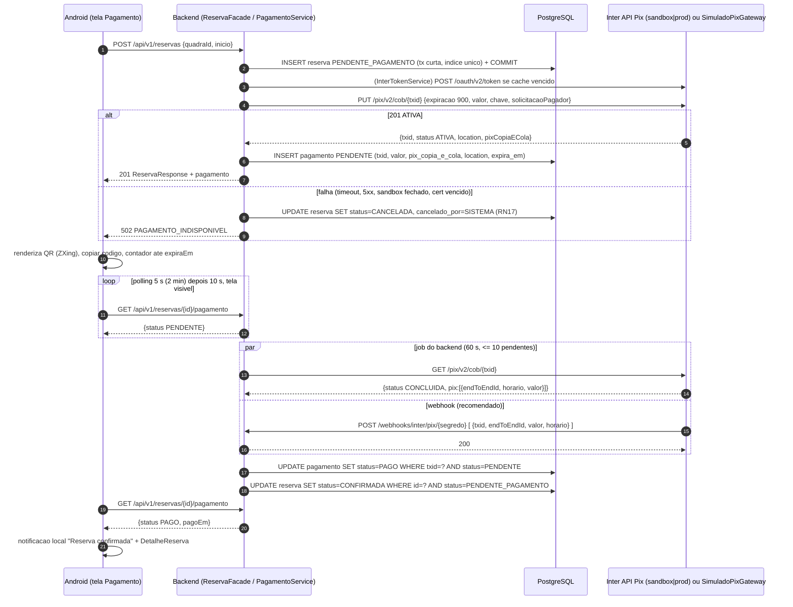
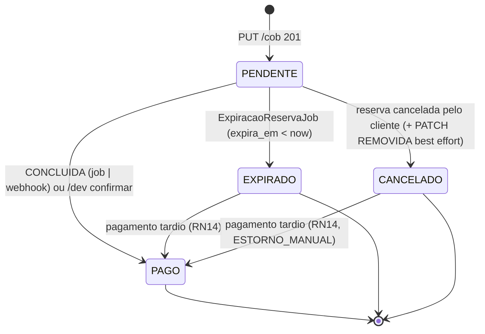

# Integração Pix — API do Banco Inter

Como o app cobra e confirma reservas via Pix usando a API Pix do Banco Inter no **sandbox** (caminho obrigatório da demonstração, sem dinheiro real), com **produção** como recomendado (só se houver CNPJ não-MEI) e o **`SimuladoPixGateway`** interno como fallback ativável por variável de ambiente. Cobre configuração passo a passo, divisão Android x backend, criação e confirmação da cobrança, cenários de erro, segurança, sandbox, código de referência, gates datados e checklist de teste manual.

Dono do documento: Integrante D (suplente: A). Regras de negócio citadas: `docs/07-regras-de-negocio.md` (RN10–RN14, RN17, RN18). Contrato do backend: `docs/10-api-rest.md`. Estados e concorrência: `docs/07-regras-de-negocio.md` e `docs/08-modelagem-banco.md` (tabela `pagamento`, índice `ux_reserva_slot_ativo`).

## 1. Decisão e classificação

| Parte | Classificação | Justificativa |
|---|---|---|
| `InterPixGateway` em **sandbox** dentro do app (criar cobrança -> QR -> pagar pelo endpoint de simulação -> `CONCLUIDA` -> reserva `CONFIRMADA`) | **obrigatório** (Must Have N2, meta 23/10) | É uma API externa real com mTLS + OAuth2 (critério 4) e não move dinheiro; demonstração legítima em ambiente acadêmico |
| `SimuladoPixGateway` (profile `simulado`, padrão em dev, CI e testes) | **obrigatório** (Must Have N1, pronto via Swagger em 18/09) | Fallback contra conta PJ inexistente, sandbox fechado (20h–8h, fim de semana), certificado vencido ou instabilidade; mesma tela, mesmo DTO, mesmo banco |
| Polling do app + `ConsultaPagamentoJob` | **obrigatório** | Única forma de confirmação que funciona em localhost e sem HTTPS público |
| Webhook `POST /webhooks/inter/pix/{segredo}` | **recomendado** (só se o Render estiver em HTTPS até 30/10) | Sandbox pode não disparar callback (incerteza registrada); mesmo com webhook o job continua |
| Pix em **produção** (`inter-prod`, cobrança real de R$ 1,00) | **recomendado** (go/no-go 16/10) | Exige conta PJ Inter Empresas; PF e MEI não têm acesso às APIs |
| Devolução/estorno automático, cobv (vencimento), Pix Automático, `x-conta-corrente`, repasse ao dono, split | **fora do MVP** | Nenhum pontua na disciplina; estorno é manual e fora do app (RN14); toda cobrança cai na única chave da plataforma (RN18) |

## 2. O que a pesquisa confirmou e o que continua incerto

| Fato (confiança) | Consequência no projeto |
|---|---|
| API Pix exige conta PJ Inter Empresas; PF e MEI não têm acesso (alta) | Produção é apenas recomendada |
| Sandbox existe em `https://cdpj-sandbox.partners.uatinter.co`, criado em `developers.inter.co/sandbox` com login da comunidade, escopos já incluídos, certificado válido por **30 dias**, disponível **8h–20h, seg–sex** (alta) | Renovações datadas (29/09, 27/10, 24/11); demos e ensaios só em horário comercial |
| Sandbox tem endpoint exclusivo `POST /pix/v2/cob/pagar/{txid}` com `{"valor": 80}` (escopo `pix.write`, 10/min) que paga a cobrança e devolve `{"e2e": "E..."}` (alta) | Botão "Simular pagamento" do app funciona também no sandbox, via `/dev/pagamentos/{txid}/confirmar` |
| OAuth2 `client_credentials` em `/oauth/v2/token`, form-urlencoded, token de 60 min, limite 5 chamadas/min (alta) | `InterTokenService` com cache de 55 min |
| `PUT /pix/v2/cob/{txid}`, txid `[a-zA-Z0-9]{26,35}`, corpo com `calendario.expiracao`, `valor.original`, `chave`, `solicitacaoPagador`; `devedor` opcional; resposta 201 com `txid`, `status`, `location`, `pixCopiaECola` (alta) | Corpo exato na seção 6; UUID sem hifens = 32 caracteres |
| `GET /pix/v2/cob/{txid}` devolve `status` ∈ {`ATIVA`, `CONCLUIDA`, `REMOVIDA_PELO_USUARIO_RECEBEDOR`, `REMOVIDA_PELO_PSP`} e lista `pix[]` com `endToEndId`, `horario`, `valor` (alta); o status **não** reflete expiração (média) | Expiração é controlada pelo nosso `expira_em`, não pelo Inter |
| Webhook: `PUT /pix/v2/webhook/{chave}` com `{"webhookUrl": "https://..."}`, callback POST com **array** JSON, 4 retentativas (20, 30, 60, 120 min), validação de origem só por mTLS (`ca.crt`) ou lista de IPs; sem HMAC (alta) | Webhook recomendado; mTLS de entrada fora do MVP, limitação documentada |
| Rate limits: cobrança/consulta 120/min, webhook 10/min, token 5/min, pagamento sandbox 10/min (alta) | O job consulta no máximo **10** pendentes por ciclo de **60 s**: 10 chamadas/min contra o teto de 120/min, sobrando 110/min para a criação de cobranças, que divide o mesmo limite; 429 pula o ciclo |

| Incerteza (aberta em 02/09/2026) | Gate que a resolve | Se confirmar o pior caso |
|---|---|---|
| A conta de desenvolvedor do sandbox pode ser criada por pessoa física sem CNPJ? | **02/09** (D tenta criar em 01/09) | `SimuladoPixGateway` vira o gateway da demonstração; BrasilAPI CEP (já obrigatória) cobre "API externa"; buscar CNPJ como plano C |
| O sandbox dispara callbacks de webhook após pagamento simulado? | **S8 (19–23/10)**, teste com `ngrok` | Webhook sai do backlog; polling já é o caminho principal |
| Valor exato de `expires_in` (presumido 3600) e limite máximo de `calendario.expiracao` | **04/09**, `curl` | Cache usa `min(expires_in, 3600) − 300 s`; 900 s de expiração é conservador |
| Prazo de aprovação da integração de produção ("Em validação": minutos a dias) | **18/09** pedido, **16/10** go/no-go | Produção sai definitivamente; sandbox é a versão final |

Nada além do listado acima é assumido sobre a API. Qualquer capacidade nova descoberta no portal logado entra aqui com data.

## 3. Pré-requisitos e configuração passo a passo

### 3.1 Sandbox (obrigatório) — responsável D, suplente A

1. Criar conta em `https://developers.inter.co` (conta da comunidade) e acessar `https://developers.inter.co/sandbox`.
2. **Nova integração** > nome `so-mais-uma-sandbox`, descrição > **Criar integração**. No sandbox não se escolhem escopos: a integração já vem com todos.
3. Em **Minhas integrações**, baixar chave e certificado: arquivos `Inter API_Chave.key` e `Inter API_Certificado.crt`. Renomear para `inter-sandbox.key` e `inter-sandbox.crt` e guardar **fora do repositório** (pasta `~/.somaisuma/` de cada integrante que tiver acesso; no Render, como *Secret Files*).
4. Copiar `client_id` e `client_secret` exibidos **uma única vez** para o gerenciador de senhas do grupo (nunca em chat, nunca no Git).
5. Aguardar status **Ativo** (minutos). Anotar a **data de expiração = criação + 30 dias** na issue de renovação.
6. Executar a prova por `curl` (seção 3.6) dentro do horário 8h–20h de um dia útil.

### 3.2 Produção (recomendado) — só se houver CNPJ não-MEI até 04/09

1. Conta **Inter Empresas** (PJ) ativa em nome de um integrante, familiar ou empresa parceira. PF e MEI não servem.
2. Internet Banking PJ > **Integrar** > **Nova integração**: nome, descrição, seleção dos escopos exatos da seção 3.5, aceite dos termos de cada API, formulário sobre a empresa.
3. Status **Em validação** (não é possível criar outra integração enquanto isso). Ao aprovar, status **Novo** em **Minhas integrações**.
4. **Ações** (três pontos) > **Download chave e certificado**: gera `.crt`/`.key` e mostra `client_id`/`client_secret` uma única vez. Status vira **Ativo** em minutos.
5. Certificado de produção vale **1 ano**; renovação disponível 90 dias antes (mantém credenciais e escopos). **Cancelar a integração é irreversível** — por isso vazamento de segredo é o risco R15.
6. Cadastrar a chave Pix da conta PJ em `INTER_CHAVE_PIX`. A chave precisa pertencer à conta da integração (RN18).
7. Teste de aceitação: cobrança real de **R$ 1,00** paga por um integrante e confirmada no app, até 16/10.

### 3.3 Variáveis de ambiente

| Variável | Profile | Conteúdo | Onde vive |
|---|---|---|---|
| `SPRING_PROFILES_ACTIVE` | todos | `simulado` (padrão se ausente), `inter-sandbox` ou `inter-prod` | `.env` local, painel do Render |
| `INTER_CLIENT_ID` / `INTER_CLIENT_SECRET` | `inter-*` | Credenciais da integração (sandbox ou produção; são pares diferentes) | `.env`, Render env vars, gerenciador de senhas |
| `INTER_CRT` / `INTER_KEY` | `inter-*` | Caminho absoluto dos arquivos PEM (`/etc/secrets/inter-sandbox.crt` no Render) | Arquivo fora do Git; Render Secret Files |
| `INTER_CHAVE_PIX` | `inter-*` | Chave Pix recebedora (no sandbox, qualquer chave fictícia aceita pelo portal; em produção, chave da conta PJ) | `.env`, Render |
| `INTER_BASE_URL` | `inter-*` | Definida no YAML de cada profile (não precisa de env), mas pode ser sobrescrita | YAML |
| `DEV_KEY` | `simulado`, `inter-sandbox` | Segredo do header `X-Dev-Key` de `/dev/**` | `.env`, Render (só no beta) |
| `INTER_WEBHOOK_SEGREDO` | `inter-*` | Segmento secreto aleatório da URL de callback (UUID sem hifens, 32 chars); compõe `POST /webhooks/inter/pix/{segredo}` e é o que impede confirmação forjada (seção 10) | `.env`, Render env vars, gerenciador de senhas |
| `SIMULADO_PIX_CHAVE`, `SIMULADO_PIX_NOME`, `SIMULADO_PIX_CIDADE` | `simulado` | Chave, nome (<= 25 chars ASCII) e cidade (<= 15 chars ASCII) usados no BR Code estático do simulado. Com a chave real de um integrante o QR é até pagável (a confirmação continua simulada) | `.env` |
| `JWT_SECRET` | todos | >= 32 bytes (não é do Pix, mas nasce junto no `.env`) | `.env`, Render |

Arquivo `backend/.env.exemplo` versionado com todas as chaves e valores vazios; `backend/.env` real ignorado. O `bootRun` lê o `.env` via `spring.config.import=optional:file:.env[.properties]`.

### 3.4 `.gitignore` (primeiro commit do monorepo, responsável A)

```gitignore
# segredos e certificados (Inter, JWT, chaves de assinatura)
*.crt
*.key
*.pfx
*.p12
*.jks
.env
.env.*
!.env.exemplo
backend/src/main/resources/application-local*.yml
scripts/http-client.private.env.json
android/keystore.properties
android/*.jks
```

Revisão de PR verifica ausência de segredo; se um `.crt/.key` ou `client_secret` vazar, a integração é cancelada e recriada no mesmo dia (R15).

### 3.5 Escopos OAuth exatos

`cob.write cob.read pix.read pix.write webhook.write webhook.read`

| Escopo | Usado por | Obrigatório? |
|---|---|---|
| `cob.write` | `PUT /pix/v2/cob/{txid}` (criar) e `PATCH /pix/v2/cob/{txid}` (remover ao cancelar) | sim |
| `cob.read` | `GET /pix/v2/cob/{txid}` (`ConsultaPagamentoJob`) | sim |
| `pix.read` | `GET /pix/v2/pix/{e2eId}` (auditoria manual de pagamento tardio) | sim |
| `pix.write` | `POST /pix/v2/cob/pagar/{txid}` — **só existe no sandbox**; sem ele o botão "Simular pagamento" falha com 403 do Inter | sim (sandbox) |
| `webhook.write` / `webhook.read` | `PUT`/`GET /pix/v2/webhook/{chave}` e `GET /pix/v2/webhook/callbacks` | recomendado |

O mesmo string de escopos é usado nos dois profiles; em produção `pix.write` fica sem uso (não há endpoint de pagar) e é inofensivo, mas a integração de produção só precisa marcá-lo se o grupo quiser devolução no futuro.

### 3.6 Prova por `curl` (gate 04/09) — sem escrever código

```bash
BASE=https://cdpj-sandbox.partners.uatinter.co
# 1) token (mTLS + client_credentials)
curl -s --cert ~/.somaisuma/inter-sandbox.crt --key ~/.somaisuma/inter-sandbox.key \
  -X POST "$BASE/oauth/v2/token" \
  -H "Content-Type: application/x-www-form-urlencoded" \
  -d "client_id=$INTER_CLIENT_ID&client_secret=$INTER_CLIENT_SECRET&grant_type=client_credentials&scope=cob.write cob.read pix.read pix.write webhook.write webhook.read"
# esperado: 200 {"access_token":"...","token_type":"Bearer","expires_in":3600,"scope":"..."}

# 2) cobranca imediata com txid proprio (32 chars)
TXID=$(uuidgen | tr -d '-' | tr 'A-Z' 'a-z')
curl -s --cert ... --key ... -X PUT "$BASE/pix/v2/cob/$TXID" \
  -H "Authorization: Bearer $TOKEN" -H "Content-Type: application/json" \
  -d '{"calendario":{"expiracao":900},"valor":{"original":"80.00"},"chave":"'"$INTER_CHAVE_PIX"'","solicitacaoPagador":"So mais uma - teste"}'
# esperado: 201 com status ATIVA, location e pixCopiaECola

# 3) pagar no sandbox e consultar
curl -s --cert ... --key ... -X POST "$BASE/pix/v2/cob/pagar/$TXID" -H "Authorization: Bearer $TOKEN" \
  -H "Content-Type: application/json" -d '{"valor": 80}'
curl -s --cert ... --key ... "$BASE/pix/v2/cob/$TXID" -H "Authorization: Bearer $TOKEN"
# esperado: status CONCLUIDA e pix:[{endToEndId, horario, valor}]
```

Resultado registrado na ata de 04/09 e em `docs/19-riscos.md` (R1, R2).

### 3.7 Certificado: bundle PEM direto (decisão) x conversão PFX (opcional)

| Opção | Comando / configuração | Uso |
|---|---|---|
| **PEM direto** (decisão) | `spring.ssl.bundle.pem.inter.keystore.certificate=file:${INTER_CRT}` e `private-key=file:${INTER_KEY}` | Sem conversão, sem senha de keystore, sem SDK; é o que o `InterRestClientConfig` usa (seção 11.3) |
| PFX (opcional) | `openssl pkcs12 -export -out inter.pfx -inkey "Inter API_Chave.key" -in "Inter API_Certificado.crt" -aes256` e `spring.ssl.bundle.jks.inter.keystore.location/password/type=PKCS12` | Só se alguma ferramenta (Postman, SDK oficial) exigir PKCS12. O SDK Java oficial (jar fora do Maven Central) **não** é usado |

## 4. O que fica no Android e o que fica obrigatoriamente no backend

| Android (tela Pagamento, Integrante D) | Prioridade |
|---|---|
| Renderizar o QR a partir de `pixCopiaECola` com **ZXing core 3.5.4** (`QrCodeGerador.gerar(texto, 512)` -> `Bitmap` -> `Image`), componente `PixQrCode` com `contentDescription` "QR Code Pix, R$ 80,00" | obrigatório |
| Botão **Copiar código** (`ClipboardManager`, `ClipData.newPlainText("Pix", pixCopiaECola)`) + snackbar "Código copiado" | obrigatório |
| Contador regressivo calculado a partir de `expiraEm` (não de um timer local), mostrando `mm:ss`; ao zerar exibe "Expirado" e desabilita o QR | obrigatório |
| **Polling** de `GET /reservas/{id}/pagamento`: a cada 5 s durante 2 min, depois a cada 10 s (RNF04), dentro de `repeatOnLifecycle(Lifecycle.State.STARTED)` (para quando a tela sai de foco); encerra em `PAGO`, `EXPIRADO`, `CANCELADO` ou `expiraEm` passado | obrigatório |
| Botão **Já paguei**: apenas força um novo ciclo do polling que a tela já faz — `GET /reservas/{id}/pagamento`, mesma rota, **sem parâmetro novo** e sem chamar o Inter; serve para o cliente não esperar os 5 ou 10 s do próximo ciclo | recomendado |
| Botão **Simular pagamento** visível só quando `BuildConfig.DEBUG`; chama `POST /dev/pagamentos/{txid}/confirmar` com `X-Dev-Key` de `BuildConfig.DEV_KEY` (definida em `local.properties`, ignorada no Git) | obrigatório (demo) |
| Ao detectar `PENDENTE -> PAGO`: `NotificadorReserva.confirmada(reserva)` (RF24) e navegação para DetalheReserva com `popUpTo(Quadras)`; permissão `POST_NOTIFICATIONS` pedida na primeira abertura da tela Pagamento (API >= 33) | recomendado |
| Tratar `502 PAGAMENTO_INDISPONIVEL` na ConfirmarReserva ("Não foi possível gerar a cobrança, tente novamente") e `EXPIRADO` na tela Pagamento (botão "Reservar novamente" volta ao DetalheQuadra) | obrigatório |
| Offline: `reserva_cache` guarda `pixCopiaECola` e `expiraEm`; o QR reabre sem rede com status "Aguardando conexão" (`docs/12-persistencia-local.md`) | obrigatório |
| **Nunca**: chamar o Inter, guardar `client_id/secret`, certificado, `endToEndId` ou dados do pagador | obrigatório |

| Backend (`integracao/pix/`, `service/PagamentoService`, Integrante D) | Prioridade |
|---|---|
| Guarda de credenciais e certificado; **mTLS** via SSL bundle `inter`; `RestClient` único com `baseUrl` do profile | obrigatório |
| `InterTokenService`: `POST /oauth/v2/token` form-urlencoded, cache em memória por 55 min (`expires_in − 300 s`), `synchronized` para evitar corrida (limite 5/min); em 401 do Inter invalida o cache e tenta **uma** vez | obrigatório |
| `InterPixGateway.criarCobranca`: gera `txid` = `UUID.randomUUID().toString().replace("-", "")` (32 chars, dentro de `[a-zA-Z0-9]{26,35}`), `PUT /pix/v2/cob/{txid}`; timeout de conexão 5 s e leitura 10 s | obrigatório |
| `InterPixGateway.consultar`: `GET /pix/v2/cob/{txid}` -> `StatusCobranca` | obrigatório |
| `InterPixGateway.removerCobranca`: `PATCH /pix/v2/cob/{txid}` com `{"status": "REMOVIDA_PELO_USUARIO_RECEBEDOR"}`, best effort (erro só loga) | recomendado |
| `ConsultaPagamentoJob` (`@Scheduled(fixedDelay = 60_000)`, profiles `inter-*`): até 10 pagamentos `PENDENTE` não expirados por ciclo; 429 ou erro de rede = log `INFO` e pula o ciclo | obrigatório |
| `PagamentoService.confirmar(txid, endToEndId, valor, horario)`: idempotente por UPDATE condicional + `end_to_end_id` UNIQUE (seção 8) | obrigatório |
| `ReconfirmacaoTardiaService`: bean separado com `@Transactional(propagation = REQUIRES_NEW)` para a reconfirmação de reserva EXPIRADA, isolando o rollback do índice único (seções 8 e 9) | obrigatório |
| `InterWebhookController` (`POST /webhooks/inter/pix/{segredo}`, `permitAll`, profiles `inter-*`): confere o segmento secreto (404 se não bater), aceita array, valida, chama `confirmar`, responde 200 | recomendado |
| `DevPagamentoController` (`POST /dev/pagamentos/{txid}/confirmar`, profiles `simulado` e `inter-sandbox`, JWT + `X-Dev-Key`) | obrigatório |
| Testes: `PixPayloadBuilderTest`, `PagamentoServiceTest`, `InterPixGatewayTest` (`MockRestServiceServer`), `InterWebhookControllerTest` | obrigatório |

## 5. Fluxo ponta a ponta



Versão textual: (1) o app cria a reserva; (2) o backend grava a reserva pendente em transação curta e **só depois** chama o Inter, fora da transação; (3) sucesso grava o pagamento e devolve o `pixCopiaECola`; falha cancela a reserva por `SISTEMA` e responde 502; (4) o app mostra o QR e faz polling do próprio backend; (5) o job (e, se existir, o webhook) detecta `CONCLUIDA` e confirma com UPDATEs condicionais; (6) o polling vê `PAGO`, dispara a notificação e navega. No profile `simulado`, os passos 3–4 e o passo do job são substituídos por `SimuladoPixGateway` (payload estático local) e por `POST /dev/pagamentos/{txid}/confirmar`.

## 6. Criação da cobrança (intenção de pagamento)

| Item | Valor | Prioridade |
|---|---|---|
| Quando | Imediatamente após o commit da reserva `PENDENTE_PAGAMENTO`, em `ReservaFacade.criar` (sem `@Transactional`), nunca dentro da transação que segura o índice único | obrigatório |
| `txid` | `UUID.randomUUID().toString().replace("-", "")` -> 32 caracteres `[0-9a-f]`; gravado em `pagamento.txid` (UNIQUE) antes da chamada | obrigatório |
| Endpoint | `PUT {base}/pix/v2/cob/{txid}` com `Authorization: Bearer <token>` e `Content-Type: application/json`; sem `x-conta-corrente` (uma conta) | obrigatório |
| Expiração | `calendario.expiracao = 900` (15 min), igual a `reserva.expira_em = criado_em + 15 min` (RN10). Constante `app.pagamento.expiracao-segundos` | obrigatório |
| Valor | `valor.original` = `reserva.valor` formatado com duas casas e ponto (`"80.00"`), copiado de `quadra.preco_hora` no momento da reserva (RN07) | obrigatório |
| `chave` | `INTER_CHAVE_PIX` (única chave da plataforma, RN18) | obrigatório |
| `devedor` | **Omitido**: o app não coleta CPF/nome do pagador (RN05, RNF02) | obrigatório |
| `solicitacaoPagador` | `"So mais uma - <nome da quadra ate 40 chars> <dd/MM HH>h"` (<= 140, sem acento) | recomendado |
| `infoAdicionais` | `[{"nome": "reserva", "valor": "42"}]` para auditoria no extrato | opcional |

Corpo exato enviado:

```json
{
  "calendario": { "expiracao": 900 },
  "valor": { "original": "80.00" },
  "chave": "a1b2c3d4-0000-4000-8000-somaisuma00",
  "solicitacaoPagador": "So mais uma - Arena Society Savassi 10/10 19h"
}
```

Da resposta 201 são persistidos apenas: `txid`, `status` (`ATIVA` -> `PENDENTE`), `pixCopiaECola` -> `pix_copia_e_cola`, `location`, `calendario.criacao` + 900 s -> `expira_em`, `provedor = INTER`, `valor`. Ignorados: `revisao`, `loc.id`, `devedor`, `chave` (já conhecida).

Falhas na criação (qualquer exceção do `RestClient`, resposta != 201, `SSLHandshakeException` por certificado vencido, sandbox fora do horário): `IntegracaoExternaException` -> `ReservaService.cancelarPorSistema(id, "GATEWAY_INDISPONIVEL")` -> `502 PAGAMENTO_INDISPONIVEL` (RN17). O slot volta a ficar livre no mesmo instante porque a reserva `CANCELADA` sai do índice parcial. Log `ERROR` com `txid`, status HTTP e `title/detail` do Inter (sem corpo completo, que pode conter a chave).

## 7. Consulta e confirmação do pagamento

### 7.1 Três caminhos, mesma função `PagamentoService.confirmar`

Só três coisas confirmam pagamento: o `ConsultaPagamentoJob`, o webhook e `/dev/pagamentos/{txid}/confirmar`. As duas primeiras linhas da tabela são leitura do próprio banco pelo app — não confirmam nada e nunca tocam o Inter.

| Caminho | Quem dispara | Frequência / limite | Profile | Prioridade |
|---|---|---|---|---|
| Polling do app | Tela Pagamento | 5 s por 2 min, depois 10 s; só lê o banco (não toca o Inter) | todos | obrigatório |
| "Já paguei" | Botão na tela | Dispara um ciclo extra do mesmo polling (`GET /reservas/{id}/pagamento`, sem parâmetro novo); não é um caminho de confirmação, não chama o Inter e não precisa de controle de frequência próprio | todos | recomendado |
| `ConsultaPagamentoJob` | `@Scheduled(fixedDelay = 60_000)` | Até 10 `PENDENTE` com `expira_em > now()` por ciclo -> no máximo 10 chamadas/min contra o teto de 120/min, deixando 110/min para a criação de cobranças (que usa o mesmo limite); 429 = pula o ciclo; fora do horário do sandbox = `INFO` + pula | `inter-sandbox`, `inter-prod` | obrigatório |
| Webhook | Inter | Evento; 4 retentativas se não responder 2xx | `inter-*` | recomendado |
| `/dev/pagamentos/{txid}/confirmar` | Botão "Simular pagamento" (debug) | Manual; no sandbox limitado a 10/min pelo Inter | `simulado`, `inter-sandbox` | obrigatório |

### 7.2 Mapeamento do status do Inter

| `GET /pix/v2/cob/{txid}` | `StatusCobranca` | Ação de `PagamentoService` |
|---|---|---|
| `ATIVA` sem `pix[]` | `Ativa` | Nada; se `expira_em < now()`, o `ExpiracaoReservaJob` já cuidou |
| `CONCLUIDA` com `pix[0]` | `Concluida(endToEndId, horario, valor)` | `confirmar(txid, endToEndId, valor, horario)` |
| `REMOVIDA_PELO_USUARIO_RECEBEDOR` / `REMOVIDA_PELO_PSP` | `Removida` | Nada muda no banco: apenas log `INFO` com o `txid`; o pagamento continua `PENDENTE` e a reserva expira pela RN10 (docs/07) |
| 404 do Inter | `Removida` (tratado como inexistente) | Log `INFO`; mesmo tratamento acima (status inalterado) |
| 429 / 5xx / timeout | exceção | Pula o ciclo; nada muda no banco |

### 7.3 Webhook (recomendado)

1. Pré-requisito: backend público em HTTPS (Render, meta 30/10). Em desenvolvimento, `ngrok http 8080` só para o teste da S8.
2. Cadastro manual, uma vez, com `scripts/inter/05-webhook-cadastrar.http`: `PUT {base}/pix/v2/webhook/{INTER_CHAVE_PIX}` com `{"webhookUrl": "https://so-mais-uma.onrender.com/api/v1/webhooks/inter/pix/{INTER_WEBHOOK_SEGREDO}"}` (escopo `webhook.write`, resposta 204). O Inter aceita qualquer URL HTTPS válida, então o segmento secreto entra sem custo nenhum (seção 10). Antes, usar o botão **Validar webhook** do portal.
3. Payload recebido (array, exemplo oficial reduzido):

```json
[
  {
    "endToEndId": "E00416968202610081707s0a1b2c3d4e5",
    "txid": "3f9c2b7e1d4a4c6f9a8b7c6d5e4f3a2b",
    "chave": "a1b2c3d4-0000-4000-8000-somaisuma00",
    "valor": "80.00",
    "horario": "2026-10-08T17:07:40.358Z",
    "infoPagador": "...",
    "componentesValor": {}
  }
]
```

4. `InterWebhookController`: responde **404** se o `{segredo}` da rota não for igual a `INTER_WEBHOOK_SEGREDO` (seção 10); rejeita com 400 se o corpo não for array; para cada item chama `confirmar`, que decide sozinho o que fazer; `DESCONHECIDO`, `JA_PROCESSADO` e `VALOR_DIVERGENTE` são apenas registrados no log; `infoPagador` e `componentesValor` são descartados (RN05); responde 200 sempre que o corpo for válido (evita as 4 retentativas do Inter). Idempotência garantida pela seção 8, então job e webhook podem processar o mesmo `txid` ao mesmo tempo sem efeito duplo — inclusive quando o mesmo `endToEndId` chega duas vezes, caso em que a violação de `ux_pagamento_end_to_end_id` é capturada e vira `JA_PROCESSADO` com 200, nunca um 500.
5. Mesmo com webhook ativo o `ConsultaPagamentoJob` continua rodando (cobre callback perdido).

## 8. Atualização do status da reserva (UPDATE condicional, idempotente)

Código idêntico ao de `docs/07-regras-de-negocio.md` (RN08, "Confirmação idempotente"); os dois documentos descrevem o mesmo e único método.

```java
// PagamentoService — chamado pelo job, pelo webhook e por /dev (simulado)
@Transactional
public ResultadoConfirmacao confirmar(String txid, String endToEndId, BigDecimal valor, OffsetDateTime horario) {
    Pagamento p = pagamentoRepository.findByTxid(txid).orElse(null);
    if (p == null) { log.warn("txid desconhecido {}", txid); return ResultadoConfirmacao.DESCONHECIDO; }
    if (p.getValor().compareTo(valor) != 0) {                                    // RN12: valor igual ao da cobranca
        log.warn("VALOR_DIVERGENTE txid={} esperado={} recebido={}", txid, p.getValor(), valor);
        return ResultadoConfirmacao.VALOR_DIVERGENTE;                            // nao confirma; tratamento manual
    }
    Long reservaId = p.getReserva().getId();          // lidos ANTES: marcarPago limpa o contexto e desanexa p
    BigDecimal valorCobranca = p.getValor();
    int pagos;
    try {
        pagos = pagamentoRepository.marcarPago(txid, endToEndId, horario);       // 0 ou 1 linha
    } catch (DataIntegrityViolationException e) {
        if (!ViolacaoIntegridade.de(e, "ux_pagamento_end_to_end_id")) throw e;   // outra constraint: 500 + log
        log.warn("E2E_DUPLICADO txid={} endToEndId={}", txid, endToEndId);       // mesmo Pix ja aplicado a outro txid
        return ResultadoConfirmacao.JA_PROCESSADO;                               // webhook responde 200
    }
    if (pagos == 1) {
        if (reservaRepository.confirmar(reservaId, Instant.now()) == 1)          // WHERE status = PENDENTE_PAGAMENTO
            return ResultadoConfirmacao.CONFIRMADA;
        return tratarPagamentoTardio(txid, reservaId, valorCobranca, endToEndId, horario);   // secao 9
    }
    if (pagamentoRepository.statusAtual(txid) == PAGO)                           // RELIDO do banco, nao da entidade
        return ResultadoConfirmacao.JA_PROCESSADO;                               // job x webhook x /dev: no-op
    return tratarPagamentoTardio(txid, reservaId, valorCobranca, endToEndId, horario);       // EXPIRADO/CANCELADO
}

private ResultadoConfirmacao tratarPagamentoTardio(String txid, Long reservaId, BigDecimal valor,
                                                   String endToEndId, OffsetDateTime horario) {
    boolean reconfirmada = false;
    try {
        reconfirmada = reconfirmacaoTardia.reconfirmarExpirada(reservaId);       // TRANSACAO PROPRIA (REQUIRES_NEW)
    } catch (DataIntegrityViolationException e) {
        if (!ViolacaoIntegridade.de(e, "ux_reserva_slot_ativo")) throw e;
        // slot ja tomado: o rollback ficou contido na transacao interna; ESTA transacao continua valida
    }
    pagamentoRepository.marcarPagoTardio(txid, endToEndId, horario);             // so agora o pagamento vira PAGO
    if (reconfirmada) {
        log.info("RECONFIRMADA_TARDIA txid={} reservaId={}", txid, reservaId);
        return ResultadoConfirmacao.CONFIRMADA;
    }
    log.warn("ESTORNO_MANUAL txid={} reservaId={} valor={}", txid, reservaId, valor);
    return ResultadoConfirmacao.ESTORNO_MANUAL;                                  // RN14
}
```

```java
// ReconfirmacaoTardiaService — bean SEPARADO: REQUIRES_NEW so vale entre beans (proxy do Spring)
@Service
public class ReconfirmacaoTardiaService {
    @Transactional(propagation = Propagation.REQUIRES_NEW)
    public boolean reconfirmarExpirada(Long reservaId) {
        return reservaRepository.reconfirmarExpirada(reservaId, Instant.now()) == 1;
        // O 23505 de ux_reserva_slot_ativo NAO e capturado aqui: sobe para o chamador e derruba
        // apenas esta transacao. Capturar dentro do metodo faria o commit falhar
        // ("current transaction is aborted"), porque o PostgreSQL ja abortou a transacao.
    }
}
```

```sql
-- PagamentoRepository.marcarPago  @Modifying(clearAutomatically = true, flushAutomatically = true)
UPDATE pagamento SET status = 'PAGO', end_to_end_id = :e2e, pago_em = :horario, atualizado_em = now()
 WHERE txid = :txid AND status = 'PENDENTE';
-- PagamentoRepository.marcarPagoTardio  @Modifying(clearAutomatically = true, flushAutomatically = true)
UPDATE pagamento SET status = 'PAGO', end_to_end_id = :e2e, pago_em = :horario, atualizado_em = now()
 WHERE txid = :txid AND status IN ('EXPIRADO', 'CANCELADO') AND end_to_end_id IS NULL;
-- PagamentoRepository.statusAtual (le o status no banco, depois do UPDATE em massa)
SELECT status FROM pagamento WHERE txid = :txid;
-- ReservaRepository.confirmar (@Modifying)
UPDATE reserva SET status = 'CONFIRMADA', atualizado_em = now()
 WHERE id = :id AND status = 'PENDENTE_PAGAMENTO';
-- ReservaRepository.reconfirmarExpirada (@Modifying, so dentro do REQUIRES_NEW)
UPDATE reserva SET status = 'CONFIRMADA', atualizado_em = now()
 WHERE id = :id AND status = 'EXPIRADA';
```

Por que é idempotente e imune a corrida:

- (a) o `UPDATE ... WHERE status = 'PENDENTE'` só afeta 1 linha na primeira vez, 0 nas seguintes (job x webhook x `/dev`);
- (b) 0 linhas **não** significa "já processado": um pagamento `EXPIRADO` ou `CANCELADO` também devolve 0. Por isso o status é **relido do banco** e só o valor `PAGO` encerra como `JA_PROCESSADO`; os outros seguem para o pagamento tardio. Se o método retornasse `JA_PROCESSADO` direto no 0, `tratarPagamentoTardio` seria código morto e as transições `EXPIRADO`/`CANCELADO` → `PAGO` (e `EXPIRADA` → `CONFIRMADA`) nunca aconteceriam;
- (c) a releitura é obrigatória porque `marcarPago` é um `UPDATE` em massa: ele não passa pelo contexto de persistência, então o `Pagamento` carregado no início continuaria com o status antigo. Daí `clearAutomatically = true, flushAutomatically = true` e a consulta `statusAtual`. Como o contexto é limpo, `reservaId` e `valor` são lidos **antes** do `UPDATE`;
- (d) `end_to_end_id` é UNIQUE (`ux_pagamento_end_to_end_id`), então o mesmo Pix não confirma dois pagamentos — e a violação é **capturada pelo nome da constraint** e mapeada para `JA_PROCESSADO` com `WARN E2E_DUPLICADO`, para que o webhook responda 200 e o Inter não reenvie a notificação 4 vezes. Violações de outras constraints continuam subindo e viram 500 com log completo;
- (e) a reserva só vira `CONFIRMADA` se ainda estiver `PENDENTE_PAGAMENTO` — cancelamento simultâneo do cliente ganha ou perde de forma determinística, nunca os dois;
- (f) a única operação que pode bater no índice `ux_reserva_slot_ativo` é a reconfirmação tardia, e ela roda em **transação própria**. O 23505 aborta a transação no PostgreSQL e nenhum `catch` em Java a reabre; se rodasse na mesma transação, nem o log nem a marcação de pago seriam gravados e o `UPDATE` anterior seria desfeito no rollback.

No profile `simulado`, `/dev/.../confirmar` chama `confirmar(txid, "SIMULADO-" + txid.substring(0, 20), pagamento.valor, now())` e passa pelo mesmo caminho.

## 9. Tratamento por cenário

| Cenário | Estado final `pagamento` / `reserva` | O que o sistema faz | Prioridade |
|---|---|---|---|
| **Aprovado** dentro do prazo | `PAGO` / `CONFIRMADA` | Seção 8; app notifica (RF24) e abre DetalheReserva | obrigatório |
| **Não pago até `expira_em`** ("recusado" não existe no Pix: o pagador simplesmente não paga) | `EXPIRADO` / `EXPIRADA` | `ExpiracaoReservaJob` (60 s): `UPDATE reserva ... WHERE status='PENDENTE_PAGAMENTO' AND expira_em < now()` e o mesmo para `pagamento`; slot liberado; app mostra "Expirado" com "Reservar novamente". A cobrança no Inter não é removida (expira sozinha em 900 s) | obrigatório |
| **Cancelado pelo cliente enquanto PENDENTE** | `CANCELADO` / `CANCELADA` (`cancelado_por = CLIENTE`) | `UPDATE` condicional da reserva; depois `removerCobranca(txid)` best effort (`PATCH` `REMOVIDA_PELO_USUARIO_RECEBEDOR`); falha no PATCH só loga | obrigatório (PATCH recomendado) |
| **Cancelado pelo cliente/dono após CONFIRMADA** (RN13) | `PAGO` / `CANCELADA` | Sem estorno automático; `motivo_cancelamento` obrigatório para DONO; log `WARN ESTORNO_MANUAL txid=... reservaId=...`; o dono devolve pelo telefone do cliente fora do app (RN14) | obrigatório |
| **Pagamento tardio para reserva EXPIRADA** (janela de até 60 s do `ExpiracaoReservaJob`, ou cliente pagou no último segundo) | `PAGO` / `CONFIRMADA` **se o slot ainda estiver livre**; senão `PAGO` / `EXPIRADA` | `tratarPagamentoTardio` chama `ReconfirmacaoTardiaService.reconfirmarExpirada` (`@Transactional(propagation = REQUIRES_NEW)`, bean separado): `UPDATE reserva SET status='CONFIRMADA' WHERE id=? AND status='EXPIRADA'` **em transação própria**. Se outro cliente já ocupou o slot, o 23505 de `ux_reserva_slot_ativo` derruba só a transação interna; a externa continua válida, grava `marcarPagoTardio` (`status IN ('EXPIRADO','CANCELADO') AND end_to_end_id IS NULL`) e loga `WARN ESTORNO_MANUAL`. A marcação de pago acontece **depois** da tentativa, não antes | obrigatório |
| **Pagamento tardio para reserva CANCELADA** | `PAGO` / `CANCELADA` | Não reconfirma (o cliente desistiu; o `UPDATE` só casa com `status='EXPIRADA'`); grava `marcarPagoTardio` e loga `WARN ESTORNO_MANUAL` | obrigatório |
| **Valor divergente** (só possível pelo endpoint de simulação do sandbox com valor errado) | `PENDENTE` até expirar | Não confirma; log `WARN VALOR_DIVERGENTE`; conferência manual via `GET /pix/v2/pix/{e2eId}` | obrigatório |
| **Cobrança removida pelo PSP** | `PENDENTE` (inalterado) / segue fluxo até expirar | Apenas log `INFO` (seção 7.2); nenhum status é alterado e a reserva expira pela RN10 | recomendado |
| **Gateway indisponível na criação** (sandbox fechado 20h–8h, timeout, cert vencido) | — / `CANCELADA` por `SISTEMA` | 502 `PAGAMENTO_INDISPONIVEL` (RN17); demo fora do horário usa `simulado` | obrigatório |
| **Gateway indisponível na consulta** | inalterado | Job pula o ciclo; polling do app continua vendo `PENDENTE`; nada é marcado erroneamente | obrigatório |
| **429 do Inter** | inalterado | Job pula o ciclo inteiro; `/dev` devolve 502 com `detail` "Limite do sandbox, tente em 1 min" | obrigatório |
| **401 do Inter** (token vencido antes dos 55 min) | inalterado | `InterTokenService.invalidar()` e uma única nova tentativa | obrigatório |
| **Certificado vencido** (`SSLHandshakeException`) | — | 502 na criação; log `ERROR CERTIFICADO_INTER`; renovar conforme seção 12; se for dia de demo, `SPRING_PROFILES_ACTIVE=simulado` sem rebuild | obrigatório |

### 9.1 Máquina de estados do pagamento



A máquina da reserva (com `EXPIRADA` -> `CONFIRMADA` no pagamento tardio) está em `docs/07-regras-de-negocio.md`.

## 10. Segurança

| Regra | Detalhe | Prioridade |
|---|---|---|
| **Nunca armazenar** | CPF/nome do pagador (`infoPagador`, `devedor`), `componentesValor`, dados bancários, chave Pix do cliente, `client_id/secret`, certificado, `access_token` em banco. Persistidos só `txid`, `valor`, `status`, `pix_copia_e_cola`, `location`, `end_to_end_id`, `expira_em`, `pago_em` (RNF02, RN05) | obrigatório |
| Segredos | Somente em variáveis de ambiente / Secret Files; `.gitignore` da seção 3.4; logs mascaram `Authorization` e nunca imprimem o corpo do token | obrigatório |
| mTLS de saída | SSL bundle `inter` em todo `RestClient` que fala com o Inter; sem `TrustAll`, sem desabilitar verificação de hostname | obrigatório |
| Exposição ao app | O Android só vê `PagamentoResponse`; `endToEndId` e `location` nunca saem da API | obrigatório |
| `/dev/**` | JWT válido **e** header `X-Dev-Key`; bean só existe nos profiles `simulado` e `inter-sandbox` (`@Profile`), portanto em `inter-prod` a rota nem é registrada | obrigatório |
| **URL de callback com segmento secreto** | A URL cadastrada no Inter é `https://.../api/v1/webhooks/inter/pix/{segredo}`, onde `{segredo}` é um valor aleatório de 32 caracteres que vive só em `INTER_WEBHOOK_SEGREDO` (variável de ambiente / Render env var, nunca no Git). O `InterWebhookController` compara o segmento recebido com a variável e responde **404** para qualquer requisição em que ele não bata — inclusive para `/webhooks/inter/pix` sem segmento. Como o Inter aceita qualquer URL HTTPS no cadastro, isso não custa nada e fecha a forja sem exigir mTLS de entrada: quem não conhece o segredo não alcança o endpoint. O segredo é rotacionado recadastrando o webhook (`scripts/inter/05-webhook-cadastrar.http`) | obrigatório |
| Validação do webhook | Além do segmento secreto: HTTPS obrigatório (Render); corpo precisa ser array; `txid` deve existir; `valor` deve ser igual ao da cobrança; campos extras ignorados; resposta 200 sem revelar nada além de `{"processados": n}` | recomendado |
| **Limitação documentada** | Sem mTLS de entrada com o `ca.crt` do Inter e sem allowlist de IPs no webhook (configurar client-auth no Tomcat/Render é desproporcional para o MVP). O segmento secreto acima é o que substitui essas duas defesas: sem ele, um terceiro que conhecesse um `txid` e o valor poderia forjar a confirmação. Continua valendo que o `txid` é um UUID aleatório de 32 chars que só o cliente daquela reserva recebe, e que o valor precisa bater. Registrado em `docs/19-riscos.md` | obrigatório (documentar) |
| Rate limit próprio | `/dev/.../confirmar` limitado a 10/min por usuário (mesmo teto do sandbox) | recomendado |

## 11. Sandbox: URLs, horário, simulação e código de referência

### 11.1 URLs e limites

| Ambiente | Base | Token | Observações |
|---|---|---|---|
| Sandbox | `https://cdpj-sandbox.partners.uatinter.co` | `POST /oauth/v2/token` | **8h–20h, seg–sex**; certificado 30 dias; escopos completos; endpoints de simulação abaixo |
| Produção | `https://cdpj.partners.bancointer.com.br` | `POST /oauth/v2/token` | 24x7; certificado 1 ano; sem endpoint de simulação |

Endpoints de simulação (só sandbox): `POST /pix/v2/cob/pagar/{txid}` com `{"valor": 80}` (escopo `pix.write`, 10/min, resposta 201 `{"e2e": "E..."}`) — usado pelo `DevPagamentoController`; alternativa `POST /pix/v2/sandbox/cob/pagamento` com `{"qrCode": "<pixCopiaECola>", "valor": 80}` (resposta 200 `{"endToEnd": "..."}`), usada só nos scripts manuais.

Comportamento do `DevPagamentoController` por profile: `simulado` -> `PagamentoService.confirmar` direto; `inter-sandbox` -> `POST /pix/v2/cob/pagar/{txid}` e resposta `202`-like (`200` com `status: PENDENTE`), cabendo ao job detectar `CONCLUIDA` em até 60 s; `inter-prod` -> rota inexistente (404 do Spring).

### 11.2 Interface `PixGateway` e tipos (Java)

```java
package br.com.somaisuma.integracao.pix;

public interface PixGateway {
    /** Cria cobranca imediata. Lanca IntegracaoExternaException em qualquer falha (-> RN17). */
    CobrancaPix criarCobranca(String txid, BigDecimal valor, int expiracaoSegundos, String descricao);
    /** Consulta o estado atual da cobranca no provedor. */
    StatusCobranca consultar(String txid);
    /** Best effort: remove a cobranca quando a reserva e cancelada; erro apenas loga. */
    void removerCobranca(String txid);
    ProvedorPagamento provedor();
}

public record CobrancaPix(String txid, String pixCopiaECola, String location, OffsetDateTime expiraEm) {}

public sealed interface StatusCobranca permits StatusCobranca.Ativa, StatusCobranca.Concluida, StatusCobranca.Removida {
    record Ativa() implements StatusCobranca {}
    record Concluida(String endToEndId, OffsetDateTime horario, BigDecimal valor) implements StatusCobranca {}
    record Removida() implements StatusCobranca {}
}

public class IntegracaoExternaException extends RuntimeException {
    public IntegracaoExternaException(String mensagem, Throwable causa) { super(mensagem, causa); }
}
```

`@Service @Profile("simulado") SimuladoPixGateway` e `@Service @Profile({"inter-sandbox", "inter-prod"}) InterPixGateway` implementam a interface; `PagamentoService` depende só de `PixGateway`. A troca de provedor é uma variável de ambiente, sem rebuild.

### 11.3 Configuração do `RestClient` com SSL bundle (YAML + Java)

`application-inter-sandbox.yml` (o `inter-prod.yml` muda só `base-url` e desliga springdoc e `/dev`):

```yaml
spring:
  ssl:
    bundle:
      pem:
        inter:
          keystore:
            certificate: file:${INTER_CRT}
            private-key: file:${INTER_KEY}
inter:
  base-url: https://cdpj-sandbox.partners.uatinter.co
  client-id: ${INTER_CLIENT_ID}
  client-secret: ${INTER_CLIENT_SECRET}
  chave-pix: ${INTER_CHAVE_PIX}
  escopos: "cob.write cob.read pix.read pix.write webhook.write webhook.read"
  token-margem-segundos: 300
app:
  pagamento:
    expiracao-segundos: 900
    job-lote: 10
  dev-key: ${DEV_KEY}
```

```java
@Configuration
@Profile({"inter-sandbox", "inter-prod"})
@EnableConfigurationProperties(InterProperties.class)
public class InterRestClientConfig {

    @Bean
    RestClient interRestClient(RestClient.Builder builder, RestClientSsl ssl, InterProperties props) {
        return builder
                .baseUrl(props.baseUrl())
                .apply(ssl.fromBundle("inter"))          // mTLS com o .crt/.key da integracao
                .defaultHeader(HttpHeaders.ACCEPT, MediaType.APPLICATION_JSON_VALUE)
                .build();
    }
}

@ConfigurationProperties("inter")
public record InterProperties(String baseUrl, String clientId, String clientSecret,
                              String chavePix, String escopos, int tokenMargemSegundos) {}
```

Timeouts (conexão 5 s, leitura 10 s): configurar o `ClientHttpRequestFactory` do builder com `ClientHttpRequestFactoryBuilder.detect().build(HttpClientSettings.ofSslBundle(bundle)...)` — a assinatura exata dos métodos de timeout deve ser conferida na referência do Spring Boot 4.1 durante a S7; a alternativa simples é `spring.http.client.*` no YAML, se disponível na versão.

### 11.4 `InterTokenService` (esboço)

```java
@Component
@Profile({"inter-sandbox", "inter-prod"})
public class InterTokenService {
    private final RestClient rest; private final InterProperties props;
    private String token; private Instant validoAte = Instant.EPOCH;

    public synchronized String obter() {                      // synchronized: no maximo 1 chamada por vez (limite 5/min)
        if (Instant.now().isBefore(validoAte)) return token;
        var form = new LinkedMultiValueMap<String, String>();
        form.add("client_id", props.clientId());
        form.add("client_secret", props.clientSecret());
        form.add("grant_type", "client_credentials");
        form.add("scope", props.escopos());
        TokenResponse r = rest.post().uri("/oauth/v2/token")
                .contentType(MediaType.APPLICATION_FORM_URLENCODED).body(form)
                .retrieve().body(TokenResponse.class);
        token = r.accessToken();
        validoAte = Instant.now().plusSeconds(Math.min(r.expiresIn(), 3600) - props.tokenMargemSegundos()); // ~55 min
        return token;
    }
    public synchronized void invalidar() { validoAte = Instant.EPOCH; }

    record TokenResponse(@JsonProperty("access_token") String accessToken,
                         @JsonProperty("expires_in") long expiresIn) {}   // tools.jackson (Jackson 3)
}
```

### 11.5 `PixPayloadBuilder` (BR Code estático, usado pelo `SimuladoPixGateway`)

Base: Manual do BR Code (Banco Central). Payload EMV TLV: `ID(2) + tamanho(2) + valor`. CRC-16/CCITT-FALSE (polinômio `0x1021`, inicial `0xFFFF`) calculado sobre todo o payload incluindo o prefixo `6304`. Nome do recebedor <= 25 e cidade <= 15 caracteres ASCII sem acento; `txid` do estático = `***` (opção mais segura para leitura por apps de banco); o vínculo com a reserva fica só em `pagamento.txid`.

```java
public final class PixPayloadBuilder {
    private static String tlv(String id, String valor) {
        return id + String.format("%02d", valor.length()) + valor;
    }

    public static String estatico(String chave, String nome, String cidade, BigDecimal valor) {
        String contaMerchant = tlv("00", "BR.GOV.BCB.PIX") + tlv("01", chave);
        String semCrc = tlv("00", "01")                              // payload format
                + tlv("26", contaMerchant)                           // merchant account information (Pix)
                + tlv("52", "0000")                                  // MCC
                + tlv("53", "986")                                   // BRL
                + tlv("54", valor.setScale(2, RoundingMode.HALF_UP).toPlainString())
                + tlv("58", "BR")
                + tlv("59", nome)                                    // <= 25, ASCII
                + tlv("60", cidade)                                  // <= 15, ASCII
                + tlv("62", tlv("05", "***"))                        // txid do estatico
                + "6304";                                            // id + tamanho do CRC
        return semCrc + crc16(semCrc);
    }

    static String crc16(String s) {
        int crc = 0xFFFF;
        for (byte b : s.getBytes(StandardCharsets.US_ASCII)) {
            crc ^= (b & 0xFF) << 8;
            for (int i = 0; i < 8; i++) {
                crc = (crc & 0x8000) != 0 ? ((crc << 1) ^ 0x1021) & 0xFFFF : (crc << 1) & 0xFFFF;
            }
        }
        return String.format("%04X", crc);
    }
}
```

`PixPayloadBuilderTest` compara o CRC com um payload de referência gerado por um gerador público de QR Pix estático e verifica que o resultado é decodificado por um app bancário (teste manual registrado). Sem bibliotecas de terceiros (a única candidata em Java é GPLv3 e sem publicação confirmada no Maven Central).

### 11.6 `ConsultaPagamentoJob` (esboço)

```java
@Component
@Profile({"inter-sandbox", "inter-prod"})
public class ConsultaPagamentoJob {
    @Scheduled(fixedDelay = 60_000)                                   // 1 ciclo/min
    public void consultarPendentes() {
        List<Pagamento> lote = pagamentoRepository.findPendentesNaoExpirados(Instant.now(), Limit.of(props.jobLote())); // <= 10
        for (Pagamento p : lote) {
            try {
                switch (gateway.consultar(p.getTxid())) {
                    case StatusCobranca.Concluida c -> pagamentoService.confirmar(p.getTxid(), c.endToEndId(), c.valor(), c.horario());
                    case StatusCobranca.Removida r -> log.info("Cobranca removida no provedor, status do pagamento inalterado txid={} (expira pela RN10)", p.getTxid());
                    case StatusCobranca.Ativa a -> { /* nada */ }
                }
            } catch (RateLimitException e) { log.info("Inter 429, ciclo interrompido"); return; }
              catch (IntegracaoExternaException e) { log.info("Inter indisponivel (sandbox fora do horario?) txid={}", p.getTxid()); return; }
        }
    }
}
```

Orçamento de chamadas: 1 ciclo por minuto x no máximo 10 pagamentos = **10 chamadas/min** no pior caso, contra o teto de 120/min que `GET /pix/v2/cob/{txid}` divide com o `PUT /pix/v2/cob/{txid}` da criação de cobrança. Sobram 110 chamadas/min para criar cobranças — folga muito acima do volume real do projeto (uma quadra, poucos clientes simultâneos na demonstração). O dimensionamento anterior (50 pendentes a cada 30 s = 100 chamadas/min) consumia quase todo o limite e podia fazer a criação de reserva cair em 429 e virar 502 `PAGAMENTO_INDISPONIVEL` (RN17). Se em algum momento houver mais de 10 pendentes vivos, os excedentes entram no ciclo seguinte; como a expiração é de 15 min, ainda cabem 15 ciclos por cobrança.

## 12. Gates, datas-limite e fallback

| Data | Gate / decisão | Responsável | Se falhar |
|---|---|---|---|
| **ter 01/09** | Conta em `developers.inter.co/sandbox` + integração sandbox criada; `.crt/.key` baixados; `client_id/secret` no gerenciador de senhas | D | Registrar o impedimento na ata e passar ao gate de 02/09 |
| **qua 02/09 (hoje)** | Conta sandbox criada por pessoa física sem CNPJ? (incerteza da pesquisa) | D + A | `SimuladoPixGateway` passa a ser o gateway da demonstração oficial; BrasilAPI CEP (já obrigatória) cobre "API externa"; procurar CNPJ não-MEI (família, empresa parceira) como plano C |
| **sex 04/09** | `curl` mTLS -> token 200 -> `PUT /cob` 201 -> `pagar` -> `CONCLUIDA` (seção 3.6). Grupo decide se existe **CNPJ não-MEI** disponível | D; todos na decisão | Abrir chamado no portal; seguir em `simulado`; sandbox volta ao backlog como Should Have |
| **sex 18/09** | Se há CNPJ: conta Inter Empresas aberta e integração de produção solicitada (IB PJ > Integrar > Nova integração) | Integrante com o CNPJ + D | Produção permanece apenas recomendada |
| **sex 18/09** | `SimuladoPixGateway` ponta a ponta via Swagger (criar reserva -> QR -> `/dev` confirmar -> `CONFIRMADA`) | D | Bloqueia a N1: prioridade máxima até 25/09 |
| **ter 29/09** | **Renovar certificado sandbox** (1ª renovação, 30 dias) — nova integração no portal, trocar `INTER_CRT/KEY/CLIENT_*` | D (suplente A) | Demos da semana caem para `simulado` |
| **sex 16/10** | **Go/no-go produção**: integração `Ativo` + cobrança real de R$ 1,00 paga e confirmada no app | D | Produção sai definitivamente do escopo; sandbox é a versão final |
| **sex 23/10** | Sandbox dentro do app: criar -> pagar (`/dev` -> `cob/pagar`) -> `CONCLUIDA` detectada pelo job -> `CONFIRMADA` | D | Demonstração oficial em `simulado`; fluxo sandbox vira evidência gravada em vídeo |
| **ter 27/10** | **Renovar certificado sandbox** (2ª renovação) | D (suplente A) | Idem 29/09 |
| **sex 30/10** | Render em HTTPS -> cadastrar webhook (`scripts/inter/05-webhook-cadastrar.http`) e validar com `ngrok`/portal | A (deploy) + D (webhook) | Webhook sai do backlog; polling segue como único caminho |
| **seg 09/11 a sex 13/11** | Durante os testes com usuários o Render fica em `SPRING_PROFILES_ACTIVE=simulado` (sem depender do horário do sandbox nem do certificado); D devolve para `inter-sandbox` na seg 16/11 | D (suplente A) | Sessães de usabilidade não podem parar por indisponibilidade do banco (docs/22-testes-com-usuarios.md, seção 3) |
| **ter 24/11** | **Renovar certificado sandbox** (3ª e última renovação: cobre 24/11 a 24/12, inclusive a apresentação) | D (suplente A) | Apresentação em `simulado` |
| **sex 27/11** | Profile da apresentação fixado na ata: `inter-prod` > `inter-sandbox` (só se a apresentação cair em dia útil das 8h às 20h) > `simulado`; ensaio nos dois modos disponíveis | D | — |

Ordem de preferência no dia da apresentação (07 a 11/12): `inter-prod` se existir; senão `inter-sandbox` dentro do horário; a qualquer erro, `SPRING_PROFILES_ACTIVE=simulado` no kit de demo offline (jar + PostgreSQL no notebook), sem rebuild do APK, porque a tela e o contrato são idênticos.

## 13. Checklist de teste manual do sandbox (scripts `.http`)

Ferramenta: IntelliJ HTTP Client (já incluído no IntelliJ/Android Studio). Para mTLS, o arquivo ignorado `scripts/http-client.private.env.json` recebe o bloco `SSLConfiguration` com `clientCertificate` e `clientCertificateKey` apontando para os PEM locais (conferir a sintaxe na documentação do HTTP Client); alternativa universal: os comandos `curl` da seção 3.6. Executar em dia útil, 8h–20h, com o certificado dentro dos 30 dias.

Arquivos em `scripts/inter/`:

| Arquivo | O que faz | Escopo |
|---|---|---|
| `01-token.http` | `POST /oauth/v2/token`; salva `access_token` em `client.global` | — |
| `02-criar-cob.http` | `PUT /pix/v2/cob/{{txid}}` com o corpo da seção 6 | `cob.write` |
| `03-consultar-cob.http` | `GET /pix/v2/cob/{{txid}}` | `cob.read` |
| `04-pagar-sandbox.http` | `POST /pix/v2/cob/pagar/{{txid}}` `{"valor": 80}` | `pix.write` |
| `05-webhook-cadastrar.http` | `PUT /pix/v2/webhook/{{chave}}` `{"webhookUrl": "https://.../api/v1/webhooks/inter/pix/{{webhookSegredo}}"}` | `webhook.write` |
| `06-webhook-consultar.http` | `GET /pix/v2/webhook/{{chave}}` e `GET /pix/v2/webhook/callbacks?dataHoraInicio=...&dataHoraFim=...` | `webhook.read` |
| `07-remover-cob.http` | `PATCH /pix/v2/cob/{{txid}}` `{"status": "REMOVIDA_PELO_USUARIO_RECEBEDOR"}` | `cob.write` |
| `scripts/api/pagamento-dev.http` | Contra o backend: login -> `POST /reservas` -> `GET .../pagamento` -> `POST /dev/pagamentos/{txid}/confirmar` -> `GET .../pagamento` | JWT + `X-Dev-Key` |

Exemplo (`01-token.http` + `02-criar-cob.http`):

```http
### 01 - token
POST {{base}}/oauth/v2/token
Content-Type: application/x-www-form-urlencoded

client_id={{clientId}}&client_secret={{clientSecret}}&grant_type=client_credentials&scope=cob.write cob.read pix.read pix.write webhook.write webhook.read

> 

### 02 - criar cobranca (txid = 32 chars; gerar com $uuid sem hifens)
PUT {{base}}/pix/v2/cob/{{txid}}
Authorization: Bearer {{token}}
Content-Type: application/json

{
  "calendario": { "expiracao": 900 },
  "valor": { "original": "80.00" },
  "chave": "{{chavePix}}",
  "solicitacaoPagador": "So mais uma - teste manual"
}
```

Checklist (marcar na issue da S1 e repetir na S7 e no ensaio de 27/11):

| # | Passo | Resultado esperado | OK |
|---|---|---|---|
| 1 | `01-token.http` | 200, `access_token` presente, `expires_in` anotado (presumido 3600) | [ ] |
| 2 | Repetir o passo 1 seis vezes em 1 min | Sexta chamada devolve 429 (confirma limite 5/min e justifica o cache) | [ ] |
| 3 | `02-criar-cob.http` | 201, `status: ATIVA`, `pixCopiaECola` e `location` presentes; QR lido por um app de banco mostra R$ 80,00 | [ ] |
| 4 | `03-consultar-cob.http` | 200, `status: ATIVA`, sem `pix[]` | [ ] |
| 5 | `04-pagar-sandbox.http` | 201 `{"e2e": "E..."}` | [ ] |
| 6 | `03-consultar-cob.http` de novo | `status: CONCLUIDA`, `pix[0].endToEndId` igual ao `e2e`, `valor: "80.00"` | [ ] |
| 7 | `02-criar-cob.http` com o **mesmo** `txid` | 400 (`CobOperacaoInvalida`): txid não pode ser reutilizado | [ ] |
| 8 | `02` + `07-remover-cob.http` + `03` | `status: REMOVIDA_PELO_USUARIO_RECEBEDOR` | [ ] |
| 9 | `02` com `expiracao: 60`, esperar 2 min, `03` | Status continua `ATIVA` (confirma que expiração é responsabilidade nossa) | [ ] |
| 10 | Passo 1 às 20h30 ou no sábado | Erro do sandbox; registrar a mensagem exata para o tratamento "fora do horário" do job | [ ] |
| 11 | `05-webhook-cadastrar.http` com URL do `ngrok` (S8) | 204; `06` mostra a URL cadastrada | [ ] |
| 12 | `04-pagar-sandbox.http` após o passo 11 | Callback recebido em `POST /webhooks/inter/pix/{segredo}` (array) **ou** ausência registrada como resultado da incerteza | [ ] |
| 12b | `POST /api/v1/webhooks/inter/pix` e `.../pix/segredo-errado` com o mesmo corpo do passo 12 | 404 nas duas; nenhum pagamento muda de status (seção 10) | [ ] |
| 13 | `scripts/api/pagamento-dev.http` com `SPRING_PROFILES_ACTIVE=inter-sandbox` | Reserva `CONFIRMADA` em até 60 s após o `/dev` confirmar | [ ] |
| 14 | Mesmo script com `SPRING_PROFILES_ACTIVE=simulado` | Reserva `CONFIRMADA` imediatamente; QR do simulado legível por app de banco | [ ] |
| 15 | Passo 1 com certificado de integração cancelada/vencida | Falha de handshake TLS; backend responde 502 `PAGAMENTO_INDISPONIVEL` em `POST /reservas` | [ ] |

## 14. Testes automatizados (Integrante D)

| Teste | Verifica | Prioridade |
|---|---|---|
| `PixPayloadBuilderTest` | CRC16 e tamanhos TLV contra payload de referência; nome/cidade truncados; valor com duas casas | obrigatório |
| `PagamentoServiceTest` | Confirmação idempotente (segunda chamada = `JA_PROCESSADO`), valor divergente não confirma, pagamento `EXPIRADO`/`CANCELADO` **entra** no caminho tardio (0 linhas com status relido diferente de `PAGO`), pagamento tardio reconfirma `EXPIRADA` quando o slot está livre e, quando não, o pagamento fica `PAGO` com a reserva `EXPIRADA` e log `ESTORNO_MANUAL` (prova de que o rollback do `REQUIRES_NEW` não derruba a transação externa); `endToEndId` repetido em outro `txid` = `JA_PROCESSADO` | obrigatório |
| `InterPixGatewayTest` (`MockRestServiceServer`) | Corpo exato do `PUT /cob`, mapeamento de `CONCLUIDA`/`REMOVIDA`, 429 -> `RateLimitException`, timeout -> `IntegracaoExternaException` | obrigatório |
| `InterWebhookControllerTest` (`@WebMvcTest`) | Segmento secreto errado ou ausente = 404 sem efeito; array oficial com o segredo certo confirma; objeto simples = 400; txid desconhecido = 200 sem efeito; valor diferente = 200 sem efeito | recomendado |
| `ReservaFacadeTest` (responsabilidade do Integrante C; D revisa) | Falha do gateway cancela a reserva por `SISTEMA` e devolve 502 (RN17) | obrigatório |

## 15. Limitações assumidas (dizer na apresentação)

1. Todo Pix cai na única chave da plataforma; repasse ao dono acontece fora do app (RN18).
2. Estorno é manual e fora do app (RN14); o sistema apenas registra `ESTORNO_MANUAL` no log e o telefone do cliente fica visível ao dono.
3. Webhook sem mTLS de entrada nem allowlist de IPs; no lugar disso, a URL de callback tem um segmento secreto aleatório e o backend responde 404 a quem não o conhece. O `ConsultaPagamentoJob` continua sendo o caminho principal.
4. Sandbox funciona só em dia útil das 8h às 20h e o certificado dura 30 dias; por isso o `SimuladoPixGateway` é parte do produto, não gambiarra.
5. Sem SDK oficial do Inter, sem cobv, sem Pix Automático, sem devolução via API.

## 16. Rastreabilidade

| Requisito | Onde está neste documento |
|---|---|
| Critério 4 — >= 1 API externa | Seções 1, 3, 5, 11 (Inter Pix em sandbox real com mTLS + OAuth2) |
| RF19 gerar cobrança Pix | Seção 6 |
| RF20 confirmar automaticamente | Seções 7 e 8 |
| RF21 simular pagamento | Seções 4, 7.1 e 11.1 |
| RF24 notificação local | Seção 4 (Android) |
| RNF02 dados de pagamento | Seção 10 |
| RNF04 polling com backoff | Seção 4 |
| RNF05 sandbox 8h–20h e kit offline | Seções 1, 11.1 e 12 |
| RN10, RN12, RN14, RN17, RN18 | Seções 6, 8, 9 |
| Riscos R1–R4, R6, R15, R21 | Seções 2, 10 e 12 |
