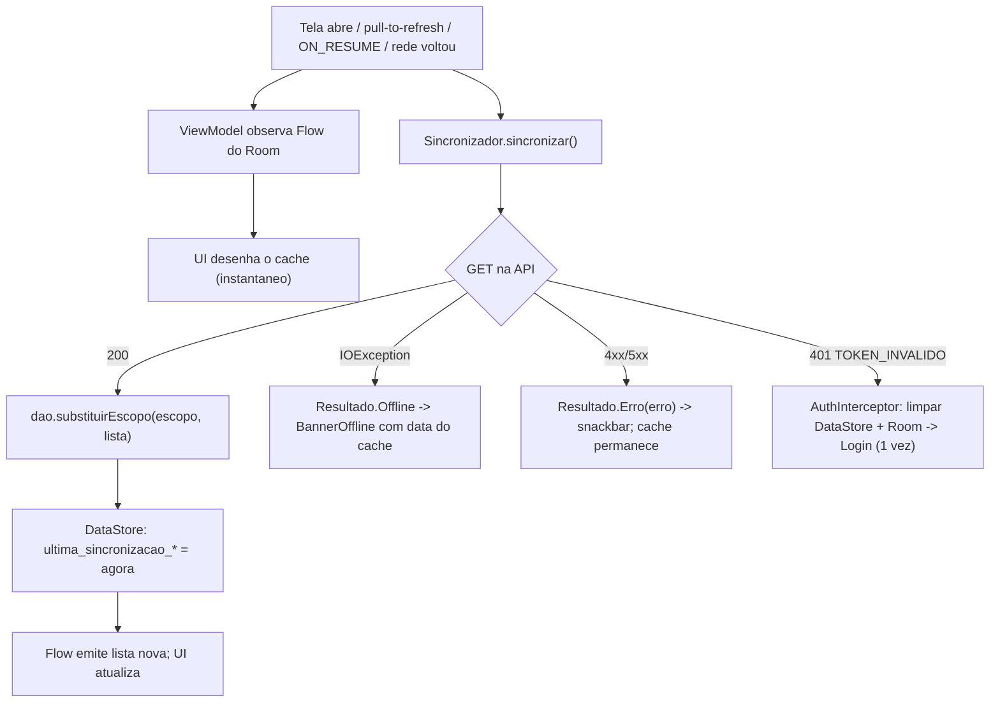

# 12. Persistência local e sincronização

Resumo: o app Android guarda sessão e preferências no DataStore, mantém um cache de leitura de quadras e reservas no Room (duas tabelas: `quadra_cache` com PK composta `id + escopo`, `reserva_cache` com PK simples `id`) e sincroniza com a regra "cache primeiro, rede depois, servidor vence"; toda escrita é feita somente online (RNF11), sem fila offline e sem WorkManager.

Rastreia o critério 4 da disciplina (persistência local com DataStore + Room, remota em PostgreSQL, sincronização) e os requisitos RF03, RF23, RNF03, RNF04, RNF08, RNF09, RNF11 e RNF12. A persistência remota (PostgreSQL) está em `docs/08-modelagem-banco.md`; as camadas do Android em `docs/09-arquitetura.md`; os endpoints citados em `docs/10-api-rest.md`.

Responsável: Integrante C (reserva_cache, `Sincronizador`, `MonitorConectividade`, `BannerOffline`) com Integrante B (quadra_cache) e Integrante A (`SessaoDataStore`). Semana prevista: S7 (12 a 16/10/2026), depois que os endpoints estão estáveis, para não retrabalhar o schema local (ver `docs/16-cronograma.md`).

## 12.1 Visão geral: dois mecanismos, papéis diferentes

| | DataStore (Preferences) | Room 3 |
|---|---|---|
| O que guarda | pares chave-valor: sessão (JWT), identidade do usuário logado, última localização, marcas de sincronização, preferências | dados estruturados em tabelas: `quadra_cache` e `reserva_cache` |
| Natureza | fonte primária no aparelho (a sessão só existe ali) | cache de leitura; a verdade é sempre o servidor (RNF11) |
| Quem lê | `Splash`, `AuthInterceptor`, `AppNavHost`, `Perfil`, `QuadrasViewModel` (distância) | ViewModels das telas de lista e detalhe, via `Flow` |
| Quem escreve | `AuthRepository` (login/cadastro/logout), `LocalizacaoProvider`, `Sincronizador`, `Perfil` | somente o `Sincronizador` e o write-through após escritas online |
| Sobrevive ao logout? | não: `clear()` (RF03) | não: `clearAllTables()` (RF03) |
| Migração de schema | não se aplica (chaves) | `fallbackToDestructiveMigration(true)`: cache é recriado |
| Biblioteca e versão | `androidx.datastore:datastore-preferences 1.2.1` | `androidx.room3:room3-runtime 3.0.2` + `room3-compiler` via KSP |
| Prioridade | Must Have (N1) — RF03 já é OBR-N1 | Must Have (N2) — RF23 |

Regra de decisão: se é um valor único, pequeno e ligado ao aparelho ou ao usuário logado, vai para o DataStore; se é uma lista de entidades que o servidor devolve e a tela precisa mostrar sem rede, vai para o Room; o que muda a cada segundo (slots), o que é segredo (senha) e o que o servidor sequer armazena (dados do pagador, RN05) não vai para lugar nenhum.

## 12.2 DataStore (Preferences): sessão e preferências

Arquivo: `android/app/src/main/java/br/com/somaisuma/app/data/local/SessaoDataStore.kt`. Um único arquivo de preferências chamado `sessao`.

Por que Preferences DataStore e não as alternativas:

- `SharedPreferences`: síncrono, sem `Flow`, sujeito a ANR e sem garantia transacional; o DataStore é a substituição oficial.
- Proto DataStore: exige plugin protobuf e arquivos `.proto`; para 11 chaves simples não compensa.
- `EncryptedSharedPreferences` (security-crypto): depreciada pelo Google; o token fica em texto claro dentro do sandbox do app (`/data/data/br.com.somaisuma.app`), inacessível a outros apps em aparelho não rooteado. Limitação registrada em RNF03: sem revogação de JWT no servidor, um token copiado de um aparelho rooteado vale até expirar (7 dias).

### Tabela de chaves

| Chave | Tipo | Padrão | Escrita por | Uso |
|---|---|---|---|---|
| `token_jwt` | String | ausente | `AuthRepository` (login, cadastro) | `Authorization: Bearer` no `AuthInterceptor` |
| `token_expira_em` | Long (epoch ms) | ausente | `AuthRepository` | `Splash`: se ausente ou `< agora + 5 min`, vai para `Login` sem chamar a API |
| `usuario_id` | Long | ausente | `AuthRepository` | monta `Sessao`; checagens locais de propriedade (esconder botões) |
| `usuario_nome` | String | ausente | `AuthRepository`, `Perfil` (após `PUT /usuarios/me`) | cabeçalho do `Perfil`, saudação |
| `usuario_perfil` | String (`CLIENTE`/`DONO`) | ausente | `AuthRepository` | escolhe o grafo e a bottom-nav em `AppNavHost` |
| `ultima_lat`, `ultima_lon` | Double | ausente | `LocalizacaoProvider` | distância antes de o GPS responder e em modo offline (ver `docs/13-recurso-nativo.md`) |
| `ultima_sincronizacao_quadras` | Long (epoch ms) | ausente | `Sincronizador` | `BannerOffline("dados de 10/10 19:32")` e tela `Perfil` |
| `ultima_sincronizacao_reservas` | Long (epoch ms) | ausente | `Sincronizador` | idem |
| `notificar_confirmacao` | Boolean | `true` | switch em `Perfil` | liga/desliga a notificação local de RF24 |
| `permissao_localizacao_pedida` | Boolean | `false` | `QuadrasScreen` | não repetir o card de permissão a cada abertura |
| `permissao_notificacao_pedida` | Boolean | `false` | `PagamentoScreen` | não repetir o pedido de `POST_NOTIFICATIONS` |

O que nunca entra no DataStore: senha (nem hash), e-mail e senha "lembrados", `client_secret`, certificado ou qualquer credencial do Inter (o app nunca fala com o Inter, ver `docs/11-integracao-pix-inter.md`), dados do pagador (RN05).

Logout (RF03): `SessaoDataStore.limpar()` executa `clear()` em todas as chaves, inclusive `ultima_lat/lon` e `permissao_*_pedida`, e em seguida `AppDatabase.clearAllTables()`. Trocar de usuário no mesmo aparelho começa do zero, sem vazar cache de um perfil para outro.

### Esboço de `SessaoDataStore.kt`

```kotlin
private val Context.dataStore by preferencesDataStore(name = "sessao")

class SessaoDataStore(private val ctx: Context) {
    companion object {
        val TOKEN_JWT = stringPreferencesKey("token_jwt")
        val TOKEN_EXPIRA_EM = longPreferencesKey("token_expira_em")
        val USUARIO_ID = longPreferencesKey("usuario_id")
        val USUARIO_NOME = stringPreferencesKey("usuario_nome")
        val USUARIO_PERFIL = stringPreferencesKey("usuario_perfil")
        val ULTIMA_LAT = doublePreferencesKey("ultima_lat")
        val ULTIMA_LON = doublePreferencesKey("ultima_lon")
        val ULTIMA_SINC_QUADRAS = longPreferencesKey("ultima_sincronizacao_quadras")
        val ULTIMA_SINC_RESERVAS = longPreferencesKey("ultima_sincronizacao_reservas")
        val NOTIFICAR_CONFIRMACAO = booleanPreferencesKey("notificar_confirmacao")
        val PERMISSAO_LOCALIZACAO_PEDIDA = booleanPreferencesKey("permissao_localizacao_pedida")
        val PERMISSAO_NOTIFICACAO_PEDIDA = booleanPreferencesKey("permissao_notificacao_pedida")
    }

    val sessao: Flow<Sessao?> = ctx.dataStore.data.map { p ->
        val token = p[TOKEN_JWT] ?: return@map null
        Sessao(token, p[TOKEN_EXPIRA_EM] ?: 0L, p[USUARIO_ID] ?: 0L,
               p[USUARIO_NOME].orEmpty(), PerfilUsuario.valueOf(p[USUARIO_PERFIL] ?: "CLIENTE"))
    }

    suspend fun tokenAtual(): String? = ctx.dataStore.data.first()[TOKEN_JWT]

    suspend fun salvarLogin(r: TokenResponse) = ctx.dataStore.edit { p ->
        p[TOKEN_JWT] = r.token; p[TOKEN_EXPIRA_EM] = r.expiraEm.toEpochMilli()
        p[USUARIO_ID] = r.usuario.id; p[USUARIO_NOME] = r.usuario.nome
        p[USUARIO_PERFIL] = r.usuario.perfil.name
    }

    suspend fun marcar(chave: Preferences.Key<Long>, instante: Long) =
        ctx.dataStore.edit { it[chave] = instante }

    suspend fun limpar() = ctx.dataStore.edit { it.clear() }   // RF03
}
```

## 12.3 Room 3: cache estruturado de leitura

Arquivos: `data/local/AppDatabase.kt`, `QuadraEntity.kt`, `ReservaEntity.kt`, `QuadraDao.kt`, `ReservaDao.kt`. Banco `somaisuma.db`, `exportSchema = false`, `fallbackToDestructiveMigration(true)`, `version = 1` na N2 (incrementado a cada mudança de coluna). Room 3.0.2 exige KSP (KAPT é proibido no projeto, ver `docs/09-arquitetura.md`), gera Kotlin e tem DAOs `suspend`/`Flow` nativos.

### Tabela `quadra_cache` (`QuadraEntity`)

| Coluna | Tipo Kotlin | Origem no JSON (`QuadraResponse`) | Observação |
|---|---|---|---|
| `id` | Long | `id` | parte da PK composta |
| `escopo` | String | definido pelo repositório | `CATALOGO` (de `GET /quadras`) ou `MINHAS` (de `GET /quadras/minhas`); parte da PK composta |
| `donoId` | Long | `donoId` | esconder botões do dono em telas compartilhadas |
| `nome` | String | `nome` | |
| `tipoEsporte` | String | `tipoEsporte` | valor do enum `TipoEsporte` como texto |
| `precoHora` | String | `precoHora` ("80.00") | string decimal, nunca `Double` para dinheiro |
| `descricao` | String? | `descricao` | |
| `logradouro`, `numero`, `bairro`, `cidade`, `uf` | String / String? | mesmos nomes | endereço embutido, igual ao servidor |
| `latitude`, `longitude` | Double? | `latitude`, `longitude` | nulos quando BrasilAPI e o dono não informaram (RF09); quadra sem coordenadas vai para o fim da lista ordenada por distância |
| `fotoUrl` | String? | `fotoUrl` | Coil (REC) tem cache de disco próprio; a imagem não entra no Room |
| `ativa` | Boolean | `ativa` | no escopo `MINHAS` aparecem inativas; no `CATALOGO` só ativas |
| `horariosJson` | String | `horariosFuncionamento[]` | as até 7 linhas de `HorarioFuncionamento` serializadas com kotlinx.serialization; evita uma terceira tabela e um join para 7 registros |
| `sincronizadoEm` | Long | `System.currentTimeMillis()` | diagnóstico |

### Tabela `reserva_cache` (`ReservaEntity`)

| Coluna | Tipo Kotlin | Origem no JSON (`ReservaResponse`) | Observação |
|---|---|---|---|
| `id` | Long | `id` | PK simples (ver "Por que `reserva_cache` não tem escopo") |
| `quadraId`, `quadraNome`, `quadraEndereco` | Long, String, String | `quadraId`, `quadraNome`, `quadraEndereco` | desnormalizado de propósito: a tela de reserva não depende de `quadra_cache` estar populada |
| `inicio`, `fim` | Long (epoch ms) | `inicio`, `fim` (ISO-8601 com offset) | exibidos sempre em `America/Sao_Paulo` (RNF12) por `Formatadores.kt` |
| `valor` | String | `valor` ("80.00") | |
| `status` | String | `status` | `StatusReserva` como texto; `ChipStatus` lê daqui |
| `observacao` | String? | `observacao` | |
| `pagamentoStatus` | String? | `pagamento.status` | `StatusPagamento`; nulo quando a cobrança falhou (reserva CANCELADA por SISTEMA, RN17) |
| `txid` | String? | `pagamento.txid` | mostrado em `DetalheReserva` como comprovante |
| `pixCopiaECola` | String? | `pagamento.pixCopiaECola` | permite reabrir o QR Code sem rede; é dado público de cobrança, permitido por RNF02 |
| `expiraEm` | Long? | `pagamento.expiraEm` | contador regressivo e decisão local "cobrança expirada" mesmo offline |
| `clienteNome`, `clienteTelefone` | String? | `clienteNome`, `clienteTelefone` | só chegam para o DONO; nulos para o CLIENTE |
| `canceladoPor`, `motivoCancelamento` | String? | mesmos nomes | exibidos no detalhe de reserva cancelada |
| `sincronizadoEm` | Long | `System.currentTimeMillis()` | diagnóstico |

Por que `pixCopiaECola` e `expiraEm` ficam no cache: o cenário real é o cliente criar a reserva, receber o QR, trocar para o app do banco e voltar com Wi-Fi instável ou dados desligados. Com as duas colunas, `DetalheReserva` mostra "Pagar agora" e `Pagamento` renderiza o QR do cache (`QrCodeGerador` é local, ZXing core 3.5.4) e o contador regressivo, sem nenhuma chamada. Se `expiraEm < agora`, o app mostra "Cobrança expirada" localmente; ao voltar a rede, a sincronização confirma o status EXPIRADA vindo do servidor (RN10). Nenhum dado do pagador é envolvido (RN05).

### Por que a PK de `quadra_cache` é composta `(id, escopo)`

Um DONO vê o catálogo público (`CATALOGO`) e as próprias quadras (`MINHAS`), inclusive inativas. A mesma quadra pode existir nos dois escopos. Com PK simples `id`, a operação "substituir o catálogo" apagaria e reescreveria a linha e a quadra sumiria de `MinhasQuadras` até a próxima sincronização daquele escopo (bug apontado na revisão das propostas). Com PK `(id, escopo)`, cada escopo é uma partição independente: substituir `CATALOGO` nunca toca `MINHAS`.

### Por que `reserva_cache` não tem escopo

Em reservas o mesmo registro nunca aparece em dois conjuntos: cada usuário tem um único perfil (RN20), então ou o app guarda as reservas que o CLIENTE fez, ou as reservas que o DONO recebeu — nunca as duas. A coluna de escopo só seria populada com um valor por vez, e a chave composta cobraria uma coluna e uma condição em toda consulta sem impedir nenhum bug. Por isso `reserva_cache` usa PK simples `id` e a sincronização substitui a tabela inteira. A troca de usuário no mesmo aparelho já é coberta pelo `clearAllTables()` do logout (RF03), que apaga tudo antes de qualquer login novo.

### O que NÃO vai para o Room e por quê

| Dado | Onde fica | Motivo |
|---|---|---|
| Slots (`GET /quadras/{id}/slots?data=`) | memória do `DetalheQuadraViewModel`, descartado ao sair da tela | voláteis: um slot `LIVRE` de 5 minutos atrás pode já estar `OCUPADO`; mostrar cache induz o cliente a tentar reservar e receber 409 (RN08). A verdade do slot é o servidor; offline a grade mostra "Conecte-se para ver horários" |
| Token JWT, id, nome, perfil | DataStore | valor único por aparelho, lido no `Splash` antes de qualquer banco (RNF03) |
| Senha | nenhum lugar | RNF01/RNF03 |
| Dados do pagador (CPF, nome, banco) | nenhum lugar, nem no servidor | RN05, RNF02 |
| Outros usuários | nenhum lugar | o app só conhece o usuário logado; nome/telefone do cliente para o dono chega dentro da reserva |
| Respostas de CEP | não são cacheadas no app | o resultado vai para os campos do `FormQuadra` e é salvo na quadra pelo servidor (RF09) |
| Fotos | cache de disco do Coil (REC) | biblioteca já resolve |
| Fila de escritas pendentes | não existe | ver 12.4, RNF11 |

### Esboço das entidades e DAOs

```kotlin
@Entity(tableName = "quadra_cache", primaryKeys = ["id", "escopo"])
data class QuadraEntity(
    val id: Long,
    val escopo: String,            // CATALOGO | MINHAS
    val donoId: Long,
    val nome: String,
    val tipoEsporte: String,
    val precoHora: String,         // "80.00"
    val descricao: String?,
    val logradouro: String, val numero: String, val bairro: String?,
    val cidade: String, val uf: String,
    val latitude: Double?, val longitude: Double?,
    val fotoUrl: String?,
    val ativa: Boolean,
    val horariosJson: String,      // List<HorarioFuncionamento> serializada
    val sincronizadoEm: Long,
)

@Entity(tableName = "reserva_cache")
data class ReservaEntity(
    @PrimaryKey val id: Long,      // PK simples: um usuario, um perfil (RN20)
    val quadraId: Long, val quadraNome: String, val quadraEndereco: String,
    val inicio: Long, val fim: Long,            // epoch ms
    val valor: String,
    val status: String,                          // StatusReserva
    val observacao: String?,
    val pagamentoStatus: String?, val txid: String?,
    val pixCopiaECola: String?, val expiraEm: Long?,
    val clienteNome: String?, val clienteTelefone: String?,
    val canceladoPor: String?, val motivoCancelamento: String?,
    val sincronizadoEm: Long,
)

@Dao
interface QuadraDao {
    @Query("SELECT * FROM quadra_cache WHERE escopo = :escopo ORDER BY nome")
    fun observarPorEscopo(escopo: String): Flow<List<QuadraEntity>>

    @Query("SELECT * FROM quadra_cache WHERE id = :id LIMIT 1")
    fun observarPorId(id: Long): Flow<QuadraEntity?>

    @Query("DELETE FROM quadra_cache WHERE escopo = :escopo")
    suspend fun apagarEscopo(escopo: String)

    @Insert(onConflict = OnConflictStrategy.REPLACE)
    suspend fun inserirTodas(lista: List<QuadraEntity>)

    @Transaction
    suspend fun substituirEscopo(escopo: String, lista: List<QuadraEntity>) {
        apagarEscopo(escopo); inserirTodas(lista)
    }
}

@Database(entities = [QuadraEntity::class, ReservaEntity::class], version = 1, exportSchema = false)
abstract class AppDatabase : RoomDatabase() {
    abstract fun quadraDao(): QuadraDao
    abstract fun reservaDao(): ReservaDao
}
```

`ReservaDao` segue o mesmo desenho, sem escopo: `observarTodas()`, `observarPorId(id)`, `substituirTudo(lista)` (`DELETE FROM reserva_cache` + `INSERT` dentro de `@Transaction`) e `atualizarStatus(id, status, pagamentoStatus)`, usado pelo polling do pagamento. Construção em `AppContainer`: `Room.databaseBuilder(ctx, AppDatabase::class.java, "somaisuma.db").fallbackToDestructiveMigration(true).build()`.

## 12.4 Estratégia de sincronização: "cache primeiro, rede depois, servidor vence"

Arquivo: `data/repository/Sincronizador.kt` (~30 linhas), usado por `QuadraRepository` e `ReservaRepository`.

Versão textual:

1. A tela observa o `Flow` do Room e desenha imediatamente o que existe no cache (abertura instantânea, RNF04).
2. Em paralelo, o ViewModel dispara `sincronizar()`: chama a API, grava a resposta no Room substituindo o escopo inteiro, marca `ultima_sincronizacao_*` no DataStore.
3. O `Flow` emite a lista nova e a tela se atualiza sozinha. Linhas que o servidor não devolveu mais são apagadas: o servidor vence, sempre.
4. Se a rede falhou (`IOException`), o resultado é `Resultado.Offline`: o cache continua na tela e `BannerOffline` aparece com a data da última sincronização. Se a API respondeu erro HTTP, `Resultado.Erro(erro)` (com o `ErroApi` montado pelo `ProblemDetailParser`) vai para snackbar/`ErroBox` e o cache também continua.
5. Escritas (`POST/PUT/PATCH/DELETE`) só acontecem online. Sucesso grava a resposta no Room (write-through) e dispara nova sincronização da lista; falha nunca toca o cache.



### Quando sincroniza

| Gatilho | Onde | Escopo sincronizado |
|---|---|---|
| `init` do ViewModel | `QuadrasViewModel`, `MinhasQuadrasViewModel`, `MinhasReservasViewModel`, `ReservasQuadraViewModel` | o escopo da tela |
| Pull-to-refresh | mesmas telas de lista (`PullToRefreshBox` do Material 3) | o escopo da tela |
| `ON_RESUME` | `LifecycleResumeEffect` na Screen chama `viewModel.sincronizar()` | o escopo da tela; cobre "voltei do app do banco" |
| Volta da rede | `MonitorConectividade` (`ConnectivityManager.NetworkCallback` exposto como `Flow<Boolean>`); transição `false -> true` | o escopo da tela ativa |
| Após escrita online bem-sucedida | `QuadraRepository`/`ReservaRepository` (write-through + re-sync da lista) | o escopo afetado |
| Polling do pagamento (`GET /reservas/{id}/pagamento`) | `PagamentoViewModel`, a cada 5 s por 2 min e depois 10 s, só com a tela visível (`repeatOnLifecycle(STARTED)`) | atualiza a linha da reserva em `reserva_cache` ao chegar `PAGO` |

Em `quadra_cache` "o escopo da tela" é `CATALOGO` ou `MINHAS`; em `reserva_cache`, que não tem coluna de escopo, é a tabela inteira.

Não há sincronização periódica em segundo plano: sem WorkManager, sem `AlarmManager`, sem serviço. Motivo: nada no domínio precisa estar atualizado com o app fechado; a próxima abertura sincroniza em menos de 2 s (RNF04).

### Substituição por escopo, não merge

O app nunca edita dado localmente, então não existem duas versões do mesmo registro para conciliar. Em `quadra_cache`, `substituirEscopo` é `DELETE WHERE escopo = ?` seguido de `INSERT` dentro de uma transação (`@Transaction` no DAO; `withWriteTransaction` do Room 3 é equivalente); em `reserva_cache`, `substituirTudo` é o mesmo par sem o `WHERE`. Uma reserva cancelada por outro caminho, uma quadra desativada pelo dono ou uma reserva expirada pelo `ExpiracaoReservaJob` simplesmente deixam de vir na resposta ou vêm com o status novo, e o cache reflete isso na próxima sincronização. Sem `updatedAt`, sem tombstones, sem resolução de conflito.

Decisões de contorno que mantêm a substituição simples:

- `GET /quadras` é chamado pelo app sem `esporte`/`cidade`; o filtro de RF07 é aplicado localmente no `QuadrasViewModel` sobre o `Flow`. Assim o escopo `CATALOGO` é sempre o catálogo completo, o filtro funciona offline e as listas são pequenas (sem paginação, ver `docs/10-api-rest.md`). Os parâmetros continuam existindo na API para Swagger e clientes futuros.
- CLIENTE: `MinhasReservas` sincroniza `?situacao=PROXIMAS` e `?situacao=HISTORICO` (duas chamadas, listas concatenadas) e substitui `reserva_cache` de uma vez; as abas são separadas localmente por `inicio` e `status`.
- DONO: `reserva_cache` é populado por `GET /reservas?situacao=PROXIMAS` (todas as quadras do dono). `ReservasQuadra(quadraId)` filtra localmente por quadra e data. Como a janela de reserva é de no máximo hoje+14 (RN09), "próximas" cobre todas as datas do seletor. Datas passadas usam `GET /quadras/{id}/reservas?data=` somente online, sem cache.

### Escritas somente online (RNF11) e por que não há fila offline nem WorkManager

| Escrita | Por que não pode ser adiada |
|---|---|
| `POST /reservas` | exclusividade do slot é decidida pelo índice único no servidor (RN08); uma reserva "enfileirada" poderia ser aceita horas depois num slot já ocupado, ou pior, criar cobrança Pix com 15 min de validade (RN10) para um usuário que já não está olhando |
| `POST /reservas/{id}/cancelar` | prazo de cancelamento é relativo ao início (RN13); uma fila poderia executar fora do prazo |
| `POST/PUT/DELETE` de quadra e horários | 409 `QUADRA_COM_RESERVAS`/`HORARIO_COM_RESERVAS` (RN16) depende do estado atual do servidor |
| `PUT /usuarios/me`, `PATCH /reservas/{id}` | baratas e raras; não justificam infraestrutura |

Uma fila offline (outbox + WorkManager + retries + resolução de conflito) adicionaria quatro componentes, testes de idempotência do lado do servidor e uma classe de bugs que a banca com certeza perguntaria, para atender um caso que o domínio proíbe. Em modo offline os botões de escrita ficam desabilitados com texto explicativo ("Conecte-se para reservar"), o que também atende RNF06 (estado de erro claro). Frase para a banca: "cliente fino: cache para abrir rápido e consultar sem rede; toda escrita é online porque reserva e pagamento exigem consistência forte no servidor".

### Tratamento de 401 e de ausência de rede

| Situação | Detecção | Comportamento |
|---|---|---|
| Sem rede / servidor inacessível | `IOException` no OkHttp (`UnknownHostException`, `SocketTimeoutException`, `ConnectException`) | `Resultado.Offline`; `BannerOffline` com "Sem conexão. Mostrando dados de 10/10 19:32"; escritas desabilitadas; nenhum retry automático (o pull-to-refresh e a volta da rede já cobrem) |
| 401 `TOKEN_INVALIDO` em rota protegida (token expirado ou segredo trocado) | `AuthInterceptor` espia o corpo com `peekBody(8_192)` e lê o `codigo` do `ProblemDetail` | `SessaoDataStore.limpar()` + `clearAllTables()` + emite `SessaoExpirada` em um `SharedFlow` uma única vez (flag até o próximo login); `AppNavHost` navega para `Login` com `popUpTo(0)`; sem retry no interceptor, portanto sem loop, mesmo com o polling do pagamento ativo |
| 401 `CREDENCIAL_INVALIDA` em `/auth/login` | mesmo interceptor, rota excluída | tratado na tela de Login ("E-mail ou senha inválidos"); não limpa nada |
| Token prestes a expirar | `Splash` compara `token_expira_em` com `agora + 5 min` | vai direto para `Login` sem chamar a API; evita o 401 no meio de uma tela |
| 403, 404, 409, 422, 502 | `ProblemDetailParser` | `Resultado.Erro(erro)` com `ErroApi(status, codigo, subcodigo, detail, campos)`; a tela decide a mensagem (ver `docs/04-telas.md`); cache intacto |

O interceptor nunca chama `response.body.string()`: isso esgotaria o fluxo de dados e o `ProblemDetailParser` receberia corpo vazio, perdendo `codigo`, `subcodigo`, `campos[]` e o id da reserva pendente de que a navegação depende. A leitura é por espiada — `peekBody(8_192)` copia no máximo 8 KB para um buffer novo e devolve a resposta intacta para o Retrofit (código em `docs/09-arquitetura.md` §5).

### Esboço de `Sincronizador.kt` e uso no repositório

O tipo `Resultado<T>` (`model/Resultado.kt`, com `Ok(valor)`, `Erro(erro)` e `Offline`) é declarado uma única vez, em `docs/09-arquitetura.md` §5; aqui só aparece o uso.

```kotlin
class Sincronizador(private val sessao: SessaoDataStore) {
    suspend fun <T> sincronizar(
        buscarRemoto: suspend () -> List<T>,
        gravarLocal: suspend (List<T>) -> Unit,
        marca: Preferences.Key<Long>,
    ): Resultado<Unit> = try {
        gravarLocal(buscarRemoto())                       // substitui o escopo inteiro
        sessao.marcar(marca, System.currentTimeMillis())  // "dados de 10/10 19:32"
        Resultado.Ok(Unit)
    } catch (e: IOException) {
        Resultado.Offline                                 // cache permanece na tela
    } catch (e: HttpException) {
        Resultado.Erro(ProblemDetailParser.parse(e))
    }
}

class QuadraRepository(
    private val api: ApiService, private val dao: QuadraDao, private val sync: Sincronizador,
) {
    fun observarCatalogo(): Flow<List<Quadra>> =
        dao.observarPorEscopo("CATALOGO").map { it.map(QuadraEntity::paraModelo) }

    suspend fun sincronizarCatalogo(): Resultado<Unit> = sync.sincronizar(
        buscarRemoto = { api.listarQuadras() },
        gravarLocal = { dao.substituirEscopo("CATALOGO", it.map { q -> q.paraEntity("CATALOGO") }) },
        marca = SessaoDataStore.ULTIMA_SINC_QUADRAS,
    )

    suspend fun criar(req: QuadraRequest): Resultado<Quadra> = try {
        val criada = api.criarQuadra(req)                  // somente online (RNF11)
        dao.inserirTodas(listOf(criada.paraEntity("MINHAS")))  // write-through
        Resultado.Ok(criada.paraModelo())
    } catch (e: IOException) { Resultado.Offline }
      catch (e: HttpException) { Resultado.Erro(ProblemDetailParser.parse(e)) }
}
```

## 12.5 Versionamento do schema local e contrato aditivo

- `fallbackToDestructiveMigration(true)`: quando `version` sobe, o Room apaga e recria as tabelas. Como as duas tabelas são cache puro, o custo é uma sincronização a mais na próxima abertura; nenhum dado do usuário se perde (a sessão está no DataStore). Nenhuma `Migration` é escrita e `exportSchema = false` evita arquivos JSON de schema no repositório. Risco R18 em `docs/19-riscos.md`.
- Regra de bump: qualquer alteração em `QuadraEntity`/`ReservaEntity` exige incrementar `version` no mesmo PR (checklist de revisão em `docs/21-git-e-organizacao.md`). Esquecer o bump derruba o app com `IllegalStateException` na abertura, o que o revisor detecta ao rodar.
- Contrato aditivo da API após a N1 (RNF09, risco R17): campos de resposta só são adicionados, nunca removidos ou renomeados. No app, o `Json` do kotlinx.serialization é configurado com `ignoreUnknownKeys = true` e campos novos são declarados com valor padrão (`val fotoUrl: String? = null`), então o APK instalado nos celulares dos testes com usuários (09 a 13/11) continua funcionando com um backend mais novo. Não há cabeçalho de versão do app nem filtro correspondente no servidor: a semana de testes é com poucas pessoas e os aparelhos são instalados pelo próprio grupo, então a versão instalada é conferida direto no aparelho quando necessário.
- Enums recebidos como texto (`status`, `tipoEsporte`) são convertidos com `runCatching { enumValueOf() }`; valor desconhecido cai em um estado "OUTRO" exibido de forma neutra, em vez de derrubar o app.

## 12.6 O que o avaliador vê em modo avião

Pré-condição: o usuário abriu o app online ao menos uma vez (cache populado).

| Tela | Com cache, sem rede | Ações |
|---|---|---|
| Splash | lê o DataStore; sessão válida entra direto na home do perfil, sem chamar a API | — |
| Login / Cadastro | formulário normal; ao enviar, snackbar "Sem conexão" | login e cadastro exigem rede |
| Quadras | lista do escopo `CATALOGO`, distância calculada com `ultima_lat/lon`, filtro por esporte local, `BannerOffline` com data | abrir detalhe funciona; pull-to-refresh devolve `Offline` e mantém a lista |
| DetalheQuadra | dados, endereço, horários de funcionamento (de `horariosJson`), distância e "Abrir no Maps" (o app de mapas pode ter cache próprio) | grade de slots substituída por "Conecte-se para ver horários"; botão de reservar ausente |
| ConfirmarReserva | não é alcançável sem slots | — |
| Pagamento | QR Code gerado do `pixCopiaECola` em cache, valor e contador de `expiraEm`; status "Aguardando conexão" | "Copiar código" funciona; "Já paguei" desabilitado |
| MinhasReservas | abas Próximas/Histórico de `reserva_cache` com `ChipStatus`; banner | "Pagar" abre o QR do cache; cancelar desabilitado |
| DetalheReserva | dados, status, observação, txid e status do pagamento | editar observação e cancelar desabilitados com texto "Conecte-se para alterar" |
| Perfil | nome, e-mail, telefone, perfil e "Última sincronização: 10/10 19:32" do DataStore | salvar desabilitado; "Sair" funciona e limpa tudo |
| MinhasQuadras | quadras do escopo `MINHAS`, inclusive inativas; banner | FAB e "Desativar" desabilitados; "Horários" abre a leitura |
| FormQuadra | abre para leitura dos campos se veio de uma quadra em cache | "Buscar CEP" e "Salvar" desabilitados |
| HorariosQuadra | 7 linhas de `horariosJson` | switches e TimePickers desabilitados |
| ReservasQuadra | reservas de `reserva_cache` filtradas por data, com nome/telefone do cliente | cancelar desabilitado |

Sem cache (primeiro uso offline): `VazioBox` com "Conecte-se para carregar as quadras" e botão "Tentar novamente".

## 12.7 Testes

| Teste | Tipo | O que prova | Prioridade |
|---|---|---|---|
| `SincronizadorTest` | unitário (JVM, fakes) | `IOException` -> `Offline` sem gravar; `HttpException` 500 -> `Erro(erro)`; sucesso grava e marca `ultima_sincronizacao_*` | Must Have (N2) |
| `QuadrasViewModelTest` | unitário (JVM, `FakeApiService` + DAO fake) | tela mostra cache antes da rede; filtro local por esporte; `BannerOffline` quando `Offline` | Must Have (N2) |
| `QuadraDaoTest` | instrumentado (`androidTest`, Room in-memory) | `substituirEscopo("CATALOGO")` não apaga linhas `MINHAS`; PK composta aceita o mesmo `id` nos dois escopos | Should Have |
| `PagamentoViewModelTest` | unitário | ao receber `PAGO`, atualiza a linha em `reserva_cache` e para o polling | Must Have (N2) |
| Roteiro manual (modo avião) | `docs/23-plano-de-testes.md`, casos de teste de RF23 | tabela 12.6, tela a tela | Must Have (N2) |

## 12.8 Como demonstrar na apresentação (cerca de 1 minuto)

1. Online: abrir `Quadras`, fazer pull-to-refresh, abrir `MinhasReservas` (popula os dois caches).
2. Ativar o modo avião pelo painel rápido, à vista da banca.
3. Fechar o app pelo gerenciador de apps e reabrir: `Splash` entra sem rede, `Quadras` aparece instantaneamente com distância e `BannerOffline` "dados de 07/12 14:03".
4. Abrir `DetalheQuadra`: dados e horários do cache; grade de slots mostra "Conecte-se para ver horários".
5. `MinhasReservas` -> reserva pendente -> "Pagar": o QR Code aparece a partir do `pixCopiaECola` em cache.
6. Desligar o modo avião: `MonitorConectividade` dispara a sincronização, o banner some e a lista se atualiza sozinha.
7. Opcional (30 s): no Android Studio, App Inspection > Database Inspector mostrando `quadra_cache` com a coluna `escopo` e `reserva_cache` com `pixCopiaECola`; depois "Sair" no `Perfil` e as tabelas vazias.

Quem defende: Integrante C ("servidor vence", offline) com apoio de B (`quadra_cache`) e A (`SessaoDataStore`).

## 12.9 Rastreabilidade

| Critério / requisito | Evidência neste tema |
|---|---|
| Critério 4a: persistência local (DataStore + Room) | `SessaoDataStore.kt`, `AppDatabase.kt`, `QuadraEntity`, `ReservaEntity`, demo em modo avião |
| Critério 4b: persistência remota (PostgreSQL) | `docs/08-modelagem-banco.md`; este cache espelha `quadra`, `horario_funcionamento`, `reserva` e `pagamento` |
| Critério 4c: sincronização | `Sincronizador.kt`, `MonitorConectividade`, `ultima_sincronizacao_*`, `BannerOffline` |
| RF03 | `limpar()` + `clearAllTables()` no logout |
| RF23 | seções 12.3 a 12.6 |
| RNF03 | token só no DataStore; senha nunca salva; limitação de revogação documentada |
| RNF04 | abertura instantânea pelo `Flow` do Room; polling 5 s com backoff para 10 s |
| RNF08 | app funciona sem GMS e sem localização: `ultima_lat/lon` opcionais |
| RNF09 | contrato aditivo, `ignoreUnknownKeys`, campos novos com valor padrão |
| RNF11 | escritas somente online; substituição por escopo; servidor vence |
| RNF12 | `inicio`/`fim` em epoch ms exibidos em `America/Sao_Paulo` |
