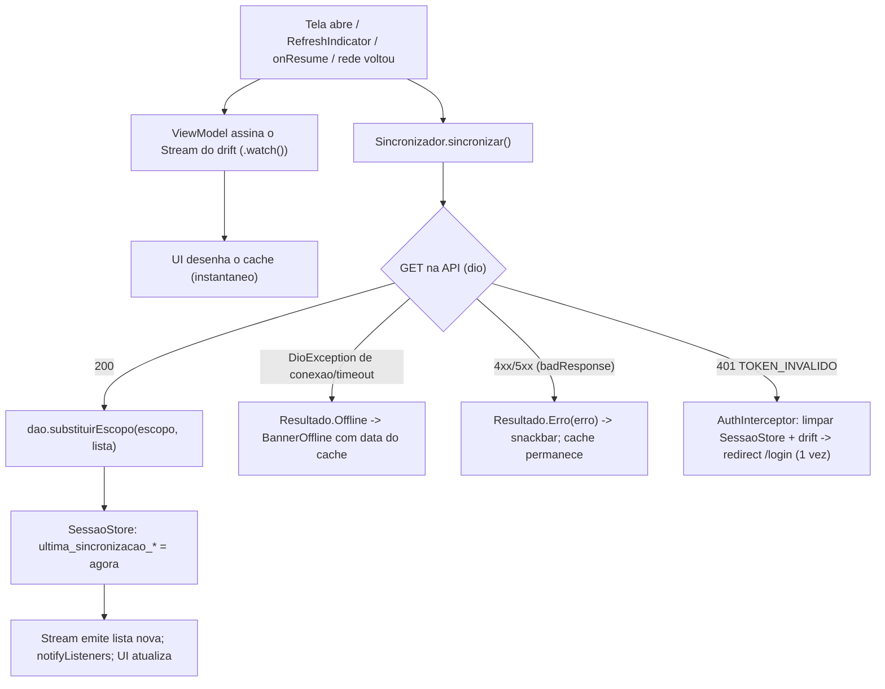

# 12. Persistência local e sincronização

Resumo: o app Flutter guarda sessão e preferências no `SessaoStore` (token JWT no flutter_secure_storage, demais chaves no shared_preferences), mantém um cache de leitura de quadras e reservas no drift (SQLite; duas tabelas: `quadra_cache` com PK composta `id + escopo`, `reserva_cache` com PK simples `id`) e sincroniza com a regra "cache primeiro, rede depois, servidor vence"; toda escrita é feita somente online (RNF11), sem fila offline e sem tarefa em segundo plano.

Rastreia o critério 4 da disciplina (persistência local com `SessaoStore` + drift, remota em PostgreSQL, sincronização) e os requisitos RF03, RF23, RNF03, RNF04, RNF08, RNF09, RNF11 e RNF12. A persistência remota (PostgreSQL) está em `docs/08-modelagem-banco.md`; as camadas do app em `docs/09-arquitetura.md`; os endpoints citados em `docs/10-api-rest.md`.

Responsável: Integrante C (reserva_cache, `Sincronizador`, `MonitorConectividade`, `BannerOffline`) com Integrante B (quadra_cache) e Integrante A (`SessaoStore`). Semana prevista: S7 (12 a 16/10/2026), depois que os endpoints estão estáveis, para não retrabalhar o schema local (ver `docs/16-cronograma.md`).

Atualizado em 06/10/2026: app passou de Android nativo (Kotlin + Compose) para Flutter. O que guardar, onde guardar e a regra de sincronização não mudaram; mudaram as bibliotecas (DataStore -> `SessaoStore`, Room -> drift) e o token passou a ficar cifrado.

## 12.1 Visão geral: dois mecanismos, papéis diferentes

| | `SessaoStore` (flutter_secure_storage + shared_preferences) | drift |
|---|---|---|
| O que guarda | pares chave-valor: sessão (JWT), identidade do usuário logado, última localização, marcas de sincronização, preferências | dados estruturados em tabelas: `quadra_cache` e `reserva_cache` |
| Natureza | fonte primária no aparelho (a sessão só existe ali) | cache de leitura; a verdade é sempre o servidor (RNF11) |
| Quem lê | `Splash`, `AuthInterceptor`, `GoRouter` (`redirect` via `refreshListenable`), `Perfil`, `QuadrasViewModel` (distância) | ViewModels das telas de lista e detalhe, via `Stream` (`.watch()`) |
| Quem escreve | `AuthRepository` (login/cadastro/logout), `LocalizacaoService`, `Sincronizador`, `Perfil` | somente o `Sincronizador` e o write-through após escritas online |
| Sobrevive ao logout? | não: `limpar()` (RF03) | não: `AppDatabase.limparTudo()` (RF03) |
| Migração de schema | não se aplica (chaves) | `schemaVersion` + `onUpgrade` destrutivo: cache é recriado |
| Biblioteca e versão | `flutter_secure_storage 11.2.0` (só `token_jwt`) + `shared_preferences 2.5.6` (API `SharedPreferencesAsync`) | `drift 2.35.1` + `drift_flutter 0.3.1` (SQLite nativo incluído), código gerado por `drift_dev 2.35.1` + `build_runner 2.16.1` |
| Prioridade | Must Have (N1) — RF03 já é OBR-N1 | Must Have (N2) — RF23 |

Regra de decisão: se é um valor único, pequeno e ligado ao aparelho ou ao usuário logado, vai para o `SessaoStore`; se é uma lista de entidades que o servidor devolve e a tela precisa mostrar sem rede, vai para o drift; o que muda a cada segundo (slots), o que é segredo (senha) e o que o servidor sequer armazena (dados do pagador, RN05) não vai para lugar nenhum.

## 12.2 `SessaoStore`: sessão e preferências

Arquivo: `frontend/lib/data/local/sessao_store.dart`. Classe `SessaoStore extends ChangeNotifier`, criada e carregada (`carregar()`) no `main()` antes do `runApp` e registrada em `lib/config/dependencias.dart`. O `GoRouter` a usa como `refreshListenable`: gravar ou limpar a sessão reavalia o `redirect` sem evento extra. Dois armazenamentos atrás de uma única classe:

- `token_jwt` no flutter_secure_storage (cifrado com chave do Android Keystore);
- as outras 11 chaves no shared_preferences, pela API `SharedPreferencesAsync` (toda leitura e escrita é `Future`, sem cache síncrono em memória).

Por que esse desenho e não as alternativas do Flutter:

- Só shared_preferences: seria o mais simples (um pacote, chaves tipadas `int`/`double`/`bool`/`String`, API assíncrona; no Android o `SharedPreferencesAsync` grava por padrão no DataStore Preferences, o mesmo mecanismo recomendado pela plataforma). Mas o token ficaria em texto claro no sandbox do app, exatamente a limitação que a versão anterior registrava em RNF03. Separar só o token custa uma dependência e três chamadas (`write`, `read`, `deleteAll`).
- Tudo no flutter_secure_storage: a API só guarda `String` (números e booleanos convertidos à mão), cada leitura passa pela decifragem e o único segredo é o token; as demais chaves não ganham nada com criptografia.
- Hive ou Isar: bancos NoSQL embutidos e rápidos, mas os pacotes originais estão sem manutenção ativa (sobrevivem em forks da comunidade) e seriam um terceiro mecanismo de armazenamento ao lado do drift. A caixa cifrada do Hive ainda precisaria guardar a chave de criptografia em lugar seguro, ou seja, no próprio flutter_secure_storage.
- sqflite puro (tabela `chave/valor` no SQLite): SQL e conversão de tipos escritos à mão para 11 chaves, e a sessão precisa estar disponível no `main()`, antes da primeira tela, sem depender de abrir ou migrar banco. Também não protege o token.

Onde o token fica agora (RNF03): o flutter_secure_storage 11.2.0 cifra o valor com AES-GCM usando uma chave protegida pelo Android Keystore e grava só o texto cifrado no sandbox do app (`/data/data/br.com.somaisuma.app`), inacessível a outros apps em aparelho não rooteado. A chave não sai do Keystore (em hardware, quando o aparelho oferece), então copiar os arquivos do app, mesmo de um aparelho rooteado, já não entrega o JWT: isso melhora a limitação registrada em RNF03. Não resolve a falta de revogação: com root, código rodando como o app ainda consegue pedir ao Keystore que decifre, e um token obtido assim (ou da memória do processo) vale até expirar (7 dias), porque o servidor não revoga JWT. A limitação de RNF03 passa a ser só essa.

Cuidado de configuração: `android:allowBackup="false"` no `frontend/android/app/src/main/AndroidManifest.xml`. O backup automático do Android restauraria o texto cifrado em outro aparelho sem a chave do Keystore, e a leitura falharia (`InvalidKeyException`, alerta do README do pacote). Se mesmo assim a leitura do token lançar exceção, `carregar()` trata como sessão ausente e chama `limpar()`: o usuário cai no Login, sem travar o app. Trocar de celular, portanto, sempre pede login de novo.

### Tabela de chaves

| Chave | Tipo | Padrão | Escrita por | Uso |
|---|---|---|---|---|
| `token_jwt` | String (flutter_secure_storage, Android Keystore) | ausente | `AuthRepository` (login, cadastro) | `Authorization: Bearer` no `AuthInterceptor` |
| `token_expira_em` | int (epoch ms) | ausente | `AuthRepository` | `redirect` da `Splash`: se ausente ou `< agora + 5 min`, vai para `/login` sem chamar a API |
| `usuario_id` | int | ausente | `AuthRepository` | monta `Sessao`; checagens locais de propriedade (esconder botões) |
| `usuario_nome` | String | ausente | `AuthRepository`, `Perfil` (após `PUT /usuarios/me`) | cabeçalho do `Perfil`, saudação |
| `usuario_perfil` | String (`CLIENTE`/`DONO`) | ausente | `AuthRepository` | o `redirect` do `GoRouter` escolhe o `StatefulShellRoute` (e a bottom-nav) do perfil |
| `ultima_lat`, `ultima_lon` | double | ausente | `LocalizacaoService` | distância antes de o GPS responder e em modo offline (ver `docs/13-recurso-nativo.md`) |
| `ultima_sincronizacao_quadras` | int (epoch ms) | ausente | `Sincronizador` | `BannerOffline("dados de 10/10 19:32")` e tela `Perfil` |
| `ultima_sincronizacao_reservas` | int (epoch ms) | ausente | `Sincronizador` | idem |
| `notificar_confirmacao` | bool | `true` | switch em `Perfil` | liga/desliga a notificação local de RF24 |
| `permissao_localizacao_pedida` | bool | `false` | `LocalizacaoService` (card em `QuadrasScreen`) | não repetir o card de permissão a cada abertura |
| `permissao_notificacao_pedida` | bool | `false` | `PagamentoViewModel` (card em `PagamentoScreen`) | não repetir o pedido de `POST_NOTIFICATIONS` |

O que nunca entra no `SessaoStore`: senha (nem hash), e-mail e senha "lembrados", `client_secret`, certificado ou qualquer credencial do Inter (o app nunca fala com o Inter, ver `docs/11-integracao-pix-inter.md`), dados do pagador (RN05).

Logout (RF03): `SessaoStore.limpar()` executa `deleteAll()` no flutter_secure_storage e `clear()` no shared_preferences, apagando todas as chaves, inclusive `ultima_lat/lon` e `permissao_*_pedida`, e em seguida `AppDatabase.limparTudo()`. Trocar de usuário no mesmo aparelho começa do zero, sem vazar cache de um perfil para outro.

As gravações nos dois armazenamentos não são atômicas entre si (na versão nativa a gravação do login era uma única transação). Por isso o token é gravado primeiro e `carregar()` só reconhece sessão quando existem `token_jwt` e `usuario_id`; se o app morrer no meio do login, o pior caso é cair no Login de novo.

### Esboço de `sessao_store.dart`

```dart
class SessaoStore extends ChangeNotifier {
  SessaoStore({FlutterSecureStorage? seguro, SharedPreferencesAsync? prefs})
      : _seguro = seguro ?? const FlutterSecureStorage(), // token: Android Keystore
        _prefs = prefs ?? SharedPreferencesAsync();       // demais chaves

  static const tokenJwt = 'token_jwt';
  static const tokenExpiraEm = 'token_expira_em';
  static const usuarioId = 'usuario_id';
  static const usuarioNome = 'usuario_nome';
  static const usuarioPerfil = 'usuario_perfil';
  static const ultimaLat = 'ultima_lat';
  static const ultimaLon = 'ultima_lon';
  static const ultimaSincQuadras = 'ultima_sincronizacao_quadras';
  static const ultimaSincReservas = 'ultima_sincronizacao_reservas';
  static const notificarConfirmacao = 'notificar_confirmacao';
  static const permissaoLocalizacaoPedida = 'permissao_localizacao_pedida';
  static const permissaoNotificacaoPedida = 'permissao_notificacao_pedida';

  final FlutterSecureStorage _seguro;
  final SharedPreferencesAsync _prefs;
  Sessao? _sessao;
  Sessao? get sessao => _sessao;                   // lida pelo redirect do GoRouter

  Future<void> carregar() async {                  // main(), antes do runApp
    final String? token;
    try {
      token = await _seguro.read(key: tokenJwt);
    } catch (_) {                                  // chave do Keystore perdida: volta ao Login
      return limpar();
    }
    final id = await _prefs.getInt(usuarioId);
    _sessao = (token == null || id == null) ? null : Sessao(
        token,
        DateTime.fromMillisecondsSinceEpoch(await _prefs.getInt(tokenExpiraEm) ?? 0),
        id,
        await _prefs.getString(usuarioNome) ?? '',
        PerfilUsuario.values.byName(await _prefs.getString(usuarioPerfil) ?? 'CLIENTE'));
    notifyListeners();
  }

  Future<String?> tokenAtual() async => _sessao?.token ?? await _seguro.read(key: tokenJwt);

  Future<void> salvarLogin(TokenResponse r) async {
    await _seguro.write(key: tokenJwt, value: r.token);  // primeiro o token
    await _prefs.setInt(tokenExpiraEm, r.expiraEm.millisecondsSinceEpoch);
    await _prefs.setInt(usuarioId, r.usuario.id);
    await _prefs.setString(usuarioNome, r.usuario.nome);
    await _prefs.setString(usuarioPerfil, r.usuario.perfil.name);
    await carregar();                              // notifica o GoRouter (refreshListenable)
  }

  Future<void> marcar(String chave, DateTime instante) =>
      _prefs.setInt(chave, instante.millisecondsSinceEpoch);

  Future<void> limpar() async {                    // RF03
    await _seguro.deleteAll();
    await _prefs.clear();
    _sessao = null;
    notifyListeners();                             // redirect -> /login
  }
}
```

`ultimaCoordenada()`, `salvarCoordenada(c)` e as preferências (`notificar_confirmacao`, `permissao_*_pedida`) seguem o mesmo padrão de `getDouble`/`setDouble`/`getBool`/`setBool`. Nos testes, o construtor recebe fakes dos dois armazenamentos.

## 12.3 drift: cache estruturado de leitura

Arquivos em `frontend/lib/data/local/`: `app_database.dart`, `tabelas.dart` (`QuadraCache`, `ReservaCache`), `quadra_dao.dart`, `reserva_dao.dart`, mais os `*.g.dart` gerados por `dart run build_runner build --delete-conflicting-outputs` (não versionados; o CI e cada integrante geram). Arquivo `somaisuma.sqlite`, aberto com `driftDatabase(name: 'somaisuma')` do drift_flutter na pasta de documentos do app; `schemaVersion = 1` na N2 (incrementado a cada mudança de coluna); `onUpgrade` destrutivo (12.5).

Por que drift e não as alternativas:

- drift: é SQLite, o mesmo motor que a versão nativa usava, então PK composta, transação e todo o raciocínio desta seção continuam iguais. Tabelas declaradas em Dart, consultas tipadas verificadas na geração de código, `.watch()` devolve um `Stream` que reemite sempre que a tabela muda (a tela se atualiza sozinha após a sincronização), `transaction(...)` explícita e banco em memória (`NativeDatabase.memory()`) para testar DAO no `flutter test`, sem emulador. Custo: geração de código com `build_runner` (esquecer de rodar após mudar uma tabela é armadilha conhecida, ver `docs/09-arquitetura.md`).
- sqflite puro: SQL em strings, mapeamento `Map<String, Object?>` à mão, erro de nome de coluna só em runtime e nenhuma consulta reativa: cada gravação teria de avisar a tela manualmente.
- Hive ou Isar: trocam SQL por modelo de objetos/chave-valor sem ganho para duas tabelas pequenas e têm o problema de manutenção citado em 12.2.

Nomes: as classes Dart são `QuadraCache`/`ReservaCache` (linhas geradas `QuadraCacheData`/`ReservaCacheData`); no SQL o drift gera as tabelas `quadra_cache`/`reserva_cache` e as colunas em snake_case (`dono_id`, `preco_hora`, `horarios_json`, `pix_copia_e_cola`...). As tabelas abaixo usam o nome do getter Dart.

### Tabela `quadra_cache` (`QuadraCache`)

| Coluna | Tipo Dart (coluna drift) | Origem no JSON (`QuadraResponse`) | Observação |
|---|---|---|---|
| `id` | int (`integer()`) | `id` | parte da PK composta |
| `escopo` | String (`text()`) | definido pelo repositório | `CATALOGO` (de `GET /quadras`) ou `MINHAS` (de `GET /quadras/minhas`); parte da PK composta |
| `donoId` | int | `donoId` | esconder botões do dono em telas compartilhadas |
| `nome` | String | `nome` | |
| `tipoEsporte` | String | `tipoEsporte` | valor do enum `TipoEsporte` como texto |
| `precoHora` | String | `precoHora` ("80.00") | string decimal, nunca `double` para dinheiro |
| `descricao` | String? (`text().nullable()`) | `descricao` | |
| `logradouro`, `numero`, `bairro`, `cidade`, `uf` | String / String? | mesmos nomes | endereço embutido, igual ao servidor |
| `latitude`, `longitude` | double? (`real().nullable()`) | `latitude`, `longitude` | nulos quando BrasilAPI e o dono não informaram (RF09); quadra sem coordenadas vai para o fim da lista ordenada por distância |
| `fotoUrl` | String? | `fotoUrl` | cached_network_image (REC) tem cache de disco próprio; a imagem não entra no drift |
| `ativa` | bool (`boolean()`) | `ativa` | no escopo `MINHAS` aparecem inativas; no `CATALOGO` só ativas |
| `horariosJson` | String | `horariosFuncionamento[]` | as até 7 linhas de `HorarioFuncionamento` serializadas com `jsonEncode` dos `toJson()` gerados pelo json_serializable; evita uma terceira tabela e um join para 7 registros |
| `sincronizadoEm` | int | `DateTime.now().millisecondsSinceEpoch` | diagnóstico |

### Tabela `reserva_cache` (`ReservaCache`)

| Coluna | Tipo Dart (coluna drift) | Origem no JSON (`ReservaResponse`) | Observação |
|---|---|---|---|
| `id` | int | `id` | PK simples (ver "Por que `reserva_cache` não tem escopo") |
| `quadraId`, `quadraNome`, `quadraEndereco` | int, String, String | `quadraId`, `quadraNome`, `quadraEndereco` | desnormalizado de propósito: a tela de reserva não depende de `quadra_cache` estar populada |
| `inicio`, `fim` | int (epoch ms) | `inicio`, `fim` (ISO-8601 com offset) | exibidos sempre em `America/Sao_Paulo` (RNF12) por `formatadores.dart` (UTC-3 fixo, ver `docs/09-arquitetura.md`) |
| `valor` | String | `valor` ("80.00") | |
| `status` | String | `status` | `StatusReserva` como texto; `ChipStatus` lê daqui |
| `observacao` | String? | `observacao` | |
| `pagamentoStatus` | String? | `pagamento.status` | `StatusPagamento`; nulo quando a cobrança falhou (reserva CANCELADA por SISTEMA, RN17) |
| `txid` | String? | `pagamento.txid` | mostrado em `DetalheReserva` como comprovante |
| `pixCopiaECola` | String? | `pagamento.pixCopiaECola` | permite reabrir o QR Code sem rede; é dado público de cobrança, permitido por RNF02 |
| `expiraEm` | int? | `pagamento.expiraEm` | contador regressivo e decisão local "cobrança expirada" mesmo offline |
| `clienteNome`, `clienteTelefone` | String? | `clienteNome`, `clienteTelefone` | só chegam para o DONO; nulos para o CLIENTE |
| `canceladoPor`, `motivoCancelamento` | String? | mesmos nomes | exibidos no detalhe de reserva cancelada |
| `sincronizadoEm` | int | `DateTime.now().millisecondsSinceEpoch` | diagnóstico |

Por que `pixCopiaECola` e `expiraEm` ficam no cache: o cenário real é o cliente criar a reserva, receber o QR, trocar para o app do banco e voltar com Wi-Fi instável ou dados desligados. Com as duas colunas, `DetalheReserva` mostra "Pagar agora" e `Pagamento` renderiza o QR do cache (o componente `PixQrCode` desenha o QR localmente com qr_flutter 4.1.0) e o contador regressivo, sem nenhuma chamada. Se `expiraEm < agora`, o app mostra "Cobrança expirada" localmente; ao voltar a rede, a sincronização confirma o status EXPIRADA vindo do servidor (RN10). Nenhum dado do pagador é envolvido (RN05).

### Por que a PK de `quadra_cache` é composta `(id, escopo)`

Um DONO vê o catálogo público (`CATALOGO`) e as próprias quadras (`MINHAS`), inclusive inativas. A mesma quadra pode existir nos dois escopos. Com PK simples `id`, a operação "substituir o catálogo" apagaria e reescreveria a linha e a quadra sumiria de `MinhasQuadras` até a próxima sincronização daquele escopo (bug apontado na revisão das propostas). Com PK `(id, escopo)` (no drift, `Set<Column> get primaryKey => {id, escopo}`), cada escopo é uma partição independente: substituir `CATALOGO` nunca toca `MINHAS`.

### Por que `reserva_cache` não tem escopo

Em reservas o mesmo registro nunca aparece em dois conjuntos: cada usuário tem um único perfil (RN20), então ou o app guarda as reservas que o CLIENTE fez, ou as reservas que o DONO recebeu — nunca as duas. A coluna de escopo só seria populada com um valor por vez, e a chave composta cobraria uma coluna e uma condição em toda consulta sem impedir nenhum bug. Por isso `reserva_cache` usa PK simples `id` e a sincronização substitui a tabela inteira. A troca de usuário no mesmo aparelho já é coberta pelo `AppDatabase.limparTudo()` do logout (RF03), que apaga tudo antes de qualquer login novo.

### O que NÃO vai para o drift e por quê

| Dado | Onde fica | Motivo |
|---|---|---|
| Slots (`GET /quadras/{id}/slots?data=`) | memória do `DetalheQuadraViewModel`, descartado ao sair da tela | voláteis: um slot `LIVRE` de 5 minutos atrás pode já estar `OCUPADO`; mostrar cache induz o cliente a tentar reservar e receber 409 (RN08). A verdade do slot é o servidor; offline a grade mostra "Conecte-se para ver horários" |
| Token JWT, id, nome, perfil | `SessaoStore` (token no flutter_secure_storage) | valor único por aparelho, carregado no `main()` antes da primeira tela e sem depender do banco (RNF03) |
| Senha | nenhum lugar | RNF01/RNF03 |
| Dados do pagador (CPF, nome, banco) | nenhum lugar, nem no servidor | RN05, RNF02 |
| Outros usuários | nenhum lugar | o app só conhece o usuário logado; nome/telefone do cliente para o dono chega dentro da reserva |
| Respostas de CEP | não são cacheadas no app | o resultado vai para os campos do `FormQuadra` e é salvo na quadra pelo servidor (RF09) |
| Fotos | cache de disco do cached_network_image (REC) | biblioteca já resolve |
| Fila de escritas pendentes | não existe | ver 12.4, RNF11 |

### Esboço das tabelas, DAOs e `AppDatabase`

```dart
// lib/data/local/tabelas.dart  (SQL: quadra_cache / reserva_cache, colunas em snake_case)
class QuadraCache extends Table {
  IntColumn get id => integer()();
  TextColumn get escopo => text()();                  // CATALOGO | MINHAS
  IntColumn get donoId => integer()();
  TextColumn get nome => text()();
  TextColumn get tipoEsporte => text()();
  TextColumn get precoHora => text()();               // "80.00"
  TextColumn get descricao => text().nullable()();
  TextColumn get logradouro => text()();
  TextColumn get numero => text()();
  TextColumn get bairro => text().nullable()();
  TextColumn get cidade => text()();
  TextColumn get uf => text()();
  RealColumn get latitude => real().nullable()();
  RealColumn get longitude => real().nullable()();
  TextColumn get fotoUrl => text().nullable()();
  BoolColumn get ativa => boolean()();
  TextColumn get horariosJson => text()();            // List<HorarioFuncionamento> em JSON
  IntColumn get sincronizadoEm => integer()();

  @override
  Set<Column> get primaryKey => {id, escopo};         // PK composta
}

class ReservaCache extends Table {
  IntColumn get id => integer()();                    // PK simples: um usuário, um perfil (RN20)
  IntColumn get quadraId => integer()();
  TextColumn get quadraNome => text()();
  TextColumn get quadraEndereco => text()();
  IntColumn get inicio => integer()();                // epoch ms
  IntColumn get fim => integer()();
  TextColumn get valor => text()();
  TextColumn get status => text()();                  // StatusReserva
  TextColumn get observacao => text().nullable()();
  TextColumn get pagamentoStatus => text().nullable()();
  TextColumn get txid => text().nullable()();
  TextColumn get pixCopiaECola => text().nullable()();
  IntColumn get expiraEm => integer().nullable()();
  TextColumn get clienteNome => text().nullable()();
  TextColumn get clienteTelefone => text().nullable()();
  TextColumn get canceladoPor => text().nullable()();
  TextColumn get motivoCancelamento => text().nullable()();
  IntColumn get sincronizadoEm => integer()();

  @override
  Set<Column> get primaryKey => {id};
}

// lib/data/local/quadra_dao.dart
@DriftAccessor(tables: [QuadraCache])
class QuadraDao extends DatabaseAccessor<AppDatabase> with _$QuadraDaoMixin {
  QuadraDao(super.db);

  Stream<List<QuadraCacheData>> observarPorEscopo(String escopo) =>
      (select(quadraCache)
            ..where((q) => q.escopo.equals(escopo))
            ..orderBy([(q) => OrderingTerm.asc(q.nome)]))
          .watch();

  Stream<QuadraCacheData?> observarPorId(int id) =>
      (select(quadraCache)..where((q) => q.id.equals(id))..limit(1)).watchSingleOrNull();

  Future<void> inserirTodas(List<QuadraCacheCompanion> lista) =>
      batch((b) => b.insertAll(quadraCache, lista, mode: InsertMode.insertOrReplace));

  Future<void> substituirEscopo(String escopo, List<QuadraCacheCompanion> lista) =>
      transaction(() async {
        await (delete(quadraCache)..where((q) => q.escopo.equals(escopo))).go();
        await inserirTodas(lista);
      });
}

// lib/data/local/app_database.dart
@DriftDatabase(tables: [QuadraCache, ReservaCache], daos: [QuadraDao, ReservaDao])
class AppDatabase extends _$AppDatabase {
  AppDatabase([QueryExecutor? executor])
      : super(executor ?? driftDatabase(name: 'somaisuma'));   // somaisuma.sqlite

  @override
  int get schemaVersion => 1;                         // subir a cada mudança em tabelas.dart

  @override
  MigrationStrategy get migration => MigrationStrategy(
        onUpgrade: (m, from, to) async {              // cache puro: apaga e recria
          for (final tabela in allTables) {
            await m.deleteTable(tabela.actualTableName);
            await m.createTable(tabela);
          }
        },
      );

  Future<void> limparTudo() => transaction(() async { // logout (RF03)
        await delete(quadraCache).go();
        await delete(reservaCache).go();
      });
}
```

Cada arquivo declara o seu `part '....g.dart';` gerado pelo `build_runner` (`_$QuadraDaoMixin`, `_$AppDatabase`, `QuadraCacheData`, `QuadraCacheCompanion`). `ReservaDao` segue o mesmo desenho, sem escopo: `observarTodas()`, `observarPorId(id)`, `substituirTudo(lista)` (`delete(reservaCache).go()` + `insertAll` dentro de `transaction`) e `atualizarStatus(id, status, pagamentoStatus)` (`update(reservaCache)` com `where` por `id` e `write` de um `ReservaCacheCompanion` com `Value(...)` só nas duas colunas), usado pelo polling do pagamento. Construção: o `main()` cria uma única instância `AppDatabase()` e a entrega a `dependencias(...)` (`lib/config/dependencias.dart`), que a expõe por `Provider`; nos testes, `AppDatabase(NativeDatabase.memory())`.

## 12.4 Estratégia de sincronização: "cache primeiro, rede depois, servidor vence"

Arquivo: `frontend/lib/data/repository/sincronizador.dart` (~35 linhas), usado por `QuadraRepository` e `ReservaRepository`.

Versão textual:

1. A tela observa o `Stream` do drift (`.watch()`, assinado pelo ViewModel) e desenha imediatamente o que existe no cache (abertura instantânea, RNF04).
2. Em paralelo, o ViewModel dispara `sincronizar()`: chama a API (dio), grava a resposta no drift substituindo o escopo inteiro, marca `ultima_sincronizacao_*` no `SessaoStore`.
3. O `Stream` emite a lista nova (o drift reemite toda consulta observada quando a tabela muda), o ViewModel recalcula o estado e chama `notifyListeners()`, e a tela se atualiza sozinha. Linhas que o servidor não devolveu mais são apagadas: o servidor vence, sempre.
4. Se a rede falhou (`DioException` de conexão ou de timeout), o resultado é `Resultado.Offline`: o cache continua na tela e `BannerOffline` aparece com a data da última sincronização. Se a API respondeu erro HTTP (`DioExceptionType.badResponse`), `Resultado.Erro(erro)` (com o `ErroApi` montado pelo `ProblemDetailParser`) vai para snackbar/`ErroBox` e o cache também continua.
5. Escritas (`POST/PUT/PATCH/DELETE`) só acontecem online. Sucesso grava a resposta no drift (write-through) e dispara nova sincronização da lista; falha nunca toca o cache.


```mermaid
flowchart TD
    A["Tela abre / RefreshIndicator / onResume / rede voltou"] --> B["ViewModel assina o Stream do drift (.watch())"]
    B --> C["UI desenha o cache (instantaneo)"]
    A --> D["Sincronizador.sincronizar()"]
    D --> E{"GET na API (dio)"}
    E -- "200" --> F["dao.substituirEscopo(escopo, lista)"]
    F --> G["SessaoStore: ultima_sincronizacao_* = agora"]
    G --> H["Stream emite lista nova; notifyListeners; UI atualiza"]
    E -- "DioException de conexao/timeout" --> I["Resultado.Offline -> BannerOffline com data do cache"]
    E -- "4xx/5xx (badResponse)" --> J["Resultado.Erro(erro) -> snackbar; cache permanece"]
    E -- "401 TOKEN_INVALIDO" --> K["AuthInterceptor: limpar SessaoStore + drift -> redirect /login (1 vez)"]
```

### Quando sincroniza

| Gatilho | Onde | Escopo sincronizado |
|---|---|---|
| Criação do ViewModel | construtor de `QuadrasViewModel`, `MinhasQuadrasViewModel`, `MinhasReservasViewModel`, `ReservasQuadraViewModel` (criados na rota por `ChangeNotifierProvider`) | o escopo da tela |
| Pull-to-refresh | mesmas telas de lista (`RefreshIndicator(onRefresh: vm.sincronizar)`) | o escopo da tela |
| App volta ao primeiro plano | `AppLifecycleListener(onResume: vm.sincronizar)` no `State` da Screen | o escopo da tela; cobre "voltei do app do banco" |
| Volta da rede | `MonitorConectividade` (connectivity_plus `onConnectivityChanged` exposto como `Stream<bool>`); transição `false -> true` | o escopo da tela ativa |
| Após escrita online bem-sucedida | `QuadraRepository`/`ReservaRepository` (write-through + re-sync da lista) | o escopo afetado |
| Polling do pagamento (`GET /reservas/{id}/pagamento`) | `PagamentoViewModel`, a cada 5 s por 2 min e depois 10 s, só com a tela visível: `Timer` pausado/retomado por `AppLifecycleListener` (`onHide`/`onShow`) e cancelado no `dispose()` | atualiza a linha da reserva em `reserva_cache` ao chegar `PAGO` |

Em `quadra_cache` "o escopo da tela" é `CATALOGO` ou `MINHAS`; em `reserva_cache`, que não tem coluna de escopo, é a tabela inteira.

Detalhes do Flutter que importam aqui: o `StatefulShellRoute.indexedStack` mantém montadas as abas já visitadas, então ao voltar do app do banco cada aba montada sincroniza o próprio escopo (no máximo três GETs pequenos). O `MonitorConectividade` só sabe que existe interface de rede (Wi-Fi ou dados), não que há internet; a verdade continua sendo o `Resultado.Offline` da chamada, e o banner só some depois de uma sincronização bem-sucedida.

Não há sincronização periódica em segundo plano: sem WorkManager (nem o plugin `workmanager` do Flutter, que só o embrulha), sem `AlarmManager`, sem serviço. Motivo: nada no domínio precisa estar atualizado com o app fechado; a próxima abertura sincroniza em menos de 2 s (RNF04).

### Substituição por escopo, não merge

O app nunca edita dado localmente, então não existem duas versões do mesmo registro para conciliar. Em `quadra_cache`, `substituirEscopo` é `DELETE WHERE escopo = ?` seguido de `INSERT` dentro de uma transação (`transaction(...)` do drift no DAO); em `reserva_cache`, `substituirTudo` é o mesmo par sem o `WHERE`. Como os `Stream`s do drift só reemitem depois que a transação termina, a tela nunca vê o estado intermediário "escopo vazio". Uma reserva cancelada por outro caminho, uma quadra desativada pelo dono ou uma reserva expirada pelo `ExpiracaoReservaJob` simplesmente deixam de vir na resposta ou vêm com o status novo, e o cache reflete isso na próxima sincronização. Sem `updatedAt`, sem tombstones, sem resolução de conflito.

Decisões de contorno que mantêm a substituição simples:

- `GET /quadras` é chamado pelo app sem `esporte`/`cidade`; o filtro de RF07 é aplicado localmente no `QuadrasViewModel` sobre a lista vinda do `Stream`. Assim o escopo `CATALOGO` é sempre o catálogo completo, o filtro funciona offline e as listas são pequenas (sem paginação, ver `docs/10-api-rest.md`). Os parâmetros continuam existindo na API para Swagger e clientes futuros.
- CLIENTE: `MinhasReservas` sincroniza `?situacao=PROXIMAS` e `?situacao=HISTORICO` (duas chamadas, listas concatenadas) e substitui `reserva_cache` de uma vez; as abas são separadas localmente por `inicio` e `status`.
- DONO: `reserva_cache` é populado por `GET /reservas?situacao=PROXIMAS` (todas as quadras do dono). `ReservasQuadra(quadraId)` filtra localmente por quadra e data. Como a janela de reserva é de no máximo hoje+14 (RN09), "próximas" cobre todas as datas do seletor. Datas passadas usam `GET /quadras/{id}/reservas?data=` somente online, sem cache.

### Escritas somente online (RNF11) e por que não há fila offline nem tarefa em segundo plano

| Escrita | Por que não pode ser adiada |
|---|---|
| `POST /reservas` | exclusividade do slot é decidida pelo índice único no servidor (RN08); uma reserva "enfileirada" poderia ser aceita horas depois num slot já ocupado, ou pior, criar cobrança Pix com 15 min de validade (RN10) para um usuário que já não está olhando |
| `POST /reservas/{id}/cancelar` | prazo de cancelamento é relativo ao início (RN13); uma fila poderia executar fora do prazo |
| `POST/PUT/DELETE` de quadra e horários | 409 `QUADRA_COM_RESERVAS`/`HORARIO_COM_RESERVAS` (RN16) depende do estado atual do servidor |
| `PUT /usuarios/me`, `PATCH /reservas/{id}` | baratas e raras; não justificam infraestrutura |

Uma fila offline (outbox + tarefa em segundo plano via plugin `workmanager` + retries + resolução de conflito) adicionaria quatro componentes, testes de idempotência do lado do servidor e uma classe de bugs que a banca com certeza perguntaria, para atender um caso que o domínio proíbe. Em modo offline os botões de escrita ficam desabilitados com texto explicativo ("Conecte-se para reservar"), o que também atende RNF06 (estado de erro claro). Frase para a banca: "cliente fino: cache para abrir rápido e consultar sem rede; toda escrita é online porque reserva e pagamento exigem consistência forte no servidor".

### Tratamento de 401 e de ausência de rede

| Situação | Detecção | Comportamento |
|---|---|---|
| Sem rede / servidor inacessível | `DioException` com `type` `connectionError` (DNS, conexão recusada), `connectionTimeout`, `sendTimeout` ou `receiveTimeout` | `Resultado.Offline`; `BannerOffline` com "Sem conexão. Mostrando dados de 10/10 19:32"; escritas desabilitadas; nenhum retry automático (o pull-to-refresh e a volta da rede já cobrem) |
| 401 `TOKEN_INVALIDO` em rota protegida (token expirado ou segredo trocado) | `AuthInterceptor.onError` lê `err.response?.data` (o `ProblemDetail` já decodificado pelo dio como `Map`) e o `codigo` | `SessaoStore.limpar()` + `AppDatabase.limparTudo()`; o `GoRouter`, que escuta o `SessaoStore` por `refreshListenable`, reavalia o `redirect` e leva a `/login` uma única vez (flag no interceptor até o próximo login); o erro segue para o repositório com `handler.next(err)`; sem retry no interceptor, portanto sem loop, mesmo com o polling do pagamento ativo |
| 401 `CREDENCIAL_INVALIDA` em `/auth/login` | mesmo interceptor, rotas `/auth/*` excluídas | tratado na tela de Login ("E-mail ou senha inválidos"); não limpa nada |
| Token prestes a expirar | `redirect` do `GoRouter` (na `Splash`) compara `token_expira_em` com `agora + 5 min` | vai direto para `/login` sem chamar a API; evita o 401 no meio de uma tela |
| 403, 404, 409, 422, 502 | `ProblemDetailParser` (lê `e.response?.data`) | `Resultado.Erro(erro)` com `ErroApi(status, codigo, subcodigo, detail, campos)`; a tela decide a mensagem (ver `docs/04-telas.md`); cache intacto |

No dio, o problema que na versão nativa exigia ler o corpo "por espiada" (`peekBody`) deixa de existir. Em resposta 4xx/5xx o dio lança `DioException` do tipo `badResponse` com o corpo já decodificado em `err.response?.data` (o transformador padrão reconhece `application/problem+json` pelo sufixo `+json` e entrega um `Map`). Ler esse campo no interceptor não consome fluxo nenhum, então o `ProblemDetailParser` recebe depois o mesmo corpo completo, com `codigo`, `subcodigo`, `campos[]` e o id da reserva pendente de que a navegação depende. A única regra é o interceptor repassar o mesmo erro (`handler.next(err)`) em vez de trocá-lo por outro objeto (código em `docs/09-arquitetura.md` §5). O `onRequest` também não bloqueia: lê o token com `await sessao.tokenAtual()` e só então chama `handler.next(options)`.

### Esboço de `sincronizador.dart` e uso no repositório

O tipo `Resultado<T>` (`lib/model/resultado.dart`, `sealed class` com `Ok(valor)`, `Erro(erro)` e `Offline()`, tratado com `switch` exaustivo) é declarado uma única vez, em `docs/09-arquitetura.md` §5; aqui só aparece o uso.

```dart
// lib/data/repository/sincronizador.dart
class Sincronizador {
  Sincronizador(this._sessao);
  final SessaoStore _sessao;

  Future<Resultado<void>> sincronizar<T>({
    required Future<List<T>> Function() buscarRemoto,
    required Future<void> Function(List<T>) gravarLocal,
    required String marca,                            // SessaoStore.ultimaSincQuadras...
  }) async {
    try {
      await gravarLocal(await buscarRemoto());        // substitui o escopo inteiro
      await _sessao.marcar(marca, DateTime.now());    // "dados de 10/10 19:32"
      return Ok(null);
    } on DioException catch (e) {
      return falha(e);
    }
  }

  /// Única tradução de DioException para Resultado, usada também nas escritas.
  static Resultado<T> falha<T>(DioException e) => switch (e.type) {
        DioExceptionType.connectionError ||
        DioExceptionType.connectionTimeout ||
        DioExceptionType.sendTimeout ||
        DioExceptionType.receiveTimeout => Offline<T>(),  // cache permanece na tela
        DioExceptionType.badResponse => Erro<T>(ProblemDetailParser.parse(e)),
        _ => throw e,                                     // cancelamento, certificado: bug, não rede
      };
}

// lib/data/repository/quadra_repository.dart
class QuadraRepository {
  QuadraRepository(this._api, this._dao, this._sync);
  final ApiClient _api;
  final QuadraDao _dao;
  final Sincronizador _sync;

  Stream<List<Quadra>> observarCatalogo() => _dao
      .observarPorEscopo('CATALOGO')
      .map((linhas) => [for (final l in linhas) l.paraModelo()]);

  Future<Resultado<void>> sincronizarCatalogo() => _sync.sincronizar(
        buscarRemoto: () => _api.listarQuadras(),
        gravarLocal: (lista) => _dao.substituirEscopo(
            'CATALOGO', [for (final q in lista) q.paraLinha('CATALOGO')]),
        marca: SessaoStore.ultimaSincQuadras,
      );

  Future<Resultado<Quadra>> criar(QuadraRequest req) async {
    try {
      final criada = await _api.criarQuadra(req);             // somente online (RNF11)
      await _dao.inserirTodas([criada.paraLinha('MINHAS')]);  // write-through
      return Ok(criada.paraModelo());
    } on DioException catch (e) {
      return Sincronizador.falha(e);
    }
  }
}
```

`paraModelo()` e `paraLinha(escopo)` são extensões de mapeamento (linha drift -> modelo, DTO -> `QuadraCacheCompanion`) ao lado dos DTOs.

## 12.5 Versionamento do schema local e contrato aditivo

- `schemaVersion` + `MigrationStrategy(onUpgrade: ...)` destrutivo: quando `schemaVersion` sobe, o `onUpgrade` apaga e recria todas as tabelas. Como as duas tabelas são cache puro, o custo é uma sincronização a mais na próxima abertura; nenhum dado do usuário se perde (a sessão está no `SessaoStore`, fora do banco). Nenhuma migration é escrita e o schema não é exportado (os comandos `drift_dev schema dump`/`make-migrations` não são usados), então não há arquivos de schema no repositório. Risco R18 em `docs/19-riscos.md`.
- Regra de bump: qualquer alteração em `QuadraCache`/`ReservaCache` (`tabelas.dart`) exige incrementar `schemaVersion` e rodar o `build_runner` no mesmo PR (checklist de revisão em `docs/21-git-e-organizacao.md`). O drift não compara o schema na abertura, então esquecer o bump não derruba o app ao abrir: quem já tinha o app instalado falha na primeira consulta que toca a coluna nova, com `SqliteException` (`no such column`). Em instalação limpa o erro não aparece; por isso o revisor instala o APK novo por cima do anterior (`adb install -r`) ou usa "Validate schema" na extensão drift do Flutter DevTools.
- Contrato aditivo da API após a N1 (RNF09, risco R17): campos de resposta só são adicionados, nunca removidos ou renomeados. No app, o json_serializable já ignora chaves desconhecidas por padrão (o `fromJson` gerado só lê os campos declarados; `disallowUnrecognizedKeys` fica desligado) e campos novos são declarados nulos (`final String? fotoUrl;`) ou com `@JsonKey(defaultValue: ...)`, então o APK instalado nos celulares dos testes com usuários (09 a 13/11) continua funcionando com um backend mais novo. Não há cabeçalho de versão do app nem filtro correspondente no servidor: a semana de testes é com poucas pessoas e os aparelhos são instalados pelo próprio grupo, então a versão instalada é conferida direto no aparelho quando necessário.
- Enums recebidos como texto (`status`, `tipoEsporte`) usam `@JsonKey(unknownEnumValue: StatusReserva.OUTRO)` (e equivalente em cada enum) nos DTOs; na leitura do cache, onde o enum está como texto, a conversão é `StatusReserva.values.asNameMap()[texto] ?? StatusReserva.OUTRO`. Valor desconhecido cai em um estado "OUTRO" exibido de forma neutra, em vez de derrubar o app.

## 12.6 O que o avaliador vê em modo avião

Pré-condição: o usuário abriu o app online ao menos uma vez (cache populado).

| Tela | Com cache, sem rede | Ações |
|---|---|---|
| Splash | lê o `SessaoStore` (carregado no `main()`); sessão válida entra direto na home do perfil, sem chamar a API | — |
| Login / Cadastro | formulário normal; ao enviar, snackbar "Sem conexão" | login e cadastro exigem rede |
| Quadras | lista do escopo `CATALOGO`, distância calculada com `ultima_lat/lon`, filtro por esporte local, `BannerOffline` com data | abrir detalhe funciona; pull-to-refresh devolve `Offline` e mantém a lista |
| DetalheQuadra | dados, endereço, horários de funcionamento (de `horariosJson`), distância e "Abrir no Maps" (o app de mapas pode ter cache próprio) | grade de slots substituída por "Conecte-se para ver horários"; botão de reservar ausente |
| ConfirmarReserva | não é alcançável sem slots | — |
| Pagamento | QR Code desenhado pelo `PixQrCode` a partir do `pixCopiaECola` em cache, valor e contador de `expiraEm`; status "Aguardando conexão" | "Copiar código" funciona; "Já paguei" desabilitado |
| MinhasReservas | abas Próximas/Histórico de `reserva_cache` com `ChipStatus`; banner | "Pagar" abre o QR do cache; cancelar desabilitado |
| DetalheReserva | dados, status, observação, txid e status do pagamento | editar observação e cancelar desabilitados com texto "Conecte-se para alterar" |
| Perfil | nome, e-mail, telefone, perfil e "Última sincronização: 10/10 19:32" do `SessaoStore` | salvar desabilitado; "Sair" funciona e limpa tudo |
| MinhasQuadras | quadras do escopo `MINHAS`, inclusive inativas; banner | FAB e "Desativar" desabilitados; "Horários" abre a leitura |
| FormQuadra | abre para leitura dos campos se veio de uma quadra em cache | "Buscar CEP" e "Salvar" desabilitados |
| HorariosQuadra | 7 linhas de `horariosJson` | switches e `showTimePicker` desabilitados |
| ReservasQuadra | reservas de `reserva_cache` filtradas por data, com nome/telefone do cliente | cancelar desabilitado |

Sem cache (primeiro uso offline): `VazioBox` com "Conecte-se para carregar as quadras" e botão "Tentar novamente".

## 12.7 Testes

| Teste | Tipo | O que prova | Prioridade |
|---|---|---|---|
| `SincronizadorTest` (`test/data/repository/sincronizador_test.dart`) | unitário (`flutter test`, fakes) | `DioException` de conexão -> `Offline` sem gravar; `badResponse` 500 -> `Erro(erro)`; sucesso grava e marca `ultima_sincronizacao_*` | Must Have (N2) |
| `QuadrasViewModelTest` (`test/ui/quadras/quadras_view_model_test.dart`) | unitário (`flutter test`, `FakeApiClient` + `AppDatabase(NativeDatabase.memory())`) | tela mostra cache antes da rede; filtro local por esporte; `BannerOffline` quando `Offline` | Must Have (N2) |
| `QuadraDaoTest` (`test/data/local/quadra_dao_test.dart`) | unitário (`flutter test`, drift em memória com `NativeDatabase.memory()`, sem emulador) | `substituirEscopo('CATALOGO', ...)` não apaga linhas `MINHAS`; PK composta aceita o mesmo `id` nos dois escopos; `.watch()` reemite após a substituição | Should Have |
| `PagamentoViewModelTest` (`test/ui/pagamento/pagamento_view_model_test.dart`) | unitário (`flutter test`) | ao receber `PAGO`, atualiza a linha em `reserva_cache` e para o polling (`Timer` cancelado) | Must Have (N2) |
| Roteiro manual (modo avião) | `docs/23-plano-de-testes.md`, casos de teste de RF23 | tabela 12.6, tela a tela | Must Have (N2) |

Com o drift, o teste de DAO deixou de ser instrumentado: `AppDatabase(NativeDatabase.memory())` (de `package:drift/native.dart`) abre um SQLite em memória na própria máquina, e o mesmo `flutter test` do CI cobre DAO, ViewModels e widgets. Cada teste cria o banco no `setUp` e o fecha no `tearDown` (`await db.close()`). O `QuadraDaoTest` continua Should Have, mas agora custa pouco e roda no CI junto com os demais.

## 12.8 Como demonstrar na apresentação (cerca de 1 minuto)

1. Online: abrir `Quadras`, fazer pull-to-refresh, abrir `MinhasReservas` (popula os dois caches).
2. Ativar o modo avião pelo painel rápido, à vista da banca.
3. Fechar o app pelo gerenciador de apps e reabrir: `Splash` entra sem rede, `Quadras` aparece instantaneamente com distância e `BannerOffline` "dados de 07/12 14:03".
4. Abrir `DetalheQuadra`: dados e horários do cache; grade de slots mostra "Conecte-se para ver horários".
5. `MinhasReservas` -> reserva pendente -> "Pagar": o QR Code aparece a partir do `pixCopiaECola` em cache.
6. Desligar o modo avião: `MonitorConectividade` dispara a sincronização, o banner some e a lista se atualiza sozinha.
7. Opcional (30 s): com o app rodando em debug pelo `flutter run`, abrir o Flutter DevTools > extensão "drift" (vem com o pacote `drift`) mostrando `quadra_cache` com a coluna `escopo` e `reserva_cache` com `pix_copia_e_cola`; depois "Sair" no `Perfil` e as tabelas vazias. Plano B sem DevTools: copiar o arquivo com `adb exec-out run-as br.com.somaisuma.app.debug cat app_flutter/somaisuma.sqlite > somaisuma.sqlite` e abrir em um visualizador de SQLite.

Quem defende: Integrante C ("servidor vence", offline) com apoio de B (`quadra_cache`) e A (`SessaoStore`).

## 12.9 Rastreabilidade

| Critério / requisito | Evidência neste tema |
|---|---|
| Critério 4a: persistência local (`SessaoStore` + drift) | `sessao_store.dart`, `app_database.dart`, `tabelas.dart` (`QuadraCache`, `ReservaCache`), `quadra_dao.dart`, `reserva_dao.dart`, demo em modo avião |
| Critério 4b: persistência remota (PostgreSQL) | `docs/08-modelagem-banco.md`; este cache espelha `quadra`, `horario_funcionamento`, `reserva` e `pagamento` |
| Critério 4c: sincronização | `sincronizador.dart`, `MonitorConectividade`, `ultima_sincronizacao_*`, `BannerOffline` |
| RF03 | `SessaoStore.limpar()` + `AppDatabase.limparTudo()` no logout |
| RF23 | seções 12.3 a 12.6 |
| RNF03 | token só no flutter_secure_storage (cifrado com chave do Android Keystore); senha nunca salva; limitação de revogação documentada |
| RNF04 | abertura instantânea pelo `Stream` do drift (`.watch()`); polling 5 s com backoff para 10 s |
| RNF08 | app funciona sem GMS e sem localização: `ultima_lat/lon` opcionais |
| RNF09 | contrato aditivo; json_serializable ignora chaves desconhecidas; campos novos nulos ou com `defaultValue`; `unknownEnumValue` caindo em `OUTRO` |
| RNF11 | escritas somente online; substituição por escopo; servidor vence |
| RNF12 | `inicio`/`fim` em epoch ms exibidos em `America/Sao_Paulo` |
