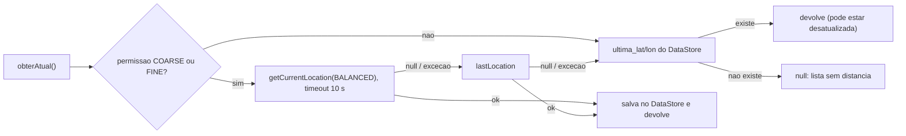

# 13. Recurso nativo

Resumo: o recurso nativo principal é a geolocalização (RF22, Must Have (N2)): o app obtém a posição do usuário com o `FusedLocationProviderClient`, calcula a distância até cada quadra com Haversine, ordena a lista por proximidade e abre o endereço no app de mapas por Intent `geo:`. Recurso secundário recomendado: notificação local "Reserva confirmada" (RF24, Should Have). Biometria é Could Have; câmera fica fora do MVP.

Rastreia o critério 5 da disciplina (pelo menos um recurso nativo) e os requisitos RF22, RF24, RNF06, RNF07 e RNF08. As coordenadas das quadras vêm de RF09 (CEP -> latitude/longitude via BrasilAPI, ver `docs/10-api-rest.md`, rota `GET /cep/{cep}`). Persistência da última posição em `docs/12-persistencia-local.md`. Responsável: Integrante C, semana S9 (26 a 30/10/2026), antes do Checkpoint 2.

## 13.1 Comparação rápida

| Recurso | Facilidade (1 a 5) | Utilidade no domínio | Valor de apresentação | Custo oculto | Veredito |
|---|---|---|---|---|---|
| Geolocalização | 4: `play-services-location 21.4.0`, duas permissões pedidas juntas, `getCurrentLocation`, Haversine em 10 linhas | Alta: "quadra mais perto de mim" é o núcleo de "encontrar quadra" | Alto: pedir permissão ao vivo, lista reordena, "a 1,2 km" em cada card, "Abrir no Maps" | Precisa de lat/lon nas quadras (resolvido por RF09 e pelo seed); emulador precisa de coordenadas nos Extended Controls; ambiente fechado pode não dar fix (cadeia de fallback) | Principal, Must Have (N2), RF22 |
| Notificação local | 5: `NotificationCompat` + canal + `POST_NOTIFICATIONS`, cerca de 40 linhas | Média: avisa "Reserva confirmada" quando o pagamento cai | Médio: aparece na barra de status durante a demo do Pix | Nenhum (sem FCM, sem servidor); em API 33+ exige pedido de permissão | Secundário, Should Have, RF24 |
| Biometria | 3: `androidx.biometric 1.1.0` exige `FragmentActivity` (a `MainActivity` é `ComponentActivity`); `biometric-compose` só em alpha | Baixa: login por e-mail/senha já atende RF02; não adiciona segurança real ao token já salvo | Médio; falha se o celular não tem digital cadastrada | Emulador precisa de fingerprint simulado; mais um caminho de login para testar | Could Have, OPC |
| Câmera | 2: CameraX ou `TakePicture` + `FileProvider` + upload multipart + armazenamento de arquivos no backend | Baixa: foto da quadra é cosmética; `foto_url` texto cobre o visual | Médio | Arrasta storage de arquivos (o disco do Render é efêmero) e permissão extra; nenhum critério a mais é atendido | Fora do MVP, "trabalhos futuros" |

Regra aplicada: o recurso escolhido precisa estar no fluxo "encontrar quadra -> ver horário -> reservar -> pagar -> confirmação". Geolocalização está no primeiro passo; notificação está no último; biometria e câmera não estão em nenhum.

## 13.2 Principal: geolocalização (RF22)

Objetivo: em `Quadras`, mostrar "a 2,3 km" em cada card e ordenar por proximidade; em `DetalheQuadra`, mostrar a distância e o botão "Abrir no Maps". Tudo com cerca de 120 linhas, sem SDK de mapas, sem chave de API, sem billing.

### Passo 1: dependência

`android/gradle/libs.versions.toml`:

```toml
[versions]
play-services-location = "21.4.0"

[libraries]
play-services-location = { group = "com.google.android.gms", name = "play-services-location", version.ref = "play-services-location" }
kotlinx-coroutines-play-services = { group = "org.jetbrains.kotlinx", name = "kotlinx-coroutines-play-services", version.ref = "kotlinx-coroutines" }
```

`kotlinx-coroutines-play-services` fornece `Task.await()`; usa a mesma versão de `kotlinx-coroutines-core` já fixada no catálogo.

### Passo 2: permissões no manifest

```xml
<uses-permission android:name="android.permission.ACCESS_COARSE_LOCATION" />
<uses-permission android:name="android.permission.ACCESS_FINE_LOCATION" />
<uses-feature android:name="android.hardware.location.gps" android:required="false" />
```

As duas permissões são declaradas e pedidas juntas: desde o Android 12 o usuário pode escolher "aproximada" mesmo que o app peça "precisa", e o app precisa funcionar com a aproximada (por isso `PRIORITY_BALANCED_POWER_ACCURACY`, que aceita apenas COARSE). `ACCESS_BACKGROUND_LOCATION` não é declarada: o app só usa localização com a tela aberta. `uses-feature required="false"` permite instalar em aparelho sem GPS.

### Passo 3: `LocalizacaoProvider` com cadeia de fallback

Arquivo: `data/local/LocalizacaoProvider.kt`. Criado uma vez em `AppContainer` e injetado no `QuadrasViewModel` e no `DetalheQuadraViewModel`.



Versão textual: posição atual (até 10 s) -> última posição conhecida do sistema -> última posição salva pelo próprio app -> nenhuma. Em qualquer etapa, exceção (inclusive celular sem Google Play Services) é engolida por `runCatching` e o app segue sem distância, atendendo RNF08. Risco R14 em `docs/19-riscos.md`.

```kotlin
data class Coordenada(val latitude: Double, val longitude: Double)

class LocalizacaoProvider(private val ctx: Context, private val sessao: SessaoDataStore) {
    private val cliente by lazy { LocationServices.getFusedLocationProviderClient(ctx) }

    fun temPermissao(): Boolean = listOf(
        Manifest.permission.ACCESS_FINE_LOCATION, Manifest.permission.ACCESS_COARSE_LOCATION,
    ).any { ContextCompat.checkSelfPermission(ctx, it) == PackageManager.PERMISSION_GRANTED }

    @SuppressLint("MissingPermission")
    suspend fun obterAtual(): Coordenada? {
        if (!temPermissao()) return sessao.ultimaCoordenada()
        val atual = runCatching {
            withTimeoutOrNull(10_000) {
                cliente.getCurrentLocation(
                    Priority.PRIORITY_BALANCED_POWER_ACCURACY, CancellationTokenSource().token,
                ).await()
            }
        }.getOrNull()
        val loc = atual ?: runCatching { cliente.lastLocation.await() }.getOrNull()
        return loc?.let { Coordenada(it.latitude, it.longitude) }
            ?.also { sessao.salvarCoordenada(it) }        // ultima_lat / ultima_lon
            ?: sessao.ultimaCoordenada()
    }
}
```

### Passo 4: distância (Haversine)

Arquivo: `util/Geo.kt`. Raio médio da Terra 6371 km; erro inferior a 0,5 % em distâncias urbanas, mais do que suficiente para "a 2,3 km".

```kotlin
object Geo {
    private const val RAIO_TERRA_KM = 6371.0

    fun distanciaKm(a: Coordenada, b: Coordenada): Double {
        val dLat = Math.toRadians(b.latitude - a.latitude)
        val dLon = Math.toRadians(b.longitude - a.longitude)
        val h = sin(dLat / 2).pow(2) +
            cos(Math.toRadians(a.latitude)) * cos(Math.toRadians(b.latitude)) * sin(dLon / 2).pow(2)
        return 2 * RAIO_TERRA_KM * asin(sqrt(h))
    }

    fun formatar(km: Double): String =
        if (km < 1.0) "a ${(km * 1000).roundToInt()} m" else "a ${"%.1f".format(Locale("pt", "BR"), km)} km"
}
```

Teste `GeoTest`: distância entre dois pontos conhecidos da cidade do grupo (tolerância de 1 %) e `formatar(0.85) == "a 850 m"`, `formatar(2.34) == "a 2,3 km"`.

### Passo 5: pedir a permissão no momento certo (UX)

A permissão não é pedida no primeiro launch nem no `Splash`. Em `QuadrasScreen`, enquanto não há permissão, a lista aparece em ordem alfabética com um card no topo: "Ativar localização para ver as quadras perto de você" e botão "Ativar". O usuário entende o porquê antes do diálogo do sistema.

```kotlin
val launcher = rememberLauncherForActivityResult(ActivityResultContracts.RequestMultiplePermissions()) { r ->
    val concedida = r[Manifest.permission.ACCESS_FINE_LOCATION] == true ||
        r[Manifest.permission.ACCESS_COARSE_LOCATION] == true
    viewModel.aoResponderPermissao(concedida)     // grava permissao_localizacao_pedida = true
}

CardAtivarLocalizacao(onAtivar = {
    launcher.launch(arrayOf(Manifest.permission.ACCESS_FINE_LOCATION, Manifest.permission.ACCESS_COARSE_LOCATION))
})
```

| Resposta do usuário | Comportamento |
|---|---|
| Precisa ou aproximada concedida | `viewModel.atualizarLocalizacao()` -> `LocalizacaoProvider.obterAtual()` -> recalcula `distanciaKm` por card -> lista reordenada; card some |
| Negada uma vez | lista em ordem alfabética; card permanece com texto "Ative a localização para ver a distância"; `permissao_localizacao_pedida = true` evita pedir de novo automaticamente |
| Negada permanentemente ("não perguntar de novo") | o card passa a abrir as configurações do app (`ACTION_APPLICATION_DETAILS_SETTINGS`) com texto "Permita a localização nas configurações" |
| Permissão concedida, mas sem fix (ambiente fechado, GPS lento) | cadeia de fallback do passo 3; se tudo falhar, lista sem distância e texto "Não foi possível obter sua localização" |

A permissão é reavaliada em `ON_RESUME` (o usuário pode ter concedido nas configurações). A localização é reobtida no `init` do `QuadrasViewModel`, no pull-to-refresh e em `ON_RESUME`; nunca em segundo plano.

### Passo 6: ordenação por proximidade

No `QuadrasViewModel`, a lista do Room (escopo `CATALOGO`) é combinada com a coordenada atual:

```kotlin
val uiState = combine(repo.observarCatalogo(), coordenada, filtroEsporte) { quadras, coord, esporte ->
    val filtradas = quadras.filter { esporte == null || it.tipoEsporte == esporte }
    val comDistancia = filtradas.map { q ->
        val d = if (coord != null && q.latitude != null && q.longitude != null)
            Geo.distanciaKm(coord, Coordenada(q.latitude, q.longitude)) else null
        QuadraCard(q, d)
    }
    val ordenadas = if (coord == null) comDistancia.sortedBy { it.quadra.nome }
                    else comDistancia.sortedWith(compareBy(nullsLast()) { it.distanciaKm })
    QuadrasUiState(carregando = false, quadras = ordenadas, temLocalizacao = coord != null)
}.stateIn(viewModelScope, SharingStarted.WhileSubscribed(5_000), QuadrasUiState(carregando = true))
```

Quadras sem latitude/longitude ficam no fim da lista com o texto "distância indisponível" (`nullsLast()`), nunca escondidas: a quadra continua reservável.

### Passo 7: "Abrir no Maps" por Intent `geo:`

Em `DetalheQuadra`, sem SDK, sem chave, sem dependência de um app específico: qualquer app de mapas instalado (Google Maps, Waze, OsmAnd) responde ao esquema `geo:`.

```kotlin
fun abrirNoMaps(ctx: Context, lat: Double, lon: Double, nome: String, onFalha: () -> Unit) {
    val uri = Uri.parse("geo:$lat,$lon?q=$lat,$lon(${Uri.encode(nome)})")
    try {
        ctx.startActivity(Intent(Intent.ACTION_VIEW, uri))
    } catch (e: ActivityNotFoundException) {
        onFalha()   // snackbar "Nenhum app de mapas instalado"
    }
}
```

O botão só aparece quando a quadra tem coordenadas. Como o Intent é implícito e disparado por `startActivity`, não é preciso declarar `<queries>` no manifest (só seria necessário para `resolveActivity`). `contentDescription = "Abrir endereço da quadra no aplicativo de mapas"` atende RNF07.

### Passo 8: origem das coordenadas das quadras

| Fonte | Quando | Detalhe |
|---|---|---|
| `GET /cep/{cep}` (backend -> BrasilAPI CEP v2, fallback ViaCEP) | `FormQuadra`, botão "Buscar" ao lado do CEP (RF09) | preenche logradouro, bairro, cidade, UF e, quando a BrasilAPI devolve, latitude/longitude. ViaCEP não devolve coordenadas |
| Campos lat/lon editáveis no `FormQuadra` | quando a API não devolveu coordenadas ou o dono quer ajustar | validação: latitude entre -90 e 90, longitude entre -180 e 180; podem ficar vazios |
| `scripts/seed-demo.sql` | dev e demo | 3 quadras georreferenciadas na cidade do grupo, a distâncias diferentes do ponto de demonstração |

O Android nunca chama a BrasilAPI diretamente: só o backend fala com serviços externos (`docs/09-arquitetura.md`). A coordenada de precisão de CEP (centro da rua/bairro) é suficiente para "a 2,3 km"; não é usada para navegação passo a passo. Risco R13 (BrasilAPI sem coordenadas) em `docs/19-riscos.md`.

### Passo 9: demonstração

| Ambiente | Como | Observação |
|---|---|---|
| Celular real (principal) | GPS ligado, Wi-Fi/dados ligados (a localização por rede acelera o fix em ambiente fechado) | abrir o Google Maps uma vez antes da apresentação popula `lastLocation`; o app então responde na hora |
| Emulador (backup) | Extended Controls > Location > definir latitude/longitude na cidade do grupo > "Set location"; ou `adb emu geo fix <longitude> <latitude>` (ordem lon, lat) | escolher um ponto entre 1 e 5 km das quadras do seed para distâncias interessantes |
| Sem permissão (mostrar o fallback) | negar no diálogo ao vivo | a lista continua funcionando em ordem alfabética, provando RNF08 |

Roteiro de 40 s dentro da demo de 8 min (`docs/18-checklist-n2.md`): abrir `Quadras` -> card "Ativar localização" -> conceder -> lista reordena e mostra "a 850 m", "a 2,3 km" -> abrir a mais próxima -> "Abrir no Maps" -> voltar.

### Estados de tela, acessibilidade e degradação

| Situação | O que a tela mostra |
|---|---|
| Obtendo localização | card com `CircularProgressIndicator` pequeno "Obtendo sua localização..."; a lista já está visível (não bloqueia) |
| Localização obtida | texto "a X km" em cada card com `contentDescription = "a 2,3 quilômetros"` para o TalkBack |
| Localização vinda do DataStore (offline ou sem fix) | mesma exibição; `BannerOffline` já informa que os dados são antigos |
| Sem GMS, sem permissão ou sem coordenadas | lista alfabética; textos explicativos; nenhuma funcionalidade bloqueada |

Alvos de toque de 48 dp no card e no botão "Abrir no Maps"; nenhuma informação transmitida só por cor (RNF07).

## 13.3 Secundário recomendado: notificação local (RF24)

Objetivo: quando o polling de `Pagamento` (ou `DetalheReserva`) detecta a transição `PENDENTE -> PAGO`, o app emite a notificação "Reserva confirmada! Quadra X, 10/10 às 19h", que abre `DetalheReserva` ao ser tocada. Cerca de 40 linhas em `util/NotificadorReserva.kt`. Entra apenas com todos os Must Have verdes (regra de ouro do backlog, `docs/14-backlog.md`).

O que é e o que não é: é uma notificação local, disparada pelo próprio app enquanto ele está aberto, ao receber a confirmação pelo polling. Não é push (FCM), não há servidor de mensagens nem token de dispositivo. Dizer isso explicitamente na apresentação evita a pergunta "e se o app estiver fechado?": nesse caso, a confirmação aparece na próxima abertura via sincronização (`docs/12-persistencia-local.md`), sem notificação. Limitação consciente; push está em `docs/02-escopo-mvp.md` como fora do MVP.

### Canal, permissão e momento de pedir

- Canal `reservas` (`IMPORTANCE_DEFAULT`) criado em `SoMaisUmaApp.onCreate()`. Como `minSdk = 26`, `NotificationChannel` existe sempre; sem checagem de versão para o canal.
- `POST_NOTIFICATIONS` é permissão de runtime desde o Android 13 (API 33). Com `targetSdk 37`, o app precisa declará-la no manifest e pedi-la com `ActivityResultContracts.RequestPermission()`; em aparelhos com API 26 a 32 o `launch` não é chamado e a notificação funciona sem pedido.
- Momento: na primeira abertura da tela `Pagamento` (não no launch, não no login), depois de mostrar o QR, com um texto de contexto na própria tela: "Quer ser avisado quando o pagamento for confirmado?" e botão "Ativar avisos". `permissao_notificacao_pedida = true` evita repetir. Negada = silêncio, sem nova insistência; o usuário pode ligar nas configurações do sistema. O switch `notificar_confirmacao` em `Perfil` permite desligar dentro do app.

```kotlin
// PagamentoScreen
val launcherNotificacao = rememberLauncherForActivityResult(ActivityResultContracts.RequestPermission()) {
    viewModel.aoResponderPermissaoNotificacao()
}
if (Build.VERSION.SDK_INT >= 33 && !state.permissaoNotificacaoPedida) {
    CardAtivarAvisos(onAtivar = { launcherNotificacao.launch(Manifest.permission.POST_NOTIFICATIONS) })
}
```

### Esboço de `NotificadorReserva.kt`

```kotlin
object NotificadorReserva {
    const val CANAL = "reservas"

    fun criarCanal(ctx: Context) {
        val canal = NotificationChannel(CANAL, "Reservas", NotificationManager.IMPORTANCE_DEFAULT)
            .apply { description = "Confirmação de pagamento das suas reservas" }
        ctx.getSystemService(NotificationManager::class.java).createNotificationChannel(canal)
    }

    fun confirmada(ctx: Context, reserva: Reserva) {
        if (Build.VERSION.SDK_INT >= 33 &&
            ContextCompat.checkSelfPermission(ctx, Manifest.permission.POST_NOTIFICATIONS) != PackageManager.PERMISSION_GRANTED
        ) return
        val abrir = Intent(ctx, MainActivity::class.java)
            .putExtra("reservaId", reserva.id)
            .addFlags(Intent.FLAG_ACTIVITY_SINGLE_TOP)
        val pendente = PendingIntent.getActivity(
            ctx, reserva.id.toInt(), abrir, PendingIntent.FLAG_IMMUTABLE or PendingIntent.FLAG_UPDATE_CURRENT,
        )
        val notificacao = NotificationCompat.Builder(ctx, CANAL)
            .setSmallIcon(R.drawable.ic_notificacao)
            .setContentTitle("Reserva confirmada!")
            .setContentText("${reserva.quadraNome}, ${Formatadores.dataHora(reserva.inicio)}")
            .setContentIntent(pendente)
            .setAutoCancel(true)
            .build()
        NotificationManagerCompat.from(ctx).notify(reserva.id.toInt(), notificacao)
    }
}
```

`MainActivity` lê o extra `reservaId` em `onCreate`/`onNewIntent` e o `AppNavHost` navega para `DetalheReserva(id)`. O disparo fica no `PagamentoViewModel`: ao detectar `PAGO` e `notificar_confirmacao == true`, chama `NotificadorReserva.confirmada(...)` uma única vez (flag no estado) e depois navega para `DetalheReserva`.

O que dizer na apresentação (15 s): "Segundo recurso nativo: canal de notificação, permissão de runtime do Android 13 pedida no contexto certo, PendingIntent que abre a reserva. É local, disparada pelo app ao confirmar o Pix; não usamos FCM porque não há caso de uso com o app fechado no MVP."

## 13.4 Opcional: biometria (Could Have)

Como seria, se sobrar tempo entre 06/11 e 25/11 com tudo verde:

- Dependência `androidx.biometric:biometric 1.1.0` (última estável verificada em 01/09/2026; `biometric-compose` só existe em alpha e não entra). Permissão `USE_BIOMETRIC` é de nível "normal": só manifest, sem diálogo de runtime.
- `BiometricPrompt` 1.1.0 exige `FragmentActivity`; a `MainActivity` passaria de `ComponentActivity` para `FragmentActivity` (uma linha; `setContent` continua funcionando).
- Fluxo: `Login` mostra "Entrar com biometria" somente se existe `token_jwt` válido no DataStore e `BiometricManager.from(ctx).canAuthenticate(BIOMETRIC_STRONG or DEVICE_CREDENTIAL) == BIOMETRIC_SUCCESS`. Sucesso no prompt -> navega para a home do perfil reaproveitando o JWT; falha ou cancelamento -> login por senha.
- Honestidade técnica para a banca: é conveniência de desbloqueio, não segurança adicional; o JWT já está no DataStore (RNF03) e continua sendo o que autentica no servidor. Por isso não pontua mais do que a geolocalização e ficou como opcional.
- Custo de teste: emulador precisa de digital simulada (Extended Controls > Fingerprint); celulares sem biometria cadastrada não exibem o botão.

## 13.5 Fora do MVP: câmera

Motivos, registrados também em `docs/02-escopo-mvp.md`:

1. Não está no fluxo principal: foto da quadra é cosmética; `foto_url` (texto, exibido com Coil como Should Have) entrega o visual.
2. Custo em cadeia: `CAMERA` ou `TakePicture` + `FileProvider` + redimensionamento + upload multipart + endpoint de arquivos + armazenamento persistente (o disco do Render é efêmero, exigiria S3 ou similar) + URL pública. Nenhum desses passos atende um critério a mais da disciplina.
3. Leitura de QR Code também não é necessária: o cliente paga no app do banco, e o nosso app apenas gera o QR do `pixCopiaECola` (ZXing core, sem câmera; `docs/11-integracao-pix-inter.md`).

Fica como "trabalhos futuros" junto com o mapa interativo.

## 13.6 Tabela de permissões do manifest

| Permissão | Nível | Declarada? | Quando é pedida | Requisito | Prioridade |
|---|---|---|---|---|---|
| `INTERNET` | normal | sim | manifest, sem diálogo | toda a API | Must Have (N1) |
| `ACCESS_NETWORK_STATE` | normal | sim | manifest, sem diálogo | `MonitorConectividade` (RF23) | Must Have (N2) |
| `ACCESS_COARSE_LOCATION` | runtime (dangerous) | sim | card em `Quadras`, junto com FINE | RF22 | Must Have (N2) |
| `ACCESS_FINE_LOCATION` | runtime (dangerous) | sim | card em `Quadras`, junto com COARSE; usuário pode conceder só aproximada | RF22 | Must Have (N2) |
| `POST_NOTIFICATIONS` | runtime (dangerous) em API 33+ | sim | primeira abertura de `Pagamento` | RF24 | Should Have |
| `USE_BIOMETRIC` | normal | só se a biometria entrar | manifest, sem diálogo | opcional | Could Have |
| `ACCESS_BACKGROUND_LOCATION` | runtime | não | — | não há uso em segundo plano | Não declarar |
| `CAMERA` | runtime | não | — | câmera fora do MVP | Não declarar |
| `READ/WRITE_EXTERNAL_STORAGE`, `READ_MEDIA_*` | runtime | não | — | sem upload de arquivos | Não declarar |

Observações:

- `<uses-feature android:name="android.hardware.location.gps" android:required="false"/>` acompanha as permissões de localização.
- Tráfego HTTP em texto claro (emulador `10.0.2.2:8080`, IP da LAN) é liberado apenas no build `debug` por `network_security_config`; o build `release` só fala HTTPS com o Render (RNF09). Não é permissão, mas costuma ser confundido com uma.
- Nenhuma das permissões acima está na lista de "Restricted Settings" do Android 13+, então a instalação via `adb install` não altera o comportamento delas.

## 13.7 Riscos e testes

| Item | Referência |
|---|---|
| R13 BrasilAPI sem coordenadas ou fora do ar | `docs/19-riscos.md`; mitigação: ViaCEP, lat/lon editáveis, seed |
| R14 localização negada, sem fix ou sem GMS | `docs/19-riscos.md`; mitigação: cadeia de fallback, app 100 % usável sem distância |
| `GeoTest` (JVM) | Haversine e formatação | Must Have (N2) |
| `QuadrasViewModelTest` (JVM, `LocalizacaoProvider` fake) | ordenação por distância com `nullsLast`, ordem alfabética sem coordenada, filtro por esporte | Must Have (N2) |
| `PagamentoViewModelTest` (JVM, `NotificadorReserva` fake) | notifica uma única vez na transição para `PAGO`; não notifica com `notificar_confirmacao = false` | Should Have |
| Casos manuais de RF22 e RF24 | `docs/23-plano-de-testes.md`: conceder/negar permissão, precisa x aproximada, modo avião com `ultima_lat/lon`, emulador sem fix, notificação em API 33+ e em API 26 a 32 | Must Have (N2) |

## 13.8 Rastreabilidade

| Critério / requisito | Evidência neste tema |
|---|---|
| Critério 5: recurso nativo | `LocalizacaoProvider.kt`, `Geo.kt`, permissão ao vivo na demo, "Abrir no Maps"; `NotificadorReserva.kt` como segundo recurso |
| RF22 | seção 13.2 completa |
| RF24 | seção 13.3 |
| RF09 | passo 8: coordenadas via CEP |
| RNF06 | estados carregando/vazio/erro do card de localização e do pedido de notificação |
| RNF07 | `contentDescription` nas distâncias e botões, alvos de 48 dp |
| RNF08 | funciona sem Google Play Services e sem localização, de forma degradada |
| Quem defende | Integrante C (geolocalização e notificação), Integrante B (origem das coordenadas via CEP) |
