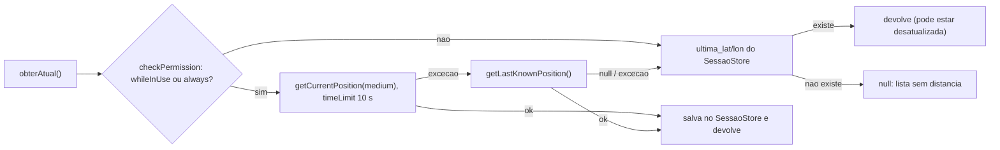

# 13. Recurso nativo

Resumo: o recurso nativo principal é a geolocalização (RF22, Must Have (N2)): o app obtém a posição do usuário com o geolocator, calcula a distância até cada quadra com Haversine, ordena a lista por proximidade e abre o endereço no app de mapas pela URI `geo:` (url_launcher). Recurso secundário recomendado: notificação local "Reserva confirmada" (RF24, Should Have) com flutter_local_notifications. Biometria é Could Have (local_auth); câmera fica fora do MVP.

Rastreia o critério 5 da disciplina (pelo menos um recurso nativo) e os requisitos RF22, RF24, RNF06, RNF07 e RNF08. As coordenadas das quadras vêm de RF09 (CEP -> latitude/longitude via BrasilAPI, ver `docs/10-api-rest.md`, rota `GET /cep/{cep}`). Persistência da última posição em `docs/12-persistencia-local.md`. Responsável: Integrante C, semana S9 (26 a 30/10/2026), antes do Checkpoint 2.

Atualizado em 06/10/2026: app passou de Android nativo (Kotlin + Compose) para Flutter. O recurso continua nativo: em Flutter ele é acessado por plugins que chamam as APIs nativas do Android por platform channels. O geolocator pede a permissão de runtime do sistema e consulta o serviço de localização do Android (GPS e rede); o flutter_local_notifications cria o canal de notificação do Android e publica a notificação pelo sistema. O critério 5 continua atendido: o que a banca vê (diálogo de permissão em runtime, fix de GPS, notificação na barra de status saindo do canal `reservas`) é o mesmo da versão nativa.

## 13.1 Comparação rápida

| Recurso | Facilidade (1 a 5) | Utilidade no domínio | Valor de apresentação | Custo oculto | Veredito |
|---|---|---|---|---|---|
| Geolocalização | 4: `geolocator 14.1.1` (um pacote; usa Google Play Services quando há e o `LocationManager` quando não há), `checkPermission`/`requestPermission` pedem as duas permissões juntas, `getCurrentPosition`, Haversine em 10 linhas | Alta: "quadra mais perto de mim" é o núcleo de "encontrar quadra" | Alto: pedir permissão ao vivo, lista reordena, "a 1,2 km" em cada card, "Abrir no Maps" | Precisa de lat/lon nas quadras (resolvido por RF09 e pelo seed); permissões declaradas à mão no `AndroidManifest.xml` (o plugin não as acrescenta); emulador precisa de coordenadas nos Extended Controls; ambiente fechado pode não dar fix (cadeia de fallback) | Principal, Must Have (N2), RF22 |
| Notificação local | 4: `flutter_local_notifications 22.3.1` + canal + `POST_NOTIFICATIONS`, cerca de 50 linhas; inicialização no `main()` e roteamento do toque pelo payload | Média: avisa "Reserva confirmada" quando o pagamento cai | Médio: aparece na barra de status durante a demo do Pix | Nenhum serviço (sem FCM, sem servidor); em API 33+ exige pedido de permissão; o plugin exige core library desugaring no Gradle do `frontend/android/` e um ícone monocromático em `res/drawable` | Secundário, Should Have, RF24 |
| Biometria | 3: `local_auth 3.0.2` exige trocar a `MainActivity` gerada de `FlutterActivity` para `FlutterFragmentActivity` e tratar `LocalAuthException` por código | Baixa: login por e-mail/senha já atende RF02; não adiciona segurança real ao token já salvo | Médio; falha se o celular não tem digital cadastrada | Emulador precisa de fingerprint simulado; mais um caminho de login para testar | Could Have, OPC |
| Câmera | 2: `image_picker` (câmera do sistema) ou pacote `camera` + compressão + upload multipart (`FormData` do dio) + armazenamento de arquivos no backend | Baixa: foto da quadra é cosmética; `foto_url` texto cobre o visual | Médio | Arrasta storage de arquivos (o disco do Render é efêmero) e permissão extra; nenhum critério a mais é atendido | Fora do MVP, "trabalhos futuros" |

Regra aplicada: o recurso escolhido precisa estar no fluxo "encontrar quadra -> ver horário -> reservar -> pagar -> confirmação". Geolocalização está no primeiro passo; notificação está no último; biometria e câmera não estão em nenhum.

## 13.2 Principal: geolocalização (RF22)

Objetivo: em `Quadras`, mostrar "a 2,3 km" em cada card e ordenar por proximidade; em `DetalheQuadra`, mostrar a distância e o botão "Abrir no Maps". Tudo com cerca de 120 linhas, sem SDK de mapas, sem chave de API, sem billing.

### Passo 1: dependências no `pubspec.yaml`

`frontend/pubspec.yaml` (versões fixadas, como as demais; `flutter pub get` atualiza o `pubspec.lock`, que é versionado):

```yaml
dependencies:
  geolocator: 14.1.1                    # posição atual e última conhecida, permissões
  url_launcher: 6.3.3                   # "Abrir no Maps" pela URI geo:
  flutter_local_notifications: 22.3.1   # RF24 (secundário, 13.3)
```

Não há biblioteca de ponte para "esperar" a resposta do serviço de localização: o plugin já devolve `Future`. `local_auth` só entra se a biometria entrar (13.4).

### Passo 2: permissões no manifest

`frontend/android/app/src/main/AndroidManifest.xml` (o manifest principal, que vale para o release):

```xml
<uses-permission android:name="android.permission.ACCESS_COARSE_LOCATION" />
<uses-permission android:name="android.permission.ACCESS_FINE_LOCATION" />
<uses-feature android:name="android.hardware.location.gps" android:required="false" />
```

O geolocator não injeta permissões de localização: elas são declaradas à mão, e o `requestPermission()` pede as que encontrar no manifest. As duas são declaradas e pedidas juntas: desde o Android 12 o usuário pode escolher "aproximada" mesmo que o app peça "precisa", e o app precisa funcionar com a aproximada (por isso `LocationAccuracy.medium`, que no Android mapeia para a precisão balanceada e funciona só com COARSE). `ACCESS_BACKGROUND_LOCATION` não é declarada: o app só usa localização com a tela aberta. `uses-feature required="false"` permite instalar em aparelho sem GPS.

### Passo 3: `LocalizacaoService` com cadeia de fallback

Arquivo: `frontend/lib/data/local/localizacao_service.dart` (o nome evita confusão com o pacote `provider`, usado na injeção de dependências). Registrado uma vez em `dependencias(...)` (`lib/config/dependencias.dart`) e injetado no `QuadrasViewModel` e no `DetalheQuadraViewModel`.


```mermaid
flowchart LR
    A["obterAtual()"] --> B{"checkPermission: whileInUse ou always?"}
    B -- nao --> F["ultima_lat/lon do SessaoStore"]
    B -- sim --> C["getCurrentPosition(medium), timeLimit 10 s"]
    C -- ok --> S["salva no SessaoStore e devolve"]
    C -- excecao --> D["getLastKnownPosition()"]
    D -- ok --> S
    D -- null / excecao --> F
    F -- existe --> G["devolve (pode estar desatualizada)"]
    F -- nao existe --> N["null: lista sem distancia"]
```

Versão textual: posição atual (até 10 s) -> última posição conhecida do sistema -> última posição salva pelo próprio app -> nenhuma. Em qualquer etapa, exceção (`TimeoutException` do `timeLimit`, `LocationServiceDisabledException` com a localização do aparelho desligada, falha do serviço) é capturada e o app segue sem distância, atendendo RNF08. Sem Google Play Services, o geolocator usa o `LocationManager` do Android em vez do `FusedLocationProviderClient`, então a cadeia funciona igual (o primeiro fix só pode demorar mais). Risco R14 em `docs/19-riscos.md`.

```dart
// lib/model/coordenada.dart
class Coordenada {
  const Coordenada(this.latitude, this.longitude);
  final double latitude, longitude;
}

// lib/data/local/localizacao_service.dart
class LocalizacaoService {
  LocalizacaoService(this._sessao);
  final SessaoStore _sessao;

  Future<bool> temPermissao() async {
    final p = await Geolocator.checkPermission();
    return p == LocationPermission.whileInUse || p == LocationPermission.always;
  }

  Future<Coordenada?> obterAtual() async {
    if (!await temPermissao()) return _sessao.ultimaCoordenada();
    final pos = await _tentar(() => Geolocator.getCurrentPosition(
              locationSettings: AndroidSettings(
                accuracy: LocationAccuracy.medium,       // balanceada: funciona com "aproximada"
                timeLimit: const Duration(seconds: 10),
              ),
            )) ??
        await _tentar(Geolocator.getLastKnownPosition);
    if (pos == null) return _sessao.ultimaCoordenada();
    final c = Coordenada(pos.latitude, pos.longitude);
    await _sessao.salvarCoordenada(c);                    // ultima_lat / ultima_lon
    return c;
  }

  static Future<Position?> _tentar(Future<Position?> Function() f) async {
    try {
      return await f();
    } catch (_) {                                         // timeout, GPS desligado, sem serviço
      return null;
    }
  }
}
```

### Passo 4: distância (Haversine)

Arquivo: `frontend/lib/util/geo.dart` (`dart:math`). Raio médio da Terra 6371 km; erro inferior a 0,5 % em distâncias urbanas, mais do que suficiente para "a 2,3 km".

```dart
abstract final class Geo {
  static const _raioTerraKm = 6371.0;

  static double distanciaKm(Coordenada a, Coordenada b) {
    final dLat = _rad(b.latitude - a.latitude);
    final dLon = _rad(b.longitude - a.longitude);
    final h = pow(sin(dLat / 2), 2) +
        cos(_rad(a.latitude)) * cos(_rad(b.latitude)) * pow(sin(dLon / 2), 2);
    return 2 * _raioTerraKm * asin(sqrt(h));
  }

  static String formatar(double km) => km < 1
      ? 'a ${(km * 1000).round()} m'
      : 'a ${NumberFormat('0.0', 'pt_BR').format(km)} km';   // intl: vírgula decimal

  static double _rad(double graus) => graus * pi / 180;
}
```

Teste `GeoTest` (`test/util/geo_test.dart`): distância entre dois pontos conhecidos da cidade do grupo (tolerância de 1 %) e `formatar(0.85) == 'a 850 m'`, `formatar(2.34) == 'a 2,3 km'`.

### Passo 5: pedir a permissão no momento certo (UX)

A permissão não é pedida no primeiro launch nem no `Splash`. Em `QuadrasScreen`, enquanto não há permissão, a lista aparece em ordem alfabética com um card no topo: "Ativar localização para ver as quadras perto de você" e botão "Ativar". O usuário entende o porquê antes do diálogo do sistema. Não há launcher de Activity a registrar: o plugin abre o diálogo do sistema e devolve o resultado como `Future`.

```dart
// LocalizacaoService
Future<LocationPermission> pedirPermissao() async {
  var p = await Geolocator.checkPermission();
  if (p == LocationPermission.denied) {
    p = await Geolocator.requestPermission();        // diálogo do sistema: FINE + COARSE do manifest
  }
  await _sessao.marcarPermissaoLocalizacaoPedida();  // permissao_localizacao_pedida = true
  return p;
}

Future<bool> abrirConfiguracoes() => Geolocator.openAppSettings();

// QuadrasViewModel, chamado pelo botão "Ativar" do CardAtivarLocalizacao
Future<void> ativarLocalizacao() async {
  if (state.permissaoNegadaPermanentemente) {
    await _localizacao.abrirConfiguracoes();         // "Permita a localização nas configurações"
    return;
  }
  aoResponderPermissao(await _localizacao.pedirPermissao());
}
```

| Resposta do usuário | Comportamento |
|---|---|
| Precisa ou aproximada concedida (`whileInUse`) | `atualizarLocalizacao()` -> `LocalizacaoService.obterAtual()` -> recalcula `distanciaKm` por card -> lista reordenada; card some. Com aproximada (`Geolocator.getLocationAccuracy()` devolve `LocationAccuracyStatus.reduced`), o comportamento é o mesmo; a posição é uma estimativa dentro de cerca de 3 km², suficiente para ordenar |
| Negada uma vez (`denied`) | lista em ordem alfabética; card permanece com texto "Ative a localização para ver a distância"; `permissao_localizacao_pedida = true` evita pedir de novo automaticamente |
| Negada permanentemente (`deniedForever`, "não perguntar de novo") | o card passa a abrir as configurações do app (`Geolocator.openAppSettings()`) com texto "Permita a localização nas configurações" |
| Permissão concedida, mas sem fix (ambiente fechado, GPS lento) ou com a localização do aparelho desligada | cadeia de fallback do passo 3; se tudo falhar, lista sem distância e texto "Não foi possível obter sua localização" |

A permissão é reavaliada quando o app volta ao primeiro plano (`AppLifecycleListener(onResume: ...)` no `State` da tela; o usuário pode ter concedido nas configurações). A localização é reobtida na criação do `QuadrasViewModel`, no `RefreshIndicator` e no `onResume`; nunca em segundo plano.

### Passo 6: ordenação por proximidade

No `QuadrasViewModel`, a lista do drift (escopo `CATALOGO`, assinada no construtor via `repo.observarCatalogo().listen(...)`, `StreamSubscription` cancelada no `dispose()`) é recombinada com a coordenada atual e o filtro sempre que um dos três muda:

```dart
void _recalcular() {
  final coord = _coord;
  final cards = [
    for (final q in _quadras)
      if (_esporte == null || q.tipoEsporte == _esporte)
        QuadraCard(q, switch ((coord, q.coordenada)) {   // q.coordenada: null sem lat/lon
          (final a?, final b?) => Geo.distanciaKm(a, b),
          _ => null,
        }),
  ];
  cards.sort(coord == null ? _porNome : _porDistancia);
  _state = _state.copyWith(carregando: false, quadras: cards, temLocalizacao: coord != null);
  notifyListeners();
}

static int _porNome(QuadraCard a, QuadraCard b) => a.quadra.nome.compareTo(b.quadra.nome);

static int _porDistancia(QuadraCard a, QuadraCard b) {
  final d = (a.distanciaKm ?? double.infinity).compareTo(b.distanciaKm ?? double.infinity);
  return d != 0 ? d : _porNome(a, b);                  // sem distância vai para o fim
}
```

Quadras sem latitude/longitude ficam no fim da lista com o texto "distância indisponível" (distância nula tratada como infinita), nunca escondidas: a quadra continua reservável. O desempate por nome mantém a ordem previsível, já que o `sort` do Dart não é estável.

### Passo 7: "Abrir no Maps" pela URI `geo:`

Em `DetalheQuadra`, sem SDK, sem chave, sem dependência de um app específico: qualquer app de mapas instalado (Google Maps, Waze, OsmAnd) responde ao esquema `geo:`. O url_launcher dispara o Intent implícito do Android por baixo.

```dart
Future<void> abrirNoMaps(BuildContext context, double lat, double lon, String nome) async {
  final uri = Uri.parse('geo:$lat,$lon?q=$lat,$lon(${Uri.encodeComponent(nome)})');
  final abriu = await launchUrl(uri).catchError((_) => false);
  if (!abriu && context.mounted) {
    ScaffoldMessenger.of(context).showSnackBar(
        const SnackBar(content: Text('Nenhum app de mapas instalado')));
  }
}
```

O botão só aparece quando a quadra tem coordenadas. O `launchUrl` devolve `false` ou lança `PlatformException` conforme a falha; os dois casos caem no snackbar. Como o app não chama `canLaunchUrl`, não é preciso declarar `<queries>` no manifest (o url_launcher só exige isso para consultar, no Android 11+, se há app que abra o esquema). `Semantics(label: 'Abrir endereço da quadra no aplicativo de mapas')` no botão atende RNF07.

### Passo 8: origem das coordenadas das quadras

| Fonte | Quando | Detalhe |
|---|---|---|
| `GET /cep/{cep}` (backend -> BrasilAPI CEP v2, fallback ViaCEP) | `FormQuadra`, botão "Buscar" ao lado do CEP (RF09) | preenche logradouro, bairro, cidade, UF e, quando a BrasilAPI devolve, latitude/longitude. ViaCEP não devolve coordenadas |
| Campos lat/lon editáveis no `FormQuadra` | quando a API não devolveu coordenadas ou o dono quer ajustar | validação (`validadores.dart`, no `validator:` do `TextFormField`): latitude entre -90 e 90, longitude entre -180 e 180; podem ficar vazios |
| `scripts/seed-demo.sql` | dev e demo | 3 quadras georreferenciadas na cidade do grupo, a distâncias diferentes do ponto de demonstração |

O app nunca chama a BrasilAPI diretamente: só o backend fala com serviços externos (`docs/09-arquitetura.md`). A coordenada de precisão de CEP (centro da rua/bairro) é suficiente para "a 2,3 km"; não é usada para navegação passo a passo. Risco R13 (BrasilAPI sem coordenadas) em `docs/19-riscos.md`.

### Passo 9: demonstração

| Ambiente | Como | Observação |
|---|---|---|
| Celular real (principal) | GPS ligado, Wi-Fi/dados ligados (a localização por rede acelera o fix em ambiente fechado) | abrir o Google Maps uma vez antes da apresentação popula a última posição conhecida do sistema (`getLastKnownPosition()`); o app então responde na hora |
| Emulador (backup) | Extended Controls > Location > definir latitude/longitude na cidade do grupo > "Set location"; ou `adb emu geo fix <longitude> <latitude>` (ordem lon, lat) | escolher um ponto entre 1 e 5 km das quadras do seed para distâncias interessantes |
| Sem permissão (mostrar o fallback) | negar no diálogo ao vivo | a lista continua funcionando em ordem alfabética, provando RNF08 |

Roteiro de 40 s dentro da demo de 8 min (`docs/18-checklist-n2.md`): abrir `Quadras` -> card "Ativar localização" -> conceder -> lista reordena e mostra "a 850 m", "a 2,3 km" -> abrir a mais próxima -> "Abrir no Maps" -> voltar.

### Estados de tela, acessibilidade e degradação

| Situação | O que a tela mostra |
|---|---|
| Obtendo localização | card com `CircularProgressIndicator` pequeno "Obtendo sua localização..."; a lista já está visível (não bloqueia) |
| Localização obtida | texto "a X km" em cada card com `Semantics(label: 'a 2,3 quilômetros')` para o TalkBack |
| Localização vinda do `SessaoStore` (offline ou sem fix) | mesma exibição; `BannerOffline` já informa que os dados são antigos |
| Sem GMS, sem permissão ou sem coordenadas | lista alfabética; textos explicativos; nenhuma funcionalidade bloqueada |

Alvos de toque de 48 dp lógicos no card e no botão "Abrir no Maps" (padrão do Material, `kMinInteractiveDimension`); nenhuma informação transmitida só por cor (RNF07).

## 13.3 Secundário recomendado: notificação local (RF24)

Objetivo: quando o polling de `Pagamento` (ou `DetalheReserva`) detecta a transição `PENDENTE -> PAGO`, o app emite a notificação "Reserva confirmada! Quadra X, 10/10 às 19h", que abre `DetalheReserva` ao ser tocada. Cerca de 50 linhas em `frontend/lib/util/notificador_reserva.dart`. Entra apenas com todos os Must Have verdes (regra de ouro do backlog, `docs/14-backlog.md`).

O que é e o que não é: é uma notificação local, disparada pelo próprio app enquanto ele está aberto, ao receber a confirmação pelo polling. Não é push (FCM), não há servidor de mensagens nem token de dispositivo. Dizer isso explicitamente na apresentação evita a pergunta "e se o app estiver fechado?": nesse caso, a confirmação aparece na próxima abertura via sincronização (`docs/12-persistencia-local.md`), sem notificação. Limitação consciente; push está em `docs/02-escopo-mvp.md` como fora do MVP.

### Canal, permissão e momento de pedir

- Canal `reservas` (`Importance.defaultImportance`) criado por `NotificadorReserva.inicializar()`, chamado no `main()` antes do `runApp`, com `createNotificationChannel` do `AndroidFlutterLocalNotificationsPlugin`. Como `minSdk = 26`, o canal existe sempre; sem checagem de versão para o canal.
- Configuração de build exigida pelo plugin: core library desugaring no `frontend/android/app/build.gradle.kts` (`isCoreLibraryDesugaringEnabled = true` em `compileOptions` e `coreLibraryDesugaring("com.android.tools:desugar_jdk_libs:<versão indicada no README do plugin>")` em `dependencies`) e compileSdk 36 ou maior (já é o `flutter.compileSdkVersion` do Flutter 3.47.6). Sem isso o build Android falha pedindo `coreLibraryDesugaring`.
- Ícone: `ic_notificacao` monocromático em `frontend/android/app/src/main/res/drawable/`. Como ele só é referenciado pelo Dart, um `res/raw/keep.xml` com `tools:keep="@drawable/ic_notificacao"` impede que o encolhimento de recursos do build release o remova (orientação do README do plugin).
- `POST_NOTIFICATIONS` é permissão de runtime desde o Android 13 (API 33). Com `targetSdk` 36 (`flutter.targetSdkVersion`), o app precisa declará-la no manifest e pedi-la com `resolvePlatformSpecificImplementation<AndroidFlutterLocalNotificationsPlugin>()?.requestNotificationsPermission()`; em aparelhos com API 26 a 32 não há diálogo e a notificação funciona sem pedido. Para saber se o card deve aparecer, `areNotificationsEnabled()` do mesmo objeto: em API 26 a 32 já vem `true`, então o card não aparece.
- Momento: na primeira abertura da tela `Pagamento` (não no launch, não no login), depois de mostrar o QR, com um texto de contexto na própria tela: "Quer ser avisado quando o pagamento for confirmado?" e botão "Ativar avisos". `permissao_notificacao_pedida = true` evita repetir. Negada = silêncio, sem nova insistência; o usuário pode ligar nas configurações do sistema. O switch `notificar_confirmacao` em `Perfil` permite desligar dentro do app.

```dart
// PagamentoScreen
if (state.mostrarCardAvisos) CardAtivarAvisos(onAtivar: vm.ativarAvisos),

// PagamentoViewModel: mostrarCardAvisos = !permissao_notificacao_pedida && !avisosLigados()
Future<void> ativarAvisos() async {
  await _notificador.pedirPermissao();            // diálogo do sistema (Android 13+)
  await _sessao.marcarPermissaoNotificacaoPedida();
  _state = _state.copyWith(mostrarCardAvisos: false);
  notifyListeners();
}
```

### Esboço de `notificador_reserva.dart`

```dart
class NotificadorReserva {
  static const _canal = AndroidNotificationChannel(
    'reservas', 'Reservas',
    description: 'Confirmação de pagamento das suas reservas',
    importance: Importance.defaultImportance,
  );
  final _plugin = FlutterLocalNotificationsPlugin();

  AndroidFlutterLocalNotificationsPlugin? get _android => _plugin
      .resolvePlatformSpecificImplementation<AndroidFlutterLocalNotificationsPlugin>();

  /// main(), antes do runApp. Devolve o id da reserva se o app foi aberto pela notificação.
  Future<int?> inicializar(void Function(int reservaId) abrirReserva) async {
    await _plugin.initialize(
      settings: const InitializationSettings(
          android: AndroidInitializationSettings('ic_notificacao')),
      onDidReceiveNotificationResponse: (r) {     // toque com o app aberto ou em segundo plano
        final id = int.tryParse(r.payload ?? '');
        if (id != null) abrirReserva(id);
      },
    );
    await _android?.createNotificationChannel(_canal);
    final lancamento = await _plugin.getNotificationAppLaunchDetails();  // app estava fechado
    return (lancamento?.didNotificationLaunchApp ?? false)
        ? int.tryParse(lancamento!.notificationResponse?.payload ?? '')
        : null;
  }

  Future<bool> avisosLigados() async => await _android?.areNotificationsEnabled() ?? true;

  Future<bool> pedirPermissao() async => await _android?.requestNotificationsPermission() ?? true;

  Future<void> confirmada(Reserva reserva) async {
    if (!await avisosLigados()) return;
    await _plugin.show(
      id: reserva.id,
      title: 'Reserva confirmada!',
      body: '${reserva.quadraNome}, ${Formatadores.dataHora(reserva.inicio)}',
      notificationDetails: NotificationDetails(
        android: AndroidNotificationDetails(_canal.id, _canal.name,
            channelDescription: _canal.description, icon: 'ic_notificacao'),
      ),
      payload: '${reserva.id}',                   // volta no toque
    );
  }
}
```

O `main()` chama `inicializar((id) => router.go(Rotas.detalheReserva(id)))`: o toque com o app vivo cai em `onDidReceiveNotificationResponse` e navega para `DetalheReserva`. Se o app estava fechado e foi aberto pela notificação, `getNotificationAppLaunchDetails()` devolve o payload e o `AppRouter` começa em `Rotas.detalheReserva(id)` (`initialLocation`); o `redirect` continua exigindo sessão válida. O plugin monta o `PendingIntent` nativo e devolve o payload ao Dart; o app não registra Activity nem Intent à mão. O disparo fica no `PagamentoViewModel`: ao detectar `PAGO` e `notificar_confirmacao == true`, chama `NotificadorReserva.confirmada(...)` uma única vez (flag no estado) e depois navega para `DetalheReserva`.

O que dizer na apresentação (15 s): "Segundo recurso nativo: canal de notificação do Android, permissão de runtime do Android 13 pedida no contexto certo, toque que abre a reserva pelo payload. É local, disparada pelo app ao confirmar o Pix; não usamos FCM porque não há caso de uso com o app fechado no MVP."

## 13.4 Opcional: biometria (Could Have)

Como seria, se sobrar tempo entre 06/11 e 25/11 com tudo verde:

- Dependência `local_auth 3.0.2` (OPC; versão verificada em 06/10/2026 no pub.dev). Permissão `USE_BIOMETRIC` é de nível "normal": só manifest, sem diálogo de runtime.
- No Android o `local_auth` exige que a `MainActivity` gerada pelo `flutter create` (em `frontend/android/`) estenda `FlutterFragmentActivity` em vez de `FlutterActivity` (uma linha); com `FlutterActivity` o prompt não abre.
- Fluxo: `Login` mostra "Entrar com biometria" somente se existe `token_jwt` válido no `SessaoStore` e `LocalAuthentication().isDeviceSupported()` e `canCheckBiometrics` são verdadeiros, com `getAvailableBiometrics()` não vazio. Sucesso em `authenticate(localizedReason: 'Entrar no Só mais uma')` (aceita credencial do aparelho como alternativa, salvo `biometricOnly: true`) -> `context.go` para a home do perfil reaproveitando o JWT; falha, cancelamento ou `LocalAuthException` -> login por senha.
- Honestidade técnica para a banca: é conveniência de desbloqueio, não segurança adicional; o JWT já está no `SessaoStore` (flutter_secure_storage, RNF03) e continua sendo o que autentica no servidor. Por isso não pontua mais do que a geolocalização e ficou como opcional.
- Custo de teste: emulador precisa de digital simulada (Extended Controls > Fingerprint); celulares sem biometria cadastrada não exibem o botão.

## 13.5 Fora do MVP: câmera

Motivos, registrados também em `docs/02-escopo-mvp.md`:

1. Não está no fluxo principal: foto da quadra é cosmética; `foto_url` (texto, exibido com cached_network_image como Should Have) entrega o visual.
2. Custo em cadeia: `image_picker` (câmera do sistema) ou pacote `camera` com permissão `CAMERA` + redimensionamento + upload multipart (`FormData` do dio) + endpoint de arquivos + armazenamento persistente (o disco do Render é efêmero, exigiria S3 ou similar) + URL pública. Nenhum desses passos atende um critério a mais da disciplina.
3. Leitura de QR Code também não é necessária: o cliente paga no app do banco, e o nosso app apenas desenha o QR do `pixCopiaECola` (qr_flutter no componente `PixQrCode`, sem câmera; `docs/11-integracao-pix-inter.md`).

Fica como "trabalhos futuros" junto com o mapa interativo.

## 13.6 Tabela de permissões do manifest

Todas declaradas em `frontend/android/app/src/main/AndroidManifest.xml`.

| Permissão | Nível | Declarada? | Quando é pedida | Requisito | Prioridade |
|---|---|---|---|---|---|
| `INTERNET` | normal | sim | manifest, sem diálogo | toda a API | Must Have (N1) |
| `ACCESS_NETWORK_STATE` | normal | sim | manifest, sem diálogo | `MonitorConectividade` (RF23) | Must Have (N2) |
| `ACCESS_COARSE_LOCATION` | runtime (dangerous) | sim | card em `Quadras`, junto com FINE (`Geolocator.requestPermission()`) | RF22 | Must Have (N2) |
| `ACCESS_FINE_LOCATION` | runtime (dangerous) | sim | card em `Quadras`, junto com COARSE; usuário pode conceder só aproximada | RF22 | Must Have (N2) |
| `POST_NOTIFICATIONS` | runtime (dangerous) em API 33+ | sim | primeira abertura de `Pagamento` (`requestNotificationsPermission()`) | RF24 | Should Have |
| `USE_BIOMETRIC` | normal | só se a biometria entrar | manifest, sem diálogo | opcional | Could Have |
| `ACCESS_BACKGROUND_LOCATION` | runtime | não | — | não há uso em segundo plano | Não declarar |
| `CAMERA` | runtime | não | — | câmera fora do MVP | Não declarar |
| `READ/WRITE_EXTERNAL_STORAGE`, `READ_MEDIA_*` | runtime | não | — | sem upload de arquivos | Não declarar |

Observações:

- `<uses-feature android:name="android.hardware.location.gps" android:required="false"/>` acompanha as permissões de localização.
- `INTERNET` precisa estar no manifest principal: o `flutter create` só a declara nos manifests de `src/debug/` e `src/profile/` (para hot reload e DevTools), e sem ela o APK release não acessa a rede. As permissões ficam explícitas no manifest do app mesmo quando algum plugin já as traz no próprio manifest (o merge do Android junta as declarações): é a lista que a banca lê.
- Tráfego HTTP em texto claro (emulador `10.0.2.2:8080`, IP da LAN) é liberado apenas no build `debug`, por `android:usesCleartextTraffic="true"` em `frontend/android/app/src/debug/AndroidManifest.xml`; o manifest principal não libera, e o build `release` só fala HTTPS com o Render (RNF09). Não é permissão, mas costuma ser confundido com uma.
- Nenhuma das permissões acima está na lista de "Restricted Settings" do Android 13+, então a instalação via `adb install` não altera o comportamento delas.

## 13.7 Riscos e testes

| Item | Referência |
|---|---|
| R13 BrasilAPI sem coordenadas ou fora do ar | `docs/19-riscos.md`; mitigação: ViaCEP, lat/lon editáveis, seed |
| R14 localização negada, sem fix ou sem GMS | `docs/19-riscos.md`; mitigação: cadeia de fallback, app 100 % usável sem distância |
| `GeoTest` (`flutter test`, `test/util/geo_test.dart`) | Haversine e formatação | Must Have (N2) |
| `QuadrasViewModelTest` (`flutter test`, `LocalizacaoService` fake) | ordenação por distância com quadras sem coordenada no fim, ordem alfabética sem coordenada, filtro por esporte | Must Have (N2) |
| `PagamentoViewModelTest` (`flutter test`, `NotificadorReserva` fake) | notifica uma única vez na transição para `PAGO`; não notifica com `notificar_confirmacao = false` | Should Have |
| Casos manuais de RF22 e RF24 | `docs/23-plano-de-testes.md`: conceder/negar permissão, precisa x aproximada, modo avião com `ultima_lat/lon`, emulador sem fix, notificação em API 33+ e em API 26 a 32, toque na notificação com o app aberto e com o app fechado | Must Have (N2) |

## 13.8 Rastreabilidade

| Critério / requisito | Evidência neste tema |
|---|---|
| Critério 5: recurso nativo | `localizacao_service.dart` (geolocator), `geo.dart`, permissão ao vivo na demo, "Abrir no Maps" (url_launcher); `notificador_reserva.dart` (flutter_local_notifications) como segundo recurso; plugins chamam as APIs nativas do Android (permissão em runtime, serviço de localização/GPS, canal de notificação) |
| RF22 | seção 13.2 completa |
| RF24 | seção 13.3 |
| RF09 | passo 8: coordenadas via CEP |
| RNF06 | estados carregando/vazio/erro do card de localização e do pedido de notificação |
| RNF07 | `Semantics(label: ...)` nas distâncias e botões, alvos de 48 dp |
| RNF08 | funciona sem Google Play Services (geolocator cai para o `LocationManager`) e sem localização, de forma degradada |
| Quem defende | Integrante C (geolocalização e notificação), Integrante B (origem das coordenadas via CEP) |
