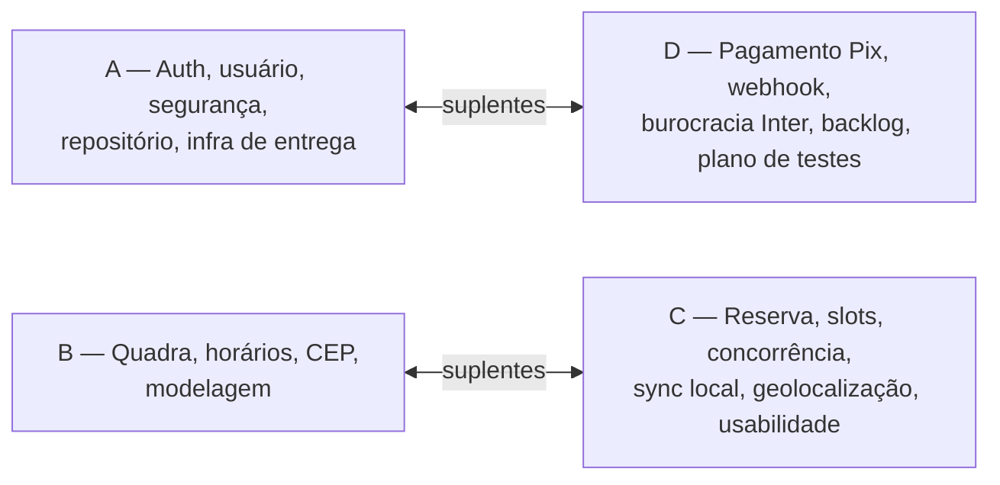

# 15 — Divisão da equipe

Divisão em quatro fatias verticais (backend + Android + documentação + testes por integrante), com suplentes cruzados, regras de Git que garantem commits dos 4 nas três pastas, estimativa de horas por fase, contribuições cruzadas planejadas, o que cada um defende sozinho na banca e os rituais semanais.

## 15.1 Princípio: fatias verticais, não camadas

A divisão "um faz Android, outro faz backend" foi rejeitada porque (a) o critério 7 da disciplina exige commits descritivos dos 4 com divisão clara, e um `git shortlog` concentrado em uma pasta por pessoa mostra o contrário do que a banca quer ver; (b) cada tela depende de um endpoint, e quem escreve os dois lados descobre o contrato cedo; (c) o risco R10 de docs/19-riscos.md (integrante concentrado em uma camada) é o mais barato de evitar por desenho.

Cada integrante é **dono de uma fatia do domínio** e entrega, nela, o controller/service/repository, as telas e ViewModels, o documento correspondente e os testes. O suplente revisa todos os PRs da fatia e sabe rodar e explicar o que ela faz.

## 15.2 Tabela de responsabilidades

| Integrante | Responsabilidade principal | Funcionalidades (backend) | Funcionalidades (Android) | Documentação | Testes | Entregas que lidera |
|---|---|---|---|---|---|---|
| **A** (suplente de D) | Autenticação, usuário, segurança, repositório e infra de entrega | `config/SecurityConfig` (stateless, JWT HS256), `JwtConfig`, `security/JwtService`, `LoginTentativasService` (RF04), `AuthController/Service` (RF01, RF02), `UsuarioController/Service` (RF05), `exception/GlobalExceptionHandler` + `CodigoErro` (RNF09), `OpenApiConfig`, tabela `usuario` no `V1`, `Dockerfile`, deploy Render + Neon, CI GitHub Actions | esqueleto do projeto (`libs.versions.toml`, tema light/dark), `di/AppContainer`, `AuthInterceptor`, `SessaoDataStore` (RF03), Splash, Login, Cadastro, Perfil, `Rotas.kt` + `AppNavHost` + bottom-navs, `CampoTextoValidado`, `ErroBox`, tela MinhasReservas (contribuição cruzada, US-31), APK release assinado + `adb install` | `README.md`, docs/01-visao-do-produto.md, docs/02-escopo-mvp.md, docs/03-perfis-e-permissoes.md, docs/05-requisitos-funcionais.md, docs/06-requisitos-nao-funcionais.md, docs/21-git-e-organizacao.md; editor de docs/00, 15, 16, 17, 19, 20 | `JwtServiceTest`, `AuthServiceTest` (bloqueio 5/15 min), `AuthControllerTest` (`@WebMvcTest`), `LoginViewModelTest`, `CadastroViewModelTest` | monorepo + Projects + CI (S1); `main` protegida; `git shortlog -sn -- backend android docs` toda sexta; `release/n1` (29/09) e tag `v0.1-n1`; Render + Neon (30/10); APK final; slides de arquitetura |
| **B** (suplente de C) | Quadra, HorarioFuncionamento, CEP e modelagem do banco | `QuadraController/Service/Repository` (RF06, RF07, RF08, RF10), `HorarioFuncionamentoController/Service/Repository` (RF11), `CepController/Service` + `integracao/cep/CepClient` BrasilAPI -> ViaCEP (RF09), regra de propriedade 403 (RN03), 409 `QUADRA_COM_RESERVAS`/`HORARIO_COM_RESERVAS` (RN16), `V1__init.sql` consolidado como fonte do DER, `scripts/seed-demo.sql` | `QuadraRepository` + `QuadraDao` + `QuadraEntity` (`quadra_cache`) + `Sincronizador` (RF23), telas Quadras (chips de esporte + filtro por cidade, S4), DetalheQuadra (parte estática), MinhasQuadras, FormQuadra (CEP, lat/lon editáveis), HorariosQuadra (`TimePicker`), grade de slots no DetalheQuadra (contribuição cruzada, US-28), Coil [Should] | docs/08-modelagem-banco.md, docs/09-arquitetura.md (justificativa das tecnologias e modelagem), docs/04-telas.md com protótipo Figma navegável (CP1) | `QuadraServiceTest` (propriedade, 409), `HorarioFuncionamentoServiceTest`, `CepClientTest` (fallback, `MockRestServiceServer`), `MigracaoFlywayTest` (migração do banco, US-47a), `QuadrasViewModelTest`, `QuadraDaoTest` [Should] | protótipo Figma no CP1; CRUD das 2 entidades ao vivo na N1 e na N2; seed com 3 quadras georreferenciadas; DER x banco real (S12) |
| **C** (suplente de B) | Reserva, slots, concorrência, sincronização local, geolocalização e usabilidade | `SlotService` (RF12, RN06, RN09), `ReservaService` + `ReservaFacade` (RF13, RN08, RN10, RN11, RN17), `ReservaController` (RF15, RF16, RF17), `ExpiracaoReservaJob` (RF14), transições por UPDATE condicional (RN13, RN15), `FusoConfig` (RNF12), rascunho do `V1` com `ux_reserva_slot_ativo` | `ReservaRepository` + `ReservaDao` + `ReservaEntity` (`reserva_cache`), `MonitorConectividade`, `BannerOffline`, ConfirmarReserva (409/422/502), DetalheReserva, `LocalizacaoProvider` + permissão + `Geo.kt` + "Abrir no Maps" (RF22), `NotificadorReserva` (RF24) [Should] | docs/07-regras-de-negocio.md (concorrência e transições), docs/12-persistencia-local.md, docs/13-recurso-nativo.md, docs/22-testes-com-usuarios.md (roteiro, SUS, resultados) | **`ReservaConcorrenciaIT`** (10 threads, Testcontainers), `SlotServiceTest` (fuso, funcionamento), `ReservaServiceTest` (transições, RN11, RN13), `ReservaControllerTest` (`@WebMvcTest`, US-47b), `ConfirmarReservaViewModelTest`, `SincronizadorTest` | demo da corrida com 2 celulares e do modo avião; condução dos testes com usuários (09–13/11); correções de usabilidade (S12) |
| **D** (suplente de A) | Pagamento Pix (Inter + simulado), webhook, burocracia Inter, backlog e plano de testes | `integracao/pix/` (`PixGateway`, `SimuladoPixGateway`, `PixPayloadBuilder` CRC16, `inter/InterPixGateway`, `inter/InterTokenService`, SSL bundle PEM), `PagamentoService` (RF19, RF20, RN12, RN14, RNF02), `PagamentoController`, `ConsultaPagamentoJob`, `DevPagamentoController` (RF21), `InterWebhookController` [Should], `application-simulado/inter-sandbox/inter-prod.yml`, `scripts/*.http`, `GET /quadras/{id}/reservas` (RF18, contribuição cruzada na fatia de C, US-33) | `PagamentoRepository`, tela Pagamento (QR via `QrCodeGerador`/ZXing, copiar, contador, polling com backoff, "Simular pagamento" em debug), `PixQrCode`, tratamento de 502/expirado, `BuildConfig.API_BASE_URL` por build type, pedido de `POST_NOTIFICATIONS` na tela Pagamento, tela ReservasQuadra (contribuição cruzada, US-33) | docs/11-integracao-pix-inter.md, docs/10-api-rest.md, docs/14-backlog.md (dono do board), docs/23-plano-de-testes.md (CT-xx por RF), docs/18-checklist-n2.md (roteiro da demo) | `PixPayloadBuilderTest` (CRC16 contra payload conhecido), `PagamentoServiceTest` (idempotência, valor divergente, tardio, cancelado), `InterPixGatewayTest` (`MockRestServiceServer`), `InterWebhookControllerTest` (array oficial), `PagamentoViewModelTest` | conta sandbox + integração (01/09); gates 02/09, 04/09, 18/09, 16/10; renovações 29/09, 27/10, 24/11; sandbox no app (23/10); kit de demo offline (S12–S13); roteiro e ensaio da demo |

Documentos coletivos (docs/00-indice.md, docs/15, 16, 17, 19, 20): cada um escreve a parte da própria fatia; A consolida e fecha o texto.

## 15.3 Suplentes e regras de Git

### Pares de suplência

| Titular | Suplente | O que o suplente faz durante o semestre | O que assume em ausência (R11) |
|---|---|---|---|
| A | D | revisa todo PR de auth/usuário/infra; sabe gerar o APK release e fazer o deploy no Render | login/sessão na demo, `adb install`, aquecer `/actuator/health` |
| D | A | revisa todo PR de pagamento; tem cópia do `.crt/.key` do sandbox no gerenciador de senhas do grupo; renova o certificado se D faltar em 29/09, 27/10 ou 24/11 | troca de profile (`inter-sandbox` -> `simulado`) e explicação do fluxo Pix |
| B | C | revisa todo PR de quadra/horário/CEP; sabe rodar o seed e o CRUD no Swagger | CRUD das 2 entidades ao vivo |
| C | B | revisa todo PR de reserva/slots/sync; sabe rodar `ReservaConcorrenciaIT` no terminal e a demo com 2 celulares | corrida de reserva e modo avião |

Os pares são cruzados de propósito: A<->D junta "segurança" com "pagamento" (as duas fatias com segredos e variáveis de ambiente) e B<->C junta "quadra/horários" com "slots/reservas" (as duas fatias que compartilham `SlotService` e as regras 409).

### Regras (valem desde o primeiro commit; detalhe operacional em docs/21-git-e-organizacao.md)

1. **Ninguém mergeia o próprio PR.** Todo PR precisa de 1 aprovação do suplente (ou de qualquer outro integrante se o suplente estiver ausente) e CI verde; o merge é feito pelo revisor.
2. **PR de tela recebe 1 commit do revisor** com a checagem de acessibilidade (`contentDescription`, 48 dp, fonte 200 %, TalkBack) — isso gera, de graça, commits de Android de quem revisa e prova o RNF07.
3. **Até a N1 cada integrante tem commits em `backend/`, `android/` e `docs/`.** Verificado toda sexta por A com `git shortlog -sn -- backend`, `-- android` e `-- docs`; quem estiver zerado em uma pasta recebe uma issue P daquela pasta na segunda seguinte.
4. **`git shortlog -sn --no-merges` toda sexta** anexado à demo interna; desvio maior que 2:1 entre o integrante com mais e com menos commits na semana vira item da reunião de segunda (R10).
5. Branches `feat/<area>-<descricao>`, `fix/...`, `docs/...`; commits em português no formato `feat(reserva): cria indice unico parcial anti-dupla-reserva (#US-25)`; PR < 400 linhas (G quebrada antes).
6. `main` protegida, sempre subindo com profile `simulado`; segredos nunca no Git (`.gitignore` do primeiro commit: `*.crt *.key *.pfx .env`).
7. Toda feature entra "fina mas completa": endpoint + tela + cache (se houver) + teste no mesmo PR ou em PRs encadeados na mesma semana; tela sem endpoint usa `FakeApiService` até o endpoint existir.

## 15.4 Estimativa de horas por integrante e fase

**Este é o único lugar do projeto onde o esforço total é calculado.** docs/14-backlog.md publica apenas a soma por marco e aponta para cá. A estimativa de ~197 h citada em docs/02-escopo-mvp.md cobre somente as funcionalidades dimensionadas por requisito; ela não é o esforço do backlog inteiro e não deve ser comparada com os números desta seção.

Orçamento: 4 x 10 h = ~40 h/semana; 15 semanas úteis (01/09 a 11/12) menos 4 feriados (07/09, 12/10, 02/11, 20/11) = ~560 h, ou ~190 h por fase de 5 semanas (~180 h na Fase 2, que tem dois feriados).

Como as horas abaixo são somadas:

- Estimativas P (3 h) e M (8 h) de docs/14-backlog.md, tratadas como tetos.
- História com responsável **"Todos" custa a estimativa por integrante**, conforme a convenção de docs/14-backlog.md §14.1: US-47a, US-47b, US-48, US-50 e US-55 são M e custam **32 h** cada (8 h em cada uma das quatro fatias); US-53, com três donos, custa **24 h**. Este era o erro do planejamento anterior, que somava essas seis histórias uma vez só.
- Histórias com dois donos que **não** são "Todos" contam uma vez e têm as horas rateadas: US-52 (M) fica 4 h em A (docs) e 4 h em B (Figma); US-46 (P) fica inteira em C, com a parte de D dentro dela; US-56 (M) fica inteira em D.
- Revisões de PR (~1 h/semana por pessoa) e rituais semanais (~1 h/semana por pessoa) entram como **10 h por pessoa em cada fase** de 5 semanas — 120 h no semestre.
- Soma das histórias: 591 h (mesma base da tabela por marco de docs/14-backlog.md §14.2).

| Integrante | Fase 1 — S1 a S5 (fundação, CP1, N1) | Fase 2 — S6 a S10 (reserva, Pix, offline, nativo, CP2) | Fase 3 — S11 a S15 (usuários, correções, doc final, N2) | Total |
|---|---|---|---|---|
| **A** | 89 h — 79 h de histórias (US-01, US-02, US-06 a US-11, US-47a, US-52 docs, US-54) + 10 h | 51 h — 41 h de histórias (US-12, US-31, US-47b, US-48, US-57 a US-59) + 10 h | 26 h — 16 h de histórias (US-50, US-55 como editor) + 10 h, mais shortlog, APK final e slides | **166 h** |
| **B** | 105 h — 95 h de histórias (US-03, US-13 a US-21, US-47a, US-52 Figma, US-53 docs 08/09) + 10 h | 45 h — 35 h de histórias (US-23, US-28, US-43, US-47b, US-48) + 10 h | 26 h — 16 h de histórias (US-50, US-55 parte) + 10 h, mais DER x banco real e slides | **176 h** |
| **C** | 66 h — 56 h de histórias (US-04, US-24 a US-27, US-47a, US-53 docs 12/13) + 10 h | 79 h — 69 h de histórias (US-22a a US-22c, US-29, US-30a a US-30c, US-32, US-44, US-45, US-46, US-47b, US-48) + 10 h | 34 h — 24 h de histórias (US-49 condução, US-50, US-55 parte) + 10 h, mais docs/22 e slides | **179 h** |
| **D** | 66 h — 56 h de histórias (US-05a a US-05c, US-34, US-35a a US-35c, US-36, US-37a, US-37b, US-47a, US-53 docs 10/11) + 10 h, mais o board | 82 h — 72 h de histórias (US-33, US-38 a US-42, US-47b, US-48, US-51) + 10 h | 42 h — 32 h de histórias (US-50, US-55 parte, US-56 roteiro e ensaios, US-60) + 10 h, mais renovação 24/11 e profile da apresentação | **190 h** |
| **Soma** | **326 h** | **257 h** | **128 h** | **711 h** |
| Capacidade da fase | ~190 h | ~180 h | ~190 h | **~560 h** |
| Saldo | **-136 h** | **-77 h** | +62 h | **-151 h** |

Leitura do equilíbrio:

- **O plano não cabe.** São 711 h planejadas (591 h de histórias + 60 h de revisões de PR + 60 h de rituais) contra ~560 h disponíveis: déficit de 151 h, 27 % do orçamento. Spikes, o bug bash de S13 e o ensaio da véspera ainda não estão quantificados e entram por cima disso. As opções de corte, em ordem de preferência, estão em docs/14-backlog.md, seção "Ajuste de escopo necessário"; a decisão é do grupo no Checkpoint 1 (11/09) e **esta tabela só fecha depois dela**.
- O déficit está concentrado na Fase 1 (-136 h): fundação, CP1 e N1 acontecem juntos e as histórias de custo multiplicado começam justamente ali, com US-47a e US-53. A Fase 3 é a única com folga (+62 h) e não compensa o resto, porque o prazo da N1 é rígido.
- A diferença entre o mais e o menos carregado no semestre é de 24 h (A com 166 h, D com 190 h), acima das 8 h que o planejamento anterior declarava.
- A Fase 1 é a mais pesada para B (105 h: 9 histórias de quadra/horário/CEP + Figma) e é onde C, com menos telas, revisa os PRs de B e escreve o `V1`. Por isso a redistribuição do caminho crítico de C não foi feita via B, que é o suplente dele: US-33 foi para D (ver §15.5).
- A Fase 2 segue sendo a mais pesada para C e D. As duas telas já deslocadas da fatia de C continuam valendo: grade de slots (US-28) com B e MinhasReservas (US-31) com A.
- As semanas S6 e S12 tinham carga planejada abaixo de 40 h para absorver provas de outras disciplinas (R9); com o déficit atual essa reserva não existe mais até que o corte seja decidido.

## 15.5 Contribuições cruzadas planejadas

Além das revisões, cada integrante escreve código dentro da fatia de outro. Isso é planejado (não acidental) para que o `git shortlog` mostre os 4 em todas as pastas e para que o suplente conheça o código que pode ter de defender.

| Quem | O que faz | Na fatia de | Quando | Por quê |
|---|---|---|---|---|
| B | grade de slots no DetalheQuadra (US-28) consumindo `GET /quadras/{id}/slots` de C | C | S6 | a tela é de B; B e C fecham juntos o contrato `SlotResponse`; alivia C na fase 2 |
| A | tela MinhasReservas (US-31) usando `ReservaRepository` de C | C | S6 | A já domina `ChipStatus` e os estados de tela; alivia C |
| C | rascunho do `V1__init.sql` com `ux_reserva_slot_ativo` (US-04), consolidado por B | B | S1–S2 | quem prova a concorrência escreve o índice; B mantém o DER |
| D | `PagamentoRepository` no Android e o pedido de `POST_NOTIFICATIONS` na tela Pagamento, que dispara o `NotificadorReserva` de C | C | S6, S9 | a permissão é pedida na tela de D, a notificação é código de C |
| D | listagem e cancelamento de reservas pelo dono (US-33): `GET /quadras/{id}/reservas` e a tela ReservasQuadra | C | S8 | o caminho crítico passava quase todo por C (slots, reserva, concorrência, cache de reservas, geolocalização, condução dos testes com usuários, quatro documentos); D tem S8 com apenas o sandbox e o suplente de C (B) já é o mais carregado da Fase 1, então a carga saiu para fora do par B<->C |
| A | `Dockerfile`, Secret Files do `.crt/.key` no Render e `SPRING_PROFILES_ACTIVE=inter-sandbox` (US-58) | D | S8–S9 | A é suplente de D e precisa saber trocar o profile na demo |
| D | `X-Dev-Key` e o `@Profile` do `DevPagamentoController` passam pela `SecurityConfig` de A | A | S3 | D ajusta a rota `/dev` e o `permitAll` do webhook; A revisa |
| C | `SincronizadorTest` e a integração do `Sincronizador` (de B) com `reserva_cache` | B | S7 | o mesmo `Sincronizador` serve às duas tabelas; C garante que funciona para reservas |
| B | seed `scripts/seed-demo.sql` com 2 reservas (CONFIRMADA amanhã, EXPIRADA ontem) e 1 pagamento PAGO | C, D | S3–S4 | o seed exercita entidades das três fatias |
| Todos | 1 commit de acessibilidade em cada PR de tela que revisam (regra 2) | todas | contínuo | RNF07 com evidência distribuída |
| Todos | 1 sessão de teste com usuários conduzida (US-49) e 1 correção do top-5 (US-50) | C (usabilidade) | S11–S12 | resultado do SUS é responsabilidade de todos |

## 15.6 O que cada um defende sozinho na banca

| Integrante | Tema que deve explicar sem ajuda (e a evidência que abre em < 1 min) |
|---|---|
| **A** | JWT HS256 com `NimbusJwtEncoder/Decoder` sem jjwt (por que: Jackson 3 no Boot 4), sessão stateless, BCrypt custo 10, bloqueio 5 falhas/15 min, `JWT_SECRET` em variável de ambiente e a limitação "sem revogação"; navegação tipada com `@Serializable` e os dois grafos por perfil; `SessaoDataStore` e o tratamento único de 401; por que DI manual (`AppContainer`) e não Hilt; pipeline de release, Render + Neon, `adb install` e a verificação de desenvolvedor do Google. Evidência: Swagger com 401/403/429, `Rotas.kt`, `git shortlog`. |
| **B** | Por que `TipoEsporte` é enum e não tabela; por que `horario_funcionamento` com uma linha por dia e slots calculados em memória (e não slots persistidos); `dia_semana` 1..7 = `DayOfWeek`; CEP -> endereço + lat/lon via BrasilAPI com fallback ViaCEP e por que passa pelo backend; CRUD completo das 2 entidades com endpoints individuais; DER e `V1__init.sql`; `quadra_cache` com PK composta `(id, escopo)`. Evidência: `POST /quadras` 403 com token CLIENTE; tela HorariosQuadra disparando `POST/PUT/DELETE`; DER. |
| **C** | Índice único parcial `ux_reserva_slot_ativo` + `saveAndFlush` + 409 e por que não há lock pessimista nem `@Version`; `ReservaConcorrenciaIT` com 10 threads; expiração e transições por UPDATE condicional; cobrança fora da transação (`ReservaFacade`); fuso único America/Sao_Paulo; "cache primeiro, servidor vence", escritas só online e o que aparece em modo avião; geolocalização (cadeia de fallback, permissão aproximada, sem GMS) e `Intent geo:`; resultados do SUS. Evidência: 2 celulares no mesmo slot + IT no terminal; modo avião; card "a 2,3 km". |
| **D** | OAuth2 `client_credentials` + mTLS com SSL bundle PEM (sem PFX, sem SDK); escopos e por que `pix.write`/`webhook.write` entram; cobrança imediata `PUT /pix/v2/cob/{txid}` com expiração 900 s; polling (app com backoff + job com teto de 50/ciclo) versus webhook e por que o webhook é recomendado e não obrigatório; confirmação idempotente e casos tardio/cancelado (`ESTORNO_MANUAL`); por que existe o `SimuladoPixGateway` e como o `PixPayloadBuilder` monta o BR Code (TLV + CRC16); o que não é armazenado (RNF02, RN05); sandbox 8h–20h, certificado de 30 dias e os gates. Evidência: QR na tela, `POST /dev/.../confirmar`, status CONCLUIDA no sandbox, `docs/23` com CT-xx. |

**Plano B da fatia do Integrante D.** Se a conta de desenvolvedor do sandbox exigir CNPJ (risco de probabilidade média já registrado em docs/19-riscos.md), saem da fatia de D cerca de 40 h de trabalho de integração (US-39 a US-42) e a defesa individual dele perde a evidência principal. Nesse caso: D mantém US-33, a listagem e o cancelamento de reservas pelo dono, e assume também o banner de modo offline (`BannerOffline`, US-44); passa a co-defender a persistência local junto com C; e mantém como tema próprio, sozinho, a construção do payload do código de pagamento (`PixPayloadBuilder`, BR Code TLV + CRC16) e a máquina de estados do pagamento (PENDENTE -> PAGO/EXPIRADO, confirmação idempotente, tardio e cancelado), que existem no `SimuladoPixGateway` e não dependem do banco.

Regra de ensaio: em S14 cada integrante apresenta a própria parte para os outros três, que fazem as perguntas que a banca faria; em S15 os suplentes apresentam a parte do titular uma vez (garantia contra ausência).

## 15.7 Rituais semanais

| Ritual | Quando | Duração | Conteúdo | Saída |
|---|---|---|---|---|
| Planejamento | segunda (ou terça após feriado: 08/09, 13/10, 03/11) | 30 min | mover issues para "Semana atual" respeitando ~40 h (P=3, M=8); quebrar G; confirmar itens `inter` com data na semana; checar se algum Must está atrasado antes de puxar Should | board da semana; ata curta em `docs/atas/AAAA-MM-DD.md` (3 linhas: decisões, riscos, pendências) |
| Demo interna | sexta | 15 min | cada um mostra o que roda no `main` (não em branch); A mostra `git shortlog -sn --no-merges -- backend android docs` da semana; D atualiza o board | lista de bugs como issues `bug`; ajuste de milestone se necessário |
| Revisão de PR | contínuo, prazo de 24 h úteis | — | suplente revisa, roda localmente e faz o commit de acessibilidade em PR de tela | PR mergeado pelo revisor |
| Checagem Inter | nas datas: 02/09, 04/09, 18/09, 29/09, 16/10, 23/10, 27/10, 30/10, 24/11, 27/11 | 10 min | D reporta o gate e a decisão de fallback (docs/11-integracao-pix-inter.md e docs/19-riscos.md) | decisão registrada na ata |
| Bug bash cruzado | S10 (antes do CP2) e S13 (antes do congelamento) | 2 h | cada um testa a fatia do outro seguindo os CT-xx de docs/23-plano-de-testes.md com TalkBack e fonte 200 % | issues `bug`/`usabilidade` com severidade |
| Ensaio da demo | S14 (2x) e véspera da apresentação | 1 h | roteiro de 8 min de docs/18-checklist-n2.md nos dois modos (Render + sandbox dentro de 8h–20h; kit offline + simulado) | checklist do dia preenchido |

Comunicação: um grupo de mensagens para o dia a dia, mas toda decisão vai para a ata ou para o comentário da issue — o que não está no repositório não existe.
