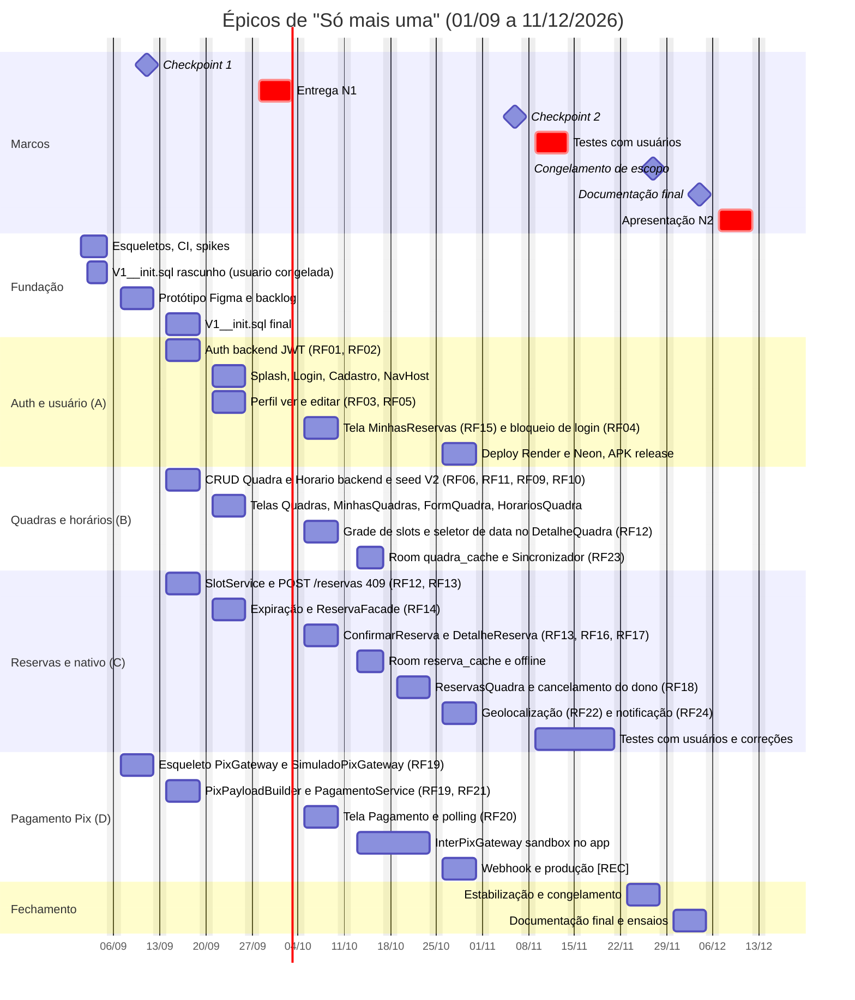

# 16. Cronograma semanal (01/09 a 11/12/2026)

Plano de 15 semanas (S1 a S15) para o app "Só mais uma", com objetivo, atividades por integrante (com a história `US-nn` correspondente), entregável e gates de cada semana, feriados descontados, os gates do Banco Inter que mexem na semana e regras de corte em caso de atraso.

## 16.1 Parâmetros do plano

| Parâmetro | Valor |
|---|---|
| Período | ter 01/09/2026 a sex 11/12/2026 (15 semanas) |
| Orçamento | 4 integrantes x 10 h/semana = 40 h/semana; ~560 h no total (S1 é parcial e 4 semanas têm feriado) |
| Feriados descontados | seg 07/09 (S2), seg 12/10 (S7), seg 02/11 (S10), sex 20/11 (S12) — cada um retira 8 h da semana |
| Marcos oficiais | Checkpoint 1 sex 11/09 · Entrega N1 28/09 a 02/10 · Checkpoint 2 sex 06/11 · Testes com usuários 09 a 13/11 · Congelamento de escopo sex 27/11 · Documentação final sex 04/12 · Apresentação N2 07 a 11/12 |
| Semanas de folga | S6 (30 h planejadas de 40; 10 h de reserva para pendências da N1) e S12 (24 h planejadas de 32; 8 h de reserva para correções dos testes com usuários); a diferença é reserva intencional e não é preenchida no planejamento de segunda-feira |
| Rituais | seg 30 min de planejamento (board em docs/14-backlog.md); sex 15 min de demo interna do que roda no `main` + `git shortlog -sn -- backend android docs` (A); PR < 400 linhas com aprovação do suplente e CI verde (ver docs/21-git-e-organizacao.md) |
| Estimativas | P <= 3 h, M <= 8 h, G <= 16 h (G obrigatoriamente quebrada em issues menores). A soma da coluna Est. de cada semana é conferida com P = 3 h, M = 8 h e G = 16 h e tem de caber nas horas úteis da semana; nenhum integrante passa de ~10 h na semana (~8 h nas semanas com feriado) |
| Definição de "semana entregue" | o entregável da semana está no `main`, o CI está verde e foi demonstrado na sexta |
| Legenda | **[INTER]** = burocracia/gate do Banco Inter (ver docs/11-integracao-pix-inter.md); **[REC]** = recomendado; **[OPC]** = opcional; prioridades por RF em docs/05-requisitos-funcionais.md |
| Coluna US | toda tabela de atividades traz o identificador da história em docs/14-backlog.md (`US-nn`), que é o mesmo número da issue no GitHub Projects; `—` quando a atividade não tem história (ritual, gate, burocracia ou item [OPC]) |

## 16.2 Visão geral

| Sem. | Datas (seg–sex) | Horas úteis | Objetivo | Marco / gate |
|---|---|---|---|---|
| S1 | ter 01/09 – sex 04/09 | 32 | Fundação, burocracia Inter, spikes | [INTER] 01/09 sandbox · 02/09 gate PF · 04/09 `curl` mTLS + decisão CNPJ |
| S2 | 07/09 (feriado) – sex 11/09 | 32 | Só o que o CP1 avalia: escopo, protótipo navegável, backlog priorizado + esqueletos | **Checkpoint 1 (sex 11/09)** |
| S3 | 14/09 – 18/09 | 40 | Auth backend, `V1__init.sql` final e backend das 4 fatias no Swagger | [INTER] 18/09 pedido de produção (se houver CNPJ) |
| S4 | 21/09 – 25/09 | 40 | Login no emulador + 7 telas da N1 + documentação v1 + IT de concorrência | — |
| S5 | 28/09 – 02/10 | 40 | **Entrega N1** | congelar `release/n1` ter 29/09 · [INTER] 29/09 renovar certificado · tag `v0.1-n1` |
| S6 | 05/10 – 09/10 | 40 (30 planejadas) | Reserva e pagamento ponta a ponta com `SimuladoPixGateway` (tela Pagamento, polling, bloqueio de login) | folga de 10 h |
| S7 | 12/10 (feriado) – sex 16/10 | 32 | Inter sandbox dentro do app + Room | [INTER] **sex 16/10 go/no-go produção** |
| S8 | 19/10 – 23/10 | 40 | Sandbox estabilizado + telas do dono | [INTER] 23/10 sandbox no app (criar -> pagar -> CONCLUIDA) |
| S9 | 26/10 – 30/10 | 40 | Recurso nativo + beta na nuvem | [INTER] ter 27/10 renovar certificado · 30/10 Render em HTTPS (webhook) |
| S10 | 02/11 (feriado) – sex 06/11 | 32 | Bug bash, acessibilidade, roteiro de testes | **Checkpoint 2 (sex 06/11)** · `release/beta` qua 04/11 · tag `v0.2-beta` |
| S11 | 09/11 – 13/11 | 40 | **Testes com usuários** | docs/22-testes-com-usuarios.md com SUS |
| S12 | 16/11 – 20/11 (feriado sex) | 32 (24 planejadas) | Correções de usabilidade | folga de 8 h · tag `v0.9-rc` |
| S13 | 23/11 – 27/11 | 40 | Últimas features e estabilização | **Congelamento de escopo (sex 27/11)** · [INTER] ter 24/11 renovar certificado · profile da demo fixado · tag `v1.0-rc1` |
| S14 | 30/11 – 04/12 | 40 | **Documentação final (sex 04/12)** + ensaio geral 1 | tag `v1.0` |
| S15 | 07/12 – 11/12 | 40 | **Apresentação N2** | checklist do dia em docs/18-checklist-n2.md |

## 16.3 Gantt resumido por épico

Versão textual (15 semanas): fundação e CP1 (S1–S2) -> auth backend e CRUDs (S3) -> telas da N1 e documentação v1 (S4) -> N1 (S5) -> reserva e pagamento simulado (S6) -> sandbox Inter e Room (S7–S8) -> geolocalização e nuvem (S9) -> CP2 (S10) -> usuários (S11) -> correções (S12) -> congelamento (S13) -> documentação (S14) -> N2 (S15).

## 16.4 Detalhe semana a semana

### S1 — ter 01/09 a sex 04/09 (32 h) — Fundação, burocracia e spikes

Objetivo: os dois projetos compilando nos 4 notebooks, repositório organizado e a incerteza do Inter resolvida antes de qualquer tela.

| Integrante | Atividades | US | Est. |
|---|---|---|---|
| Todos | 3 h de spike cada (Compose + Navigation tipada; Boot 4 + Jackson 3 `tools.jackson`); instalar JDK 21, Android Studio Quail 4, Docker | — | P por integrante (12 h) |
| A | Monorepo `so-mais-uma/` (`backend/`, `android/`, `docs/`, `scripts/`, `README.md`); `.gitignore` com `*.crt *.key *.pfx .env` no primeiro commit; `main` protegida; CI GitHub Actions (build backend + `assembleDebug`) | US-01 | P |
| A | Esqueleto do backend: Spring Initializr Boot 4.1.x, JDK 21, Gradle Kotlin DSL, `compose.yaml` com `postgres:18-alpine`, Flyway, springdoc, profile padrão `simulado` | US-02 | P |
| B | Projeto Android (AGP 9.4, Kotlin 2.4.10, Compose BOM 2026.08.00, `gradle/libs.versions.toml`, minSdk 26, compileSdk/targetSdk 37, KSP para Room 3); tema com `lightColorScheme`/`darkColorScheme` | US-03 | P |
| C | Rascunho de `V1__init.sql` com as 5 tabelas e o índice `ux_reserva_slot_ativo`; **a tabela `usuario` é congelada já no rascunho** (é a única que não depende de `reserva`), de modo que a auth backend da S3 começa sem esperar o resto do script, que fecha na S3; decisão de `FusoConfig` (`America/Sao_Paulo`, RNF12) | US-04 | P |
| D | **[INTER] 01/09**: conta em developers.inter.co/sandbox, integração sandbox, download de `.crt/.key` (validade 30 dias), `curl` de token | US-05 | P |

Entregável: 2 projetos buildando nos 4 notebooks; token do sandbox 200 (ou fallback acionado); RF/RNF/RN v0 em docs/05, 06 e 07; rascunho de `V1__init.sql` com a tabela `usuario` congelada.

Gates: **02/09** conta sandbox criada por PF? (se exigir CNPJ: `SimuladoPixGateway` vira o gateway da demo; API externa obrigatória fica coberta por BrasilAPI CEP, RF09) · **04/09** `curl` mTLS -> token 200 -> `PUT /pix/v2/cob/{txid}` 201 no sandbox; o grupo registra se há **CNPJ não-MEI** disponível (integrante, família, empresa parceira).

### S2 — 07/09 (feriado) a sex 11/09 (32 h) — Checkpoint 1

Objetivo: **a semana inteira serve ao que será avaliado em sex 11/09** — escopo, protótipo navegável e backlog priorizado —, mais os esqueletos dos projetos que faltavam (interface `PixGateway` e `SimuladoPixGateway`, sobre os projetos backend e Android já buildando desde a S1). Tudo o que o marco não cobra saiu para a S3: auth backend com testes, `V1__init.sql` final, `PixPayloadBuilder` com teste e os documentos v1 de RF/RNF/RN; o bloqueio de login (RF04) é `must-n2` e foi para a S6.

| Integrante | Atividades | US | Est. |
|---|---|---|---|
| A | docs/01-visao-do-produto.md, docs/02-escopo-mvp.md (Must/Should/Could/Fora) e docs/03-perfis-e-permissoes.md v1 | US-52 | M |
| B | Figma navegável com as 13 telas + Splash (docs/04-telas.md) | US-52 | M |
| C | DER inicial em docs/08-modelagem-banco.md; revisão cruzada do rascunho de `V1__init.sql` com B (a versão final fecha na S3) | US-04 | M |
| D | GitHub Projects com labels `must-n1/must-n2/should/could/fora-mvp` e as issues `must-n1` estimadas (P/M/G); docs/14-backlog.md v1; interface `PixGateway` + esqueleto de `SimuladoPixGateway`; [INTER] decisão sobre CNPJ registrada em docs/11 | US-52, US-34, US-05 | M |

Entregável (**CP1, sex 11/09**): escopo, protótipo navegável, backlog priorizado e lista FORA do MVP (docs/02, 04, 14).

### S3 — 14/09 a 18/09 (40 h) — Backend das 4 fatias

Objetivo: backend das 4 fatias visível no Swagger, com a auth pronta para o app e o `V1__init.sql` fechado. Semana que recebe o excedente das S1–S2: auth backend, versão final do script do banco e `PixPayloadBuilder`.

| Integrante | Atividades | US | Est. |
|---|---|---|---|
| A | Auth backend: `POST /auth/registrar`, `POST /auth/login`, `JwtConfig` (Nimbus HS256), BCrypt custo 10, e-mail único -> 409 (RF01, RF02); `JwtServiceTest` e `AuthServiceTest` | US-06, US-47a | M + P |
| B | `QuadraController/Service/Repository`, `HorarioFuncionamentoController/Service/Repository`, regra de propriedade (RN03, 403), `CepClient` BrasilAPI -> ViaCEP + `GET /cep/{cep}` (RF06, RF09, RF11); `scripts/seed-demo.sql` (2 usuários, 3 quadras georreferenciadas, horários seg–dom, 2 reservas); `DELETE /quadras/{id}` com 409 `QUADRA_COM_RESERVAS` (RF10, RN16) | US-13, US-14, US-15, US-16 | M |
| C | `V1__init.sql` final (revisão cruzada com B; fecha as tabelas que dependem de `reserva`, já que `usuario` foi congelada na S1); `SlotService` (RN06, RN09); `POST /reservas` com índice único -> 409 (RF13, RN08) | US-04, US-24, US-25 | P + M |
| D | `PagamentoService`, `SimuladoPixGateway`, `DevPagamentoController` (`POST /dev/pagamentos/{txid}/confirmar` com JWT + `X-Dev-Key`) (RF19, RF21); `PixPayloadBuilder` (TLV + CRC16-CCITT) + `PixPayloadBuilderTest`; **[INTER] 18/09**: se há CNPJ, integração de produção solicitada no Internet Banking PJ | US-35, US-36, US-34, US-47a | M |

Entregável: Swagger com auth, quadras, horários e reservas; fluxo simulado ponta a ponta via Swagger até sex 18/09 (reserva -> cobrança -> `/dev/.../confirmar` -> CONFIRMADA).

### S4 — 21/09 a 25/09 (40 h) — Telas da N1 e documentação v1

Objetivo: login no emulador contra a API real e as 7 telas obrigatórias da N1 funcionando; documentos v1; teste de concorrência verde no CI. Só entram itens `must-n1`: é a semana anterior ao marco (regra 1 de 16.6).

| Integrante | Atividades | US | Est. |
|---|---|---|---|
| A | Splash, Login, Cadastro, `Rotas.kt`, `AppNavHost` (2 grafos), `SessaoDataStore`, `AppContainer`, `AuthInterceptor` (RF01–RF03 no app); `AuthControllerTest` (`@WebMvcTest`); `GlobalExceptionHandler` completo com `CodigoErro` (RNF09), tratamento de 401/409/offline no app, `CampoTextoValidado`, `ErroBox`; Perfil ver e editar (`GET`/`PUT /usuarios/me`, nome, telefone, senha; Sair) (RF03, RF05) | US-07, US-08, US-09, US-10, US-11, US-47a | M + P |
| B | Telas Quadras (filtros por esporte e por cidade, RF07), DetalheQuadra estático (RF08), MinhasQuadras, FormQuadra com busca de CEP e lat/lon editáveis, HorariosQuadra com `TimePicker` (RF06, RF09, RF11); `QuadraServiceTest`, `HorarioFuncionamentoServiceTest`, `CepClientTest`; docs/08 final + docs/09 (justificativa das tecnologias) | US-17, US-18, US-19, US-20, US-21, US-47a, US-53 | M + P |
| C | `ExpiracaoReservaJob` com UPDATE condicional (RF14, RN10), `ReservaFacade` (cobrança fora da transação, RN17); `ReservaConcorrenciaIT` (Testcontainers, 10 threads: 1x201 + 9x409) | US-26, US-27 | M |
| D | `GET /reservas/{id}/pagamento` (txid, status, valor, `pixCopiaECola`, expiração); docs/10-api-rest.md v1 e docs/11 v1; docs/05, 06 e 07 de v0 para v1 (revisão cruzada com A) | US-37a, US-53, US-52 | M |

Entregável: 7 telas funcionais (Login, Cadastro, Quadras, DetalheQuadra, MinhasQuadras, FormQuadra, HorariosQuadra); docs/01 a 11 v1; IT de concorrência verde no CI.

### S5 — 28/09 a 02/10 (40 h) — Entrega N1

Objetivo: entregar e apresentar a N1 com repositório congelado. Checklist completo em docs/17-checklist-n1.md.

| Dia | Atividade | US | Responsável |
|---|---|---|---|
| seg 28/09 | Bug bash interno; fechar os últimos PRs `must-n1`; README completo com tabela de versões | US-54 | todos · A |
| ter 29/09 | Congelar `release/n1` (a partir de `main`; depois só hotfix via PR); **[INTER] renovar certificado sandbox** (o de 01/09 vence 01/10) | US-54, US-05 | A · D |
| qua 30/09 | Teste do README em máquina limpa por integrante que não o escreveu (C); correções de README | US-54 | C · A |
| qui 01/10 | Vídeo de backup de 2 min; ensaio do roteiro de 5 min (2 vezes); tag `v0.1-n1` | US-54 | D · todos · A |
| sex 02/10 | Apresentação da N1 (ou no dia marcado dentro da janela 28/09–02/10) | — | todos |

Entregável (**N1**): documentação, modelagem, arquitetura, protótipo, app parcialmente funcional, repositório organizado, tag `v0.1-n1`.

### S6 — 05/10 a 09/10 (40 h, 30 h planejadas) — Reserva ponta a ponta com simulado

Objetivo: o cliente reserva, paga (simulado) e vê CONFIRMADA dentro do app. Semana de folga: 10 h reservadas para pendências apontadas na N1. Recebe o que saiu das S2 e S4: tela Pagamento com a consulta periódica de status e o bloqueio de login.

| Integrante | Atividades | US | Est. |
|---|---|---|---|
| C | ConfirmarReserva com 409/422/502 (RF13), DetalheReserva com editar observação e cancelar (RF16, RF17, RN13) | US-29, US-30, US-32 | M |
| D | Tela Pagamento v1 (QR via `QrCodeGerador`/ZXing) com simulado; polling do app (5 s por 2 min, depois 10 s), contador regressivo, `ConsultaPagamentoJob` (60 s, <= 10 por ciclo) (RF19, RF20) | US-37b, US-38 | M |
| B | Grade de slots e seletor de data no DetalheQuadra (RF12), com C revisando o contrato de `SlotResponse`; ajustes pós-N1 e revisão dos PRs de C | US-28 | M |
| A | Tela MinhasReservas (RF15) | US-31 | P |
| A | Bloqueio do login por 15 min após 5 falhas seguidas (`LoginTentativasService` em memória, 429 `LOGIN_BLOQUEADO`, RF04) — única semana em que a funcionalidade aparece; esqueleto de docs/23-plano-de-testes.md | US-12 | P |

30 h planejadas de 40 h úteis: as 10 h restantes são reserva intencional para as pendências apontadas na N1 e não devem ser preenchidas no planejamento de segunda-feira.

Entregável: reservar -> pagar (simulado) -> CONFIRMADA no app.

### S7 — 12/10 (feriado) a sex 16/10 (32 h) — Inter sandbox no app + Room

Objetivo: cobrança real criada no sandbox pelo app; app abre offline com cache.

| Integrante | Atividades | US | Est. |
|---|---|---|---|
| D | `InterPixGateway` (RestClient + SSL bundle PEM, `InterTokenService` com cache de 55 min, `PUT`/`GET /pix/v2/cob/{txid}`), `application-inter-sandbox.yml` | US-39 | M |
| D | **[INTER] sex 16/10: go/no-go de produção** (integração "Ativo" + cobrança real de R$ 1,00 testada; senão produção sai definitivamente) | US-42 | P |
| B | Room `quadra_cache` (`QuadraEntity`, PK composta `id + escopo`), `QuadraDao`, `Sincronizador` (RF23) | US-43 | M |
| C | Room `reserva_cache` (com `pixCopiaECola` e `expiraEm`), `ReservaDao`, `BannerOffline`, `MonitorConectividade` (RF23, RNF11) | US-44 | M |
| A | `Dockerfile` multi-stage (`eclipse-temurin:21-jre`) antecipado de S8, com o backend subindo em contêiner no notebook | US-57 | P |

Entregável: cobrança real no sandbox criada pelo app (dentro de 8h–20h, seg–sex); app abre offline com cache.

### S8 — 19/10 a 23/10 (40 h) — Sandbox estabilizado + fatia do dono

Objetivo: fluxo completo em `inter-sandbox`; dono gerencia reservas recebidas.

| Integrante | Atividades | US | Est. |
|---|---|---|---|
| D | `/dev/pagamentos/{txid}/confirmar` em `inter-sandbox` repassando para `POST /pix/v2/cob/pagar/{txid}` (escopo `pix.write`) -> `ConsultaPagamentoJob` detecta CONCLUIDA (RF20, RF21; **meta sex 23/10**); teste de webhook com `ngrok` e registro em docs/11 se o sandbox dispara; `PagamentoServiceTest`, `InterPixGatewayTest` | US-40, US-47b | M + P |
| C | ReservasQuadra (RF18), cancelamento pelo dono com motivo (RN13), casos de borda de pagamento tardio/cancelado (RN14, log `ESTORNO_MANUAL`); `ReservaServiceTest`, `ReservaFacadeTest` (revisão de D) | US-33, US-45, US-47b | M + P |
| B | 409 `HORARIO_COM_RESERVAS` em `PUT`/`DELETE` de horário (RN16) | US-15 | M |
| A | Pipeline de release (assinatura do APK, `BuildConfig.API_BASE_URL` por build type) completando o `Dockerfile` de S7 | US-57 | P |

Entregável: criar -> pagar -> CONCLUIDA -> CONFIRMADA em `inter-sandbox`; decisão sobre webhook documentada.

### S9 — 26/10 a 30/10 (40 h) — Recurso nativo + beta na nuvem

Objetivo: lista de quadras com distância; backend público; APK instalável via `adb`.

| Integrante | Atividades | US | Est. |
|---|---|---|---|
| C | Geolocalização (RF22): `LocalizacaoProvider` (cadeia `getCurrentLocation` -> `lastLocation` -> DataStore -> sem distância), permissão pedida no card "Ativar localização", `Geo.kt` (Haversine), ordenação por proximidade, "Abrir no Maps" via Intent `geo:`; `NotificadorReserva` (RF24) [REC] | US-22, US-46 | M + P |
| A | Deploy **Render + Neon** (**meta sex 30/10**), variáveis de ambiente e Secret Files; APK release assinado; `adb install` em 2 celulares; avaliar conta de distribuição limitada do Google | US-58, US-59 | M + P |
| D | **[INTER] ter 27/10: renovar certificado sandbox**; cadastrar webhook `PUT /pix/v2/webhook/{chave}` se o Render estiver em HTTPS [REC] | US-05, US-41 | P + M |
| B | Coil para `foto_url` [REC] — só com todos os OBR verdes | US-23 | P |

Entregável: backend público; APK beta nos 4 celulares; lista com "a 2,3 km".

### S10 — 02/11 (feriado) a sex 06/11 (32 h) — Checkpoint 2

Objetivo: beta funcional aprovado; roteiro dos testes com usuários pronto.

| Integrante | Atividades | US | Est. |
|---|---|---|---|
| Todos | Bug bash cruzado (cada um testa a fatia do outro, ter 03/11); acessibilidade básica em cada tela (RNF07: `contentDescription`, alvos 48 dp, fonte 200 %, TalkBack) com 1 commit do revisor por tela | US-48 | P por integrante (12 h) |
| C | Roteiro dos testes com usuários (docs/22: 6 tarefas, SUS, termo de consentimento); recrutar 5–8 usuários com B | US-49 | M |
| D | docs/23 com CT-xx por RF executados e resultado registrado | US-51 | M |
| A | Congelar `release/beta` qua 04/11; tag `v0.2-beta`; `/actuator/health` aquecido antes do CP2 | — | P |

Entregável (**CP2, sex 06/11**): beta funcional com profile `inter-sandbox` (ou `simulado` se fora do horário do sandbox).

### S11 — 09/11 a 13/11 (40 h) — Testes com usuários

Objetivo: medir usabilidade real (RNF06) sem alterar escopo.

| Integrante | Atividades | US | Est. |
|---|---|---|---|
| C | Conduz as sessões: 5–8 usuários (mín. 3 CLIENTE, 2 DONO), APK via `adb`, observação + SUS + 3 perguntas abertas; consolida docs/22 | US-49 | M + P |
| A, B, D | Cada um conduz >= 1 sessão; abrem issues `usabilidade` com severidade; corrigem só bugs críticos (crash, dado errado) | US-49, US-50 | M por integrante (24 h) |
| D | Render em `SPRING_PROFILES_ACTIVE=simulado` de seg 09/11 a sex 13/11 (docs/22 §3), para que as sessões não dependam do horário nem do certificado do sandbox; D devolve para `inter-sandbox` na seg 16/11 | — | P |

Entregável: docs/22 com taxa de sucesso por tarefa, SUS e top-5 problemas.

### S12 — 16/11 a 20/11 (feriado sex) (32 h, 24 h planejadas) — Correções de usabilidade

Objetivo: fechar o top-5 de usabilidade. Semana de folga: 8 h reservadas para o que os testes revelarem além do previsto.

| Integrante | Atividades | US | Est. |
|---|---|---|---|
| Todos | Top-5 correções (aceite: SUS >= 68 e >= 80 % de sucesso por tarefa) | US-50 | P por integrante (12 h) |
| D | Ensaio da demo nos profiles `inter-sandbox` e `simulado` | US-60 | P |
| D | Kit de demo offline v1 (jar + Postgres em Docker + hotspot + APK debug apontando para o IP do notebook) | US-60 | P |
| B | Revisão DER (docs/08) x banco real (`\d` no psql) | — | P |
| A | `git shortlog -sn -- backend android docs` consolidado; alerta se algum integrante estiver abaixo em alguma pasta | — | P |
| [OPC] | Biometria, remarcar reserva, desativar conta, bloqueio pontual — só se tudo acima estiver verde | — | — |

24 h planejadas de 32 h úteis: as 8 h restantes são reserva intencional para o que os testes com usuários revelarem além do top-5 e não devem ser preenchidas no planejamento de segunda-feira.

Entregável: tag `v0.9-rc`.

### S13 — 23/11 a 27/11 (40 h) — Congelamento de escopo

Objetivo: nenhuma feature nova depois de sex 27/11.

| Dia / integrante | Atividades | US |
|---|---|---|
| seg 23/11 – qua 25/11 | Últimas features (só issues já abertas); **[INTER] ter 24/11 (D): renovar certificado sandbox** (último; vale até 24/12 e cobre a N2) | US-05 |
| qui 26/11 – sex 27/11 | Só correção e estabilidade; D fixa o profile oficial da apresentação (`inter-prod` > `inter-sandbox` > `simulado`) em docs/11; A gera APK final assinado; todos iniciam a seção final dos seus documentos | US-60, US-59, US-55 |

Entregável (**sex 27/11**): escopo congelado; tag `v1.0-rc1`; item novo só entra como `could` para trabalhos futuros.

### S14 — 30/11 a 04/12 (40 h) — Documentação final

| Integrante | Atividades | US |
|---|---|---|
| A (editor) | Consolidar docs/00 a 23 + README final (tabela de versões verificada em 01/09/2026) + matriz de rastreabilidade critério -> evidência -> defensor | US-55 |
| B | Slides de arquitetura e modelagem; revisão final de docs/04, 08, 09 | US-55, US-56 |
| C | docs/07, 12, 13, 22 finais; roteiro da parte de concorrência/offline/geolocalização | US-55, US-56 |
| D | docs/10, 11, 14, 23 finais; roteiro da demo (docs/18); vídeo de backup gravado dentro de 8h–20h | US-55, US-56, US-60 |
| Todos | Ensaio geral 1 (dentro de 8h–20h) com Render e com o kit offline | US-56 |

Entregável (**sex 04/12**): documentação técnica entregue; tag `v1.0`.

### S15 — 07/12 a 11/12 (40 h) — Apresentação N2

Ensaio geral 2 no dia anterior; checklist do dia e roteiro de 8 min em docs/18-checklist-n2.md. Entregável: app completo, APK, testes, documentação, apresentação e demo.

## 16.5 Gates do Banco Inter que mexem na semana

A linha do tempo completa da integração (eventos, responsáveis, planos B e as incertezas tratadas como risco em docs/19-riscos.md) vive em **docs/11-integracao-pix-inter.md**, que é a única fonte; este cronograma repete apenas as datas que mudam o que o grupo faz na semana, todas sob responsabilidade de D com A como suplente. São elas: **02/09 e 04/09** (S1), gate de pessoa física e `curl` mTLS — se falhar, o `SimuladoPixGateway` vira o gateway da demo e a API externa obrigatória passa a ser a BrasilAPI CEP, o que apaga o trabalho de sandbox das S7–S8; **18/09** (S3), pedido da integração de produção, que só existe se houver CNPJ não-MEI; **16/10** (S7), go/no-go de produção, que decide se a S9 ainda tem trabalho de `inter-prod`; **23/10** (S8), sandbox dentro do app funcionando ponta a ponta, meta que, se cair, troca a demo oficial para `simulado`; **30/10** (S9), Render em HTTPS liberando o cadastro do webhook [REC]; **09 a 13/11** (S11), Render em `SPRING_PROFILES_ACTIVE=simulado` durante toda a semana de testes com usuários, voltando para `inter-sandbox` na seg 16/11; e as três renovações do certificado sandbox, que vence a cada 30 dias — **29/09** (S5), **27/10** (S9) e **24/11** (S13, a última, que cobre a N2). Perder uma renovação derruba a demo para `simulado` no mesmo dia.

## 16.6 Regras de priorização e o que cortar se atrasar

1. **O checkpoint manda.** Na semana anterior a um marco, só entram issues com a etiqueta do marco (`must-n1`, `must-n2`); qualquer outra volta ao backlog.
2. **Regra de ouro:** nenhum item [REC] ou [OPC] começa enquanto houver bug aberto em item OBR (docs/14-backlog.md).
3. **Gatilho de replanejamento:** se na sexta o entregável da semana não está no `main`, a segunda seguinte começa com 30 min de replanejamento; atraso > 1 semana em item OBR faz o suplente entrar na fatia e o [REC] do titular sair.
4. **Folgas:** S6 (10 h) e S12 (8 h) absorvem feedback da N1 e dos usuários; são reserva intencional, não entram no planejamento de segunda-feira e não são usadas para features novas.
5. **Teto de horas:** o planejamento de segunda só fecha se a soma da coluna Est. da semana couber nas horas úteis declaradas em 16.2 e nenhum integrante passar de ~10 h (~8 h nas semanas com feriado); o que sobra volta ao backlog com a semana em branco.

Ordem de corte (do primeiro ao último a cair):

| Ordem | O que cortar | Efeito |
|---|---|---|
| 1 | [OPC]: biometria, remarcar reserva, desativar conta, bloqueio pontual de horário | nenhum critério perdido |
| 2 | [REC] Coil/`foto_url` | nenhum |
| 3 | [REC] Pix em produção (fica sandbox) | nenhum; sandbox é API externa real |
| 4 | [REC] webhook `POST /webhooks/inter/pix/{segredo}` (fica polling app + job) | nenhum; documentado em docs/11 |
| 5 | [REC] notificação local RF24 (último REC a cair: ~40 linhas e é o segundo recurso nativo) | perde-se um argumento de demo, não o critério 5 (RF22 continua) |
| 6 | Sandbox dentro do app (S7–S8): demo oficial em `simulado`, sandbox como evidência gravada de `curl`/Swagger | critério 4 ainda coberto por BrasilAPI CEP (RF09) |
| 7 | Simplificar dentro do OBR-N2 sem remover: RF18 sem seletor de data (só "próximas"), RF15 sem aba Histórico separada (lista única com `ChipStatus`), RF16 como campo simples no DetalheReserva | critérios mantidos |
| Nunca | RF01–RF03, RF06, RF07, RF11 (auth, 2 perfis, CRUD x2), RF12–RF14 e RN08 (409), RF19–RF21 (pagamento simulado), RF22 (recurso nativo), RF23 (Room + sync), testes CT-xx, README e commits dos 4 | são a evidência dos 7 critérios da disciplina |

## 16.7 Rastreabilidade dos marcos

| Marco | Evidência | Documento |
|---|---|---|
| Checkpoint 1 (11/09) | escopo, Figma navegável, backlog priorizado, lista FORA | docs/02, 04, 14 |
| Entrega N1 (28/09–02/10) | checklist com responsável e evidência, `release/n1`, `v0.1-n1` | docs/17-checklist-n1.md |
| Checkpoint 2 (06/11) | beta com `inter-sandbox` ou `simulado`, `v0.2-beta` | docs/18 (seções Funcionalidades e Estabilidade) |
| Testes com usuários (09–13/11) | SUS, taxa de sucesso, top-5 | docs/22-testes-com-usuarios.md |
| Congelamento (27/11) | profile fixado, `v1.0-rc1` | docs/11, docs/14 |
| Documentação final (04/12) | docs/00 a 23 + README, `v1.0` | docs/00-indice.md |
| Apresentação N2 (07–11/12) | roteiro de 8 min, checklist do dia | docs/18-checklist-n2.md |
