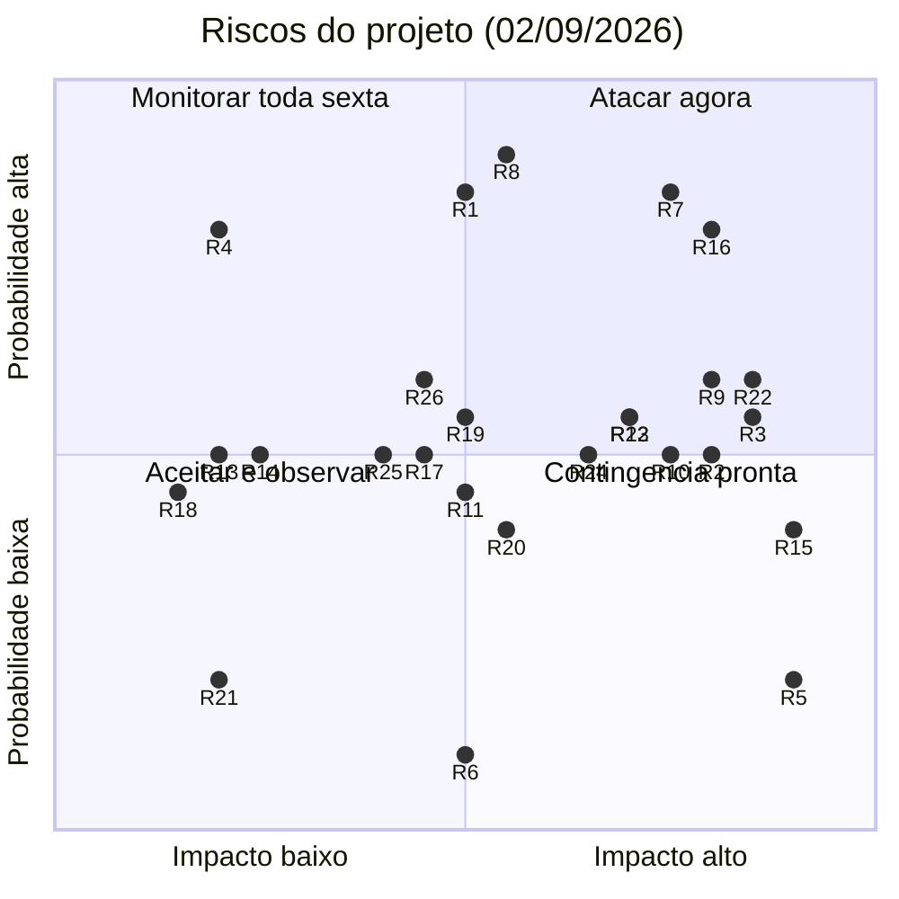
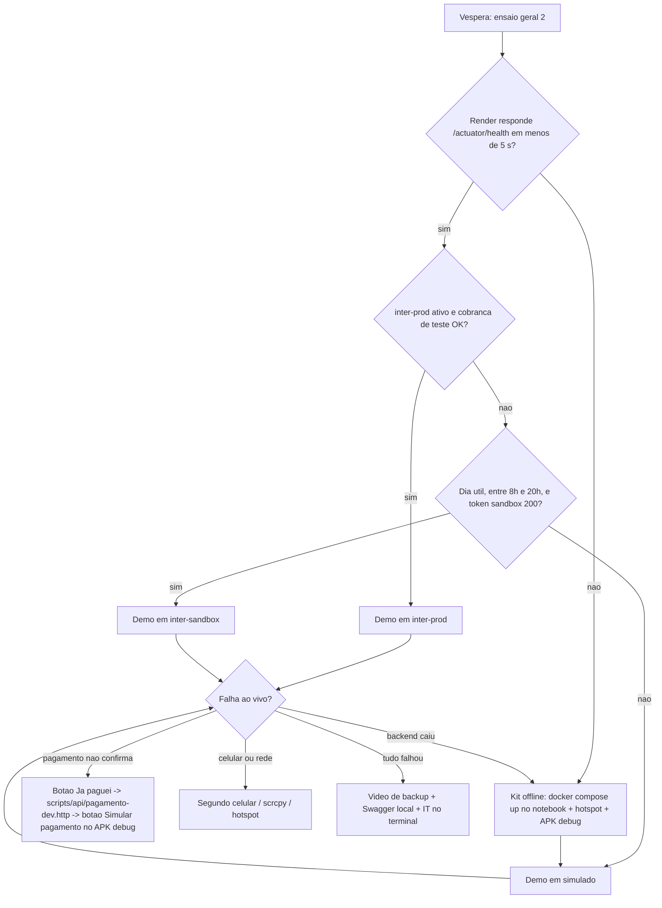

# 19 — Riscos e plano de contingência

Registro dos riscos técnicos e de gestão do projeto "Só mais uma" (01/09 a 11/12/2026), com probabilidade, impacto, mitigação, sinal de alerta, responsável e data-limite, mais a matriz de priorização, os gates datados e o plano de contingência da demonstração final.

## 19.1 Como ler este documento

| Item | Convenção |
|---|---|
| Probabilidade | Baixa (< 25 %), Média (25-60 %), Alta (> 60 %) — estimativa do grupo em 02/09/2026, revista toda sexta |
| Impacto | Baixo (retrabalho < 4 h, nenhum critério da disciplina afetado), Médio (retrabalho de 4-16 h ou perda de item recomendado), Alto (critério obrigatório, entrega ou demo em risco) |
| Gatilho / sinal de alerta | Fato observável que indica que o risco está virando problema; quem observar abre uma issue com label `risco` e o ID no título |
| Responsável | Titular da mitigação; o suplente da fatia (A<->D, B<->C, ver docs/15-divisao-equipe.md) assume se o titular faltar |
| Data-limite | Data em que a mitigação precisa estar concluída ou a decisão tomada; coincide com os gates de docs/16-cronograma.md |
| Prioridade | Obrigatório = a mitigação faz parte do escopo Must Have; Recomendado = a mitigação entra só com os obrigatórios verdes |

A numeração R1-R22 vem da espinha dorsal consolidada do projeto e é citada nos demais documentos; R23-R26 foram acrescentados aqui para cobrir integração Android x backend, autenticação, ambiente de desenvolvimento e gargalo de revisão. Ritual: na demo interna de sexta (15 min), o integrante A percorre a tabela, atualiza probabilidade/impacto e registra riscos disparados na issue "Ritual de sexta" (docs/21-git-e-organizacao.md, seção 21.8).

## 19.2 Riscos técnicos

| ID | Risco | Prob. | Impacto | Mitigação (prioridade) | Gatilho / sinal de alerta | Resp. | Data-limite |
|---|---|---|---|---|---|---|---|
| R1 | Integração Pix atrasar por falta de conta PJ Inter (CNPJ não-MEI) ou integração de produção não aprovada a tempo | Alta | Médio (perde "Pix real", que é recomendado; não perde critério) | Produção é Should Have; `SimuladoPixGateway` (S1-S3) e `InterPixGateway` em sandbox (S7-S8) são os caminhos obrigatórios; profile trocado por `SPRING_PROFILES_ACTIVE` sem rebuild (obrigatório) | 04/09 sem CNPJ identificado; 18/09 sem pedido no Internet Banking PJ; status "Em validação" por mais de 10 dias | D | 16/10 (go/no-go produção) |
| R2 | Conta de desenvolvedor do sandbox exigir CNPJ (incerteza registrada na pesquisa) | Média | Alto (API externa de pagamento indisponível) | Gate 02/09; se falhar, BrasilAPI CEP (RF09, já obrigatória na N1) cobre o critério 4 "API externa" e o pagamento fica em `simulado`; buscar CNPJ de parente/empresa parceira como plano C (obrigatório) | Cadastro em developers.inter.co/sandbox pede CNPJ ou fica "Em validação" por mais de 48 h | D (suplente A) | 04/09 |
| R3 | Sandbox instável, fechado (8h-20h, seg-sex) ou certificado de 30 dias vencido no dia da demo | Média | Alto na demo | Issues datadas de renovação (29/09, 27/10, 24/11); `simulado` ativável por variável de ambiente; ensaio nos dois profiles; demo em horário comercial; vídeo de backup (obrigatório) | `curl` de token retorna 401/erro TLS; `ConsultaPagamentoJob` loga `INFO sandbox indisponivel` fora do horário; data de renovação passou sem issue fechada | D | 24/11 (última renovação) e 27/11 (profile fixado) |
| R4 | Sandbox não dispara webhook | Alta | Baixo | Polling do app (5 s, backoff para 10 s) + `ConsultaPagamentoJob` (60 s) são o caminho obrigatório de RF20; webhook é recomendado | Teste com ngrok na S8 sem callback em 10 min após `POST /pix/v2/cob/pagar/{txid}` | D | 23/10 |
| R5 | Dupla reserva no mesmo slot (conflito de horários) | Baixa | Alto (credibilidade do produto) | Índice único parcial `ux_reserva_slot_ativo` + `saveAndFlush` + 409 `HORARIO_INDISPONIVEL` (RN08); `ReservaConcorrenciaIT` com 10 threads no CI; demo com 2 celulares (obrigatório) | IT vermelho ou desabilitado com `@Disabled`; `SELECT count(*)` de reservas ativas no mesmo `(quadra_id, inicio)` > 1; slot continua LIVRE após 201 | C | 25/09 (IT verde antes da N1) |
| R6 | Pagamento confirmado depois de a reserva virar EXPIRADA ou CANCELADA | Baixa | Médio | Expiração da cobrança = expiração da reserva (900 s, RN10); confirmação idempotente por UPDATE condicional (RN12); log `WARN ESTORNO_MANUAL` e reconfirmação se o slot ainda estiver livre (RN14) (obrigatório) | Log `ESTORNO_MANUAL` fora de teste automatizado | D | 23/10 |
| R7 | Verificação de desenvolvedor Google (Brasil, a partir de 30/09/2026) trava a instalação do APK por navegador/arquivo | Alta | Alto (demo e testes com usuários) | `adb install` do APK release assinado em todos os celulares (não afetado); teste em 2 celulares na S9; avaliar a conta de distribuição limitada (até 20 dispositivos) (obrigatório) | Celular exige "fluxo avançado" ou espera de 24 h ao abrir o APK | A | 30/10 |
| R8 | Toolchain nova (Boot 4.1, Jackson 3 `tools.jackson`, Security 7; AGP 9.4, Kotlin 2.4, Room 3) quebra builds e invalida tutoriais | Alta | Médio | Esqueletos commitados por A (backend) e B (Android) na S1 com versões fixadas; JDK 21 para os quatro; KAPT proibido; DI manual; spikes de 3 h; armadilhas listadas no `CONTRIBUTING.md` (obrigatório) | Build falha em mais de um notebook; import `com.fasterxml.jackson` ou `kapt` em PR; `@MockBean` em teste | A (backend), B (Android) | 04/09 |
| R12 | Render free em cold start (30-60 s) ou Neon pausado na hora da demo | Média | Alto | Abrir `/actuator/health` 10 min antes; kit de demo offline ensaiado (S12/S13); plano Starter (US$ 7) em nov-dez se o cold start incomodar (obrigatório) | Primeira chamada > 30 s no ensaio; banco "suspended" no painel do Neon | A | 04/12 (ensaio geral 1) |
| R13 | BrasilAPI sem coordenadas para o CEP ou fora do ar | Média | Baixo | Fallback ViaCEP no `CepClient`; latitude/longitude editáveis no FormQuadra; 503 `CEP_INDISPONIVEL` tratado na tela; seed com 3 quadras georreferenciadas (obrigatório) | `location.coordinates` vazio na resposta; timeout > 3 s | B | 25/09 |
| R14 | Localização negada, `getCurrentLocation` devolve null (ambiente fechado) ou celular sem Google Play Services | Média | Baixo | Cadeia atual -> `lastLocation` -> `ultima_lat/lon` do DataStore -> lista sem distância (RNF08); app 100 % usável sem distância; celular real na demo com localização obtida antes de entrar na sala (obrigatório) | Cards sem "a X km" no ensaio; `runCatching` devolvendo null nos logs | C | 30/10 |
| R15 | Vazamento de segredo (`.crt/.key`, `client_secret`, `JWT_SECRET`, `DEV_KEY`, keystore de release) no Git | Média | Alto (integração Inter cancelada é irreversível) | `.gitignore` no primeiro commit; segredos só em variáveis de ambiente, GitHub Secrets e Secret Files do Render; revisão de PR olha o diff inteiro; gitleaks no CI (recomendado); procedimento de resposta em docs/21-git-e-organizacao.md, seção 21.10 | Arquivo `.env`, `*.key`, `*.crt`, `*.jks` ou string de 32+ bytes aleatórios em diff de PR; alerta de secret scanning do GitHub | A (todos revisam) | 02/09 e contínuo |
| R17 | Contrato da API muda depois da N1 e quebra o APK instalado nos celulares dos testes | Média | Médio | Contrato aditivo: campos só adicionados e opcionais (RNF09); `V1__init.sql` nunca editado após a N1; Swagger e `FakeApiService` como contrato; versão instalada conferida no próprio aparelho quando houver dúvida | PR remove ou renomeia campo de um `*Response`; app antigo falha ao desserializar | B (backend), A (app) | 02/10 e contínuo |
| R18 | Schema do Room muda entre o beta e a versão final | Média | Baixo | Cache-only com `fallbackToDestructiveMigration(true)`; bump de `version` no `AppDatabase`; re-sync automático no próximo `ON_RESUME` (docs/12-persistencia-local.md) (obrigatório) | Crash "Room cannot verify the data integrity" em celular de teste | C | 06/11 |
| R20 | Dono reduz horário de funcionamento ou desativa quadra com reserva paga futura | Média | Médio (dinheiro do cliente) | 409 `QUADRA_COM_RESERVAS` / `HORARIO_COM_RESERVAS` (RN16); dono cancela uma a uma com motivo (RN13); estorno manual pelo telefone do cliente (RN14) (obrigatório) | Caso de teste de RF10 falhando; reserva CONFIRMADA fora do horário de funcionamento no banco | B | 23/10 |
| R21 | Rate limit do Inter (120/min em cobrança e consulta; 5/min no token) | Baixa | Baixo | Job consulta no máximo 10 pagamentos por ciclo de 60 s; HTTP 429 pula o ciclo; token cacheado por 55 min no `InterTokenService` (obrigatório) | HTTP 429 nos logs do backend | D | 23/10 |
| R22 | Slot deslocado por fuso (`TIME` local em `horario_funcionamento` x `TIMESTAMPTZ` em `reserva.inicio`) | Média | Alto (reserva no horário errado) | Fuso único `America/Sao_Paulo` (RNF12) no `SlotService` via `FusoConfig`; app envia `OffsetDateTime` com offset; RN06 rejeita minuto != 0; `SlotServiceTest` com offset -03:00 e caso de virada de dia (obrigatório) | Slot de 19h aparece às 16h ou 22h no emulador com fuso UTC; teste de fuso vermelho | C | 18/09 |
| R23 | Android e backend não integram (serialização, formato de datas, `ProblemDetail`, cleartext HTTP, `10.0.2.2` x IP da LAN) | Média | Alto (nada demonstrável) | Walking skeleton de autenticação na S3 contra a API real; `FakeApiService` só até o endpoint existir no Swagger; DTOs Android espelham os records do backend; `ProblemDetailParser` testado com os códigos de docs/10-api-rest.md; `network_security_config` com cleartext só em debug; demo interna de sexta do que roda no `main` (obrigatório) | Login no emulador não funciona em 18/09; tela usando `FakeApiService` mais de uma semana depois de o endpoint existir | A | 18/09 |
| R24 | Autenticação mal configurada (lambda DSL do Security 7, `JWT_SECRET` < 32 bytes, 401 em loop no app, bloqueio de login que não expira) | Média | Alto (critério 3; bloqueia todas as telas) | JWT HS256 via `NimbusJwtEncoder`/`NimbusJwtDecoder` sem jjwt (RNF01); backend falha no boot se `JWT_SECRET` < 32 bytes; `AuthInterceptor` sem retry; códigos `TOKEN_INVALIDO` x `CREDENCIAL_INVALIDA`; `JwtServiceTest`, `AuthServiceTest` (5 falhas/15 min), `AuthControllerTest`; Swagger devolve 403 em `POST /quadras` com token CLIENTE (RN01) (obrigatório) | 401 em rota pública; app volta ao Login sozinho durante o polling de pagamento; teste de bloqueio vermelho | A | 11/09 (backend) e 18/09 (app) |
| R25 | Ambiente de desenvolvimento insuficiente (notebook não roda emulador + Docker + Android Studio; Wi-Fi da faculdade bloqueia IP local) | Média | Médio | Celular físico via USB/`adb` no lugar do emulador; hotspot do celular; backend no notebook de um colega ou no Render após a S9; Neon como banco compartilhado se o Docker não rodar (obrigatório) | Build > 10 min; emulador não abre; `adb` não alcança o backend na LAN | A | 04/09 |

## 19.3 Riscos de gestão

| ID | Risco | Prob. | Impacto | Mitigação (prioridade) | Gatilho / sinal de alerta | Resp. | Data-limite |
|---|---|---|---|---|---|---|---|
| R9 | Cronograma não cabe em 40 h/semana (4 feriados: 07/09, 12/10, 02/11, 20/11; provas de outras disciplinas) | Média | Alto | Estimativa P/M/G por issue (P <= 3 h, M <= 8 h, G <= 16 h e obrigatoriamente quebrada); N1 realista (7 telas, reserva só no backend); folgas em S6 e S12; Should/Could só com Must verdes; feriados já descontados (obrigatório) | Milestone com mais de 20 % das issues Must atrasadas na sexta; issue G sem quebra; item Must adiado duas semanas seguidas | A (D no board) | Toda sexta; corte definitivo em 27/11 |
| R10 | Integrante com poucos commits ou concentrado em uma única camada (critério 7) | Média | Alto | Fatias verticais (backend + Android + docs + teste por pessoa); PR cruzado com commit do revisor; `git shortlog -sn --no-merges -- backend android docs` toda sexta; até a N1 cada um tem commits nas três pastas (obrigatório) | Shortlog de sexta com integrante abaixo de 15 % dos commits ou com zero commits em `android/` ou `backend/` | A | 25/09 (antes da N1) e 27/11 |
| R11 | Ausência, doença ou atraso de um integrante (especialmente perto da N2) | Média | Médio | Suplente por fatia (A<->D, B<->C) revisa todo PR e sabe rodar e explicar a fatia; docs por seção entregues em S13-S14; slides por fatia prontos na S14; tarefa atrasada mais de 1 semana é redistribuída na segunda seguinte (obrigatório) | Integrante sem commit e sem mensagem por 7 dias; PR aberto sem revisão por 48 h; issue Em andamento há mais de 2 semanas | A | 27/11 |
| R16 | Escopo grande demais ou crescendo (mapa interativo, fotos, avaliações, cartão, split entre jogadores) | Alta | Alto | Lista "Fora do MVP" fechada no CP1 (docs/02-escopo-mvp.md); item novo entra como Could Have; congelamento em 27/11; regra de ouro "nenhum recomendado começa com bug aberto em obrigatório" (obrigatório) | Issue nova sem label de prioridade; PR com funcionalidade fora de docs/14-backlog.md; Could Have iniciado com Must aberto | A (D no board) | 11/09 (CP1) e 27/11 |
| R19 | Poucos usuários para os testes de 09 a 13/11 | Média | Médio (critério 6; SUS) | Recrutar na S10 colegas de outras turmas e donos de quadra conhecidos; mínimo 5 (3 clientes, 2 donos); sessões de 20 min presenciais ou remotas; APK via adb pronto desde a S9 (obrigatório) | Menos de 5 participantes confirmados em 06/11 | C | 06/11 |
| R26 | Revisão de PR vira gargalo (PRs grandes, suplente ocupado) e o grupo passa a mesclar sem revisão | Média | Médio (qualidade e critério 7) | PR < 400 linhas; SLA de revisão de 24 h úteis; `main` protegida exige 1 aprovação; se o suplente não responder em 24 h, qualquer outro integrante revisa; PRs só de docs têm revisão leve (obrigatório) | PR aberto há mais de 48 h; PR acima de 400 linhas; commit direto na `main` | Todos (A monitora) | Contínuo |

## 19.4 Matriz probabilidade x impacto

Versão textual da matriz:

| Quadrante | Riscos | O que significa na prática |
|---|---|---|
| Atacar agora (prob. alta, impacto alto) | R7, R8, R9, R16, R22, R3, R12, R23 | Mitigação já está no escopo obrigatório da S1-S3 ou tem gate datado antes da N1; A revisa toda sexta |
| Contingência pronta (prob. baixa/média, impacto alto) | R2, R5, R15, R24, R10 | Não devem acontecer, mas se acontecerem custam a entrega: teste automatizado, gate ou procedimento escrito (19.6 e docs/21) |
| Monitorar toda sexta (prob. alta, impacto baixo/médio) | R1, R4 | Já aceitos como perda de item recomendado; só exigem que o caminho obrigatório (simulado, polling) esteja verde |
| Aceitar e observar (prob. baixa/média, impacto baixo/médio) | R6, R11, R13, R14, R17, R18, R19, R20, R21, R25, R26 | Mitigação barata já embutida no design; só viram issue se o gatilho aparecer |

## 19.5 Cobertura dos riscos pedidos pelo grupo

| Preocupação original do grupo | Riscos que a cobrem | Onde a mitigação vive |
|---|---|---|
| Integração Pix atrasar | R1, R2, R3, R4, R21 | docs/11-integracao-pix-inter.md (profiles, fallback em 3 camadas, gates) |
| Conflito de horários (dupla reserva) | R5, R6, R22 | docs/07-regras-de-negocio.md (RN08, RN10, RN12), docs/08-modelagem-banco.md (`ux_reserva_slot_ativo`), docs/23-plano-de-testes.md (`ReservaConcorrenciaIT`) |
| Integrante atrasar ou faltar | R9, R10, R11, R26 | docs/15-divisao-equipe.md (suplentes), docs/21-git-e-organizacao.md (rituais, shortlog) |
| Android x backend não integrar | R23, R17, R18, R25 | docs/20-ordem-de-implementacao.md (walking skeleton, `FakeApiService`), docs/10-api-rest.md (contrato) |
| Escopo grande demais | R16, R9 | docs/02-escopo-mvp.md (Fora do MVP), docs/14-backlog.md (prioridades) |
| Autenticação | R24, R15 | docs/06-requisitos-nao-funcionais.md (RNF01, RNF03), docs/09-arquitetura.md (`SecurityConfig`, `JwtConfig`) |
| Demo falhar no dia | R3, R7, R12, R14 | seção 19.7 deste documento e docs/18-checklist-n2.md |

## 19.6 Gates datados (decisões binárias)

Cada gate tem uma consequência definida; ninguém espera "mais uma semana" sem registrar a decisão em ata (comentário na issue do gate).

| Data | Gate | Se passar | Se falhar | Resp. |
|---|---|---|---|---|
| 02/09 (qua) | Conta de desenvolvedor do sandbox criada por pessoa física? (R2) | Seguir com `inter-sandbox` como caminho obrigatório de demo | `SimuladoPixGateway` vira o gateway da demo; BrasilAPI CEP cobre "API externa"; buscar CNPJ como plano C | D |
| 04/09 (sex) | `curl` mTLS -> token 200 -> `PUT /pix/v2/cob/{txid}` 201 no sandbox; grupo decide se há CNPJ não-MEI (R1, R2) | Registrar em `scripts/inter/01-token.http` e `scripts/inter/02-criar-cob.http`; se há CNPJ, abrir conta PJ | Chamado no portal do Inter; seguir com simulado até resposta | D |
| 04/09 (sex) | Backend e Android buildam nos 4 notebooks (R8, R25) | Spikes concluídos | Integrante com problema usa celular físico e backend do colega; A/B pareiam na segunda | A, B |
| 11/09 (sex) | Checkpoint 1: escopo, protótipo, backlog, lista Fora do MVP (R16, R9) | Escopo congelado no nível de funcionalidade | Escopo cortado no mesmo dia pelo critério "não pontua e não está no fluxo principal = fora" | A |
| 18/09 (sex) | Login funciona no emulador contra a API real (R23, R24); se há CNPJ, integração de produção solicitada (R1) | Seguir para as telas da N1 | S4 começa com A e B pareando no app até fechar; produção continua Should Have | A, D |
| 25/09 (sex) | `ReservaConcorrenciaIT` verde no CI (R5); shortlog mostra os 4 nas três pastas (R10) | Congelar `release/n1` na terça 29/09 | IT é prioridade única de C na S5; integrante com zero commits em uma pasta recebe issue P dessa pasta | C, A |
| 29/09 (ter) | Certificado sandbox renovado (R3) | — | Demo interna da sexta cai para `simulado`; issue reaberta | D |
| 16/10 (sex) | Go/no-go produção: integração "Ativo" + cobrança real de R$ 1,00 testada (R1) | `inter-prod` entra como profile preferido da apresentação | Produção sai definitivamente; sandbox é a versão final | D |
| 23/10 (sex) | Sandbox dentro do app: criar -> pagar -> CONCLUIDA detectada pelo job (R3, R4) | `inter-sandbox` é o profile oficial | Demo oficial em `simulado`; sandbox vira evidência gravada em vídeo | D |
| 27/10 (ter) | Certificado sandbox renovado (R3) | — | Idem 29/09 | D |
| 30/10 (sex) | Render em HTTPS + APK via `adb install` em 2 celulares (R7, R12); webhook cadastrado se HTTPS ok (R4) | Beta público para os testes com usuários | Testes com usuários usam o kit offline (notebook + hotspot); webhook sai do backlog | A, D |
| 06/11 (sex) | Checkpoint 2 com 5 usuários confirmados para a S11 (R19) | — | Recrutar na própria turma; sessões remotas | C |
| 24/11 (ter) | Último certificado sandbox (cobre até 11/12) (R3) | — | Apresentação em `simulado` | D |
| 27/11 (sex) | Congelamento de escopo; profile da apresentação fixado (`inter-prod` > `inter-sandbox` > `simulado`) (R3, R16) | Só correções até 11/12 | Não há "se falhar": o que não estiver no `main` fica fora | Todos |
| 04/12 (sex) | Ensaio geral 1 dentro de 8h-20h, com Render e com kit offline (R12) | — | Kit offline vira principal | A, D |

## 19.7 Plano de contingência da demo (07 a 11/12/2026)

O roteiro completo da apresentação está em docs/18-checklist-n2.md; aqui fica só a árvore de decisão e a resposta a falhas ao vivo.

### 19.7.1 Preparação que torna a contingência possível

| Item | Detalhe | Resp. | Quando |
|---|---|---|---|
| Dois APKs em cada celular | APK release (`applicationId br.com.somaisuma.app`, `API_BASE_URL` do Render) e APK debug (`applicationIdSuffix .debug`, `API_BASE_URL` do IP do notebook), instalados via `adb install`, ambos logados com `cliente@demo.com` / `dono@demo.com` | A | S13 e véspera |
| Kit de demo offline | `scripts/kit-demo-offline/compose.yaml` (postgres:18-alpine + jar do backend em profile `simulado` + seed), clonado em 2 notebooks; hotspot do celular do apresentador como rede única | D | S12 (v1), S13 (ensaio) |
| Profile trocável sem rebuild | `SPRING_PROFILES_ACTIVE` no painel do Render (redeploy ~2 min) e no `compose.yaml` do kit | D | S8 |
| Vídeo de backup | 8 min, mesmo roteiro da demo, gravado na S14 com o profile oficial; cópia no celular e no notebook | D | 04/12 |
| Espelhamento do celular | `scrcpy` instalado nos 2 notebooks para projetar a tela do celular via USB; testado no ensaio geral | A | S14 |
| Terminal pré-aquecido | Docker rodando, `./gradlew test --tests ReservaConcorrenciaIT` já executado uma vez antes da sala (Testcontainers com imagem baixada) | C | H-60 min |
| Aquecimento do Render | `GET /actuator/health` 10 min antes e a cada 5 min durante a espera | A | H-10 min |
| Localização pré-obtida | Abrir a tela Quadras na rua antes de entrar (grava `ultima_lat/lon` no DataStore) | C | H-15 min |

### 19.7.2 Árvore de decisão

Versão textual: a ordem de preferência do profile é `inter-prod` (só se o go/no-go de 16/10 passou) > `inter-sandbox` (só em dia útil entre 8h e 20h com token válido) > `simulado`. Se o Render não responder, o kit offline sobe em `simulado` e os celulares usam o APK debug apontando para o notebook. Qualquer falha ao vivo tem uma resposta de no máximo 60 s; se a segunda tentativa falhar, o apresentador passa ao vídeo de backup e demonstra Swagger, `git shortlog` e o teste de concorrência no terminal, que não dependem de rede externa.

### 19.7.3 Resposta a falhas ao vivo

| Sintoma | Ação imediata (até 60 s) | Segunda tentativa | Quem age |
|---|---|---|---|
| Render não responde ou cold start > 60 s | Continuar falando enquanto A repete `/actuator/health`; se passar de 60 s, abrir o APK debug já conectado ao kit offline | Kit offline no segundo notebook | A |
| Sandbox devolve 401/erro TLS ao criar cobrança (502 `PAGAMENTO_INDISPONIVEL` na tela) | Trocar `SPRING_PROFILES_ACTIVE=simulado` no Render (D) e, enquanto redeploya, usar o kit offline | Vídeo do trecho de pagamento em sandbox | D |
| Pagamento não confirma em 30 s | Tocar "Já paguei" (consulta imediata); em sandbox, rodar `scripts/api/pagamento-dev.http` (`POST /dev/pagamentos/{txid}/confirmar` com `X-Dev-Key`) | Em `simulado`, botão "Simular pagamento" do APK debug | D |
| Segundo celular não recebe 409 na corrida | Repetir com os dois tocando o slot ao mesmo tempo; mostrar `ux_reserva_slot_ativo` no `V1__init.sql` | Rodar `ReservaConcorrenciaIT` no terminal (1x201, 9x409) | C |
| Lista sem distância ("a X km") | Puxar para atualizar após ligar a localização; se persistir, mostrar `ultima_lat/lon` do DataStore na tela Perfil | Emulador com Extended Controls > Location no notebook | C |
| Notificação local não aparece | Verificar permissão em Configurações > Notificações; refazer um pagamento simulado | Explicar o `NotificadorReserva` no código (item recomendado, não obrigatório) | C |
| Modo avião não mostra cache | Fechar e reabrir o app (o `Flow` do Room recarrega); confirmar `BannerOffline` | Mostrar `quadra_cache` no App Inspection do Android Studio | C |
| Wi-Fi da faculdade cai ou bloqueia | Hotspot do celular do apresentador (notebook e 2 celulares na mesma rede) | Kit offline não depende de internet; Render fica só para o vídeo | A |
| APK não instala no celular do avaliador | `adb install -r app-release.apk` com o cabo do grupo (depuração USB já ativada nos celulares do grupo) | Oferecer o celular do grupo com `scrcpy` no projetor | A |
| Notebook do apresentador trava | Segundo notebook com kit offline, `scrcpy` e vídeo | — | D |
| Projetor sem entrada compatível | `scrcpy` no notebook do professor ou celular passado de mão | Vídeo no celular | A |
| Tudo falhou | Vídeo de backup (8 min) + Swagger local + `git shortlog -sn -- backend android docs` + IT no terminal | — | D apresenta, A conduz o terminal |

### 19.7.4 Regras de ouro do dia

1. Nada é instalado, atualizado ou reconfigurado no dia da apresentação; a última mudança de código é a tag `v1.0` de 04/12.
2. Quem não está apresentando está com o terminal e o segundo notebook prontos; ninguém "tenta consertar" na frente da banca por mais de 60 s.
3. O profile escolhido na véspera é o profile da apresentação; a única troca permitida ao vivo é para `simulado`.
4. O que não depende de rede externa (Swagger local, IT de concorrência, `git shortlog`, código no IDE) fecha a apresentação e prova os critérios 2, 6 e 7 mesmo no pior cenário.
