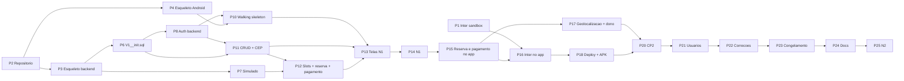

# 20 — Ordem de implementação

Sequência prática numerada a partir de 02/09/2026, com a ordem original proposta pelo grupo lado a lado, a justificativa de cada mudança e, para cada passo, semana, responsável, dependências e critério de pronto; fecha com as regras transversais e os comandos do dia 1.

## 20.1 Sete princípios que reordenam o trabalho

| # | Princípio | Por que muda a ordem | Onde aparece |
|---|---|---|---|
| 1 | Burocracia primeiro | Lead time de terceiros (conta sandbox Inter, decisão sobre CNPJ, certificado de 30 dias) não se comprime com horas extras; começa antes de qualquer código | P1 |
| 2 | Esqueletos por uma pessoa | Boot 4.1 (Jackson 3, Security 7) e AGP 9.4 (Kotlin embutido, KSP) invalidam tutoriais; uma pessoa por projeto fixa as versões e os outros clonam um build que já funciona | P3, P4 |
| 3 | DDL cedo | `V1__init.sql` com o índice único parcial é o contrato entre as quatro fatias; entidades JPA, DTOs e Room derivam dele | P6 |
| 4 | Simulado antes do Inter | `SimuladoPixGateway` define `PixGateway`, a máquina de estados e a tela de Pagamento sem certificado nem horário de sandbox; o Inter entra depois como troca de bean | P7, P16 |
| 5 | Walking skeleton | Autenticação ponta a ponta (tela -> Retrofit -> JWT -> DataStore -> navegação) valida rede, serialização e sessão antes de qualquer outra tela | P10 |
| 6 | Fatias finas ponta a ponta | Cada funcionalidade entra com endpoint + tela + cache + teste + doc; nunca "todo o backend, depois todo o Android" | P11-P17 |
| 7 | Deploy cedo | Render + Neon + APK via `adb` seis semanas antes da N2, porque testes com usuários e webhook precisam de backend público e a verificação de desenvolvedor do Google vigora desde 30/09 | P18 |

## 20.2 Ordem original x ordem melhorada

| # | Ordem original (grupo) | Onde ficou na ordem melhorada | O que mudou e por quê |
|---|---|---|---|
| 1 | Repositórios | P2 (02/09), logo depois de P1 | Mantido no início, mas atrás da conta sandbox do Inter: o repositório fica pronto em 2 h, a burocracia do banco não |
| 2 | Spring Boot | P3 esqueleto por A (02-04/09) | Uma pessoa gera o projeto com versões fixadas e commita; os outros clonam um build verde em vez de quatro pessoas brigando com Boot 4 ao mesmo tempo |
| 3 | PostgreSQL | Dentro de P3 (`compose.yaml` no mesmo commit) | Deixa de ser passo separado: `spring-boot-docker-compose` sobe o `postgres:18-alpine` junto com `./gradlew bootRun` |
| 4 | Entidades | P6 `V1__init.sql` + entidades JPA (S1-S2) | O SQL vem antes das classes: o DDL é o contrato, as entidades apenas o espelham (`ddl-auto=validate`) |
| 5 | Autenticação | P8 backend (S2) + P10 walking skeleton no app (S3) | Continua cedo, mas passa a ser feita ponta a ponta com tela, em vez de "só backend" |
| 6 | CRUD quadras | P11 backend (S3) + P13 telas (S4) | Igual, mas junto com HorarioFuncionamento (segundo CRUD completo, RF11) e CEP (API externa, RF09), que a tela FormQuadra já exige |
| 7 | Disponibilidade | P12 `SlotService` (S3) | Mantido; slots calculados em memória a partir de `horario_funcionamento`, sem tabela de slots |
| 8 | Reservas | P12 backend (S3-S4) + P15 telas (S6) | Backend e teste de concorrência antes da N1, quando corrigir é barato; telas depois da N1 |
| 9 | App Android | P4 esqueleto (dia 1) + telas em P10, P13, P15, P17 | "App Android" deixa de ser um passo: o esqueleto nasce no dia 1 e cada fatia traz a sua tela |
| 10 | Integrar | Não existe como passo | Integração é contínua desde P10; `FakeApiService` só até o endpoint existir no Swagger |
| 11 | Pagamento | P7 simulado (S1-S2), P12 `PagamentoService` (S3), P15 tela (S6), P16 Inter (S7-S8) | Sai do fim para a semana 1; o maior risco externo (docs/19-riscos.md, R1-R3) é atacado enquanto ainda há tempo de reagir |
| 12 | Recurso nativo | P17 (S8-S9) | Depende de latitude/longitude (P11) e da lista pronta (P13); fica antes do CP2, não no fim |
| 13 | Testes | Distribuídos: `ReservaConcorrenciaIT` (S4), unitários em cada passo, CT-xx (S10), usuários (S11) | Teste faz parte do critério de pronto de cada passo; não é uma fase |
| 14 | Documentação | Distribuída: CP1 (S2), N1 (S4-S5), consolidação (S14) | Cada fatia entrega o seu documento; a S14 apenas consolida |
| 15 | APK | P18 (S9) e APK final (S13) | Seis semanas antes da N2: verificação Google (30/09), testes com usuários (09-13/11) e webhook exigem backend público e instalação testada |
| — | (novo) Burocracia Inter | P1 | Não existia na ordem original |
| — | (novo) Spikes | P5 | 3 h por integrante para Compose/Navigation tipada e Boot 4/Jackson 3 |
| — | (novo) Checkpoints e fechamento | P9, P14, P20-P25 | Marcos da disciplina com critério de pronto explícito |

## 20.3 Sequência numerada

Semanas conforme docs/16-cronograma.md (S1 = 01-04/09 ... S15 = 07-11/12). Responsável = titular; o suplente revisa o PR. Estimativas P/M/G conforme docs/14-backlog.md.

### Fase 1 — Fundação (S1, 02/09 a 04/09)

| # | Passo | Semana | Resp. | Depende de | Critério de pronto |
|---|---|---|---|---|---|
| P1 | Burocracia Inter e levantamento de CNPJ | S1 (01-04/09) | D (suplente A) | — | Conta em developers.inter.co/sandbox criada; integração sandbox com status "Ativo"; `.crt/.key` guardados fora do repositório; `curl` de token 200 e `PUT /pix/v2/cob/{txid}` 201 registrados em `scripts/inter/01-token.http` e `scripts/inter/02-criar-cob.http`; gates de 02/09 (PF criou a conta?) e 04/09 (há CNPJ não-MEI?) respondidos por escrito na issue #1 |
| P2 | Repositório, board e CI | 02/09 | A | — | Monorepo com a árvore de docs/21-git-e-organizacao.md; `.gitignore` de segredos no primeiro commit; `main` protegida; labels, milestones e GitHub Projects criados; `ci.yml` verde no primeiro PR; os 4 com acesso e `git config user.email` igual ao e-mail do GitHub |
| P3 | Esqueleto do backend | 02-04/09 | A | P2 | Projeto do Initializr (Boot 4.1.x, JDK 21, Gradle Kotlin DSL) com dependências de 20.5.2; `compose.yaml` com `postgres:18-alpine`; Flyway habilitado com pasta `db/migration` vazia; `./gradlew bootRun` sem variável de ambiente sobe em profile `simulado` e `GET /actuator/health` responde 200; Swagger em `/swagger-ui.html`; `application-simulado.yml`, `application-inter-sandbox.yml`, `application-inter-prod.yml` com placeholders |
| P4 | Esqueleto do Android | 02-04/09 | B | P2 | Projeto `br.com.somaisuma.app` (AGP 9.4, Kotlin 2.4.10, compileSdk/targetSdk 37, minSdk 26, Compose BOM 2026.08.00, `libs.versions.toml` fixado, KSP, sem KAPT); `SoMaisUmaTheme` com `lightColorScheme` e `darkColorScheme` explícitos; `Rotas.kt` com as 13 rotas `@Serializable`; `AppNavHost` com telas placeholder; `AppContainer` vazio; `FakeApiService`; `assembleDebug` verde no CI e nos 4 notebooks |
| P5 | Spikes de 3 h por integrante | S1 | Todos | P3, P4 | Cada um roda os dois projetos no próprio notebook (ou celular físico via `adb`); branch `spike/<nome>` nunca é mesclada; armadilhas anotadas no `CONTRIBUTING.md` (`tools.jackson`, lambda DSL do Security 7, `@MockitoBean`, Navigation tipada, Room 3 com KSP) |

### Fase 2 — Contrato e Checkpoint 1 (S1-S2, até 11/09)

| # | Passo | Semana | Resp. | Depende de | Critério de pronto |
|---|---|---|---|---|---|
| P6 | DDL fechado: `V1__init.sql`, entidades JPA e enums | Rascunho 04/09, final 11/09 | C rascunha, B consolida | P3 | Tabelas `usuario`, `quadra`, `horario_funcionamento`, `reserva`, `pagamento` como docs/08-modelagem-banco.md; `ux_reserva_slot_ativo`, `UNIQUE (quadra_id, dia_semana)`, checks e índices; entidades Java com Lombok `@Getter @Setter @NoArgsConstructor` (nunca `@Data`, nunca record); enums canônicos; `bootRun` aplica a migration com `ddl-auto=validate`; `scripts/seed-demo.sql` com `cliente@demo.com` e `dono@demo.com` (senha `Senha123`), 3 quadras georreferenciadas, horários seg-dom 08-22h; regra "V1 nunca editado após a N1" no `CONTRIBUTING.md` |
| P7 | `PixGateway`, `SimuladoPixGateway` e `PixPayloadBuilder` | S1-S2 | D | P3 | Interface com `criarCobranca`, `consultar`, `removerCobranca` e DTOs `CobrancaPix`/`StatusCobranca`; `PixPayloadBuilder` gera BR Code estático (TLV EMV + CRC16-CCITT) com `PixPayloadBuilderTest` contra payload conhecido; QR com a chave real de um integrante e txid `***` é reconhecido por app de banco |
| P8 | Autenticação no backend | S2 (até 11/09) | A | P6 | `POST /auth/registrar` e `POST /auth/login` (JWT HS256 via Nimbus, 7 dias, claim `perfil`), BCrypt custo 10, senha >= 8 com letra e número, `LoginTentativasService` (5 falhas -> 429 por 15 min), `GlobalExceptionHandler` com `ProblemDetail` + `codigo`; `JwtServiceTest`, `AuthServiceTest`, `AuthControllerTest`; Swagger devolve 403 em `POST /quadras` com token CLIENTE |
| P9 | Checkpoint 1 | Sex 11/09 | A (escopo, backlog), B (Figma) | P2 | docs/02-escopo-mvp.md com lista Fora do MVP; docs/14-backlog.md priorizado com estimativa P/M/G e milestones; Figma navegável das 13 telas; docs/05, 06 e 07 em v1; decisão sobre CNPJ registrada em ata |

### Fase 3 — Walking skeleton e backend da N1 (S3, 14 a 18/09)

| # | Passo | Semana | Resp. | Depende de | Critério de pronto |
|---|---|---|---|---|---|
| P10 | Walking skeleton: autenticação ponta a ponta no app | S3 | A | P4, P8 | Splash -> Login -> Cadastro contra a API real no emulador (`http://10.0.2.2:8080`) e em celular físico (IP da LAN, cleartext só em debug); `SessaoDataStore` com `token_jwt`, `token_expira_em`, `usuario_perfil`; `AuthInterceptor` sem retry; bottom-nav por perfil; 401 `TOKEN_INVALIDO` -> Login uma única vez; `LoginViewModelTest` e `CadastroViewModelTest`; gate de 18/09 |
| P11 | CRUD Quadra + CRUD HorarioFuncionamento + CEP (backend) | S3 | B | P6, P8 | Os 4 endpoints de Quadra e os 4 de HorarioFuncionamento de docs/10-api-rest.md, com propriedade (403, RN03), 409 `QUADRA_COM_RESERVAS`, 409 `DIA_JA_CADASTRADO` e RN19; `GET /cep/{cep}` via `CepClient` (BrasilAPI v2 -> ViaCEP, 503 `CEP_INDISPONIVEL`); `QuadraServiceTest`, `HorarioFuncionamentoServiceTest`, `CepClientTest` com `MockRestServiceServer` |
| P12 | Slots, reserva, expiração e pagamento simulado (backend) | S3 (até sex 18/09) | C (slots/reserva), D (pagamento) | P6, P7, P11 | `GET /quadras/{id}/slots?data=` com LIVRE/OCUPADO/PASSADO/FECHADO (RF12); `POST /reservas` com RN06, RN09, RN11 e 409 `HORARIO_INDISPONIVEL` (RN08); `ExpiracaoReservaJob` por UPDATE condicional (RF14); `ReservaFacade` com cobrança fora da transação e 502 `PAGAMENTO_INDISPONIVEL` (RN17); `PagamentoService.confirmar` idempotente (RN12); `POST /dev/pagamentos/{txid}/confirmar` com JWT + `X-Dev-Key`; fluxo reservar -> confirmar -> CONFIRMADA executado só pelo Swagger em sex 18/09 |

### Fase 4 — Telas da N1 e entrega (S4-S5, 21/09 a 02/10)

| # | Passo | Semana | Resp. | Depende de | Critério de pronto |
|---|---|---|---|---|---|
| P13 | Telas da N1 e endurecimento | S4 | B (Quadras, DetalheQuadra estático, MinhasQuadras, FormQuadra com CEP, HorariosQuadra), A (Perfil editável com `PUT /usuarios/me`, `GlobalExceptionHandler` completo, tratamento 401/409/offline, `CampoTextoValidado`, `ErroBox`), C (`ReservaConcorrenciaIT` com 10 threads), D (tela Pagamento v1 com QR do simulado) | P10, P11, P12 | 7 telas funcionais contra a API (RF01, RF02, RF03, RF05, RF06, RF07, RF08, RF09, RF10, RF11); validação por campo e estados carregando/vazio/erro (RNF06); IT de concorrência verde no CI; docs/08 e docs/09 em v1; README completo |
| P14 | Entrega N1 | S5 (28/09-02/10) | Todos (A edita) | P13 | Branch `release/n1` congelada na terça 29/09; README testado em máquina limpa por outro integrante; vídeo de 2 min; tag `v0.1-n1`; docs/17-checklist-n1.md todo verde; certificado sandbox renovado em 29/09 (D); shortlog mostra os 4 em `backend/`, `android/` e `docs/` |

### Fase 5 — Reserva, pagamento, Inter e offline (S6-S8, 05/10 a 23/10)

| # | Passo | Semana | Resp. | Depende de | Critério de pronto |
|---|---|---|---|---|---|
| P15 | Fluxo do cliente completo com simulado | S6 | C (ConfirmarReserva, DetalheReserva com PATCH e cancelar), B (grade de slots e `SeletorData` no DetalheQuadra, US-28; revisa os PRs de C), A (MinhasReservas, US-31; esqueleto de docs/23 e testes unitários de auth), D (polling 5 s -> 10 s, contador regressivo, `ConsultaPagamentoJob`) | P14 | Reservar -> pagar (simulado) -> CONFIRMADA no app (RF13, RF15, RF16, RF17, RF19, RF20, RF21); 409 mostra snackbar e recarrega slots; 422 `RESERVA_PENDENTE_EXISTENTE` leva à reserva pendente; back de Pagamento vai para MinhasReservas; expiração visível após 15 min |
| P16 | Inter sandbox no app + Room e offline | S7-S8 | D (`InterPixGateway`, `InterTokenService`, SSL bundle PEM, `POST /pix/v2/cob/pagar/{txid}`, teste de webhook com ngrok), B (`quadra_cache` + `Sincronizador`), C (`reserva_cache`, `BannerOffline`, `MonitorConectividade`) | P15 | Cobrança real criada no sandbox pelo app e CONCLUIDA detectada pelo job (meta 23/10); go/no-go de produção em 16/10 registrado; app abre em modo avião com cache e banner (RF23); QR reabre offline a partir de `pixCopiaECola` do cache; decisão sobre webhook registrada em docs/11-integracao-pix-inter.md |

### Fase 6 — Recurso nativo, dono e deploy (S8-S9, 19/10 a 30/10)

| # | Passo | Semana | Resp. | Depende de | Critério de pronto |
|---|---|---|---|---|---|
| P17 | Geolocalização e telas restantes do dono | S8-S9 | C (ReservasQuadra, cancelamento pelo dono com motivo, `LocalizacaoProvider`, `Geo.kt`, ordenação, "Abrir no Maps"), B (409 `HORARIO_COM_RESERVAS`) | P13, P15 | Lista ordenada por distância com "a X km" (RF22); permissões COARSE + FINE pedidas no card, não no launch; funciona sem GMS e sem permissão (RNF08); dono lista e cancela reservas das próprias quadras (RF18, RN13); reduzir horário com reserva ativa devolve 409 (RN16) |
| P18 | Deploy e distribuição | S9 (26-30/10) | A (D cadastra o webhook se HTTPS ok) | P16 | Render (Web Service Docker) + Neon com `SPRING_PROFILES_ACTIVE=inter-sandbox` e `.crt/.key` como Secret Files; `/actuator/health` público; APK release assinado com `BuildConfig.API_BASE_URL` do Render; `adb install` testado em 2 celulares; conta de distribuição limitada avaliada e registrada; certificado renovado em 27/10 |
| P19 | Itens recomendados (só com obrigatórios verdes) | S9-S10 | C (notificação local, RF24), D (webhook `POST /webhooks/inter/pix/{segredo}`), B (Coil para `foto_url`) | P18 | Cada item entra por PR próprio; o revisor confere no template que não há bug aberto em item Must antes de aprovar |

### Fase 7 — Beta, usuários e fechamento (S10-S15, 02/11 a 11/12)

| # | Passo | Semana | Resp. | Depende de | Critério de pronto |
|---|---|---|---|---|---|
| P20 | Checkpoint 2 — beta funcional | S10 (sex 06/11) | Todos | P17, P18 | Bug bash cruzado (cada um testa a fatia do outro); acessibilidade básica por tela (RNF07); casos CT-xx de docs/23-plano-de-testes.md executados; `release/beta` congelada na quarta 04/11; tag `v0.2-beta`; 5 usuários confirmados para a S11 |
| P21 | Testes com usuários | S11 (09-13/11) | C conduz; todos fazem ao menos 1 sessão | P20 | 5-8 usuários (mínimo 3 clientes e 2 donos), tarefas, SUS e 3 perguntas abertas; docs/22-testes-com-usuarios.md com taxa de sucesso por tarefa e top-5 problemas; issues `usabilidade` com severidade |
| P22 | Correções de usabilidade e ensaio | S12 (16-20/11) | Todos; D ensaia os profiles e monta o kit offline v1 | P21 | Top-5 corrigido; aceite SUS >= 68 e >= 80 % de sucesso por tarefa; tag `v0.9-rc` |
| P23 | Congelamento de escopo | S13 (23-27/11) | Todos | P22 | Últimas funcionalidades até quarta 25/11; quinta e sexta só correções; profile da apresentação fixado (D); certificado renovado em 24/11; APK final assinado (A); tag `v1.0-rc1` |
| P24 | Documentação final | S14 (30/11-04/12) | Todos (A edita) | P23 | docs/00 a 23 consolidados; README final com tabela de versões (verificada em 01/09/2026); matriz critério -> evidência -> quem defende; slides por fatia; vídeo de backup; ensaio geral 1 com Render e com kit offline; tag `v1.0` |
| P25 | Apresentação N2 | S15 (07-11/12) | Todos | P24 | Checklist de docs/18-checklist-n2.md; ensaio geral 2 na véspera; demo de 8 min; contingência de docs/19-riscos.md, seção 19.7 |

### Dependências entre os passos principais



Caminho crítico: P2 -> P3 -> P6 -> P8 -> P10 -> P13 -> P14 -> P15 -> P16 -> P18 -> P20. Qualquer atraso nesse caminho consome a folga de S6 e S12 antes de atrasar um marco da disciplina.

## 20.4 Regras transversais (valem em todos os passos)

| Regra | Como se aplica | Prioridade |
|---|---|---|
| Fatia fina mas completa | Uma funcionalidade só está pronta com endpoint no Swagger + teste no backend + tela + (quando lista) cache no Room + linha no documento da fatia; PR que entrega só uma das partes fica em rascunho | Obrigatório |
| `FakeApiService` só até o endpoint existir | Nenhuma tela é escrita contra dados inventados por mais de uma semana depois de o endpoint aparecer no Swagger; `FakeApiService` continua existindo para os testes de ViewModel | Obrigatório |
| `main` sempre sobe com `simulado` | `./gradlew bootRun` sem nenhuma variável de ambiente precisa subir; `spring.profiles.default=simulado`; profiles `inter-*` só em quem tem `.crt/.key` e no Render; o CI roda em `simulado` | Obrigatório |
| Migrations aditivas | Depois da N1 `V1__init.sql` nunca é editado; o seed `scripts/seed-demo.sql` fica fora do Flyway e pode ser ajustado á vontade; toda mudança é um `Vn__descricao.sql` novo; `ddl-auto=validate` denuncia entidade divergente do banco | Obrigatório |
| Contrato aditivo após a N1 | Campos de resposta só são adicionados e opcionais (RNF09); remover ou renomear campo exige issue com label `contrato` e aprovação de A e B | Obrigatório |
| Recomendado só com obrigatório verde | Nenhum item Should Have começa enquanto houver bug aberto em item Must Have do mesmo milestone | Obrigatório |
| Commit do revisor em PR de tela | O revisor faz ao menos um commit de acessibilidade (contentDescription, alvos de 48 dp, `ImeAction`) no PR da tela antes de aprovar | Obrigatório |
| Um JDK, um serializador, um DI | JDK 21 nos dois projetos; kotlinx.serialization no Android (rotas e Retrofit); `AppContainer` manual; KSP apenas para Room; KAPT proibido | Obrigatório |
| Sexta é dia de `main` | O que não roda a partir do `main` na demo interna de sexta não conta como feito | Obrigatório |
| Estimativa antes de começar | Toda issue recebe P/M/G antes de ir para "Em andamento"; G é quebrada em M/P | Obrigatório |

## 20.5 Comandos do dia 1 (quarta, 02/09/2026)

Pré-requisitos nos quatro notebooks: JDK 21 (Temurin), Docker Desktop (ou Docker Engine), Android Studio Quail 4 (2026.1.4), Git, `gh` CLI (opcional). Todas as versões abaixo foram verificadas em 01/09/2026 (docs/09-arquitetura.md traz a tabela completa).

### 20.5.1 Repositório (A)

```bash
mkdir so-mais-uma && cd so-mais-uma
git init -b main
mkdir -p backend android docs scripts .github/workflows .github/ISSUE_TEMPLATE
# criar .gitignore, README.md e CONTRIBUTING.md conforme docs/21-git-e-organizacao.md
git add .
git commit -m "chore: cria monorepo com estrutura inicial (#1)"
gh repo create <organizacao>/so-mais-uma --private --source=. --push
```

Em seguida, no GitHub: proteger a `main`, criar labels, milestones e o board (docs/21-git-e-organizacao.md, seções 21.3 e 21.6). Cada integrante confere `git config --global user.email` igual ao e-mail da conta do GitHub, senão os commits não aparecem em Insights.

### 20.5.2 Backend (A)

Spring Initializr (start.spring.io) com: Project Gradle - Kotlin DSL, Language Java, Spring Boot 4.1.x (última patch), Java 21, Group `br.com.somaisuma`, Artifact `backend`, Package `br.com.somaisuma`, Packaging Jar. Dependências (nome na interface -> artefato no `build.gradle.kts`):

| Nome no Initializr | Artefato gerado no Boot 4 | Para quê |
|---|---|---|
| Spring Web | `spring-boot-starter-webmvc` | REST |
| Spring Data JPA | `spring-boot-starter-data-jpa` | Repositórios |
| Spring Security | `spring-boot-starter-security` | Autorização por perfil |
| OAuth2 Resource Server | `spring-boot-starter-oauth2-resource-server` | JWT HS256 via Nimbus (sem jjwt) |
| Validation | `spring-boot-starter-validation` | Bean Validation nos records |
| Flyway Migration | `spring-boot-starter-flyway` + `org.flywaydb:flyway-database-postgresql` | Migrations (Flyway >= 12 suporta PostgreSQL 18) |
| PostgreSQL Driver | `org.postgresql:postgresql` (runtimeOnly) | JDBC |
| Docker Compose Support | `spring-boot-docker-compose` (developmentOnly) | Sobe o Postgres com o `bootRun` |
| Spring Boot Actuator | `spring-boot-starter-actuator` | `/actuator/health` |
| Testcontainers | `spring-boot-testcontainers` + `org.testcontainers:testcontainers-postgresql` (test) | `ReservaConcorrenciaIT` |
| Lombok | `org.projectlombok:lombok` (só entidades) | `@Getter @Setter @NoArgsConstructor` |

Linha de comando equivalente (conferir no `build.gradle.kts` gerado que os artefatos são os da tabela; os ids do Initializr podem mudar):

```bash
curl https://start.spring.io/starter.tgz -d type=gradle-project-kotlin -d language=java -d bootVersion=4.1.1 -d javaVersion=21 -d groupId=br.com.somaisuma -d artifactId=backend -d name=backend -d packageName=br.com.somaisuma -d baseDir=backend -d dependencies=web,data-jpa,security,oauth2-resource-server,validation,flyway,postgresql,docker-compose,actuator,testcontainers,lombok | tar -xzvf -
```

Adicionar manualmente ao `backend/build.gradle.kts` (não está no Initializr):

```kotlin
implementation("org.springdoc:springdoc-openapi-starter-webmvc-ui:3.1.0")
```

`backend/compose.yaml` (o Boot detecta e executa `docker compose up` sozinho):

```yaml
services:
  postgres:
    image: postgres:18-alpine
    environment:
      POSTGRES_DB: somaisuma
      POSTGRES_USER: somaisuma
      POSTGRES_PASSWORD: somaisuma
    ports:
      - "5432:5432"
    volumes:
      - pgdata:/var/lib/postgresql
    healthcheck:
      test: ["CMD-SHELL", "pg_isready -U somaisuma -d somaisuma"]
      interval: 5s
      timeout: 3s
      retries: 10
volumes:
  pgdata: {}
```

Observação: a imagem `postgres:18` mudou o diretório de dados para dentro de `/var/lib/postgresql`; montar o volume nesse caminho (não em `/var/lib/postgresql/data`).

`backend/src/main/resources/application.yml` mínimo do dia 1:

```yaml
spring:
  profiles:
    default: simulado
  jpa:
    hibernate:
      ddl-auto: validate
    open-in-view: false
  flyway:
    enabled: true
app:
  fuso-horario: America/Sao_Paulo
  jwt-secret: ${JWT_SECRET:}
management:
  endpoints:
    web:
      exposure:
        include: health
```

Verificação: `cd backend && ./gradlew bootRun`, depois `curl http://localhost:8080/actuator/health` deve devolver `{"status":"UP"}` e `http://localhost:8080/swagger-ui.html` deve abrir. Commit: `feat(infra): esqueleto Spring Boot 4.1 com compose e Flyway (#2)`.

### 20.5.3 Android (B)

Android Studio Quail 4 > New Project > Empty Activity (Compose) > Name "So mais uma", Package `br.com.somaisuma.app`, Save location `so-mais-uma/android`, Minimum SDK API 26, Build configuration language Kotlin DSL. Depois, ajustar `android/gradle/libs.versions.toml`:

```toml
[versions]
agp = "9.4.0"
kotlin = "2.4.10"
ksp = "<versao pareada com Kotlin 2.4.10, conferir em github.com/google/ksp/releases>"
composeBom = "2026.08.00"
activityCompose = "1.13.0"
lifecycle = "2.11.0"
navigation = "2.10.0"
room3 = "3.0.2"
datastore = "1.2.1"
retrofit = "3.0.0"
okhttp = "<5.x, versao exata conferida no Maven Central no dia 1>"
kotlinxSerialization = "1.11.0"
playServicesLocation = "21.4.0"
zxing = "3.5.4"
coil = "3.6.1"

[plugins]
android-application = { id = "com.android.application", version.ref = "agp" }
kotlin-compose = { id = "org.jetbrains.kotlin.plugin.compose", version.ref = "kotlin" }
kotlin-serialization = { id = "org.jetbrains.kotlin.plugin.serialization", version.ref = "kotlin" }
ksp = { id = "com.google.devtools.ksp", version.ref = "ksp" }
```

Regras do esqueleto: `compileSdk = 37`, `targetSdk = 37`, `minSdk = 26`; plugin do Compose na mesma versão do Kotlin; Kotlin embutido no AGP 9 (não aplicar `org.jetbrains.kotlin.android`); sem KAPT; `buildTypes` com `applicationIdSuffix ".debug"` e `buildConfigField("String", "API_BASE_URL", ...)` por build type; `res/xml/network_security_config.xml` liberando cleartext só em debug. Verificação: `cd android && ./gradlew assembleDebug`. Commit: `feat(infra): esqueleto Android Compose com catalogo de versoes (#3)`.

### 20.5.4 Inter sandbox (D)

Após baixar `Inter API_Certificado.crt` e `Inter API_Chave.key` do portal (guardados em `~/inter/`, nunca no repositório), a prova mínima é:

```bash
curl --cert ~/inter/inter.crt --key ~/inter/inter.key --data-urlencode "client_id=$INTER_CLIENT_ID" --data-urlencode "client_secret=$INTER_CLIENT_SECRET" --data-urlencode "grant_type=client_credentials" --data-urlencode "scope=cob.write cob.read pix.read pix.write webhook.write webhook.read" https://cdpj-sandbox.partners.uatinter.co/oauth/v2/token
```

Com o `access_token` em mãos (vale 60 min; no máximo 5 chamadas/min ao token):

```bash
curl --cert ~/inter/inter.crt --key ~/inter/inter.key -X PUT -H "Authorization: Bearer $TOKEN" -H "Content-Type: application/json" -d '{"calendario":{"expiracao":900},"valor":{"original":"80.00"},"chave":"'"$INTER_CHAVE_PIX"'","solicitacaoPagador":"So mais uma - teste"}' https://cdpj-sandbox.partners.uatinter.co/pix/v2/cob/$(uuidgen | tr -d '-')
```

Resultado esperado: 201 com `txid`, `status: ATIVA`, `location` e `pixCopiaECola`. As duas chamadas vão para `scripts/inter/01-token.http` e `scripts/inter/02-criar-cob.http` (com variáveis em `scripts/http-client.env.json`, sem valores). O sandbox só responde entre 8h e 20h de segunda a sexta.

### 20.5.5 Checklist do fim do dia 1

| Item | Resp. | Evidência |
|---|---|---|
| Repositório privado criado, `main` protegida, os 4 com acesso de escrita | A | Link do repositório na issue #1 |
| `.gitignore` ignorando `.env`, `*.crt`, `*.key`, `*.pfx`, `*.jks`, `build/` | A | Primeiro commit |
| `backend/`: `bootRun` sobe Postgres via compose e `/actuator/health` responde | A | Print no PR #2 |
| `android/`: `assembleDebug` verde | B | Print no PR #3 |
| CI verde nos dois PRs | A | Badge no README |
| Conta sandbox Inter criada; gate de 02/09 respondido | D | Comentário na issue #1 |
| Board com milestones CP1, N1, CP2, N2 e labels | A | Link do Projects |
| Cada um clonou o repositório e começou o spike | Todos | Branch `spike/<nome>` |
