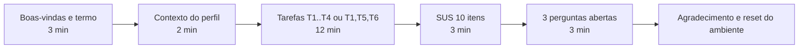

# Testes com usuários (09 a 13/11/2026)

Estratégia simples de teste de usabilidade do app "Só mais uma": 5 a 8 participantes, 6 tarefas (uma por fluxo central), SUS e três perguntas abertas, com critério de aceite mensurável (SUS >= 68 e >= 80 % de sucesso por tarefa) e correções priorizadas até o congelamento de escopo em 27/11.

## 1. Objetivos

| # | Objetivo | Evidência para a disciplina |
|---|---|---|
| O1 | Verificar se um CLIENTE consegue encontrar uma quadra, reservar e pagar sem ajuda | critério 3 (telas e navegação) e critério 6 (usabilidade) |
| O2 | Verificar se um DONO consegue cadastrar quadra por CEP e definir horários sem ajuda | critério 3 (CRUD de 2 entidades) |
| O3 | Medir satisfação com o SUS (meta: >= 68, média do instrumento) | RNF06 (ver docs/06-requisitos-nao-funcionais.md) |
| O4 | Levantar e priorizar os 5 problemas mais graves para corrigir antes de 27/11 | backlog `usabilidade` em docs/14-backlog.md |
| O5 | Executar o checklist de acessibilidade básica na mesma semana | RNF07 |

O que NÃO é objetivo: medir desempenho do backend, testar o Pix real no Inter (o pagamento é simulado) ou validar o modelo de negócio.

## 2. Participantes e recrutamento

| Item | Definição |
|---|---|
| Quantidade | 5 a 8 pessoas (mínimo aceitável: 5). Meta: 6 |
| Perfil CLIENTE | mínimo 3; pessoas que jogam ou já alugaram quadra; não podem ser do grupo |
| Perfil DONO | mínimo 2; de preferência alguém que administra quadra, ginásio ou espaço; se não houver, colega que faz o papel com um roteiro de contexto de 1 minuto |
| Recrutamento | tarefa própria e pequena (estimativa P, dono C), iniciada na **S9 (26 a 30/10)** e não na S10, que já concentra o mutirão de testes, a acessibilidade e o feriado de 02/11. Fontes: colegas de outras turmas, grupos de futebol/vôlei da faculdade, conhecidos dos integrantes. Meta: **8 participantes confirmados** (acima dos 6 necessários) para absorver faltas e desistências. A confirmação — nome, perfil, dia e horário — precisa estar fechada **antes** do Checkpoint 2, até qua 04/11, e não no mesmo dia do checkpoint (risco R19 em docs/19-riscos.md) |
| Duração da sessão | 20 a 25 min (5 de contexto, 12 de tarefas, 5 de SUS e perguntas) |
| Local | presencial na faculdade (preferência) ou remoto com câmera apontada para o celular |
| Compensação | nenhuma; agradecimento e resultado compartilhado ao final |
| Condução | Integrante C conduz e treina; cada integrante conduz pelo menos 1 sessão (obrigatório); sempre 2 pessoas por sessão: 1 facilitador + 1 observador anotando |

Agenda sugerida: seg 09/11 (2 sessões, C + A), ter 10/11 (2 sessões, C + B), qua 11/11 (2 sessões, D + A), qui 12/11 (reserva para faltas), sex 13/11 (consolidação e triagem).

## 3. Ambiente de teste

| Componente | Configuração obrigatória | Plano B |
|---|---|---|
| App | APK `debug` (`v0.2-beta` ou posterior) instalado via `adb install -r` no celular do grupo (2 celulares carregados). Build debug porque o botão "Simular pagamento" só existe em `BuildConfig.DEBUG` | celular do participante só se ele quiser e via `adb` (sideload por navegador pode cair no fluxo de verificação Google, R7) |
| Backend | Render + Neon com `SPRING_PROFILES_ACTIVE=simulado` durante a semana de testes (evita a janela 8h-20h do sandbox Inter e o certificado de 30 dias) | kit de demo offline: `docker compose up` (postgres + api jar) no notebook + hotspot do celular + APK apontando para o IP do notebook (ver docs/09-arquitetura.md) |
| Pagamento | `SimuladoPixGateway`; participante toca "Simular pagamento" (chama `POST /api/v1/dev/pagamentos/{txid}/confirmar` com `X-Dev-Key`) | se o botão falhar, facilitador confirma pelo Swagger |
| Dados | seed `scripts/seed-demo.sql` (3 quadras georreferenciadas na cidade do grupo, horários seg-dom 08-22h) + 1 quadra extra "Quadra Teste Usabilidade" com slots livres amanhã às 19h e 20h e **1 reserva CONFIRMADA para amanhã** (usada na T6), vinculada à conta DONO da sessão | reset do banco entre sessões: `docker compose down -v && docker compose up -d` (kit offline) ou script `scripts/reset-demo.sql` (Render). O script é obrigatório **antes de cada sessão** e recria a "Quadra Teste Usabilidade" com a reserva confirmada de amanhã; sem ela a T6 não mede nada |
| Contas | cada participante cria a própria conta na tarefa 1 (e-mail fictício `teste<N>@somaisuma.local`); `cliente@demo.com` / `dono@demo.com` (senha `Senha123`) só como reserva | — |
| Localização | GPS ligado no celular; se em ambiente fechado sem fix, `LocalizacaoProvider` cai para `lastLocation` e depois para `ultima_lat/lon` do DataStore (R14) | facilitador abre o Google Maps antes para "aquecer" o fix |
| Aquecimento | 10 min antes: `GET /actuator/health` no Render (cold start 30-60 s), login de teste, limpar dados do app (`adb shell pm clear br.com.somaisuma.app`) | — |
| Registro | gravação de tela com `adb shell screenrecord` (com consentimento) + formulário de observação em papel/planilha | só formulário |

## 4. Roteiro: 6 tarefas (uma por fluxo central)

O facilitador lê a tarefa em voz alta, não explica a interface e só intervém após 2 min sem progresso (a intervenção conta como falha). O participante é convidado a pensar em voz alta.

| Tarefa | Perfil | Enunciado lido ao participante | Fluxo / telas | RF cobertos | Critério de sucesso | Tempo esperado | Limite |
|---|---|---|---|---|---|---|---|
| T1 | CLIENTE e DONO | "Crie uma conta para você no aplicativo e entre." (para o DONO: "...uma conta para anunciar suas quadras") | Cadastro -> home do perfil | RF01, RF02 | chega à home do perfil correto (Quadras para CLIENTE, MinhasQuadras para DONO) sem ajuda | 2 min | 4 min |
| T2 | CLIENTE | "Encontre a quadra de futsal mais perto de você e veja o endereço e os horários de funcionamento dela." | Quadras (permissão de localização, chip FUTSAL, ordenação por distância) -> DetalheQuadra | RF07, RF08, RF22 | abre o DetalheQuadra da quadra de futsal com menor distância e diz o endereço em voz alta | 1,5 min | 3 min |
| T3 | CLIENTE | "Reserve essa quadra para amanhã às 19h e faça o pagamento até a reserva aparecer como confirmada." | DetalheQuadra (data, slot LIVRE) -> ConfirmarReserva -> Pagamento (QR, copiar, "Simular pagamento") -> DetalheReserva | RF12, RF13, RF19, RF20, RF24 | vê o status "Confirmada" no DetalheReserva (e a notificação local, se habilitada) | 3 min | 5 min |
| T4 | CLIENTE | "Veja suas reservas e cancele a reserva que você acabou de fazer." | MinhasReservas (aba Próximas) -> DetalheReserva -> cancelar (diálogo) | RF15, RF17 | reserva aparece com chip CANCELADA no Histórico | 1 min | 2,5 min |
| T5 | DONO | "Cadastre uma quadra sua de futebol society, R$ 120 por hora, neste endereço: CEP 01001-000, número 100." | MinhasQuadras (FAB) -> FormQuadra (CEP + Buscar preenche endereço/lat/lon) -> Salvar | RF06, RF09 | quadra aparece em MinhasQuadras com endereço preenchido a partir do CEP (participante não digitou logradouro/cidade) | 3 min | 5 min |
| T6 | DONO | "Deixe essa quadra aberta de segunda a sexta das 18h às 23h e fechada no fim de semana. Depois abra a quadra 'Quadra Teste Usabilidade' e diga quem reservou e em que horário para amanhã." | MinhasQuadras -> HorariosQuadra (switch + TimePicker por dia) -> MinhasQuadras -> ReservasQuadra da "Quadra Teste Usabilidade" (seletor de data) | RF11, RF18 | 5 linhas seg-sex com 18:00-23:00, sáb/dom "Fechado"; abre ReservasQuadra da quadra de teste com a data de amanhã e lê em voz alta o nome do cliente e o horário da reserva CONFIRMADA semeada pelo script de reinicialização | 3 min | 5 min |

Participantes CLIENTE fazem T1-T4; participantes DONO fazem T1, T5, T6. Ordem fixa (os fluxos dependem um do outro). O CEP 01001-000 é o exemplo público da BrasilAPI (devolve latitude/longitude); trocar por um CEP da cidade do grupo se preferirem realismo.



## 5. Métricas

| Métrica | Como medir | Meta |
|---|---|---|
| Taxa de sucesso por tarefa | sucesso = critério atingido sem intervenção e dentro do limite; sucesso parcial (com 1 dica) conta 0,5; falha = 0 | >= 80 % por tarefa |
| Tempo por tarefa | cronômetro do observador, do fim da leitura do enunciado até o critério de sucesso | dentro do "tempo esperado" em >= 50 % dos participantes; nenhum acima do limite |
| Erros | contagem de: toque em elemento errado, volta indevida, mensagem de erro exibida, dado digitado errado, pedido de ajuda | registrar; média <= 2 por tarefa |
| SUS | questionário de 10 afirmações (escala 1 = discordo totalmente a 5 = concordo totalmente) | média >= 68 |
| Problemas qualitativos | anotações do observador + perguntas abertas, consolidados em issues com severidade | top-5 corrigido até 27/11 |

### 5.1 SUS (System Usability Scale) em português

1. Eu acho que gostaria de usar este aplicativo com frequência.
2. Eu achei o aplicativo desnecessariamente complexo.
3. Eu achei o aplicativo fácil de usar.
4. Eu acho que precisaria do apoio de uma pessoa técnica para conseguir usar este aplicativo.
5. Eu achei que as várias funções deste aplicativo estão bem integradas.
6. Eu achei que havia muita inconsistência neste aplicativo.
7. Eu imagino que a maioria das pessoas aprenderia a usar este aplicativo rapidamente.
8. Eu achei o aplicativo muito complicado de usar.
9. Eu me senti muito confiante usando o aplicativo.
10. Eu precisei aprender várias coisas antes de conseguir usar o aplicativo.

Cálculo: itens ímpares contribuem (nota - 1); itens pares contribuem (5 - nota); soma das 10 contribuições x 2,5 = pontuação de 0 a 100. Média das pontuações individuais = SUS do app. Referência: 68 é a média histórica do instrumento; abaixo disso é "abaixo da média".

### 5.2 Três perguntas abertas (após o SUS)

1. "O que foi mais difícil ou confuso durante o uso?"
2. "O que você esperava que o aplicativo fizesse e ele não fez?"
3. "Se pudesse mudar uma coisa no aplicativo, o que seria?"

## 6. Termo de consentimento (curto)

Imprimir 1 por participante; assinado antes da sessão; guardar em `docs/anexos/consentimentos/` apenas como digitalização sem CPF (não versionar no Git; registrar só o código do participante P1..P8).

```text
TERMO DE CONSENTIMENTO - Teste de usabilidade do aplicativo "Só mais uma"

Este teste faz parte de um trabalho acadêmico da disciplina de desenvolvimento mobile.
O objetivo é avaliar o aplicativo, não você. Não existem respostas certas ou erradas.

- A sessão dura cerca de 25 minutos e pode ser interrompida a qualquer momento, sem justificativa.
- Serão registrados: anotações do observador, tempos, respostas ao questionário e, se você autorizar,
  a gravação da tela do celular (sem áudio e sem imagem sua).
- Nenhum dado pessoal real é necessário: use e-mail e telefone fictícios. Nenhum pagamento real é feito;
  o pagamento Pix é simulado.
- Os resultados serão apresentados de forma anônima (código P1..P8) no relatório da disciplina.

[ ] Autorizo a gravação da tela.      [ ] Não autorizo a gravação da tela.

Nome (apenas iniciais): ______   Código: P__   Data: __/11/2026   Assinatura: __________________
Facilitador: Integrante __
```

## 7. Formulário de observação (1 por participante)

```text
Participante: P__   Perfil testado: [ ] CLIENTE  [ ] DONO   Data/hora: __/11 __:__
Facilitador: __   Observador: __   Celular: [ ] grupo 1  [ ] grupo 2   Backend: [ ] Render  [ ] kit offline
Já usou app de reserva/agendamento? [ ] sim [ ] não     Joga em quadra alugada? [ ] sim [ ] não

| Tarefa | Início | Fim | Tempo | Resultado (S / P / F) | Erros (contagem) | Pediu ajuda? | O que aconteceu (fatos, não opinião) |
|--------|--------|-----|-------|-----------------------|------------------|--------------|--------------------------------------|
| T1     |        |     |       |                       |                  |              |                                      |
| T2/T5  |        |     |       |                       |                  |              |                                      |
| T3/T6  |        |     |       |                       |                  |              |                                      |
| T4     |        |     |       |                       |                  |              |                                      |

Frases ditas em voz alta que valem registrar: ...
Mensagens de erro exibidas (código ProblemDetail, se apareceu): ...
SUS: item1 _ item2 _ item3 _ item4 _ item5 _ item6 _ item7 _ item8 _ item9 _ item10 _  -> pontuação: ___
Pergunta 1: ...   Pergunta 2: ...   Pergunta 3: ...
```

S = sucesso, P = parcial (1 dica), F = falha (desistiu, estourou o limite ou precisou de 2+ dicas).

## 8. Critério de aceite

| Critério | Regra | Se não atingir |
|---|---|---|
| SUS | média >= 68 com n >= 5 | corrigir top-5 e reaplicar o SUS com 3 participantes (podem ser os mesmos) em **qua 18/11 e qui 19/11**, sobre as correções já feitas; registrar as duas medições no relatório. Se a segunda medição também ficar abaixo de 68, o resultado é **registrado como limitação conhecida na seção "Limitações do estudo" do relatório final**, com hipótese e o que faríamos com mais tempo — não abre uma terceira rodada de correções, porque a S13 (23 a 27/11) é das últimas funcionalidades e da estabilização e o congelamento é em 27/11 |
| Sucesso por tarefa | >= 80 % (S = 1, P = 0,5) em cada uma das 6 tarefas | a tarefa abaixo de 80 % vira issue de severidade >= 3 obrigatoriamente; reteste dirigido da tarefa em **18 e 19/11**, junto com o reteste do SUS. Segunda medição ainda abaixo de 80 % vira limitação no relatório final, não nova rodada de correções |
| Problemas críticos | zero problemas de severidade 4 abertos em 27/11 | congelamento não aprova; item vira correção prioritária na S13 (só correções, sem features) |
| Acessibilidade | checklist da seção 11 executado nas 13 telas, sem item vermelho em Login, Quadras, DetalheQuadra, Pagamento e FormQuadra | correção na S12 |

Quem aprova: Integrante C (dono deste documento) apresenta os números na demo interna de sex 13/11; o grupo decide o top-5 na reunião de seg 16/11; Integrante A registra a decisão em ata no board.

## 9. Como priorizar e corrigir (13/11 a 27/11)

Escala de severidade (adaptada de Nielsen):

| Severidade | Definição | Exemplo esperado | Prazo |
|---|---|---|---|
| 4 crítico | impede concluir a tarefa; dado perdido; erro sem saída | participante não encontra como pagar; app fecha ao tocar no slot | S12 (até 19/11) |
| 3 grave | conclui só com ajuda ou com muito atraso | não percebe que precisa escolher a data antes do slot | S12 |
| 2 moderado | atraso ou erro recuperável sem ajuda | confunde "Copiar código" com "Já paguei" | S12/S13 se sobrar hora |
| 1 leve | cosmético, comentário de preferência | cor do chip, texto do botão | backlog Could Have |

Processo:

1. Sex 13/11: C consolida o formulário de todos em uma planilha (`docs/anexos/testes-usuarios-2026-11.csv`: participante, tarefa, resultado, tempo, erros, SUS).
2. Cada problema observado em >= 2 participantes ou com severidade >= 3 vira issue no GitHub com label `usabilidade`, `sev-1..4`, milestone N2, estimativa P/M/G e RF afetado.
3. Seg 16/11: ranking = severidade x frequência; os 5 primeiros são o **top-5** e entram como Must Have (N2) no docs/14-backlog.md; o restante fica Should/Could.
4. Regra de ouro mantida: nenhuma feature Could Have começa enquanto houver item do top-5 aberto.
5. Correções seguem PR cruzado normal (revisor = suplente da fatia); cada PR cita a issue e o participante que originou (P3, T3).
6. Qua 18/11 e qui 19/11 (S12): reteste dirigido das tarefas afetadas e reaplicação do SUS com 3 pessoas, sobre as correções já feitas até ali. O reteste **não** fica na S13, que é das últimas funcionalidades e da estabilização; se a segunda medição ficar abaixo da meta, ela vira limitação no relatório final (seção 8) e não gera nova rodada de correções. Congelamento em sex 27/11.

## 10. Template do relatório final (seção a preencher neste arquivo até 04/12)

```markdown
## Resultados (preenchido em __/11/2026)

### Participantes
| Código | Perfil | Data | Facilitador | Já usava apps de agendamento? |
|---|---|---|---|---|
| P1 | CLIENTE | 09/11 | C | sim |

### Sucesso e tempo por tarefa
| Tarefa | n | Sucesso | Parcial | Falha | Taxa (%) | Tempo médio | Tempo máximo | Meta atingida? |
|---|---|---|---|---|---|---|---|---|
| T1 | 6 | 6 | 0 | 0 | 100 | 1m40 | 2m30 | sim |

### SUS
| Participante | P1 | P2 | P3 | P4 | P5 | P6 | Média |
|---|---|---|---|---|---|---|---|
| Pontuação | | | | | | | |
SUS médio: __ (meta >= 68). Segunda medição de 18-19/11 (se houve): __.

### Top-5 problemas
| # | Problema | Tarefa | Frequência | Severidade | Issue | Correção aplicada | PR | Retestado em |
|---|---|---|---|---|---|---|---|---|

### Outros achados (severidade 1-2)

### Respostas abertas (resumo por tema)

### Checklist de acessibilidade (seção 11) - resultado por tela

### Limitações do estudo
(n pequeno; participantes conhecidos do grupo; pagamento simulado; sessões presenciais com celular do grupo; segunda medição de 18-19/11 abaixo da meta, se foi o caso, com a hipótese do grupo)
```

## 11. Checklist de acessibilidade básica (executar na mesma semana, 09 a 13/11)

Executado por Integrante C com apoio de A nas 13 telas do docs/04-telas.md; resultado registrado na seção de resultados acima. Ferramentas: TalkBack (Configurações > Acessibilidade), "Tamanho da fonte" em 200 % (Configurações > Tela), Layout Inspector do Android Studio para medir alvos.

| # | Item | Como verificar | Aceite |
|---|---|---|---|
| A1 | Todo ícone/imagem com ação tem `contentDescription` (ícones decorativos com `null`) | TalkBack lê o nome ao focar; QR lê "QR Code Pix, R$ 80,00" | sem "botão sem rótulo" |
| A2 | Alvos de toque >= 48 dp | Layout Inspector nos chips de esporte, slots da grade, switches de HorariosQuadra, ícones da bottom-nav | 100 % dos alvos |
| A3 | Fonte do sistema em 200 % não corta texto nem esconde botão | percorrer as 13 telas; atenção a cards de Quadras, grade de slots, contador do Pagamento | sem corte; scroll aparece onde necessário |
| A4 | Contraste Material 3 (tema claro e escuro explícitos, dynamic color desligado) | conferir `ChipStatus` (CONFIRMADA/PENDENTE/CANCELADA/EXPIRADA) e `BannerOffline` nos dois temas | sem texto cinza sobre cinza |
| A5 | Navegação por TalkBack completa a T3 (reservar e pagar) | executar a T3 só com gestos do TalkBack | conclui sem tocar "às cegas" |
| A6 | Ordem de foco e `ImeAction.Next` nos formulários (Login, Cadastro, FormQuadra, Perfil) | teclado avança campo a campo; último campo dispara a ação | sem pular campo |
| A7 | Estados carregando/vazio/erro anunciados | `CarregandoBox`, `VazioBox`, `ErroBox(onTentarNovamente)` têm texto lido pelo TalkBack | sim |
| A8 | Mensagens de erro por campo (`CampoTextoValidado`) associadas ao campo | TalkBack lê o erro ao focar o campo | sim |
| A9 | Não depende só de cor: status também em texto | chips e slots têm rótulo textual (LIVRE, OCUPADO, PASSADO, FECHADO) | sim |
| A10 | App usável sem localização e sem notificações (permissões negadas) | negar ambas; lista em ordem alfabética com aviso; pagamento confirma sem notificação | sim (RNF08) |

Itens vermelhos em Login, Quadras, DetalheQuadra, Pagamento e FormQuadra são bloqueantes para o congelamento (seção 8). Casos de teste formais relacionados: CT-25 e CT-29 em docs/23-plano-de-testes.md.
