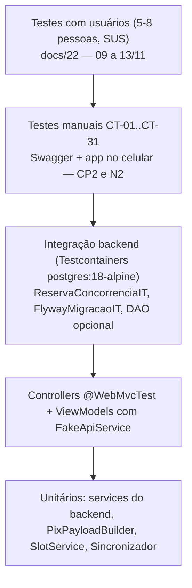

# Plano de testes

Pirâmide de testes do projeto (unitários por service, controllers com `@WebMvcTest`, integração com Testcontainers incluindo a corrida de 10 threads, ViewModels com `FakeApiService`, testes manuais CT-01..CT-30 rastreados a RF/RN e testes com usuários), comandos para rodar, o que roda no CI e critérios de saída para o Checkpoint 2 e a N2.

## 1. Pirâmide do projeto



| Nível | Ferramenta | Onde | Quando roda | Responsável |
|---|---|---|---|---|
| Unitário backend (por service) | JUnit 5 + Mockito (`@MockitoBean` só nos slice tests) | `backend/src/test/java/br/com/somaisuma/service/*Test.java` | todo PR (CI) | dono da fatia |
| Controller | `@WebMvcTest` + `MockMvc` + `spring-boot-starter-webmvc-test`; segurança real (`SecurityConfig` importada) | `backend/src/test/java/.../controller/*Test.java` | todo PR (CI) | A (auth), B (quadra), C (reserva), D (pagamento/webhook) |
| Integração | `@SpringBootTest` + `@ServiceConnection` `PostgreSQLContainer` (Testcontainers 2.x, imagem `postgres:18-alpine`), Flyway real, profile `simulado` | `backend/src/test/java/.../*IT.java` | todo PR (CI, Docker do runner) | C (`ReservaConcorrenciaIT`), B (`FlywayMigracaoIT`) |
| ViewModel Android | JUnit 5 + `kotlinx-coroutines-test` + `FakeApiService` + `FakeQuadraDao`/`FakeReservaDao` em memória + `FakeSessaoDataStore` | `android/app/src/test/kotlin/.../ui/**/*ViewModelTest.kt` | todo PR (CI, JVM, sem emulador) | dono da tela |
| DAO Room (opcional, Should Have) | `androidTest` com Room in-memory | `android/app/src/androidTest/.../QuadraDaoTest.kt` | manual no notebook com emulador | B |
| Manuais CT-xx | Swagger, `adb`, 2 celulares | este arquivo, seção 3 | mutirão de testes da S10 (02 a 06/11, 2 h por integrante), reteste S13, ensaio S14/S15 | D organiza; cada um executa os CT da fatia de outro integrante |
| Usuários | roteiro de 6 tarefas + SUS | docs/22-testes-com-usuarios.md | 09 a 13/11 | C |

Decisão: sem testes de UI Compose automatizados em CI (emulador no runner custa tempo e quebra por toolchain); a lógica de tela fica nos ViewModels testáveis na JVM e o comportamento visual é coberto pelos CT manuais e pelos testes com usuários (ver "complexidade evitada" em docs/00-indice.md).

## 2. Inventário de testes automatizados

| Classe | Tipo | O que prova | RF/RN/RNF | Dono |
|---|---|---|---|---|
| `JwtServiceTest` | unitário | token HS256 com `sub` = usuarioId, claim `perfil`, expiração 7 dias; segredo < 32 bytes falha na inicialização | RF02, RNF01 | A |
| `AuthServiceTest` | unitário | BCrypt custo 10; 5 falhas -> bloqueio 15 min; sucesso zera contador; e-mail normalizado para minúsculas | RF02, RF04, RN20, RNF01 | A |
| `AuthControllerTest` | `@WebMvcTest` | 201 no registrar; 400 `VALIDACAO` com `campos[]` para senha fraca; 409 `EMAIL_JA_CADASTRADO`; 401 `CREDENCIAL_INVALIDA`; 429 `LOGIN_BLOQUEADO`; `POST /quadras` com token CLIENTE -> 403 | RF01, RF02, RF04, RN01 | A |
| `QuadraServiceTest` | unitário | quadra nasce com dono = logado; edição por outro dono -> `AcessoNegadoException`; desativar com reserva ativa futura -> `ConflitoException(QUADRA_COM_RESERVAS)` | RF06, RF10, RN01, RN03, RN16 | B |
| `HorarioFuncionamentoServiceTest` | unitário | `hora_fechamento > hora_abertura`; dia duplicado -> `DIA_JA_CADASTRADO`; reduzir faixa com reserva ativa -> `HORARIO_COM_RESERVAS` | RF11, RN16, RN19 | B |
| `CepClientTest` | unitário (`MockRestServiceServer`) | BrasilAPI v2 devolve lat/lon; BrasilAPI 5xx -> fallback ViaCEP sem coordenadas; ambos fora -> `CEP_INDISPONIVEL` 503; CEP inexistente -> 404 | RF09 | B |
| `FlywayMigracaoIT` | integração | `V1__init.sql` + `scripts/seed-demo.sql` aplicam em PostgreSQL 18 limpo; índice `ux_reserva_slot_ativo` existe e é parcial | RNF10 | B |
| `SlotServiceTest` | unitário | grade de 60 min = funcionamento − reservas ativas − passado; status LIVRE/OCUPADO/PASSADO/FECHADO; data > hoje+14 -> `DATA_FORA_DA_JANELA`; `inicio` recebido com offset `-03:00` e com `Z` caem no mesmo slot em `America/Sao_Paulo`; minuto != 0 -> 400 | RF12, RN06, RN09, RNF12 | C |
| `ReservaServiceTest` | unitário | valor = `preco_hora` no momento; `expira_em = criado_em + 15 min`; RN11 (segunda pendente -> 422); transições por UPDATE condicional (0 linhas -> `TRANSICAO_INVALIDA`); RN13 (cliente CONFIRMADA < 2 h -> `CANCELAMENTO_FORA_DO_PRAZO`; dono sem motivo -> 400 `VALIDACAO` com `campos[motivo]`) | RF13, RF14, RF17, RN07, RN10, RN11, RN13 | C |
| `ReservaFacadeTest` | unitário | gateway lança `IntegracaoExternaException` -> `cancelarPorSistema` chamado + `PagamentoIndisponivelException` (502) | RN17 | C |
| **`ReservaConcorrenciaIT`** | integração | 10 threads com `CountDownLatch` fazem `POST /api/v1/reservas` no mesmo `(quadraId, inicio)`: exatamente 1 x 201, 9 x 409 `HORARIO_INDISPONIVEL`, `SELECT count(*)` ativo = 1 | RN08 | C |
| `PixPayloadBuilderTest` | unitário | payload BR Code estático (TLV) com CRC16-CCITT igual a um payload de referência conhecido; txid `***`; nome <= 25 e cidade <= 15 caracteres | RF19 (simulado) | D |
| `PagamentoServiceTest` | unitário | `confirmar(txid, e2e, valor)` idempotente (2ª chamada no-op); valor divergente -> rejeitado com log; pagamento tardio para reserva EXPIRADA reconfirma se slot livre, senão log `ESTORNO_MANUAL`; pagamento para CANCELADA -> PAGO + `ESTORNO_MANUAL` | RF20, RN12, RN14 | D |
| `InterPixGatewayTest` | unitário (`MockRestServiceServer`) | `PUT /pix/v2/cob/{txid}` com `calendario.expiracao=900`, `valor.original="80.00"`, chave; parse de `pixCopiaECola`/`location`; `GET /cob/{txid}` CONCLUIDA -> `endToEndId`; token cacheado (1 chamada a `/oauth/v2/token` para 2 cobranças); 429 -> exceção que o job trata pulando o ciclo | RF19, RF20 | D |
| `InterWebhookControllerTest` | `@WebMvcTest` | aceita o array oficial `[{endToEndId, txid, chave, valor, horario, infoPagador, componentesValor}]`; txid desconhecido ignorado com 200; valor diferente ignorado; `infoPagador` nunca persistido | RF20 (Should Have), RN05, RNF02 | D |
| `LoginViewModelTest` / `CadastroViewModelTest` | ViewModel | validação por campo; `CREDENCIAL_INVALIDA` e `LOGIN_BLOQUEADO` viram mensagens; sucesso grava `SessaoDataStore` (fake) e navega para a home do perfil | RF01, RF02, RNF06 | A |
| `QuadrasViewModelTest` | ViewModel | filtro por esporte; ordenação por distância com `Geo.distanciaKm`; sem localização -> ordem alfabética; estados carregando/vazio/erro da tela e `ErroBox(onTentarNovamente)` no erro de rede. Exigida já na N1 (S2 a S4), quando ainda não existe cache local | RF07, RF22, RNF06 | B |
| `QuadrasCacheViewModelTest` | ViewModel | cache primeiro (Flow do fake DAO) depois rede; `Resultado.Offline` -> `BannerOffline` com a data da última sincronização. Exigida a partir da S7, quando o cache Room e o banner são construídos | RF23 | B |
| `ConfirmarReservaViewModelTest` | ViewModel | 201 -> navega para Pagamento; 409 -> evento "recarregar slots"; 422 `RESERVA_PENDENTE_EXISTENTE` -> navega para a reserva pendente; 502 -> mensagem "pagamento indisponível" | RF13, RN08, RN11, RN17 | C |
| `SincronizadorTest` | unitário | `IOException` -> `Resultado.Offline` sem apagar cache; sucesso substitui o escopo e marca `ultima_sincronizacao`; `HttpException` -> `Resultado.Erro(codigo)` | RF23, RNF11 | C |
| `PagamentoViewModelTest` | ViewModel | polling a cada 5 s por 2 min e depois 10 s (dispatcher de teste); PENDENTE -> PAGO chama `NotificadorReserva.confirmada` (fake) e emite navegação; EXPIRADO para o polling; contador regressivo a partir de `expiraEm` | RF20, RF24, RNF04 | D |
| `QuadraDaoTest` (opcional) | `androidTest` | `substituirEscopo(CATALOGO, ...)` não apaga linhas `MINHAS` (PK composta `id, escopo`) | RF23 | B |

## 3. Casos de teste CT-01..CT-31

Convenções: pré-condição padrão = backend no profile `simulado`, seed `scripts/seed-demo.sql`, contas `cliente@demo.com` e `dono@demo.com` (senha `Senha123`), app debug instalado via `adb`. "Auto" indica a classe automatizada que cobre o caso; "Manual" indica execução no Swagger e/ou no app registrada na planilha `docs/anexos/execucao-ct-<data>.csv` (colunas: CT, data, executor, ambiente, resultado, evidência).

Mutirão de testes da S10 (bug bash): **8 horas somadas, sendo 2 horas por integrante** — não são 8 horas por pessoa nem um dia inteiro de equipe. Os 30 CT Must Have (CT-01..CT-29 e CT-31) são divididos em **cerca de 7 casos por pessoa** (7 + 7 + 8 + 8), e cada integrante executa sempre casos da fatia de outro integrante, nunca da própria. D distribui os casos na planilha antes de o mutirão começar; o que não couber nas 2 horas de alguém é redistribuído no mesmo dia, e não empurrado para a S13.

| CT | Descrição | Passos | Resultado esperado | Rastreio | Tipo | Resp. |
|---|---|---|---|---|---|---|
| CT-01 | Cadastro de CLIENTE com auto-login | app > Cadastro: nome, e-mail novo, telefone, senha `Teste1234`, confirmar, perfil "Quero reservar quadras" > Cadastrar | 201; app grava token e abre a home Quadras com bottom-nav de CLIENTE | RF01, RF03 | Auto (`AuthControllerTest`, `CadastroViewModelTest`) + Manual | A |
| CT-02 | E-mail duplicado | repetir CT-01 com `cliente@demo.com` (também em maiúsculas) | 409 `EMAIL_JA_CADASTRADO`; mensagem no campo e-mail | RF01, RN20 | Auto + Manual | A |
| CT-03 | Senha fora da política | Cadastro com senha `abcdefgh` e depois `12345678` | 400 `VALIDACAO` com `campos[senha]`; tela mostra "mínimo 8 caracteres com letra e número" antes de enviar | RF01, RNF01 | Auto + Manual | A |
| CT-04 | Login válido e JWT | `POST /auth/login` `dono@demo.com`; decodificar o token | 200 `TokenResponse{token, expiraEm, usuario}`; claim `perfil=DONO`, `exp` = agora + 7 dias; Swagger com o token acessa `GET /usuarios/me` | RF02, RNF01 | Auto (`JwtServiceTest`) + Manual | A |
| CT-05 | Bloqueio após 5 falhas | 5 logins com senha errada, depois 1 com senha certa | 5x 401 `CREDENCIAL_INVALIDA`; 6ª chamada 429 `LOGIN_BLOQUEADO`; tela: "Muitas tentativas, aguarde 15 minutos"; após 15 min (ou reinício do backend) volta a aceitar | RF04, RNF01 | Auto (`AuthServiceTest`) + Manual | A |
| CT-06 | Sessão persistente e logout limpo | login; fechar o app pelo gerenciador; reabrir; depois Perfil > Sair; reabrir | reabre direto na home (Splash lê `token_expira_em`); após Sair abre Login e `adb shell run-as ... ls databases` mostra `somaisuma.db` sem linhas em `quadra_cache`/`reserva_cache` (ou app sem dados na lista antes do sync) | RF03, RNF03 | Manual | A |
| CT-07 | Editar perfil e trocar senha | Perfil > alterar nome e telefone > Salvar; trocar senha com `senhaAtual` errada e depois correta; relogar | `PUT /usuarios/me` 200; senha errada -> 422; login só com a senha nova; perfil (CLIENTE/DONO) não editável | RF05, RN20 | Manual | A |
| CT-08 | Criar quadra (CRUD-C) | como DONO: MinhasQuadras > FAB > FormQuadra completo > Salvar; `GET /quadras/minhas` | 201 com `Location`; `dono_id` = usuário logado; quadra aparece em MinhasQuadras e em `GET /quadras` (ativa) | RF06, RN01 | Auto (`QuadraServiceTest`) + Manual | B |
| CT-09 | CLIENTE não cria quadra | Swagger com token CLIENTE: `POST /quadras` | 403 `ACESSO_NEGADO`; no app o CLIENTE não vê MinhasQuadras nem FAB | RN01, RN02 | Auto (`AuthControllerTest`) + Manual | B |
| CT-10 | Propriedade da quadra | criar 2º DONO; tentar `PUT /quadras/{id}` e `DELETE` da quadra do `dono@demo.com` | 403 `ACESSO_NEGADO`; `GET /quadras/{id}` continua 200 (leitura pública) | RN03 | Auto + Manual | B |
| CT-11 | Desativar quadra com reserva futura | quadra com reserva CONFIRMADA amanhã (seed); MinhasQuadras > Desativar | 409 `QUADRA_COM_RESERVAS`; diálogo orienta a cancelar as reservas antes; após cancelar a reserva, `DELETE` -> 204 e quadra some de `GET /quadras` mas fica em `/quadras/minhas` como inativa | RF10, RN16 | Auto + Manual | B |
| CT-12 | Listar e filtrar quadras | Quadras > chip FUTSAL; `GET /quadras?esporte=FUTSAL&cidade=<cidade do seed>` | só quadras ativas do esporte/cidade; quadra inativa de CT-11 não aparece; estado vazio com texto quando o filtro não retorna nada | RF07, RNF06 | Auto (`QuadrasViewModelTest`) + Manual | B |
| CT-13 | CEP com fallback | FormQuadra > CEP `01001000` > Buscar; depois simular BrasilAPI fora (bloquear host ou `MockRestServiceServer`); depois CEP `00000000` | 1) logradouro/bairro/cidade/UF/lat/lon preenchidos; 2) fallback ViaCEP preenche endereço, lat/lon ficam vazios e editáveis; 3) 404 e mensagem no campo; ambos fora -> 503 `CEP_INDISPONIVEL` | RF09 | Auto (`CepClientTest`) + Manual | B |
| CT-14 | CRUD de HorarioFuncionamento | HorariosQuadra: ligar seg (POST 08:00-22:00); alterar para 09:00 (PUT); desligar dom (DELETE); tentar abertura 22:00 e fechamento 08:00; `POST` do mesmo dia duas vezes via Swagger | 201 / 200 / 204; fechamento <= abertura -> 400 `VALIDACAO`; dia repetido -> 409 `DIA_JA_CADASTRADO`; `GET .../horarios-funcionamento` reflete as 3 operações; dia sem linha exibido como "Fechado" | RF11, RN19 | Auto (`HorarioFuncionamentoServiceTest`) + Manual | B |
| CT-15 | Reduzir horário com reserva ativa | reserva CONFIRMADA amanhã 19h; `PUT` do dia correspondente para 08:00-18:00; `DELETE` do dia | 409 `HORARIO_COM_RESERVAS` nos dois; após cancelar a reserva, operações passam | RN16 | Auto + Manual | B |
| CT-16 | Grade de slots | DetalheQuadra > data de amanhã; data de hoje; data hoje+15 via Swagger | slots de 60 min entre abertura e fechamento; slot da reserva CONFIRMADA = OCUPADO; horas já passadas de hoje = PASSADO; dia sem funcionamento = lista só FECHADO; hoje+15 -> 422 `DATA_FORA_DA_JANELA` e seletor do app não oferece a data | RF12, RN09 | Auto (`SlotServiceTest`) + Manual | C |
| CT-17 | Fuso horário único | `POST /reservas` com `inicio=2026-11-20T22:00:00Z` (= 19:00 em São Paulo) e com `2026-11-20T19:00:00-03:00`; depois com `19:30:00-03:00` | as duas primeiras caem no mesmo slot (a 2ª recebe 409); 19:30 -> 400 `VALIDACAO` (hora cheia); `ReservaResponse.inicio` sempre com offset `-03:00` | RN06, RNF12 | Auto (`SlotServiceTest`) + Manual | C |
| CT-18 | Criar reserva com cobrança | ConfirmarReserva > Confirmar; conferir `pagamento` na resposta e no banco | 201 com `status=PENDENTE_PAGAMENTO`, `valor` = `preco_hora`, `expiraEm` = criado + 15 min; `pagamento{txid 32 chars, pixCopiaECola, status PENDENTE}`; QR renderiza e app de banco decodifica o payload (CRC16 válido); "Copiar código" copia o texto | RF13, RF19, RN07, RN10 | Auto (`ReservaServiceTest`, `PixPayloadBuilderTest`) + Manual | C / D |
| CT-19 | Corrida de 10 threads | `./gradlew test --tests '*ReservaConcorrenciaIT'`; na demo: 2 celulares tocam o mesmo slot livre quase ao mesmo tempo | IT: 1 x 201, 9 x 409, `count(*)` ativo = 1; celulares: um vai para Pagamento, o outro recebe snackbar "Esse horário acabou de ser reservado" e a grade recarrega com o slot OCUPADO | RN08 | Auto (`ReservaConcorrenciaIT`) + Manual | C |
| CT-20 | Uma pendente por cliente | com reserva PENDENTE aberta, tentar reservar outro slot | 422 `RESERVA_PENDENTE_EXISTENTE`; app leva ao DetalheReserva da pendente com botão "Pagar agora" | RN11 | Auto (`ReservaServiceTest`, `ConfirmarReservaViewModelTest`) + Manual | C |
| CT-21 | Fora da janela ou do funcionamento | Swagger: `inicio` no passado; fora do horário de funcionamento; quadra inativa; quadra inexistente | 400 (`@Future`); 422 `FORA_DO_FUNCIONAMENTO`; 404 `NAO_ENCONTRADO` nos dois últimos | RN09 | Auto + Manual | C |
| CT-22 | Expiração em 15 min | criar reserva; `UPDATE reserva SET expira_em = now() - interval '1 minute' WHERE id=?` (e o mesmo em `pagamento`); aguardar até 60 s | reserva EXPIRADA, pagamento EXPIRADO; slot volta a LIVRE; tela Pagamento mostra "Expirado" e para o polling; reserva aparece no Histórico | RF14, RN10 | Auto (`ReservaServiceTest`) + Manual | C |
| CT-23 | Gateway indisponível | subir backend com o `SimuladoPixGateway` em falha forçada (propriedade de teste `simulado.falhar=true` ou `@MockitoBean` lançando `IntegracaoExternaException`), ou profile `inter-sandbox` fora do horário 8h-20h, e criar reserva | 502 `PAGAMENTO_INDISPONIVEL`; reserva CANCELADA com `cancelado_por=SISTEMA`; nenhuma linha em `pagamento`; slot LIVRE; app: "Não foi possível gerar a cobrança, tente novamente" | RN17 | Auto (`ReservaFacadeTest`) + Manual | C / D |
| CT-24 | Confirmação idempotente | `POST /dev/pagamentos/{txid}/confirmar` com `X-Dev-Key`; repetir; chamar sem o header; em `inter-sandbox` verificar que repassa a `POST /pix/v2/cob/pagar/{txid}` | 1ª: pagamento PAGO, reserva CONFIRMADA, `end_to_end_id` preenchido; 2ª: 422 `REGRA_NEGOCIO`/`TRANSICAO_INVALIDA`, sem alteração no banco; sem header -> 403; em `inter-prod` a rota não existe (404) | RF20, RF21, RN12 | Auto (`PagamentoServiceTest`) + Manual | D |
| CT-25 | Polling, navegação e notificação | tela Pagamento aberta; confirmar via CT-24 em outro dispositivo/Swagger; repetir com notificações negadas e com TalkBack ligado | em <= 5 s a tela muda para "Pago", notificação "Reserva confirmada" aparece (se permitida), app navega para DetalheReserva com `popUpTo Quadras`; back não volta para ConfirmarReserva; sem permissão: só navega; TalkBack lê "QR Code Pix, R$ 80,00" | RF20, RF24, RNF04, RNF07 | Auto (`PagamentoViewModelTest`) + Manual | D |
| CT-26 | Cancelamento (RN13) | a) cliente cancela PENDENTE; b) cliente cancela CONFIRMADA com início em 3 h; c) idem com início em 1 h; d) dono cancela CONFIRMADA sem motivo; e) com motivo | a) 200 CANCELADA, pagamento CANCELADO; b) 200; c) 422 `CANCELAMENTO_FORA_DO_PRAZO` e botão desabilitado com a regra exibida; d) 400 `VALIDACAO` com `campos[motivo]`; e) 200 com `cancelado_por=DONO` e motivo; nenhuma reserva é apagada (RN15) | RF17, RN13, RN15 | Auto (`ReservaServiceTest`) + Manual | C |
| CT-27 | Minhas reservas, observação e visão do dono | CLIENTE: MinhasReservas (Próximas/Histórico) > DetalheReserva > editar observação; CLIENTE tenta `GET /reservas/{id}` de outro cliente; DONO: ReservasQuadra com data de amanhã | listas corretas por aba; `PATCH` 200 e observação persistida; 403 `ACESSO_NEGADO` para reserva alheia; DONO vê hora, nome/telefone do cliente, status e valor, e nunca dados do pagador | RF15, RF16, RF18, RN04, RN05 | Auto (`ReservaControllerTest`) + Manual | C |
| CT-28 | Offline com cache | com dados sincronizados, ativar modo avião; abrir Quadras, DetalheQuadra, MinhasReservas, DetalheReserva de uma PENDENTE, Perfil; desativar o modo avião | listas abrem instantaneamente com `BannerOffline("dados de dd/MM HH:mm")`; grade de slots mostra "Conecte-se para ver horários"; QR da pendente reabre do `reserva_cache.pixCopiaECola`; botões de escrita desabilitados; ao voltar a rede, `MonitorConectividade` dispara sync e o banner some | RF23, RNF04, RNF11 | Auto (`SincronizadorTest`, `QuadrasCacheViewModelTest`) + Manual | C |
| CT-29 | Geolocalização e degradação | Quadras > card "Ativar localização" > conceder "aproximada"; conferir distâncias e ordem; DetalheQuadra > "Abrir no Maps"; repetir negando a permissão; repetir em emulador sem fix (Extended Controls sem coordenada) | com permissão: "a X,X km" em cada card, lista ordenada, quadras sem lat/lon ao fim; Maps abre em `geo:lat,lon?q=...`; negada: ordem alfabética + texto "Ative a localização para ver a distância", app 100 % usável; sem fix: usa `lastLocation` ou `ultima_lat/lon`, senão sem distância | RF22, RNF08 | Manual | C |
| CT-30 | Webhook do Inter (Should Have) | `POST /api/v1/webhooks/inter/pix/{segredo}` com o array oficial (txid válido, valor igual); repetir; enviar txid desconhecido; enviar valor diferente; com `ngrok` em S8 verificar se o sandbox dispara após `POST /pix/v2/cob/pagar/{txid}` | 200 e reserva CONFIRMADA; repetição no-op (`end_to_end_id` UNIQUE); desconhecido -> 200 ignorado com log; valor diferente -> ignorado com `WARN`; `infoPagador` não aparece em nenhuma tabela; resultado do disparo do sandbox registrado em docs/11-integracao-pix-inter.md | RF20, RN05, RN12, RNF02 | Auto (`InterWebhookControllerTest`) + Manual | D |
| CT-31 | Detalhe da quadra | abrir `DetalheQuadra` de uma quadra do seed pelo card da lista; conferir os campos exibidos; tocar "Abrir no Maps"; repetir com `GET /api/v1/quadras/{id}` de id inexistente e de quadra com `ativa=false` | nome, esporte, preço por hora, descrição, endereço completo e os sete dias com faixa (`08:00–22:00`) ou "Fechado" (RN19); distância exibida quando há localização (RF22); o `Intent` `geo:` abre o aplicativo de mapas; id inexistente ou quadra inativa devolvem 404 `NAO_ENCONTRADO` | RF08, RN19 | Manual | B |

Cobertura por requisito: todos os RF01..RF24 e as RN01..RN20 aparecem em ao menos um dos 31 CT, exceto RN18 (chave única de recebimento: verificada por inspeção de `application-inter-*.yml` e documentada em docs/11) e RN14 (estorno manual: coberta por `PagamentoServiceTest` e por log, sem CT manual porque exige pagamento tardio real).

## 4. Como rodar

Backend (JDK 21, Docker Desktop ligado para os `*IT`):

```bash
cd backend
./gradlew test                                   # unitários + @WebMvcTest + *IT (Testcontainers sobe postgres:18-alpine)
./gradlew test --tests '*ReservaConcorrenciaIT'  # só a corrida de 10 threads (mostrar na apresentação)
./gradlew test --tests 'br.com.somaisuma.service.*'   # só unitários de service, sem Docker
./gradlew test --tests '*Test'                   # se o Docker não estiver disponível (o padrão de nome deixa os *IT de fora)
```

O relatório HTML fica em `backend/build/reports/tests/test/index.html`. Variáveis mínimas nos testes: `JWT_SECRET` (definido em `src/test/resources/application-test.yml` com um valor fixo de 32 bytes), profile `simulado` forçado por `@ActiveProfiles("simulado")`.

Android (sem emulador):

```bash
cd android
./gradlew testDebugUnitTest                      # ViewModels, Sincronizador, Geo, Validadores
./gradlew testDebugUnitTest --tests '*PagamentoViewModelTest'
./gradlew connectedDebugAndroidTest              # opcional: QuadraDaoTest, exige emulador/celular conectado
```

Relatório em `android/app/build/reports/tests/testDebugUnitTest/index.html`. No Windows, `gradlew.bat` no lugar de `./gradlew`.

Testes manuais: executar a planilha `docs/anexos/execucao-ct-<data>.csv` com Swagger em `http://localhost:8080/swagger-ui.html` e o APK instalado com `adb install -r`. Para cenários com `inter-sandbox`, respeitar 8h-20h seg-sex.

## 5. O que roda no CI (`.github/workflows/ci.yml`, dono A)

| Job | Runner | Passos | Gate |
|---|---|---|---|
| `segredos` | `ubuntu-latest` | varredura do diff em busca de `.crt`, `.key`, `.pfx`, `.env` e de `client_secret`/`JWT_SECRET` com valor real; falha se encontrar | obrigatório para merge em `main` |
| `backend` | `ubuntu-latest` (Docker disponível para Testcontainers) | `actions/setup-java` Temurin 21 -> `./gradlew build` (compila e roda `*Test` e `*IT`) -> publica `build/reports/tests` como artefato | obrigatório para merge em `main` |
| `android` | `ubuntu-latest` | Temurin 21 -> `./gradlew testDebugUnitTest assembleDebug` -> publica `app-debug.apk` como artefato | obrigatório para merge em `main` |

Gatilhos: `pull_request` e `push` em `main` (também em `release/*`). Os três jobs são os mesmos descritos em docs/21-git-e-organizacao.md e docs/09-arquitetura.md. Meta de duração: < 10 min. Segredos: nenhum (profile `simulado`; `JWT_SECRET` de teste no repositório de testes). Regras de `main`: PR com 1 aprovação do suplente + CI verde; ninguém mergeia o próprio PR (docs/21-git-e-organizacao.md). O CI não roda `androidTest` nem testes contra o sandbox Inter (dependem de emulador e de certificado).

## 6. Critérios de saída

### Checkpoint 2 — beta funcional (sex 06/11/2026)

| # | Critério | Como comprovar |
|---|---|---|
| S1 | CI verde em `main` com `ReservaConcorrenciaIT` passando | link da execução do Actions |
| S2 | Todas as classes automatizadas da seção 2 marcadas como Must existem e passam (opcional: `QuadraDaoTest`) | relatório de testes |
| S3 | CT-01..CT-29 e CT-31 (30 casos) executados no mutirão de testes da S10 — 8 h somadas, 2 h por integrante, cerca de 7 casos por pessoa, sempre da fatia de outro integrante —, >= 90 % aprovados | planilha `execucao-ct-2026-11-0x.csv` |
| S4 | Zero defeito de severidade 4 aberto; defeitos 3 com issue e responsável | board GitHub Projects |
| S5 | Beta no Render + Neon respondendo `GET /actuator/health`; APK `v0.2-beta` instalado via `adb` em 2 celulares | demonstração no checkpoint |
| S6 | Profile do beta decidido (`inter-sandbox` se CT-24 passou no sandbox até 23/10; senão `simulado`) | registro em docs/11-integracao-pix-inter.md |

### Apresentação N2 (07 a 11/12/2026)

| # | Critério | Como comprovar |
|---|---|---|
| F1 | 100 % dos CT Must Have (CT-01..CT-29 e CT-31) aprovados no profile da apresentação fixado em 27/11; CT-30 aprovado ou registrado como não aplicável com motivo | planilha final `execucao-ct-2026-12-0x.csv` anexada em docs/anexos |
| F2 | Testes com usuários concluídos: SUS >= 68 e >= 80 % de sucesso por tarefa (ou segunda medição documentada) | seção de resultados de docs/22-testes-com-usuarios.md |
| F3 | Top-5 de usabilidade corrigido e retestado antes de 27/11 | issues fechadas com PR vinculado |
| F4 | Checklist de acessibilidade sem item vermelho nas 5 telas críticas | docs/22, seção 11 |
| F5 | CI verde na tag `v1.0`; `ReservaConcorrenciaIT` executável ao vivo no terminal em < 60 s | ensaio geral S14 |
| F6 | Kit de demo offline ensaiado com os CT-18, CT-19, CT-24, CT-25 e CT-28 passando sem internet | ensaio S12/S13 registrado na planilha |
| F7 | Defeitos abertos: zero severidade 4 e 3; severidade 2 restantes listados como limitações conhecidas no README | README, seção de limitações |
