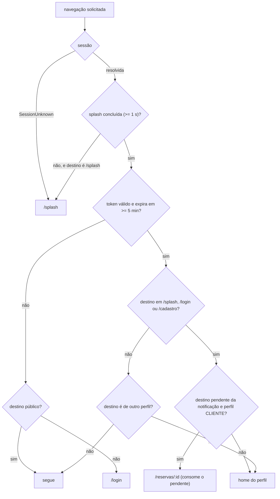

## Context

Ver `proposal.md`, seção Why, para a motivação. O que molda o desenho técnico:

- **Ponto de partida real** (verificado em 07/10/2026). `frontend/` foi gerado pelo FlutterInit.
  - O que traz:
    - `lib/src/` em feature-first;
    - `signals` 7.1.0, `auto_injector` 2.2.0, `go_router` 17.5.0, `dio` 5.11.1 e `fpdart`;
    - o kit de widgets `App*` e um `SessionStore` com signals;
    - `runTask` mapeando exceções para `FutureEither<T>` com `Failure` selado;
    - services singleton (Dio, SecureStorage, Storage, InternetConnection, UrlLauncher, Permission, Media).
  - O que está errado:
    - o auth chama rotas que não existem no backend;
    - o tema usa `ColorScheme.fromSeed('#16A34A')`;
    - o `.env` é asset;
    - o `pubspec.yaml` usa `^` e `sdk >=3.5.0`;
    - há um único teste (`test/widget_test.dart`).
  - O que falta: `android/`, `config/` e `assets/images/`.
  - O notebook de referência roda Flutter 3.44.2 (Dart 3.12.2); o CI fixa 3.47.6.
- **Contrato do backend**: vale `docs/api/openapi-n1.json`. Quatro comportamentos foram conferidos no código do
  backend e mudam o desenho do app:
  1. `GET /reservas` e `GET /quadras/{id}/reservas` montam a resposta com `ReservaResponse.de(r, null, …)`,
     ou seja, sem a cobrança;
  2. os POST respondem 201, embora o OpenAPI documente 200;
  3. o 401 do filtro de segurança traz `codigo` `TOKEN_INVALIDO` e `detail` "Sua sessão expirou. Entre
     novamente.", como `application/problem+json`;
  4. o erro 422 de reserva pendente traz a extensão `reservaId`, e os erros de validação trazem `campos[]`
     com `campo` e `mensagem`.
- **Protótipo**: são 17 `code.html` com o mesmo `tailwind.config`, cujas cores e tipografia são idênticas ao
  frontmatter de `athletic_modernist/DESIGN.md`. Há três pontos de atenção:
  - os raios divergem do frontmatter;
  - 13 dos `screen.png` têm 28 bytes;
  - o próprio HTML tem inconsistências entre telas: ícone errado no chip de Futsal, dois estilos de
    bottom-nav e o logo repetido no lugar do avatar na tela Pagamento.
- **Divergência com a documentação**: docs/04, 09, 12, 13, 15, 20, 21 e 23 descrevem provider +
  `ChangeNotifier`, MVVM em `lib/{ui,data,model}`, drift + json_serializable + `build_runner`, `Ambiente`,
  `Resultado` e `br.com.somaisuma.app`. Este change segue o boilerplate.
- **Restrições**:
  - o beta funcional precisa estar pronto no CP2 (06/11/2026), e o APK precisa ser instalado nos celulares
    dos testes com usuários (09 a 13/11);
  - são quatro pessoas em fatias verticais;
  - o CI não tem emulador e o projeto não aceita geração de código.

## Goals / Non-Goals

**Goals:**

- 13 telas e a Splash fiéis ao protótipo, com dados reais, os quatro estados de RNF06 e acessibilidade básica.
- Uma única forma de fazer cada coisa: um `Dio`, um tradutor de erro, um padrão de store, um banco local e um
  sincronizador.
- Telas de consulta que abrem do cache e continuam úteis em modo avião.
- Toda regra calculada (métricas, prazos, agrupamentos, ordenação) em funções puras testáveis sem Flutter.
- Lógica de tela testável sem emulador: stores com fakes e views com estado fixo.
- APK debug como artefato do CI desde a fundação, e APK release assinado antes do CP2.

**Non-Goals:**

- iOS, Play Store, push/FCM, sincronização em segundo plano, fila offline de escritas e `integration_test`
  no CI.
- Mapa interativo, câmera, upload de foto, biometria, recuperação de senha, remarcação, reativação de quadra
  e o link "ver como cliente" do DONO.
- Qualquer mudança no backend e qualquer chamada direta a Inter, BrasilAPI ou ViaCEP.

## Decisions

### D1 — O protótipo é o contrato de UI; a API é o contrato de dados

A precedência é:

| Conflito | Vence |
|---|---|
| Layout, hierarquia, componentes, ícones, textos, cores, espaçamentos | `code.html` da tela |
| Comportamento (erros, pilha, offline, regras) | docs/04, salvo as resoluções das specs deste change |
| Stack, estrutura de pastas, padrões de código | boilerplate (`frontend/CLAUDE.md`, `AGENTS.md`, `DESIGN.md`) |
| Nome de campo, enum, parâmetro | `docs/api/openapi-n1.json` |

Cada elemento desenhado recebe um de sete tratamentos, e cada spec de tela lista explicitamente o que é
omitido e o que é calculado:

| Elemento do protótipo | Tratamento |
|---|---|
| Estrutura, texto de interface, ícone | Reproduzir |
| Valor de exemplo (quadra, preço, data, pessoa, código) | Trocar pelo dado da API ou do cache |
| Elemento cujo dado não existe e não é calculável (avaliação, comodidades, contato da arena) | Omitir |
| Elemento calculável (contagem, percentual, prazo, "Concluída", "Estorno pendente") | Calcular (D14) |
| Item fora do MVP (upload, PDF, lembrete, "Modo Proprietário", termos) | Omitir |
| Marcação de requisito no texto ("(RN20)", "RF06 / RF09") | Remover do texto, manter o conteúdo |
| Estado sem desenho (vazio, erro, offline, diálogos, cards de permissão) | Criar na mesma linguagem visual |

O processo por tela tem quatro passos:

1. abrir o `code.html` no navegador com 390 px de largura;
2. mapear cada bloco para um componente `App*` ou de domínio;
3. montar a view com estado fixo;
4. anexar no PR o print do app ao lado do HTML renderizado.

Resoluções globais que unificam inconsistências do HTML:

- **Barra superior**: logo, título ou marca e avatar de iniciais em todas as telas. O logo repetido no lugar
  do avatar, na tela Pagamento, é tratado como erro do HTML.
- **Bottom-nav**: um único componente com indicador em pílula (`primary-fixed` a 40 %). Os ícones são os de
  docs/04 §4.4: `sports_soccer`, `event_available` e `person` para o CLIENTE; `stadium`, `event_note` e
  `person` para o DONO.
- **Ícones**: Material Symbols viram `Icons.<nome>_outlined` quando a variante existe e `Icons.<nome>` quando
  o HTML usa `FILL 1`. Há três exceções: Futsal usa `sports_soccer` (o HTML tem `cloud_upload`), Tênis e
  Padel usam `sports_tennis`, e os chips por quadra da ReservasQuadra usam o ícone do esporte (o HTML tem
  `roofing` e `wb_sunny`).
- **Selos de conectividade**: "Online", "Conectado", "Conexão estável" e "tempo real" refletem o signal de
  conectividade (D12). Sem conexão, viram o texto de modo cache.
- **QR Pix**: sem a marca decorativa central, para não reduzir a leitura.
- **Rótulo curto de esporte**: `FUTEBOL_SOCIETY` vira "Society" nas etiquetas sobre imagem; os demais
  repetem o nome.

*Alternativas*:
- seguir o docs/04 e tratar o protótipo como inspiração;
- reproduzir o protótipo literalmente, com os valores de exemplo.

*Por quê*: o protótipo é o artefato que os usuários dos testes de 09 a 13/11 e a banca vão comparar. O
docs/04 descreve comportamento e estados que o protótipo não mostra. A regra de omitir o que não tem dado
evita a armadilha mais cara: preencher avaliações, comodidades ou contatos com valores fixos que a API nunca
vai fornecer.

### D2 — Tema construído a partir dos tokens do protótipo

O `ColorScheme` claro é explícito, com os tokens do `tailwind.config`:

| Papel no `ColorScheme` | Token | Valor |
|---|---|---|
| `primary` / `onPrimary` | primary / on-primary | `#006b2c` / `#ffffff` |
| `primaryContainer` / `onPrimaryContainer` | primary-container / on-primary-container | `#00873a` / `#f7fff2` |
| `secondary` / `onSecondary` | secondary / on-secondary | `#565e74` / `#ffffff` |
| `secondaryContainer` / `onSecondaryContainer` | secondary-container / on-secondary-container | `#dae2fd` / `#5c647a` |
| `tertiary` / `onTertiary` | tertiary / on-tertiary | `#755800` / `#ffffff` |
| `tertiaryContainer` / `onTertiaryContainer` | tertiary-container / on-tertiary-container | `#936f00` / `#fffbff` |
| `error` / `onError` | error / on-error | `#ba1a1a` / `#ffffff` |
| `errorContainer` / `onErrorContainer` | error-container / on-error-container | `#ffdad6` / `#93000a` |
| `surface` / `onSurface` / `onSurfaceVariant` | surface / on-surface / on-surface-variant | `#f7f9fb` / `#191c1e` / `#3e4a3d` |
| `surfaceDim` / `surfaceBright` | surface-dim / surface-bright | `#d8dadc` / `#f7f9fb` |
| `surfaceContainerLowest` … `surfaceContainerHighest` | surface-container-lowest … highest | `#ffffff`, `#f2f4f6`, `#eceef0`, `#e6e8ea`, `#e0e3e5` |
| `outline` / `outlineVariant` | outline / outline-variant | `#6e7b6c` / `#bdcaba` |
| `inverseSurface` / `onInverseSurface` / `inversePrimary` | inverse-* | `#2d3133` / `#eff1f3` / `#62df7d` |
| `surfaceTint` | surface-tint | `#006e2d` |
| `primaryFixed` / `primaryFixedDim` / `onPrimaryFixed` / `onPrimaryFixedVariant` | primary-fixed* | `#7ffc97` / `#62df7d` / `#002109` / `#005320` |
| `secondaryFixed` / `secondaryFixedDim` / `onSecondaryFixed` / `onSecondaryFixedVariant` | secondary-fixed* | `#dae2fd` / `#bec6e0` / `#131b2e` / `#3f465c` |
| `tertiaryFixed` / `tertiaryFixedDim` / `onTertiaryFixed` / `onTertiaryFixedVariant` | tertiary-fixed* | `#ffdf9a` / `#f7be1d` / `#251a00` / `#5a4300` |

O esquema escuro é derivado assim. Primeiro, `ColorScheme.fromSeed(seedColor: #006b2c, brightness: dark)`
gera os tons que os tokens não trazem: superfícies escuras, `onPrimary` e `outline`. Depois, `copyWith`
aplica os tons que o protótipo já define, pela tabela tonal do Material 3:

| Papel escuro | Fonte | Valor |
|---|---|---|
| `primary` | inverse-primary (tom 80) | `#62df7d` |
| `primaryContainer` / `onPrimaryContainer` | on-primary-fixed-variant / primary-fixed | `#005320` / `#7ffc97` |
| `secondary` | secondary-fixed-dim | `#bec6e0` |
| `secondaryContainer` / `onSecondaryContainer` | on-secondary-fixed-variant / secondary-fixed | `#3f465c` / `#dae2fd` |
| `tertiary` | tertiary-fixed-dim | `#f7be1d` |
| `tertiaryContainer` / `onTertiaryContainer` | on-tertiary-fixed-variant / tertiary-fixed | `#5a4300` / `#ffdf9a` |
| `error` / `onError` / `errorContainer` / `onErrorContainer` | paleta de erro do Material 3 | `#ffb4ab` / `#690005` / `#93000a` / `#ffdad6` |
| `onSurface` / `inverseSurface` | surface-container-highest (tom 90) | `#e0e3e5` |
| `onInverseSurface` | inverse-surface (tom 20) | `#2d3133` |
| `inversePrimary` | primary | `#006b2c` |

O contraste dos dois esquemas é provado pelos widget tests com `textContrastGuideline` (D19).

O `AppColorsExtension` passa a usar os tokens do protótipo:

| Papel | Claro | Escuro |
|---|---|---|
| success / onSuccess | primary / on-primary | `#62df7d` / derivado |
| successContainer / onSuccessContainer | primary-fixed / on-primary-fixed | `#005320` / `#7ffc97` |
| warning / onWarning | tertiary / on-tertiary | `#f7be1d` / derivado |
| warningContainer / onWarningContainer | tertiary-fixed / on-tertiary-fixed | `#5a4300` / `#ffdf9a` |
| info / onInfo | secondary / on-secondary | `#bec6e0` / derivado |
| infoContainer / onInfoContainer | secondary-container / on-secondary-container | `#3f465c` / `#dae2fd` |

O `TextTheme` usa a fonte Inter, declarada em `pubspec.yaml` (`fonts:`) com os pesos 400, 500, 600 e 700 e a
licença OFL versionada ao lado. A altura de linha é a razão entre a linha do token e o tamanho:

| Papel | Token | Tamanho / linha / peso |
|---|---|---|
| `displayLarge` | display-lg | 40 / 48 / 700 |
| `displayMedium` | display-lg-mobile | 32 / 40 / 700 |
| `displaySmall` | (sem token; sem uso nas telas) | 28 / 36 / 700 |
| `headlineLarge` | headline-lg | 28 / 36 / 700 |
| `headlineMedium` | headline-md | 24 / 32 / 600 |
| `headlineSmall` | headline-sm | 20 / 28 / 600 |
| `titleLarge` | title-lg | 18 / 24 / 600 |
| `titleMedium` | title-md | 16 / 22 / 600 |
| `titleSmall` | title-sm | 14 / 20 / 600 |
| `bodyLarge` / `bodyMedium` / `bodySmall` | body-lg / body-md / body-sm | 16/24/400 · 14/20/400 · 12/16/400 |
| `labelLarge` / `labelMedium` / `labelSmall` | label-lg / label-md / label-sm | 14/20/600 · 12/16/600 · 11/14/500 |

Os tamanhos de fonte não passam pelo ScreenUtil (`.sp`), para que o `TextScaler` do sistema valha sozinho até
200 % (RNF07). Horários e contadores usam `FontFeature.tabularFigures()`, como o `tabular-nums` do HTML.

Os raios vêm do `tailwind.config` dos `code.html`: `DEFAULT` 4, `lg` 8 e `xl` 12, mais `2xl` 16 e `3xl` 24 do
Tailwind. Essa escala coincide com a que já está em `AppBorders` (`xs` 4, `sm` 8, `md` 12, `lg` 16, `xl` 24,
`bottomSheet` 28, `full`). Mudam só os apelidos: `button` passa a `md` (12), `card` fica em `md`, `input`
passa a `md` e `dialog` passa a `lg` (16).

Os espaçamentos `space-xs`/`sm`/`md`/`lg`/`xl` e `gutter`/`margin` correspondem a `AppSpacing.xs` (4), `sm`
(8), `md` (16), `lg` (24), `xl` (32) e `pagePadding` (16). Entram `AppSpacing.s6`, `s10` e `s14` para os
passos 1.5, 2.5 e 3.5 do Tailwind, que o HTML usa com frequência.

As sombras seguem esta correspondência:
- `shadow-sm` → `AppShadows.subtle`;
- `shadow` e `shadow-md` → `card`;
- `shadow-lg` → `elevated`;
- `shadow-xl` e `shadow-2xl` → `modal`.

Entram ainda `AppShadows.topBar` (0, 1, 8, preto 4 %) e `bottomBar` (0, -2, 12, preto 5 %), usadas na barra
superior e na bottom-nav.

O ScreenUtil passa a usar o tamanho de referência 390×844, como já diz o `DESIGN.md` do boilerplate; o wrapper
usava 360×690. O app segue o tema do sistema (`ThemeMode.system`), sem dynamic color.

*Alternativas*:
- `ColorScheme.fromSeed('#006b2c')`;
- `google_fonts` para Inter;
- manter os raios do frontmatter.

*Por quê*: o seed gera tons próximos, mas não iguais, e o print lado a lado denunciaria a diferença.
`google_fonts` baixa a fonte em tempo de execução, o que falha no primeiro uso em modo avião e acrescenta
dependência. Os raios do frontmatter não são os que o HTML de fato renderiza.

### D3 — Arquitetura feature-first com fronteiras explícitas

```text
lib/
├── main.dart                       bootstrap: binding, native splash, EasyLocalization, notificador, injector, runApp
└── src/
    ├── app.dart                    MaterialApp.router (tema claro/escuro, i18n, AppRouter)
    ├── config/
    │   ├── app_config.dart         API_BASE_URL, DEV_KEY (String.fromEnvironment), URI de health
    │   └── injector.dart           registros do auto_injector (D5)
    ├── routing/
    │   ├── app_routes.dart         caminhos de docs/04 §4.2 e construtores de caminho
    │   ├── app_router.dart         GoRouter, dois StatefulShellRoute.indexedStack, composição das telas
    │   ├── redirect.dart           regra pura do redirect (D9), testável sem Flutter
    │   ├── router_refresh.dart     Listenable alimentado pelos signals de sessão e de Splash
    │   ├── shell_cliente.dart · shell_dono.dart   Scaffold com a bottom-nav do perfil
    │   └── global_navigator.dart
    ├── services/                   infraestrutura singleton, sem regra de negócio
    │   ├── api_client.dart         Dio único + AuthInterceptor + log
    │   ├── auth_interceptor.dart · problem_detail_parser.dart
    │   ├── secure_storage_service.dart · storage_service.dart (SharedPreferencesAsync)
    │   ├── conectividade_service.dart   internet_connection_checker_plus contra /actuator/health
    │   ├── localizacao_service.dart     geolocator + cadeia de fallback (D16)
    │   ├── notificador_reserva.dart     flutter_local_notifications (D17)
    │   ├── url_launcher_service.dart    tel:, https://wa.me/, geo: sem canLaunchUrl
    │   ├── app_info_service.dart        package_info_plus (versão e build)
    │   └── copy_service.dart · logger
    ├── shared/
    │   ├── domain/                 enums (PerfilUsuario, TipoEsporte, StatusReserva, StatusPagamento, StatusSlot,
    │   │                           ProvedorPagamento, CanceladoPor, EscopoQuadra) e entidades compartilhadas
    │   │                           (Quadra, HorarioFuncionamento, Reserva, Pagamento, Sessao, Coordenada)
    │   ├── data/
    │   │   ├── local/              app_database.dart · quadra_cache_dao.dart · reserva_cache_dao.dart
    │   │   ├── json/               fromJson/toJson escritos à mão (pattern matching; enum desconhecido -> OUTRO)
    │   │   └── sincronizador.dart
    │   ├── session/                session_store.dart · encerrar_sessao.dart · destino_pendente.dart
    │   ├── state/                  estado_tela.dart (RequestState + offline + última sincronização) · relogio.dart
    │   ├── calculos/               funções puras de D14 (agrupamento, métricas, prazos, abas, resumo do dia)
    │   ├── formatters/ · validators/ · geo/
    │   └── widgets/
    │       ├── ui/                 kit App* do boilerplate (inalterado salvo tokens)
    │       └── dominio/            componentes do domínio (D1 e plataforma-app)
    ├── features/
    │   ├── auth/        data/ · domain/ · presentation/{splash, login, cadastro}
    │   ├── perfil/      data/ · domain/ · presentation/perfil
    │   ├── quadras/     data/ (quadras e CEP) · domain/ · presentation/{quadras, detalhe_quadra, minhas_quadras, form_quadra}
    │   ├── horarios/    data/ · domain/ (inclui SalvarHorariosUseCase) · presentation/horarios_quadra
    │   ├── reservas/    data/ (reservas e slots) · domain/ · presentation/{grade, confirmar_reserva, minhas_reservas,
    │   │                detalhe_reserva, cancelamento, reservas_quadra}
    │   └── pagamento/   data/ · domain/ · presentation/pagamento
    ├── theme/ · extensions/ · imports/ · middleware/
    └── utils/                      failure.dart (+ ApiFailure), typedefs.dart, task_runner.dart, async_state.dart
```

As regras de fronteira são revisadas no PR:

| Camada | Pode depender de | Nunca |
|---|---|---|
| `features/<f>/presentation` | `domain` da própria feature, `shared/*`, `routing/app_routes.dart` | `data` de qualquer feature; `services` diretamente (exceto `UrlLauncherService` e `CopyService` em callbacks) |
| `features/<f>/domain` | `shared/domain`, `utils` | Flutter, Dio, sqflite |
| `features/<f>/data` | `domain` da própria feature, `shared/data`, `services` | outra feature |
| `shared/*` | `services`, `utils` | qualquer `features/*` |
| `routing/app_router.dart` | o arquivo público (`features/<f>/<f>.dart`) de cada feature | internals de feature |

Alguns pontos de organização:

- **Composição de telas**: quando uma tela mostra pedaços de duas features, a composição acontece na rota.
  Exemplo: a DetalheQuadra de `quadras` recebe a seção de grade e reserva de `reservas`. A tela expõe um
  parâmetro construtor, por exemplo `secaoReserva: Widget Function(Quadra)`, e o `app_router.dart` liga as
  duas. Nenhuma feature importa a outra.
- **Dados entre features**: os dados que várias features leem passam por `shared/data/local`. Exemplos:
  reservas que leem a foto da quadra, MinhasQuadras que lê as reservas do dia e o Perfil que conta jogos.
  Só o repositório dono da tabela escreve nela: quadras escreve em `quadra_cache`; reservas e pagamento
  escrevem em `reserva_cache`.
- **Sessão**: o `SessionStore` sai de `features/auth/presentation/providers/` para `shared/session/`, porque o
  router e o `AuthInterceptor` dependem dele.
- **Use case**: só existe onde há orquestração. São dois: `SalvarHorariosUseCase` (diff e sequência de
  operações) e `EncerrarSessao` (sessão, cache e notificações juntos). Nos demais casos, o store chama o
  repositório direto.

*Alternativas*:
- MVVM em `lib/{ui,data,model}`, como em docs/09;
- um pacote por camada.

*Por quê*: decisão do usuário. O boilerplate já está em feature-first e as fatias A–D mapeiam bem em pastas
de feature, o que reduz conflito de merge. O custo é documentar a regra de composição na rota, que é a única
peça nova em relação ao boilerplate.

### D4 — Store com signals e separação entre contêiner e view

Cada tela tem três arquivos:
- `xxx_store.dart`: o estado e as ações;
- `xxx_screen.dart`: o contêiner, um `StatefulWidget` que resolve o store pelo injector, cria os `effect` de
  navegação e snackbar, guarda os `TextEditingController` e o `AppLifecycleListener` e chama `dispose`;
- `xxx_view.dart`: a view sem estado, que recebe o estado e os callbacks e é coberta por widget test.

```dart
final class EstadoTela<T> {
  const EstadoTela({this.request = const RequestInitial(), this.offline = false, this.ultimaSincronizacao});
  final RequestState<T> request;      // RequestInitial | RequestLoading | RequestSuccess | RequestFailure
  final bool offline;                 // última tentativa falhou por NetworkFailure ou backend inalcançável
  final DateTime? ultimaSincronizacao;
}

class QuadrasStore {
  QuadrasStore(this._quadras, this._conectividade, this._localizacao, this._relogio) { _iniciar(); }
  final _estado = signal(const EstadoTela<List<QuadraCard>>());
  final _filtro = signal(const FiltroQuadras());
  ReadonlySignal<EstadoTela<List<QuadraCard>>> get estado => _estado;
  late final ReadonlySignal<List<QuadraCard>> visiveis =
      computed(() => filtrarEOrdenar(_quadras.catalogo.value, _filtro.value, _coordenada.value)); // D14
  // ações: sincronizar(), filtrarPorEsporte(), buscar(), ativarLocalizacao(), alternarOrdem()
  void dispose() { visiveis.dispose(); _estado.dispose(); _filtro.dispose(); /* + cleanups dos effects */ }
}
```

As regras do padrão são:

- **Estado**: signal privado com getter `ReadonlySignal` e `computed` para derivados. Atualizações em
  conjunto usam `batch`. A UI lê só com `SignalBuilder`; `Watch` e `.watch(context)` não são usados.
- **Efeitos**: navegação e snackbar ficam em `effect` criados no `initState` do contêiner, que guarda o
  cleanup e o chama no `dispose`. O store expõe eventos de uma única leitura, como
  `ReadonlySignal<EventoNavegacao?>`, consumidos e zerados pelo contêiner.
- **Tempo**: todo cálculo que depende de "agora" recebe um `Relogio` injetado. Nos testes, um relógio
  controlado roda dentro de `fakeAsync`.
- **Descarte**: respostas que chegam depois do `dispose` são descartadas (`_descartado`), sem alterar
  signal nem disparar efeito.

*Alternativas*:
- `ChangeNotifier` + provider;
- `SignalsMixin` e `Watch`, que estão obsoletos.

*Por quê*: o boilerplate e o `AGENTS.md` fixam signals sem geração de código. A separação entre contêiner e
view é o que permite testar cada tela com estado fixo e `meetsGuideline` sem banco nem rede, como pedem
docs/23 e RNF07.

### D5 — Injeção de dependências com auto_injector

O arquivo `lib/src/config/injector.dart` concentra todos os registros. `setupInjector()` roda no `main()`,
depois de abrir o banco e de inicializar o notificador.

| Registro | Itens |
|---|---|
| `addLazySingleton` (com `BindConfig(onDispose: ...)` quando seguram recursos) | `AppConfig`, `ApiClient`, `SecureStorageService`, `StorageService`, `SessionStore`, `EncerrarSessao`, `DestinoPendente`, `AppDatabase`, `QuadraCacheDao`, `ReservaCacheDao`, `Sincronizador`, `ConectividadeService`, `LocalizacaoService`, `NotificadorReserva`, `UrlLauncherService`, `AppInfoService`, `Relogio`, todos os repositórios e o `SalvarHorariosUseCase` |
| `add` (fábrica, uma instância por abertura de tela) | `SplashStore`, `LoginStore`, `CadastroStore`, `PerfilStore`, `QuadrasStore`, `DetalheQuadraStore`, `GradeSlotsStore`, `ConfirmarReservaStore`, `PagamentoStore`, `MinhasReservasStore`, `DetalheReservaStore`, `CancelamentoStore`, `MinhasQuadrasStore`, `FormQuadraStore`, `HorariosQuadraStore`, `ReservasQuadraStore` |

Os services do boilerplate que eram acessados por `ClassName.instance` passam a ser registrados pelo
construtor. Assim os testes recebem fakes sem tocar singletons estáticos.

### D6 — Erros: Failure selado, ApiFailure e mensagens por código

```dart
sealed class Failure { ... }                         // já existe
final class NetworkFailure extends Failure { ... }   // já existe: passa a significar "offline"
final class ApiFailure extends Failure {
  const ApiFailure({required this.status, this.codigo, this.subcodigo, this.detail,
      this.campos = const {}, this.reservaId, String mensagem = ''}) : super(mensagem);
  final int status;
  final String? codigo, subcodigo, detail;
  final Map<String, String> campos;                  // campos[]: campo -> mensagem
  final int? reservaId;                              // extensão do 422 RESERVA_PENDENTE_EXISTENTE
}
```

A tradução de `DioException` acontece em um único lugar, `Failure.fromException`, e segue esta tabela:

| `DioExceptionType` | Failure |
|---|---|
| `connectionError`, `connectionTimeout`, `sendTimeout`, `receiveTimeout` | `NetworkFailure` (offline) |
| `badResponse` | `ApiFailure` montado pelo `ProblemDetailParser` a partir de `err.response?.data`; corpo que não é `Map` vira `ApiFailure(status)` |
| demais (`cancel`, `badCertificate`, `unknown`) | `UnknownFailure`, registrado no log |

O `runTask` continua sendo a fronteira dos repositórios, com duas mudanças:
- não verifica mais a rede antes de leituras;
- não mostra mais o toast global em inglês.

Em leituras, o offline vira o banner da tela. Em escritas, o botão já está desabilitado quando o app sabe que
está offline; se a rede cair no meio, a tela mostra o snackbar.

A mensagem de erro é resolvida por `mensagemDe(Failure, contexto)`, nesta ordem:
1. chave `erros.<SUBCODIGO>`;
2. chave `erros.<CODIGO>`;
3. `detail` do servidor;
4. `erros.generico` ("Algo deu errado. Tente novamente.").

Cada tela pode sobrepor a mensagem padrão com uma chave própria, por exemplo `auth.login.credencialInvalida`
para "E-mail ou senha incorretos". As mensagens fixadas pelas specs seguem docs/04 §2.2.

### D7 — Cliente HTTP e AuthInterceptor

O cliente usa um único `Dio`, com as seguintes configurações:
- `baseUrl` igual a `AppConfig.apiBaseUrl`;
- `connectTimeout` de 10 s e `sendTimeout` e `receiveTimeout` de 15 s;
- `Content-Type: application/json; charset=utf-8` e `Accept: application/json`;
- os interceptors `AuthInterceptor` e o log do boilerplate, ajustado para não registrar o cabeçalho
  `Authorization` nem corpos de `/auth/*`.

Não há retry em lugar nenhum: `POST /reservas` não é idempotente, e o gesto de puxar para atualizar mais a volta
da rede já cobrem a nova tentativa.

```dart
class AuthInterceptor extends Interceptor {
  AuthInterceptor(this._sessao, this._encerrar);
  final SessionStore _sessao;
  final EncerrarSessao _encerrar;
  var _derrubada = false;                                  // rearmada por _sessao.salvar() no próximo login

  @override
  Future<void> onRequest(RequestOptions o, RequestInterceptorHandler h) async {
    if (!o.path.startsWith('/auth/')) {
      final token = await _sessao.tokenAtual();             // flutter_secure_storage
      if (token != null) o.headers['Authorization'] = 'Bearer $token';
    }
    h.next(o);
  }

  @override
  Future<void> onError(DioException err, ErrorInterceptorHandler h) async {
    final r = err.response;
    if (r?.statusCode == 401 && !err.requestOptions.path.startsWith('/auth/') && !_derrubada &&
        ProblemDetailParser.codigoDe(r!.data) == 'TOKEN_INVALIDO') {
      _derrubada = true;
      await _encerrar(motivo: MotivoEncerramento.sessaoExpirada);   // cache, notificações e sessão
    }
    h.next(err);                                            // sem retry; o erro segue íntegro
  }
}
```

`MotivoEncerramento.sessaoExpirada` faz o Login mostrar uma vez "Sua sessão expirou. Entre novamente.".

O `UrlLauncherService` passa a chamar `launchUrl` direto, sem `canLaunchUrl` e sem a heurística que
transformava telefone em `whatsapp://`. Assim nenhum `<queries>` precisa entrar no manifest; uma abertura que
falha devolve `false` ou lança exceção, e as duas viram snackbar (docs/13 §13.2, passo 7). O serviço oferece
três métodos: `ligar(dígitos)`, que abre `tel:`; `whatsapp(dígitos)`, que abre `https://wa.me/55<dígitos>`;
e `abrirMapa(...)` (D16).

### D8 — Sessão no aparelho

O `SessionStore` mantém um signal `SessionState`, com as variantes `SessionUnknown`,
`SessionAuthenticated(Sessao)` e `SessionUnauthenticated`. Os dados ficam em dois lugares:

| Chave | Onde | Escrita por | Uso |
|---|---|---|---|
| `token_jwt` | flutter_secure_storage (Android Keystore) | login e cadastro (primeiro) | Bearer |
| `token_expira_em` (epoch ms) | `SharedPreferencesAsync` | login e cadastro | redirect: expira em menos de 5 min significa sessão ausente |
| `usuario_id`, `usuario_nome`, `usuario_perfil` | idem | login, cadastro e Perfil (nome) | sessão, iniciais, escolha do shell |
| `usuario_email`, `usuario_telefone` | idem | login, cadastro e Perfil | Perfil offline (acréscimo a docs/12) |
| `ultima_lat`, `ultima_lon` | idem | `LocalizacaoService` | distância sem fix ou offline |
| `ultima_sincronizacao_quadras`, `ultima_sincronizacao_reservas` | idem | `Sincronizador` | banners, rodapés e Perfil |
| `notificar_confirmacao` (padrão `true`) | idem | switch do Perfil | RF24 |
| `permissao_localizacao_pedida`, `permissao_notificacao_pedida` | idem | card de localização e card de avisos | não repetir pedidos |

O ciclo de vida da sessão tem quatro operações:

- **Carregar**, no `main()`: lê o token dentro de `try`; exceção do Keystore significa limpar e tratar como
  ausente. A sessão só existe com `token_jwt` e `usuario_id`. Se `token_expira_em` cai em menos de 5 minutos,
  chama `EncerrarSessao`. Em seguida o estado sai de `SessionUnknown`.
- **Salvar**, no login e no cadastro: grava o token primeiro e depois as demais chaves, a partir de
  `TokenResponse`. Rearma o `AuthInterceptor` e emite `SessionAuthenticated`.
- **`EncerrarSessao`**, no Sair ou no 401: apaga as duas tabelas, cancela as notificações exibidas, executa
  `deleteAll()` no armazenamento seguro e `clear()` no shared_preferences e emite `SessionUnauthenticated`.
  Não há chamada de rede, porque não existe endpoint de logout.
- **Volta ao primeiro plano**: o app reavalia a expiração do token, para que um token que cruzou o limite de
  5 minutos com o app aberto leve ao Login sem esperar um 401.

### D9 — Navegação, redirect e Splash

Os caminhos ficam em `AppRoutes` e seguem docs/04 §4.2. Duas rotas entram neste change:
`/dono/quadras/:id`, para a DetalheQuadra do DONO, e `?perfil=DONO` em `/cadastro`, para o atalho do gestor.

| Rota | Tela | Shell / navigator |
|---|---|---|
| `/splash`, `/login`, `/cadastro[?perfil=DONO]` | Splash, Login, Cadastro | raiz, sem shell |
| `/quadras` | Quadras | shell CLIENTE, aba 0 |
| `/quadras/:id` | DetalheQuadra (com a seção de reserva) | raiz |
| `/quadras/:id/reservar?inicio=<ISO>` | ConfirmarReserva | raiz |
| `/reservas` | MinhasReservas | shell CLIENTE, aba 1 |
| `/reservas/:id` | DetalheReserva | raiz (filha de `/reservas`) |
| `/reservas/:id/pagamento` | Pagamento | raiz |
| `/perfil` | Perfil | shell CLIENTE, aba 2 |
| `/dono/quadras` | MinhasQuadras | shell DONO, aba 0 |
| `/dono/quadras/nova`, `/dono/quadras/:id/editar` | FormQuadra | raiz |
| `/dono/quadras/:id` | DetalheQuadra do DONO (só a parte estática) | raiz |
| `/dono/quadras/:id/horarios` | HorariosQuadra | raiz |
| `/dono/quadras/:id/reservas` | ReservasQuadra (com o chip da quadra) | raiz |
| `/dono/reservas` | ReservasQuadra (todas as quadras) | shell DONO, aba 1 |
| `/dono/perfil` | Perfil | shell DONO, aba 2 |
| `/debug/ui-showcase` | galeria do kit | só em `kDebugMode` |

O `redirect` é uma função pura em `routing/redirect.dart`. O `refreshListenable` é um `ChangeNotifier`
notificado por um `effect` sobre o signal da sessão e sobre o signal de Splash concluída. O
`SessionListenerWrapper` sai.



Os detalhes de comportamento da navegação são:

- **Native splash**: é preservado no `main()` e removido por um `effect` quando a sessão sai de
  `SessionUnknown`. A partir daí, a Splash do protótipo fica visível; o `SplashStore` marca a Splash como
  concluída 1 s depois do primeiro quadro, e só então o `redirect` tira o usuário de `/splash`.
- **Bottom-nav**: os shells montam o `Scaffold` com a bottom-nav. `goBranch(i, initialLocation: i ==
  atual)` faz o toque na aba atual voltar à raiz.
- **Telas de detalhe**: usam `parentNavigatorKey: rootNavigatorKey`, por isso abrem por cima do shell.
- **Tela Pagamento**: usa `PopScope(canPop: false)` e faz `go('/reservas')` no back.
- **ConfirmarReserva**: é aberta com `push<bool>` e devolve `pop(true)` para pedir recarga da grade.
- **Ida ao pagamento e à reserva**: o pagamento é aberto com `go` depois do 2xx, e a DetalheReserva com `go`
  depois de `PAGO` ou do 422 de reserva pendente. É isso que monta a pilha MinhasReservas -> DetalheReserva
  descrita em docs/04 §4.3.
- **Ordem das rotas do DONO**: `/dono/quadras/nova` é declarada antes de `/dono/quadras/:id`, porque o
  go_router resolve na ordem e, ao contrário, leria `nova` como id.

*Alternativas*:
- manter a navegação imperativa do `SessionListenerWrapper`;
- duas instâncias de `GoRouter`, uma por perfil.

*Por quê*: com o `redirect` como função pura, cada regra de docs/04 §4.1 vira um teste de unidade
(`redirect_test.dart`). Um único router com dois shells é o desenho de docs/04 e preserva o estado de cada
aba.

### D10 — Configuração por ambiente e projeto Android

**Configuração por ambiente.**

- `config/dev.json.exemplo` é versionado, com `{"API_BASE_URL": "http://10.0.2.2:8080/api/v1", "DEV_KEY":
  "troque"}`.
- `config/release.json` é versionado, com `{"API_BASE_URL": "https://<servico>.onrender.com/api/v1"}`. O
  marcador vale até a publicação do backend.
- `config/dev.json` entra no `.gitignore` de `frontend/`.
- `AppConfig` lê `String.fromEnvironment('API_BASE_URL', defaultValue: 'http://10.0.2.2:8080/api/v1')` e
  `String.fromEnvironment('DEV_KEY')`. Ele também deriva a URI de health trocando o caminho por
  `/actuator/health`.
- Saem `flutter_dotenv`, o `.env` dos assets e o `dotenv.load`.

**Plataforma.** O projeto nasce de `flutter create . --platforms android --org com.corebuild --project-name
so_mais_uma`, rodado em `frontend/`. O comando não sobrescreve `lib/` nem `pubspec.yaml`, e
`test/widget_test.dart` é substituído depois pelos testes do app. Em
`android/app/build.gradle.kts`:

- `namespace` e `applicationId` valem `com.corebuild.so_mais_uma`;
- `minSdk` vale 26; `compileSdk` e `targetSdk` vêm de `flutter.*`;
- o tipo de build debug tem `applicationIdSuffix ".debug"`;
- `compileOptions` tem `isCoreLibraryDesugaringEnabled = true`, com
  `coreLibraryDesugaring("com.android.tools:desugar_jdk_libs:<versão do README do plugin>")`;
- `signingConfigs.release` é lido de `key.properties`; sem esse arquivo, o build release cai na assinatura
  debug e avisa;
- AGP, Gradle e Kotlin ficam como o `flutter create` gerou.

Nos manifests:

- **`src/main`**: `INTERNET`, `ACCESS_NETWORK_STATE`, `ACCESS_COARSE_LOCATION`, `ACCESS_FINE_LOCATION`,
  `POST_NOTIFICATIONS`, `<uses-feature android:name="android.hardware.location.gps" android:required="false"/>`,
  `android:allowBackup="false"` e `android:label="Só mais uma"`;
- **`src/debug`**: `android:usesCleartextTraffic="true"`;
- **`res/drawable/ic_notificacao.xml`**: ícone monocromático derivado das linhas de campo do logo;
- **`res/raw/keep.xml`**: protege esse ícone da remoção no release.

O logo é versionado como `assets/images/logo.svg` (renderizado com flutter_svg) e
`assets/images/splash.png`. O ícone adaptativo tem o primeiro plano vetorial gerado do SVG e o fundo `#16a34a`.
O `flutter_native_splash.yaml` usa `color` `#f7f9fb`, `color_dark` igual à superfície escura e a imagem do
logo. Os PNG e o vetor são exportados uma vez do SVG e versionados, sem pacote gerador. iOS fica fora.

### D11 — Cache local com sqflite

O banco é `somaisuma.db`, em `getDatabasesPath()`, com `version` 1 e duas tabelas:

```sql
CREATE TABLE quadra_cache (
  id              INTEGER NOT NULL,
  escopo          TEXT    NOT NULL CHECK (escopo IN ('CATALOGO', 'MINHAS')),
  dono_id         INTEGER NOT NULL,
  nome            TEXT    NOT NULL,
  tipo_esporte    TEXT    NOT NULL,           -- TipoEsporte como texto; desconhecido vira OUTRO na leitura
  preco_hora      TEXT    NOT NULL,           -- "80.00", nunca REAL
  descricao       TEXT,
  cep             TEXT    NOT NULL,           -- acréscimo a docs/12: edição a partir do cache
  logradouro      TEXT    NOT NULL,
  numero          TEXT    NOT NULL,
  bairro          TEXT,
  cidade          TEXT    NOT NULL,
  uf              TEXT    NOT NULL,
  latitude        REAL,
  longitude       REAL,
  foto_url        TEXT,
  ativa           INTEGER NOT NULL,           -- 0/1
  horarios_json   TEXT    NOT NULL,           -- jsonEncode(horariosFuncionamento)
  sincronizado_em INTEGER NOT NULL,
  PRIMARY KEY (id, escopo)
);

CREATE TABLE reserva_cache (
  id                  INTEGER PRIMARY KEY,
  quadra_id           INTEGER NOT NULL,
  quadra_nome         TEXT    NOT NULL,
  quadra_endereco     TEXT    NOT NULL,
  inicio              INTEGER NOT NULL,       -- epoch ms (instante)
  fim                 INTEGER NOT NULL,
  valor               TEXT    NOT NULL,       -- "80.00"
  status              TEXT    NOT NULL,       -- StatusReserva
  observacao          TEXT,
  expira_em           INTEGER,                -- reserva.expiraEm (= expiração da cobrança, RN10)
  criado_em           INTEGER,
  cancelado_por       TEXT,
  motivo_cancelamento TEXT,
  cancelado_em        INTEGER,
  cliente_nome        TEXT,                   -- só para o DONO
  cliente_telefone    TEXT,
  pagamento_status    TEXT,                   -- colunas de cobrança: preservadas na substituição
  pagamento_provedor  TEXT,
  txid                TEXT,
  pix_copia_e_cola    TEXT,
  pago_em             INTEGER,
  sincronizado_em     INTEGER NOT NULL
);
CREATE INDEX idx_reserva_cache_inicio ON reserva_cache (inicio);
```

O contrato dos DAOs é escrito à mão, com `Map<String, Object?>` e pattern matching nos dois sentidos:

| DAO | Operações |
|---|---|
| `QuadraCacheDao` | `porEscopo(escopo)` (ordenado por nome), `porId(id, {escopo})`, `substituirEscopo(escopo, linhas)` (DELETE + batch INSERT em transação), `upsert(linha)`, `remover(id, escopo)` |
| `ReservaCacheDao` | `todas()`, `porId(id)`, `substituirTudo(linhas)` (em transação, preservando por `id` as colunas de cobrança quando a linha nova não as traz), `upsertCompleta(linha)` (substitui tudo, inclusive cobrança), `atualizarCobranca(id, pagamento, statusReservaDerivado)` |
| `AppDatabase` | `abrir()`, `limparTudo()` (os dois DELETE em uma transação), `onUpgrade` e `onDowngrade` destrutivos |

Os repositórios são reativos: cada um guarda signals carregados do DAO e os recarrega depois de cada gravação
dele. A tela observa esses signals, sem `Stream` do banco. Como só o repositório dono da tabela escreve, a
reatividade fica completa. Os outros leitores, como as métricas de MinhasQuadras, leem os signals públicos
do repositório.

Os testes do DAO rodam em memória com `sqflite_common_ffi` (`databaseFactoryFfi`, `inMemoryDatabasePath`) no
próprio `flutter test`. Os testes de mapeamento entre linha e entidade ficam no Must; os de DAO contra o banco
ficam no Should, conforme docs/12 §12.7.

*Alternativas*:
- drift, como em docs/12;
- Hive ou Isar;
- sqflite com `Stream` reativo próprio.

*Por quê*: o drift exige `build_runner`, que o boilerplate proíbe. Hive e Isar trocam SQL e chave composta
por um modelo de objetos sem ganho para duas tabelas. A reatividade por signals no repositório já é o padrão
do app e evita um segundo mecanismo. O custo, erro de nome de coluna só aparecer em execução, é coberto pelos
testes de mapeamento e de DAO em memória.

### D12 — Sincronização e conectividade

```dart
class Sincronizador {
  Sincronizador(this._sessao, this._relogio);
  FutureEither<Unit> sincronizar<T>({
    required Future<List<T>> Function() buscar,          // GET na API (Dio)
    required Future<void> Function(List<T>) substituir,  // DAO: substituirEscopo / substituirTudo
    required String marca,                               // ultima_sincronizacao_*
  }) => runTask(() async {
        await substituir(await buscar());               // servidor vence: o escopo inteiro é trocado
        await _sessao.marcar(marca, _relogio.agora());
        return unit;
      }, operation: 'sync.$marca');                     // falha de rede -> NetworkFailure; cache intacto
}
```

| Gatilho | Onde | Escopo |
|---|---|---|
| Abertura da tela | construtor do store de Quadras, MinhasQuadras, MinhasReservas, ReservasQuadra, DetalheQuadra e DetalheReserva | escopo da tela |
| Puxar para atualizar, botão "Atualizar dados" e "Tentar novamente" | view -> store | escopo da tela |
| App volta ao primeiro plano | `AppLifecycleListener(onResume)` no contêiner; as abas montadas do shell sincronizam cada uma o próprio escopo | escopo da tela |
| Backend volta a ficar alcançável | `effect` sobre `ConectividadeService.online` (transição de falso para verdadeiro) | escopo da tela visível |
| Escrita bem-sucedida | repositório: write-through e nova sincronização | escopo afetado |
| Consulta do pagamento | `PagamentoStore` (D15) | colunas de cobrança e status derivado |

O `ConectividadeService` usa `InternetConnection.createInstance` com `useDefaultOptions: false`, uma única
`InternetCheckOption` apontando para a URI de health do `AppConfig`, timeout de 5 s e intervalo de 10 s. Ele
expõe `ReadonlySignal<bool> online` e escuta `onStatusChange` só com o app em primeiro plano. Uma tela está
offline quando o backend está inalcançável ou quando a última sincronização dela falhou por
`NetworkFailure`. O banner só some depois de uma sincronização bem-sucedida.

*Por quê*: o checker padrão consulta servidores da internet e diria "offline" no kit de demo, que roda em
hotspot sem internet e com o backend no notebook. Consultar o próprio health mede o que importa, que é
alcançar o backend.

### D13 — Contrato de cada repositório

Os erros saem como `Failure` (D6). "Cache" indica o efeito da operação no banco local.

| Repositório (feature) | Operação | Endpoint | Cache |
|---|---|---|---|
| `AuthRepository` (auth) | `entrar(email, senha)` | `POST /auth/login` | — (grava a sessão via `SessionStore.salvar`) |
| | `cadastrar(nome, email, senha, perfil, telefone?)` | `POST /auth/registrar` | idem |
| `PerfilRepository` (perfil) | `obter()` | `GET /usuarios/me` | atualiza as chaves `usuario_*` |
| | `atualizarDados(nome, telefone)` | `PUT /usuarios/me` | idem |
| | `trocarSenha(senhaAtual, novaSenha)` | `PUT /usuarios/me` (com o nome e o telefone salvos) | — |
| `QuadraRepository` (quadras) | `catalogo`, `minhas` | — | `ReadonlySignal<List<Quadra>>` dos escopos |
| | `sincronizarCatalogo()` | `GET /quadras` (sem parâmetros) | `substituirEscopo(CATALOGO)` |
| | `sincronizarMinhas()` | `GET /quadras/minhas` | `substituirEscopo(MINHAS)` |
| | `detalhar(id, escopo)` | `GET /quadras/{id}` | `upsert`; 404 remove a quadra do escopo |
| | `criar(form)`, `atualizar(id, form)` | `POST /quadras`, `PUT /quadras/{id}` | `upsert(MINHAS)` e `sincronizarMinhas()` |
| | `desativar(id)` | `DELETE /quadras/{id}` | `sincronizarMinhas()` |
| `CepRepository` (quadras) | `buscar(cep)` | `GET /cep/{cep}` | — (nunca cacheado) |
| `HorarioRepository` (horarios) | `listar(quadraId)` | `GET /quadras/{id}/horarios-funcionamento` | atualiza `horarios_json` da quadra (MINHAS) |
| | `criar(quadraId, dia, abre, fecha)` | `POST .../horarios-funcionamento` | — (o use case ressincroniza ao final) |
| | `atualizar(quadraId, horarioId, abre, fecha)` | `PUT .../horarios-funcionamento/{hid}` | — |
| | `remover(quadraId, horarioId)` | `DELETE .../horarios-funcionamento/{hid}` | — |
| `SalvarHorariosUseCase` (horarios) | `call(quadraId, servidor, editados)` | sequência de `criar`, `atualizar` e `remover`, de segunda a domingo | ao final, `detalhar(quadraId, MINHAS)`; devolve o resultado por dia (ok, 409 com reversão, não enviado) |
| `SlotRepository` (reservas) | `slots(quadraId, data)` | `GET /quadras/{id}/slots?data=` | — (slots nunca vão ao cache) |
| `ReservaRepository` (reservas) | `reservas` | — | `ReadonlySignal<List<Reserva>>` |
| | `sincronizar()` | `GET /reservas` (sem `situacao`) | `substituirTudo`, preservando as colunas de cobrança |
| | `detalhar(id)` | `GET /reservas/{id}` | `upsertCompleta` |
| | `criar(quadraId, inicio, observacao?)` | `POST /reservas` | `upsertCompleta` (com `pix_copia_e_cola`) |
| | `atualizarObservacao(id, texto?)` | `PATCH /reservas/{id}` | `upsertCompleta` |
| | `cancelar(id, motivo)` | `POST /reservas/{id}/cancelar` | `upsertCompleta` |
| | `agendaDaQuadra(quadraId, data)` | `GET /quadras/{id}/reservas?data=` | — (só online, datas fora da faixa) |
| `PagamentoRepository` (pagamento) | `estado(reservaId)` | `GET /reservas/{id}/pagamento` | `atualizarCobranca`, com o status derivado da reserva: PAGO vira CONFIRMADA, EXPIRADO vira EXPIRADA e CANCELADO vira CANCELADA |
| | `simular(txid)` | `POST /dev/pagamentos/{txid}/confirmar` + `X-Dev-Key` | — (só debug) |

Os serviços compartilhados têm contratos pequenos:
- `LocalizacaoService`: `temPermissao`, `pedirPermissao`, `obterAtual` e `abrirConfiguracoes`;
- `NotificadorReserva`: `inicializar`, `avisosLigados`, `pedirPermissao`, `confirmada(reserva)` e
  `cancelarTodas`;
- `ConectividadeService`: `online` e `verificar`.

### D14 — Fórmulas dos campos calculados

Todas são funções puras em `shared/calculos/` e recebem "agora" e o fuso fixo UTC-3 como parâmetros.

| Campo | Fórmula |
|---|---|
| Linhas de funcionamento (DetalheQuadra) | Percorre os dias 1..7 e mapeia cada um para `(abertura, fechamento)` ou `fechado`. Agrupa dias consecutivos com valor igual, sem juntar domingo com segunda. O rótulo é o nome do dia (1 dia), "<a> e <b>" (2 dias) ou "<primeiro> a <último>" (3 ou mais). Sem nenhuma faixa: "Esta quadra ainda não tem horários cadastrados" |
| Faixa de datas | Datas de hoje a hoje + 14. A legenda de cima é "Hoje", "Amanhã" ou o dia da semana abreviado; a de baixo é o dia da semana (hoje e amanhã) ou o mês abreviado. O título mostra o mês da data selecionada |
| Abas de reservas | Próximas: status `PENDENTE_PAGAMENTO` ou `CONFIRMADA` e `fim > agora`, em ordem crescente de início. Histórico: o resto, em ordem decrescente. "Concluída": `CONFIRMADA` e `fim <= agora` |
| "Pago via Pix" | `status == CONFIRMADA`, porque só o pagamento confirma uma reserva (RN12) |
| Prazo de cancelamento (cliente) | `CONFIRMADA`: limite = `inicio - 2 h`; dentro do prazo quando `agora <= limite`. `PENDENTE_PAGAMENTO`: sempre dentro, até `expira_em`. O tempo restante aparece como "Faltam N horas" (N = horas inteiras, a partir de 1 h) ou "Faltam N min" |
| "Estorno pendente" | `status == CANCELADA` e `pagamento_status == PAGO` |
| Contador Pix | `restante = max(0, expira_em - agora)`, no formato `mm:ss`; a barra de progresso é `restante / 900 s` |
| Jogos e Arenas (Perfil do CLIENTE) | Jogos = número de `CONFIRMADA` com `fim <= agora`. Arenas = número de `quadra_id` distintos nesse conjunto |
| Quadras e Reservas (Perfil do DONO) | Quadras = tamanho do escopo `MINHAS`. Reservas = número de `CONFIRMADA` no cache |
| Total de quadras (MinhasQuadras) | Tamanho do escopo `MINHAS` |
| Reservas hoje (painel) | Número de `CONFIRMADA` com início hoje, no fuso UTC-3 |
| `n` reservas hoje (card) | Número de `PENDENTE_PAGAMENTO` e `CONFIRMADA` da quadra com início hoje |
| Próxima às | Menor início maior que agora entre essas `n`; sem nenhuma, "Sem próximas hoje" |
| Ocupação do dia | `round(100 * n / slotsHoje)`, com `slotsHoje = horas(fechamento - abertura)` da faixa de hoje; sem faixa, "Fechada hoje" |
| Ordem "Mais ativas" | ativa decrescente, depois `n` decrescente, depois nome crescente |
| Resumo do dia (ReservasQuadra) | Agendadas = número de `CONFIRMADA`. Ocupação = `round(100 * ativas / soma de slots do dia das quadras filtradas)`. Aguardando = número de `PENDENTE_PAGAMENTO`; "Expira em Xm" = `ceil(menor(expira_em - agora) / 1 min)`. Previsão = soma do valor das ativas, com o rótulo "Hoje total" ou "Total do dia" |
| Sincronizado há | Menos de 1 min: "agora"; menos de 60 min: "há X min"; hoje: "hoje às HH:mm"; senão, "em dd/MM às HH:mm" |
| Iniciais | Primeira letra do primeiro e do último nome, em maiúsculas; com um nome só, a primeira letra |
| Força da senha (Cadastro) | 0 se vazia; +1 se não vazia; +1 se tem 8 ou mais caracteres e (letra ou número); +1 se tem 8 ou mais, letra e número. As barras usam `error` (1), `tertiaryFixedDim` (2) e `primary` (3) |
| Distância | Haversine com raio de 6371 km; "a N m" abaixo de 1 km; "a N,N km" a partir de 1 km |
| Preço compacto do slot | "R$ 90" quando os centavos são zero; senão, o formato completo |

### D15 — Pagamento: máquina de estados da consulta

```mermaid
stateDiagram-v2
    [*] --> Carregando : tela abre
    Carregando --> Aguardando : cobrança PENDENTE (cache ou rede)
    Carregando --> SemCodigo : sem código no cache e sem rede
    SemCodigo --> Carregando : Tentar novamente / rede voltou
    Aguardando --> Aguardando : ciclo PENDENTE (5 s até 2 min visíveis; depois 10 s)
    Aguardando --> Pausada : app em segundo plano (onHide)
    Pausada --> Aguardando : onShow -> ciclo imediato
    Aguardando --> Confirmada : ciclo devolve PAGO
    Aguardando --> Cancelada : ciclo devolve CANCELADO
    Aguardando --> Expirada : ciclo devolve EXPIRADO
    Aguardando --> UltimoCiclo : contador local chega a 00:00
    UltimoCiclo --> Confirmada : PAGO
    UltimoCiclo --> Expirada : qualquer outro resultado
    Confirmada --> [*] : grava cache; notifica 1x; go(/reservas/:id)
    Cancelada --> [*] : grava cache; go(/reservas/:id) + "A reserva foi cancelada."
    Expirada --> [*] : grava cache; mostra o layout de pagamento_expirado
```



| Evento | Efeito |
|---|---|
| Ciclo com falha de rede | permanece em `Aguardando`; status "Aguardando conexão para verificar" |
| Ciclo com outra falha | permanece em `Aguardando`; "Não foi possível verificar agora" |
| "Já realizei o pagamento" | ciclo extra imediato, sem mexer na cadência; "Verificando liquidação Pix..." e, se continuar `PENDENTE`, "Aguardando compensação bancária" por 2 s |
| "Simular confirmação" (debug) | `POST /dev/...` e depois ciclo imediato |
| 401 `TOKEN_INVALIDO` | o interceptor encerra a sessão uma vez; o redirect sai da tela e o `dispose` cancela tudo |
| `dispose` | cancela o temporizador da consulta e o do contador; respostas tardias são descartadas |

A cadência é calculada pelo tempo de tela visível acumulado (`visivel < 2 min ? 5 s : 10 s`). O temporizador
é um único `Timer` reagendado a cada ciclo, para que `fakeAsync` prove a sequência exata (D19). O flag
`notificada` garante uma única notificação por reserva.

### D16 — Geolocalização e mapas

O `LocalizacaoService.obterAtual()` percorre uma cadeia de quatro etapas:
1. `Geolocator.getCurrentPosition` com `AndroidSettings(accuracy: LocationAccuracy.medium, timeLimit: 10 s)`;
2. `getLastKnownPosition()`;
3. `ultima_lat` e `ultima_lon`;
4. `null`.

Cada etapa fica dentro de `try`. Toda posição nova é gravada nas preferências. Pedir a permissão usa
`checkPermission` e `requestPermission`, que pedem COARSE e FINE juntas. A resposta `deniedForever` leva a
`openAppSettings()`.

O `QuadrasStore` combina, por `computed`, o catálogo, o filtro, a coordenada e a ordem escolhida (proximidade
ou nome) e aplica as fórmulas de D14. As quadras sem coordenada vão para o fim; o desempate é pelo nome, porque
o `sort` do Dart não é estável.

Os mapas abrem por duas URIs:
- `geo:<lat>,<lon>?q=<lat>,<lon>(<nome codificado>)`;
- sem coordenadas, `geo:0,0?q=<endereço codificado>`.

As duas passam por `UrlLauncherService.abrirMapa`, que devolve `false` na falha.

### D17 — Notificação local

O `NotificadorReserva.inicializar()` roda no `main()`, antes do `runApp`, em três passos:
1. `initialize` com `AndroidInitializationSettings('ic_notificacao')` e `onDidReceiveNotificationResponse`;
2. `createNotificationChannel('reservas', 'Reservas', 'Confirmação de pagamento das suas reservas',
   Importance.defaultImportance)`;
3. `getNotificationAppLaunchDetails()`.

Quando o app foi aberto pela notificação, o id da carga vai para o `DestinoPendente`, consumido pelo `redirect`
depois da Splash (D9). Com o app vivo, o toque chama `router.go('/reservas/<id>')` se a sessão for de
CLIENTE.

O card "Ativar avisos" usa `areNotificationsEnabled()`. O pedido usa `requestNotificationsPermission()`, que
abre o diálogo em API 33 ou superior.

`confirmada(reserva)` só notifica com `notificar_confirmacao` ligado e com os avisos permitidos. O id da
notificação é o id da reserva, então repetir a chamada substitui a notificação em vez de duplicar. O flag do
`PagamentoStore` evita até a segunda chamada.

### D18 — Idiomas, textos e formatação

As traduções ficam em `assets/translations/{pt,en,es}.json`, com chaves `<feature>.<tela>.<elemento>`, por
exemplo `quadras.lista.buscaPlaceholder`, mais `erros.<CODIGO>`, `erros.<SUBCODIGO>` e `comum.*`. A
interpolação usa os argumentos do easy_localization, sem concatenar strings. As chaves são usadas como string,
sem o gerador `LocaleKeys`; o teste `traducoes_test.dart` garante o mesmo conjunto de chaves nos três arquivos
e falha com chave órfã.

O `LocalizationWrapper` mantém `supportedLocales` pt, en e es, `fallbackLocale` pt e
`useFallbackTranslations: true`.

Os formatadores usam `intl` com o locale ativo e o deslocamento fixo de UTC-3 para todo instante exibido. Em
pt, eles produzem os formatos do protótipo:
- "Sábado, 10 de outubro de 2026 · 19:00 – 20:00";
- "Sáb, 26 de Outubro";
- "R$ 90,00".

`inicio` é enviado como `<data>T<HH>:00:00-03:00`. Se o horário de verão voltar, a conversão fixa precisa
passar ao pacote `timezone` (limitação de RNF12).

### D19 — Testes sem emulador

Todos os testes rodam em `flutter test`, que é o que o CI executa. A tabela abaixo dá o equivalente de cada
teste de docs/23 no novo desenho, com a prioridade.

| Teste (docs/23) | Novo nome / arquivo | Prova | Prioridade |
|---|---|---|---|
| `LoginViewModelTest` | `features/auth/.../login_store_test.dart` | validação por campo; `CREDENCIAL_INVALIDA` e `LOGIN_BLOQUEADO` viram mensagem e o bloqueio dura 30 s (`fakeAsync`); o sucesso grava a sessão (fake) e emite a navegação; a senha não é persistida | Must |
| `CadastroViewModelTest` | `cadastro_store_test.dart` | validações, `EMAIL_JA_CADASTRADO` no campo, auto-login com o perfil escolhido, atalho do gestor | Must |
| `QuadrasViewModelTest` e `QuadrasCacheViewModelTest` | `quadras_store_test.dart` | cache antes da rede; filtro por esporte e busca sem acento; ordem por distância com as sem coordenada no fim; ordem alfabética sem posição; estados carregando, vazio e erro; banner offline com a data | Must |
| `ConfirmarReservaViewModelTest` | `confirmar_reserva_store_test.dart` | 201 navega com `go` para o pagamento; 409 pede recarga com `pop(true)`; 422 abre o diálogo com `reservaId`; 502 abre o diálogo; sem POST duplicado | Must |
| `PagamentoViewModelTest` | `pagamento_store_test.dart` | sequência de 5 s por 2 min e depois 10 s (`fakeAsync`); temporizador cancelado no `dispose`; PAGO notifica uma vez e emite `go`; EXPIRADO e o último ciclo param a consulta; pausa e retomada; contador a partir de `expira_em` | Must |
| `SincronizadorTest` | `shared/data/sincronizador_test.dart` | offline não apaga o cache; o sucesso substitui o escopo e marca a sincronização; o servidor vence; as colunas de cobrança são preservadas na listagem | Must |
| — | `services/problem_detail_parser_test.dart` | `codigo`, `subcodigo`, `campos[]`, `reservaId`, corpo inválido | Must |
| — | `services/auth_interceptor_test.dart` | Bearer só fora de `/auth/*`; dois 401 `TOKEN_INVALIDO` limpam uma única vez; `CREDENCIAL_INVALIDA` não limpa | Must |
| — | `routing/redirect_test.dart` | cada linha da regra de D9, inclusive o token a menos de 5 min e o destino pendente | Must |
| — | `shared/calculos/*_test.dart`, `geo_test.dart`, `validadores_test.dart`, `formatadores_test.dart` | cada fórmula de D14 (agrupamento de dias, ocupação, contadores, prazo, "Concluída", resumo do dia), Haversine e formato, regras de campo, UTC-3 | Must |
| — | `features/horarios/.../salvar_horarios_use_case_test.dart` | o diff gera POST, PUT e DELETE na ordem; um 409 reverte só a linha; uma falha de rede interrompe a sequência | Must |
| — | `i18n/traducoes_test.dart` | paridade de chaves entre pt, en e es | Must |
| Widget tests das Screens | `*_view_test.dart` de cada tela | estados fixos de RNF06; `androidTapTargetGuideline`, `labeledTapTargetGuideline` e `textContrastGuideline` nos temas claro e escuro; rótulo do QR "QR Code Pix, R$ 80,00" | Must (um por view) |
| `QuadraDaoTest` | `shared/data/local/quadra_cache_dao_test.dart` e `reserva_cache_dao_test.dart` (`sqflite_common_ffi` em memória) | `substituirEscopo(CATALOGO)` não toca `MINHAS`; `substituirTudo` preserva a cobrança; `limparTudo` | Should |

Os fakes são classes escritas à mão que implementam os contratos de D13. Não há `mocktail`, para não acrescentar
dependência. O `test/widget_test.dart` do boilerplate é apagado.

Os CT manuais que exercitam o app são CT-01 a 03, 05 a 09, 11 a 14, 16, 18 a 20, 22, 23 e 25 a 29, além do
CT-31. Eles são executados no mutirão da S10 com o APK debug, e o roteiro de cada CT aponta a tela e a spec
correspondentes.

### D20 — Dependências e versões

Nenhuma versão usa `^`. O `pubspec.lock` é versionado e o `environment.sdk` é `^3.13.0`.

| Pacote | Versão | Situação |
|---|---|---|
| go_router | 18.0.2 | atualizado (era 17.5.0); exige Flutter 3.44 ou superior |
| flutter_secure_storage | 11.2.0 | atualizado (era 10.3.4); conferir a API de `AndroidOptions` na fundação |
| dio, shared_preferences | 5.11.1, 2.5.6 | fixados |
| signals, auto_injector, easy_localization, fpdart, equatable | 7.1.0, 2.2.0, 3.0.8, 1.2.0, 2.1.0 | fixados (versões do lock) |
| internet_connection_checker_plus, cached_network_image | 2.9.1+2, 3.4.1 | reaproveitados e fixados no lock, sem salto de versão major |
| url_launcher, flutter_svg, skeletonizer, flutter_screenutil, flutter_native_splash, logger | 6.3.3, 2.3.0, 2.1.3, 5.9.3, 2.4.8, 2.8.0 | fixados (versões do lock) |
| qr_flutter | 4.1.0 | novo |
| geolocator | 14.1.1 | novo |
| flutter_local_notifications | 22.3.1 | novo (exige desugaring) |
| sqflite | 2.4.4+1 | novo |
| intl | 0.20.3 (ou a exigida pelo `flutter_localizations` do 3.47.6) | novo direto |
| package_info_plus | 10.2.2 | novo direto (era transitivo de `app_version_update`) |
| sqflite_common_ffi, fake_async, flutter_lints | 2.4.3, 1.3.3 (ou a exigida pelo `flutter_test` do 3.47.6), 6.0.0 | dev |
| flutter_dotenv, image_picker, app_version_update | — | removidos com `MediaService`, `VersionUpdateService`, onboarding e ícones de login social |
| permission_handler, device_info_plus, path_provider, flutter_animate, smooth_page_indicator | lock | mantidos como herdados do kit; nenhuma feature nova depende deles |

Todas as versões existem no pub.dev, conferidas em 07/10/2026. A tarefa de fundação confirma a resolução com
o Flutter 3.47.6 antes do primeiro PR de tela.

### D21 — Correções do boilerplate

As correções entram na fase de fundação:

- **Auth**: o auth genérico, com `/auth/signup`, `password`, `/auth/me`, `/auth/logout` e
  `/auth/forgot-password`, dá lugar a `AuthRepository` (D13). O `AuthService` com stream próprio sai.
- **Telas de exemplo**: saem `onboarding/`, `home/`, `forgot_password_screen`, os ícones de login social em
  `assets/icons/` e as referências no barrel `imports/`.
- **Router**: o `SessionListenerWrapper` sai e o `initialLocation` passa a `/splash` (D9).
- **App e tema**: `app.dart` passa ao tema de D2; `ScreenUtilWrapper` passa a 390×844.
- **Serviços e utilitários**:
  - o `runTask` deixa de checar a rede e de mostrar o toast em inglês (D6);
  - o `AppErrorHandler.format` perde o `catch (_) {}` vazio e passa a registrar o erro;
  - o `UrlLauncherService` perde `canLaunchUrl` e a heurística de WhatsApp (D7);
  - o `StorageService` passa a `SharedPreferencesAsync`.
- **Configuração**: o `.gitignore` de `frontend/` ganha `config/dev.json`; `android/key.properties` e `*.jks`
  já vêm cobertos pelo `.gitignore` do Android gerado. O `flutter_native_splash.yaml` passa às cores e ao
  logo de D10.
- **Documentação do boilerplate**: `frontend/CLAUDE.md`, `AGENTS.md` e `DESIGN.md` são atualizados para o seed
  trocado por tokens, a fonte Inter e a configuração por `--dart-define-from-file`.

### D22 — Fatias da equipe e propriedade dos arquivos

| Fatia | Titular (suplente) | Pastas e peças |
|---|---|---|
| A | A (D) | fundação: `config/`, `android/`, `routing/`, `shared/session/`, `services/api_client` e interceptor, tema, i18n, CI, APK release; features `auth` e `perfil`; MinhasReservas (US-31, contribuição na fatia de C) |
| B | B (C) | feature `quadras` (Quadras, DetalheQuadra estática, MinhasQuadras, FormQuadra, CEP), feature `horarios`, `QuadraCacheDao` e `Sincronizador`; grade de slots e faixa de datas (US-28, contribuição na fatia de C) |
| C | C (B) | feature `reservas` (ConfirmarReserva, DetalheReserva, sheet de cancelamento), `ReservaCacheDao`, `ConectividadeService` e banner offline, `LocalizacaoService` e `geo`, `NotificadorReserva` |
| D | D (A) | feature `pagamento` (tela, `PixQrCode`, consulta, simulação), card "Ativar avisos"; ReservasQuadra (US-33, contribuição na fatia de C, conforme docs/14 e docs/15) |

Componentes compartilhados de `shared/widgets/dominio` ficam com quem os usa primeiro, e o suplente revisa.
Cada PR de tela recebe um commit de acessibilidade do revisor (docs/15 §15.3).

## Risks / Trade-offs

- **13 telas e a Splash em cerca de 4 semanas até o CP2** → walking skeleton na S6; telas do critério 3
  antes das demais; fatias paralelas; ordem de corte de docs/16 §16.6, em que a notificação (RF24) é a
  primeira a sair e nenhum Must é cortado.
- **Flutter local diferente do CI** (3.44.2 contra 3.47.6, e `sdk: ^3.13.0` não resolve no 3.44) → primeira
  tarefa da fundação: todos sobem para 3.47.6 e conferem com `flutter --version`.
- **`intl` e `fake_async` fixados diferente do exigido pelo SDK** (`flutter_localizations` e `flutter_test`
  fixam essas versões) → `flutter pub get` no 3.47.6 decide; a versão do SDK vence e a decisão fica
  registrada no PR de fundação.
- **sqflite sem geração de código: erro de coluna só em execução** → testes de mapeamento no Must, DAO em
  memória no Should e `version` subindo a cada mudança de coluna, com recriação destrutiva.
- **Listagem de reservas sem a cobrança** → preservação por `id` das colunas de cobrança, "Pago via Pix"
  derivado do status e detalhe sempre atualizado online; uma reserva criada em outro aparelho só tem QR
  depois de abrir a tela Pagamento com rede.
- **Splash com mínimo de 1 s atrasa a entrada** → constante única, ajustável; o native splash cobre o
  carregamento real; a decisão está nas Suposições da proposta.
- **Consulta de conectividade periódica gasta bateria e dados** → só com o app em primeiro plano, intervalo de
  10 s, requisição ao health, que é pequena.
- **Cold start do Render (30–60 s) com timeout de 15 s** → a primeira sincronização pode cair em modo cache;
  aquecer `/actuator/health` antes de testes e demos (RNF04) e puxar para atualizar.
- **Fidelidade cara (Tailwind -> Flutter)** → componentes de domínio compartilhados, tokens completos em D2 e o
  print lado a lado como critério de pronto por tela.
- **Equipe e docs defendendo provider/MVVM** → o PR de docs separado alinha o texto; A defende signals e
  auto_injector na banca, com os testes de store como evidência.
- **qr_flutter sem release desde 2023** → API estável e muito usada; se quebrar no 3.47.6, `pretty_qr_code`
  é a alternativa, sem mudar a spec.
- **flutter_secure_storage 11 (salto de versão major)** → confirmar `AndroidOptions` e o tratamento da
  `InvalidKeyException` na fundação; `allowBackup="false"` evita restaurar texto cifrado em outro aparelho.
- **Fuso fixo UTC-3 no app** → correto enquanto não houver horário de verão; documentado em RNF12.

## Migration Plan

Não há app em produção: a "migração" é a construção sobre o boilerplate, em fases, com as datas de docs/16.

1. **Fundação (S6, até 09/10)**: plataforma, configuração, versões, correções do boilerplate, tema, Inter,
   logo e ícones, CI verde com o APK debug.
2. **Walking skeleton (S6)**: Splash -> Login e Cadastro contra a API real -> shell do perfil -> Sair, com o
   401 testado.
3. **Telas do critério 3 (S6–S7)**: Quadras, DetalheQuadra estática, MinhasQuadras, FormQuadra com CEP,
   HorariosQuadra e Perfil.
4. **Reserva e pagamento no profile `simulado` (S6–S7)**: grade, ConfirmarReserva, Pagamento com o expirado,
   MinhasReservas, DetalheReserva e o sheet.
5. **Cache offline (S7–S8)**: banco, sincronizador, conectividade, comportamento em modo avião e métricas de
   MinhasQuadras.
6. **ReservasQuadra do dono (S8)**.
7. **Geolocalização (S9)** e, só com os Must verdes, a notificação local.
8. **Qualidade e entrega (S9–S10, antes de 06/11)**: acessibilidade, widget tests, APK release assinado,
   instalação em 2 aparelhos, CT do app, `release/beta` e a tag `v0.2-beta`.

Reversão: cada fase entra por PRs pequenos na `main`. Reverter é reverter o PR, porque o cache local é
recriado no próximo `onUpgrade` e a sessão só depende do armazenamento do aparelho.

## Open Questions

- **URL de produção**: depende da publicação do backend no Render (tarefa 13.2 do backend). Não altera specs
  nem desenho; até lá, `config/release.json` tem o marcador e o beta usa o APK debug.
- **Profile do beta** (`inter-sandbox` ou `simulado`): decidido por D no gate de 23/10. Só muda o rótulo do
  provedor na tela Pagamento.
- **Remoção dos pacotes herdados sem uso** (`permission_handler`, `device_info_plus`, `path_provider`,
  `flutter_animate`): fica para uma limpeza depois do CP2, para não mexer no kit durante a construção das
  telas.
